# 统一互动履约引擎 PRD

## 0. 文档状态

| 项目 | 内容 |
|---|---|
| Intake ID | `intake-2026-09-03-unified-engagement-fulfillment-engine-001` |
| 需求级别 | L3：四类 Telegram 互动任务的调度、执行和远端副作用主链重构 |
| 用户原始目标 | 先完整阅读现有发送流程，再统一设计；活群、频道评论、点赞、浏览共用同一履约引擎；产品核心是拟人化和高互动，其中活群、评论必须理解并参与正在发生的对话，点赞、浏览不做内容互动；在完成数量目标的前提下让全部目标账号真实活跃，并按全天/小时自然分散 |
| 本文范围 | `group_ai_chat`、`channel_comment`、`channel_like`、`channel_view` 从来源事实、业务义务、排期、账号/目标占位、内容准备、Action、Dispatcher、Gateway 到类型化远端事实与完成投影的完整数据面 |
| 设计结论 | 采用“统一履约内核 + 四个类型化适配器”，统一生命周期和资源时间线，不统一四种业务事实语义 |
| 设计状态 | `design_status=complete_for_review`、`product_design_complete=true`、`dev_handoff_ready=true`、`implementation_authorized=false`、`production_status=unproven` |
| 本轮边界 | 只更新设计与索引，不修改业务代码、数据库、线上配置或生产数据 |

本文是四类互动任务的顶层目标合同。`ai-group-dual-lane-send-chain-redesign-prd.md` 降为本文的 AI 活群适配器专项，不再单独定义跨任务公共内核。

合同优先级按 route/version 判断，不能按文档日期猜测：

1. 尚未启用 `unified_engine_route_v1` 的现行生产 Task，继续由 `hourly-random-pacing-and-ai-humanization-prd.md`、`task-fulfillment-classified-recovery-prd.md`、`production-planner-pacing-and-memory-remediation-prd.md`、`all-task-fulfillment-recovery-prd.md` 及各类型既有合同解释；本设计不能被误报为已上线；
2. 新 revision 一旦经 manifest/fence 启用 `unified_engine_route_v1`，公共 pacing、Timeline、materialization、Action/Attempt/Gateway、wake、recovery 和 coverage projection 只认本文；上述历史文档中的 executor 独立最终排期、相对间隔串行、提前 future Action、due-by-now 批量物化或 future/overdue-to-now 描述只能用于 legacy 收口；
3. 各 adapter 专项仍拥有任务专用数量、来源、能力、grounding、关系和 typed remote fact 语义；与本文公共内核冲突时，公共生命周期以本文为准，任务事实语义以 adapter 为准，未知 route/version 一律 blocked 而不是“兼容执行”。

> **2026-09-03 业务闭合修订：** 本版冻结互动容量预留与安全释放、deadline-aware 跨类型优先级、群聊/讨论组实时事件入口、评论关系义务兼容矩阵、逐任务全账号完成语义、自然节奏、Provider 容量和量化质量 Gate。互动响应不再依赖“刚好存在普通空位”，portfolio activity 不再替代任何 Task 的逐账号完成，自有账号互评不再伪装成真人事件响应；同一真人话轮在同租户同会话内只能由一个 Task、一个账号取得响应所有权，真人对我方消息的后续接话也进入独立效果反馈闭环。

> **2026-09-03 终审补正：** intent/style 改为真实 relation/turn/planned-call 后 late binding；账号合法换绑必须重建对应 voice/persona reservation；`conversation_attention_v1` 以可重叠 blocker、有界真人 P90 等待窗和版本化 wake 阻止无关主动内容插入真人会话，同时保证状态不会永久占用。整点两侧合法 response window、多个明确 addressee、owned followup 比例并发与真人抢占均已冻结为可验收合同。

> **2026-09-03 执行所有权终审：** response 日计划只冻结 capacity window 与 tentative supply，不预判未来真人 `planned_call_at`；canonical turn 分类归公共单 owner，Task/adapter 只消费冻结结果。真人 owner 后先冻结 natural window，再在 compatible supply/Timeline 交集中原子建立 `InteractionServiceBinding + planned_call + effective reservation`。每个 binding 的调用上限与 Task/source-plan 总预算分离，数量义务 pre-Gateway 归还不会清零旧调用，也不会导致后续 binding 永久失去调用身份。materialization/latest-safe/release/protected slack 全部按冻结 `ExecutionTimingProfileRevision + path-start stage` 派生。

> **2026-09-03 最终遗漏终审：** classification admission 现在必须为 Task candidate projection 与 peer claim finalize 预留尾部时间，不能把全部 3/5 秒 cutoff 都交给分类模型；response planned call 只从“完整准备链按 P95 可到达”的交集中抽样，并与 Provider permit、每 binding/Task 总预算同一 admission 事务冻结，预测上已迟到的 binding 不再创建。真人互动效果新增 event-level attribution claim：原生 reply 优先且不受语义推断窗限制，非原生续聊最多归因一条我方 fact，禁止一条真人消息重复抬高多条 AI 内容的互动率。owned unknown 则跨滚动窗口持续占用 O，直到有权威对账终态。

## 1. 为什么必须重做统一边界

### 1.1 当前不是一条链，而是“前半段四套、后半段一套”

当前系统已经具备一部分公共基础设施：统一 Task Center drain、共享 Telegram 来源采集、统一 Action/Dispatcher、ExecutionAttempt、Gateway 调用边界、`FulfillmentRemoteFact` 信封和投影状态。但四类 executor 仍分别完成需求量计算、账号选择、节奏计算、业务占位和 Action 创建。

这意味着真正决定用户体验的部分仍发生在共享 Dispatcher 之前：

- 每个 Task 单独计算 due，无法保证同账号、同群/频道、同来源消息跨 Task 全局错峰；
- 不同类型分别预占账号和 source pacing，局部都“随机”仍可能在全局同一分钟碰撞；
- Listener 唤醒 Planner 后，还要经过义务选择、Action 物化、AI Generation claim、质量门和 Dispatcher claim，上下文回复不是事件直达；
- Dispatcher 只领取 `scheduled_at <= now` 的 Action，不能把上游已经集中或逾期的到期点重新变成自然分布；
- Action 已经混入部分数量、排期、内容、重试和业务事实身份，类型间的恢复口径不一致。

### 1.2 统一引擎不等于把四种 Action 变成同一种 JSON

四类任务的 Telegram 完成事实不同：

- 活群：某账号在某群发出一条具体消息，需非空 Telegram remote message id；
- 评论：某账号对固定频道来源版本/讨论组身份发出一条通过 grounding 与内容哈希校验的评论；
- 点赞：某账号对某条来源消息形成指定 reaction 状态；
- 浏览：某账号对某条来源消息执行一次当日本地日界内的浏览操作事实；该事实不等于 Telegram 计数器一定增加。

因此统一的对象是“履约生命周期、节奏、资源仲裁、调用边界与事实投影”，不是业务 payload 和成功判定。

### 1.3 两类工作负载是顶层产品边界

| 工作负载 | 任务 | 产品目标 | 是否读取对话上下文 | 是否调用 LLM | 完成质量 |
|---|---|---|---|---|---|
| `interactive_content` 内容互动型 | AI 活群、频道评论 | 拟人化地加入正在发生的对话，形成提问、回答、接话、求证和讨论 | 是 | 是 | 数量 + 逐账号发言覆盖 + 上下文互动质量 |
| `passive_operation` 被动行为型 | 点赞、浏览 | 在自然时间分布下完成精确远端操作 | 否；只读取目标/能力事实 | 否 | 数量/账号覆盖 + typed operation fact |

统一引擎必须允许两类工作负载共享节奏、资源和执行内核，但不得让点赞、浏览进入 ContextTurn、语义生成、对话回复或自然语言质量链。高互动也不等于高频刷量：互动质量优先看是否在合适的时机对合适的人说了与现场相关的话。

## 2. 现状链路审计

### 2.1 公共入口与后半链

当前 Task Center 主循环按以下顺序运行：

```text
Listener drain
  -> recovery
  -> due Task planner
  -> non-search Dispatcher
  -> search Dispatcher
```

Planner 通过任务类型注册表调用四个独立 `build_plan()`。Dispatcher 只 claim `pending AND scheduled_at <= now` 的 Action。进入发送后，公共链为：

```text
Action claim
  -> pre-dispatch gates
  -> ExecutionAttempt
  -> persist gateway call-issued boundary
  -> Telegram Gateway RPC
  -> attempt/result finalization
  -> FulfillmentRemoteFact
  -> obligation/action/task-read-model projection
```

`fact_first_v3` 已把 `safely_not_executed`、`remote_outcome_unknown` 和 confirmed fact 区分开。Gateway 已调用但结果未知时，义务进入 reconcile-only，不得自动重放。

### 2.2 四类任务 as-is 对照

| 阶段 | AI 活群 `group_ai_chat` | 频道评论 `channel_comment` | 点赞 `channel_like` | 浏览 `channel_view` |
|---|---|---|---|---|
| workload | `interactive_content` | `interactive_content` | `passive_operation` | `passive_operation` |
| 来源 | 群上下文轮询，插入真人消息后唤醒 Planner | 共享频道 Listener 的帖子、来源修订、讨论组身份与评论能力 | 共享频道 Listener 的帖子与 reaction capability | 共享频道 Listener 的 active 帖子；仅浏览可在限定条件下使用 stale active snapshot |
| 数量真相 | TaskDayLedger、群日目标、TaskGroupDailyMessageSlot、逐账号 coverage 等多层对象 | 每条来源消息的评论计划、55%～65% 参与账号、Daily Cap、CommentFulfillmentObligation | 每条来源消息、选中账号、reaction 计划与 ReactionFulfillmentObligation | TaskDayLedger、每消息日目标、账号绑定、ViewFulfillmentObligation 与每日 identity |
| 账号选择 | 发送资格、群成员事实、全账号日覆盖、声线和 speaker rotation | 固定 eligible snapshot、ordinal-account binding、频道/讨论组准入 | 消息级稳定排序、成员资格、distinct account | 账号池、日/小时安全容量、跨日间隔和每日唯一身份 |
| 节奏 | `schedule_source_pacing_points` + account reservation；部分 legacy 逻辑仍在超大 executor 内 | 每消息 ordinal 的 source pacing + JIT materialization + account reservation | 每消息 ordinal 的 source pacing + source capacity + account reservation | 当前路径经 `channel_view_pacing` 使用 source pacing + account reservation |
| 内容准备 | 先创建空正文 Action；在 30 分钟 lookahead 内由独立 AI worker 生成、质量校验并持久化 ready | 先创建待生成评论 Action；评论 generation worker 做 grounding、规则、重复、风格和 fallback 质量 | 无 LLM；冻结 reaction emoji/状态意图 | 无 LLM；冻结 peer/message/account/local-date 操作意图 |
| 去重 | candidate reservation：同账号 10 天 exact/similar/semantic/template shell，同群 5 分钟 exact；Gateway 前再查；unknown 占位 | 对同一来源消息，把系统 pending/claiming/executing/success/unknown 与采集到的远端评论合并做语义去重；accepted hash 在发送前复核 | 义务唯一键 + remote fact identity，确认前不得重复创建/发送同一状态 | 义务唯一键 + 当日 identity + remote fact identity；call-issued 后不得补发 |
| Gateway | `send_message`/带受控 reply authority 的 reply | 频道评论/讨论组 reply RPC，核对 discussion identity 与 outbound hash | `send_channel_reaction` | `view_channel_message` |
| 类型化事实 | `remote_message_observed` + remote message id | `channel_comment_remote_fact` + 来源/讨论组/content hash | `ReactionRemoteFact` + peer/message/account/reaction revision | `ViewRemoteFact` + peer/message/account/local date |
| 完成口径 | 群日数量 + 每账号 coverage；当前自然参与质量未成为统一运行状态 | obligation、账号参与比例、cap、grounding 与 typed fact | reaction obligation confirmed | view obligation confirmed；不宣称远端计数器增长 |

### 2.3 当前重复过滤发生在什么时候

当前不是一个统一时点：

1. 活群在候选生成后调用 `reserve_group_ai_message()`；reservation 持久化成功才允许内容进入 ready，发送前 `ensure_group_ai_message_sendable()` 再次检查。
2. 评论在生成质量门读取同一频道消息的系统开放/成功/unknown 内容与已采集远端评论，语义重复则拒绝；之后还核对固定来源修订、grounding assignment 和 accepted content hash。
3. 点赞、浏览不做文本相似度，而在义务创建、Action 绑定、Gateway 前和远端事实确认时检查业务 identity。
4. `FulfillmentObligationProjection` 会阻断同一 obligation 同时存在多个 open Action，但它只是统一索引，不是任务专用数量真相源。

结论：现有防重能力不少，但阶段和责任分散；统一设计必须把它们收敛成共同门禁协议，不能把文本去重强行套到点赞/浏览。

## 3. 问题根因

### 3.1 上下文回复慢

现有群聊链是：

```text
Telegram 新消息
  -> Listener 到达下一个轮询窗口
  -> collect_group_context 持久化
  -> wake Planner
  -> AI executor 重新装载上下文并选择义务/账号
  -> 空正文 Action
  -> generation worker claim
  -> Provider + 质量/去重
  -> Dispatcher 到达下一个 claim
  -> Gateway
```

即使各 worker 本身轮询很快，端到端仍叠加 Listener 等待、数据库唤醒、Planner、Generation 和 Dispatcher 多段排队。普通 direct 内容可在生成前刷新上下文；绑定 reply target 的内容为了保持引用身份不会同样刷新，等待越久越容易错过现场。

### 3.2 消息集中

仓库已实现按小时权重、最大余数分配、小时内等分 strata 和稳定随机偏移，算法本身不是简单整点批发。集中仍可能来自：

1. 四个 executor/多个 Task 分别调用 pacing，没有一个跨类型、跨 Task 的账号/peer 总时间线计划；
2. 同一来源内随机不等于同一账号或同一群/频道全局随机；
3. 某些 Action 提前物化，后续恢复、容量释放和 overdue release 会在共享 Dispatcher 前形成新的可领取簇；
4. Dispatcher 批量领取全部已到期 Action，只能限制执行资源，不能改变业务 due；
5. 动态来源集中到达时，多个任务被同一 Listener 事件同时唤醒；
6. AI 生成在 30 分钟 lookahead 内成批准备，内容与发送时间、上下文新鲜度并非同一所有者。

### 3.3 “总量完成”不等于“所有账号活跃”

账号日覆盖目前主要在 AI 活群中作为专用账本处理；频道评论有消息级 distinct account 计划，点赞/浏览有消息—账号义务，但缺少一个跨四类任务的账户活动组合视图。结果可能出现：

- 总 Action/事实数达标，但少数账号承担大多数互动；
- 一个账号的成功被统计层误看成整个账号池已完成；
- 为补未覆盖账号在日末集中产生动作；
- 浏览/点赞事实被误当成“该账号已经像真人发言”，掩盖发言覆盖不足。

## 4. 目标与非目标

### 4.1 必须达成

1. 四类任务共用一个 Engagement Fulfillment Kernel；四个 executor 降为类型化 adapter，并明确分成 `interactive_content` 与 `passive_operation` 两类 workload。
2. Task 专用义务账本继续是业务真相源；公共层只持有统一 projection、时间槽、资源 reservation 和执行生命周期。
3. 全部主动互动先形成稳定的全天/小时计划，再在小时内做确定性分层随机；跨 Task、跨类型按账号和 peer 聚合错峰。
4. AI 活群与频道评论的真人上下文都走事件驱动互动泳道，不等待普通 Task planner 周期；但不能绕过数量、账号/peer 容量、质量、去重和 Gateway 安全边界。
5. 一个远端事实可以同时结算一个数量单位和一个账号覆盖单位，但不能替其他账号完成覆盖。
6. 所有完成状态均回到 task-type-specific typed remote fact；Action success、Generation ready、队列清空和容器健康都不是业务完成。
7. Gateway call-issued 后的 unknown 只能 reconcile；禁止基于超时自动再创建替代 Action。
8. overdue 不压缩追赶；过 deadline 显式 shortfall。
9. 内容型任务在生成前、候选后、并发 reservation、Gateway 前经过统一阶段协议；操作型任务在相同阶段使用业务 identity 门。
10. 自然参与以时机、上下文贴合、内容重复、账号风格差异和盲评衡量，不承诺 100% 无法识别为 AI，不冒充具体真人或编造经历。
11. 点赞、浏览不创建 InteractionOpportunity、不调用 LLM、不做语义回复；只保留自然节奏、账号错峰、业务 identity 和 typed fact。
12. AI 活群和评论必须在既有数量目标内部冻结 `response_reserved` 互动容量；活群按群日总量冻结约 40% 后再分散到预测有人活动的小时，不能把“每小时至少 1 条”误算成低配额小时 100% 预留；未使用柔性容量按确定性 release cutoff 转回主动内容，既不超发也不因预留少发。
13. 互动成效的分母必须在容量判断之前冻结；被参与策略选中但因时间线、Provider 或账号容量未响应的 turn 必须计为 missed，不能从分母中删除。
14. 活群和评论的任务日完成都要求本 Task 冻结账号范围逐账号取得自己的合格内容远端事实；跨 Task 的 portfolio activity 只作观察，不能关闭任务缺口。
15. 实时性拆成“事件识别/决策/生成延迟”和“自然发送等待”；发送时点按群或讨论串真人节奏选择，不用固定秒数形成机器指纹。
16. Provider admission、响应并发、排队截止和每义务生成预算必须在任务启动前可计算；容量不足显式阻断高互动目标，不能排队到上下文失效。
17. 同一真人话轮即使同时命中多个 Task 订阅，也只能在同 tenant、同 canonical peer/thread 内选出一个响应 owner；其余候选必须显示为跨任务合并，不能多账号抢答。
18. 真人对我方 confirmed 消息的原生回复与可解释语义续聊必须形成独立互动结果事实；它不增加发送数量，却必须进入高互动效果比较，不能只统计 AI 发了多少。

### 4.2 非目标

- 不把四类任务合成一张无类型 JSON 总账。
- 不让 LLM 决定精确数量、发送时间、重试权限、账号安全容量或远端成功。
- 不要求每条真人消息都回复；但进入冻结参与策略的 turn 必须获得响应、明确 wait，或计入可见 missed，不得用容量条件把它排除出统计。
- 不把点赞、浏览包装成“与内容对话”，也不为它们增加 Prompt、ContextSnapshot 或内容自然度评分。
- 不通过签到、固定 emoji、模板短句或静默 fallback 伪造“账号活跃完成”。
- 不把浏览操作事实解释为 Telegram 浏览计数器一定增长。
- 本轮不实施、不迁移、不发布。

## 5. 目标架构

```mermaid
flowchart LR
  S[Telegram Source Events] --> N[Source Normalizer]
  T[Task + Policy + TaskDayLedger] --> O[Typed Obligation Adapter]
  N --> O
  O --> P[Fulfillment Obligation Projection]
  P --> G[Global Pacing Coverage and Interaction Capacity Planner]
  G --> R[Hierarchical Timeline Reservations]
  R --> I[Interactive Content Materializer]
  R --> B[Passive Operation Materializer]
  N -. group/comment context .-> K[Peer-level Context Turn Builder]
  K --> L[Canonical Turn Intent Classifier]
  L --> H[Interaction Opportunity Router]
  H --> U[Peer Turn Response Owner]
  U --> G
  I --> Q[Content Quality and Dedupe Gates]
  B --> Q2[Operation Identity Gates]
  Q --> A[Immutable Ready Action]
  Q2 --> A
  A --> D[Shared Dispatcher]
  D --> E[ExecutionAttempt and Call-issued Journal]
  E --> W[Typed Telegram Gateway Adapter]
  W --> F[FulfillmentRemoteFact Envelope]
  F --> X[Typed Fact Projector and Settlement]
  X --> O
  X --> C[Quantity Coverage Quality Read Models]
  N --> J[Human Engagement Projector]
  X --> J
  J --> C
```



### 5.1 内核职责

| 内核组件 | 唯一职责 | 不允许承担 |
|---|---|---|
| `ConversationEventIngestor` | 以单 owner stream cursor 采集群和 linked discussion update，原子写事件/outbox，并在断线后按 watermark 补洞 | 不创建业务义务、不调用 LLM/Gateway |
| `ContextTurnBuilder` | 在 Task 路由前按 canonical peer/thread、稳定首事件和 coalesce policy 建立全局 turn family，并随 edit/late event 追加 revision | 不读取 Task 容量、不为每个 Task 重建不同 turn identity |
| `TurnIntentClassifier` | 对至少有一个预冻结有效互动订阅的 canonical turn revision 先做结构化确定性分类，必要时以唯一 request identity 调一次共享 classification lane 并冻结 class/confidence/evidence | 不读取 Task 参与率、发送账号、response slot，不允许无订阅群或每个 adapter/Task 重复分类 |
| `SourceEventRouter` | 接收持久化后的群/频道来源事件，按订阅唤醒相关任务 | 不创建业务义务、不调用 LLM/Gateway |
| `ObligationCoordinator` | 调用类型 adapter 建立/读取稳定业务义务，并写公共 projection | 不重算已冻结业务目标 |
| `CoverageCoordinator` | 维护任务覆盖和账号组合活动目标，选择尚未覆盖账号 | 不把一种活动等级冒充另一种 |
| `PacingPlanner` | 生成稳定 due/window/deadline，并建立跨任务分层计划 | 不修改远端事实、不物化内容 |
| `InteractionCapacityPlanner` | 在既有数量内冻结 response reserve、release cutoff、参与目标和容量 shortfall | 不增加隐藏数量、不在运行时缩小互动分母 |
| `TimelineArbiter` | 原子协调 account、peer/conversation、source-message 多级时间线 | 不改业务 due；只计算合法 release/effective claim 或 shortfall |
| `InteractionOpportunityRouter` | 只为活群/评论把真人 ContextTurn 转成可审计互动机会 | 不处理点赞/浏览，不保证每个 turn 都回复 |
| `TurnResponseCoordinator` | 在容量判断前对同 tenant、同会话、同逻辑 turn 的多个 Task 候选选出唯一响应 owner | 不按当前空闲容量挑 owner、不允许多个 Task 依次补答同一 turn |
| `ConversationResponseAuthorityCoordinator` | 冻结同 tenant、同 peer/thread 的互动响应 writer kind，隔离 legacy listener/Campaign、静态 reply planner 与统一引擎 | 不阻断合法 proactive 内容，不让两个响应 writer 并存 |
| `MaterializationCoordinator` | 到 JIT 窗口后调用类型 adapter；互动型生成内容，被动型生成操作 command | 不提前批量生成整日内容 |
| `ProviderAdmissionCoordinator` | 按 deadline slack、测得延迟、并发和预算原子冻结 Provider admission；classification 为下游 candidate/claim 留足尾部，response 只在完整准备链可命中 planned call 时准入 | 不把来不及完成的 Job 排队到过期、不决定业务参与率、不在 binding 后补记一个无并发守恒的预算 |
| `WakeCoordinator` | 在业务状态提交时写 durable stage wake，并发送低延迟通知；worker 始终回读数据库 owner | 不把通知当真相、不靠固定全表轮询串联实时链 |
| `GatePipeline` | 执行统一阶段顺序并记录 typed decision | 不使用通用文本相似度替代业务 identity |
| `Dispatcher` | claim 已到期且 ready 的 Action，完成调用边界和结果持久化 | 不生成内容、不追赶数量、不更换账号 |
| `FactCoordinator` | 落通用 fact envelope，再调用 typed projector 结算 | 不以公共信封替代专用事实表 |
| `HumanEngagementProjector` | 先对真人 event 建唯一正向归因 claim，再把对我方 confirmed fact 的权威回复或可解释续聊投影为互动结果 | 不把推断关系冒充原生 reply，不让同一真人 event 重复抬高多条 fact，不结算发送数量 |
| `RecoveryCoordinator` | 回收 pre-call lease、处理 safely-not-executed、打开 unknown reconcile | 不推断 Telegram 未执行、不集中补发 |

### 5.2 适配器接口

每种任务必须实现以下类型化接口；返回强类型对象，不返回任意结构 dict：

```text
SourceAdapter.normalize(event) -> TypedSourceFact
ObligationAdapter.reconcile(task_day, source_fact) -> TypedObligationDelta
EligibilityAdapter.snapshot(obligation) -> EligibilityDecision
InteractionAdapter.participation_candidate(turn, canonical_classification, frozen_policy) -> ParticipationCandidateDecision
InteractionAdapter.bind_capacity(turn_claim, capacity_plan) -> InteractionServiceDecision
InteractionAdapter.project_context(turn_claim, task_binding) -> TypedContextSnapshot
ContentPreparationAdapter.build_generation_spec(obligation, context_snapshot, late_bound_assignment) -> GenerationSpec
OperationPreparationAdapter.prepare(obligation, frozen_identity) -> PreparedCommand
CommandAdapter.materialize(obligation, accepted_candidate_or_operation_command) -> PreparedCommand
IdentityAdapter.intent_identity(obligation) -> StableBusinessIdentity
IdentityAdapter.candidate_identity(command) -> CandidateIdentity?
GatewayAdapter.execute(prepared_command, committed_request_identity) -> GatewayOutcome
FactAdapter.persist(outcome) -> TypedRemoteFact
SettlementAdapter.project(typed_fact) -> ObligationSettlement
```

canonical `ContextTurn` 只由公共 `ContextTurnBuilder` 在 Task 路由前建立；adapter 只能通过 `project_context` 把既有 canonical turn 投影成 Task 专用只读 snapshot，不得生成第二个 turn identity。只有 AI 活群和频道评论实现 `InteractionAdapter + ContentPreparationAdapter`；点赞、浏览只实现 `OperationPreparationAdapter`，不得提供伪 Interaction 实现或空 Prompt。`ContentPreparationAdapter` 只产生 GenerationSpec/候选，不产生 PreparedCommand；内容候选通过质量和去重后，`CommandAdapter.materialize` 才能创建最终不可变 command。所有类型 adapter 都不得自行实现全局时间算法、直接 claim Action、绕过 Attempt 或自行重试 Gateway。

## 6. 统一状态模型和所有权

### 6.1 真相源层次

```text
Task-specific obligation ledger       业务应做什么、做多少
FulfillmentObligationProjection       跨类型统一索引和当前 materialization 状态
EngagementPacingSlot                  何时允许尝试
TimelineReservation                   哪个账号/peer/source-message 在何时被占用
PreparedCommand / Action              一次不可变 Telegram transport command
ExecutionAttempt + Gateway journal    是否跨过远端调用边界
TypedRemoteFact                       Telegram 侧观察到了什么
Read models                           数量、覆盖、质量、shortfall 展示
```

公共 projection 永远不成为第二套数量账本。评论、reaction、view 和 AI group quantity/coverage 仍由各自 typed owner 定义。

### 6.2 通用状态机

```text
open
  -> paced
  -> reserved
  -> preparation_due
  -> preparing
  -> ready
  -> claiming
  -> executing_pre_call
  -> gateway_call_issued
      -> confirmed
      -> remote_reconcile_only

open/ paced/ reserved/ preparation_due/ preparing/ ready
  -> blocked | expired_shortfall | safely_released
```

不允许：

- `gateway_call_issued -> open`；
- `remote_reconcile_only -> replacement Action`；
- `expired_shortfall -> now`；
- 通过删除义务或缩小账号分母把 shortfall 变成完成；
- 已冻结 identity、账号、peer、来源版本或 content hash 在原 Action 上原地改写。

### 6.3 Action 的新边界

Action 只在以下条件全部满足后创建：

1. obligation 仍 open 且 projection CAS 成功；
2. pacing slot 已冻结且当前进入 materialization horizon；
3. 账号、peer、source identity 与 task lifecycle epoch 已冻结；
4. 内容型任务的候选已经通过质量和 candidate reservation；
5. 操作型任务的业务 identity gate 已通过；
6. request identity 和 remote mutation key 可确定。

Action 不再承担“未来可能要做的一整天计划”，也不允许以空正文等待稍后补齐。它是临近执行才物化的 immutable ready command。

### 6.4 核心对象最小数据合同

以下不是建议命名，而是开发交接必须保持的业务字段和唯一性；实现可按现有模块拆表，但不得省略 owner、revision、deadline 或唯一身份：

| 对象 | 最小业务字段 | 唯一身份 / 并发合同 |
|---|---|---|
| `ConversationSourceCursor` | tenant、collector account/session、stream kind、provider cursor/sequence、last observed at、lease owner/expiry、health、gap state | `(tenant, collector_account, stream_kind)` 单 active lease；cursor 只单调前进 |
| `ConversationEvent` | tenant、canonical peer、source/thread、remote message id、parent id、event kind、remote revision/date、author class、content hash、observed at | `(tenant, canonical_peer, event_kind, remote_message_id, remote_revision)`；重复 update 只返回既有事件 |
| `SourceEventOutbox` | event id、routing key、created/claimed/delivered at、claim owner/version | `(event_id, routing_key)`；与 ConversationEvent 同事务写入 |
| `StageWakeOutbox` | source object/revision、target stage、routing key、not-before、priority/deadline、created/claimed/delivered at、attempt/version | `(source_object, source_revision, target_stage, routing_key)`；与触发状态同事务写入，通知丢失时仍可恢复 |
| `ContextTurn` | tenant、peer/thread、turn family、coalesce policy revision、first/last event、ordered event ids、turn revision、watermark、closed/reopened at、state | `(tenant, peer/thread, turn_family, turn_revision)`；turn family 在 Task 路由前建立，同 revision 最多一个 current |
| `ConversationAttentionState` | tenant、peer/thread、watermark、active blocker set、primary state、open human turn、admitted response、awaiting-human-response、human quiet-until、quiet-after、policy/profile/projection revision | `(tenant, peer/thread)` 一个 current projection；只由权威事件/claim/quality decision/typed fact 与有界 expiry 推进，控制低优先级内容是否应等待，不能用可无限续租的 worker lease 代替 |
| `InteractionOpportunity` | turn、task/lifecycle、policy revision、opportunity class、eligibility、participation candidate decision、decision hash、freshness deadline、owner result、capacity/service-binding result、terminal reason/supersede evidence | `(task, lifecycle_epoch, turn_id, participation_policy_revision)`；先冻结 candidate，再做跨 Task owner claim，最后判断容量；不提前拥有 planned call，supersede 不删除 admitted identity |
| `ConversationTurnClaim` | tenant、canonical peer/thread、turn family、current turn revision、decision round revision、subscription set revision/hash、expected/terminal candidate count、candidate decision cutoff、next eligible wake、candidate opportunity ids、winner task/lifecycle/opportunity、ordered required account hint set + precedence basis、required owner task hint set、selection basis、state/version | `(tenant, canonical_peer/thread, turn_family)` 最多一个 active/served owner；每个 decision round 的候选集关闭后不可追加，只有尚无 admitted owner 且未过 freshness deadline 才可 CAS 开下一 round；required hints 在 Task 路由前冻结，call-issued 后不得换 winner |
| `TurnClassificationCapacityRevision` | tenant、provider route、surface/peer scope、planning period、ambiguous-turn arrival/sample/confidence、service P95、最大 eligible-Task fanout projection P95、claim finalize P95、permits、call/token/cost budget、used/unknown、policy/effective revision | `(tenant, provider_route, surface_scope, planning_period, revision)`；canonical turn revision 最多消费一次共享调用，重叠 Task 只引用同一 readiness/result，不各自预留预算；分类预计完成必须早于扣除下游 candidate projection、claim finalize 与 margin 后的 latest-safe |
| `InteractionServiceBinding` | admitted opportunity、response quantity obligation、binding revision、account/relation/turn/source、turn natural window、slot service-window intersection、timing-feasible call interval、planned call、preparation-timing revision、provider admission reservation、provider call plan/used count、task-level budget reservation、state、unbind/terminal reason | `(admitted_opportunity)` 最多一个 active binding，`(response_obligation, binding_revision)` 唯一；planned call 只能从 turn/slot/Timeline 与完整准备链 P95 都可到达的交集中冻结，绑定后 account/relation/turn 不可换；每个 binding 最多 2 次 Provider 调用且 unknown 计数，pre-Gateway unbind 可为同一数量义务在后续 opportunity 建 successor binding，但绝不在同 turn 换号、重置已消费调用或任务级总预算；call-issued 后不可解绑/复用 |
| `ConversationResponseAuthority` | tenant、canonical peer/thread、surface、writer kind、route revision、enabled lifecycle set、cutover manifest、state/version | `(tenant, canonical_peer/thread, surface)` 最多一个 active writer kind；统一引擎接管前 legacy contextual writer 必须 retired 或 fenced |
| `InteractionCapacityPlan` | task/day/source plan、peer forecast revision/confidence、replayed eligible/candidate/unique-owner/still-needed-owner/provider-requiring-owner P95、forecast superseded count、required service slots、valid response slots、shared classification-capacity revision、response binding/call budget、hour/validity window、total quantity、proactive floor、response reserved、released/consumed/shortfall、policy revision | `(task, lifecycle_epoch, task_day/source_plan, capacity_bucket, revision)`；需求回放发生在容量过滤之前，各类别之和始终等于冻结数量；重叠 Task 引用共享分类容量，所有本 Task successor response binding 共用冻结总预算 |
| `ExecutionTimingProfileRevision` | adapter/lane、sample window/count、materialization/quality/dedupe/Gateway 各段 P95、按 path-start stage 索引的 remaining-path P95 map、materialization-through-Gateway P95、各 path safety margin、confidence、effective/version | `(tenant, adapter, lane, revision)`；只由批准 shadow/remote attempt 样本生成，冻结到 plan/slot，不允许运行 worker 自带不同常数；每个派生时点同时保存所用 path-start stage |
| `OwnedFollowupAdmissionReservation` | task/source plan、parent fact、bound account、rolling-window/policy revision、confirmed-human fact set hash/count、owned exposure set hash/count、unresolved carryover set hash/count、ratio after candidate、state/version | `(task, source plan, parent fact, policy revision)`；Task/policy 锁内只用滚动窗内 confirmed 真人目标回复作正向分母，owned 的窗内 active/call-issued/unknown/confirmed 加所有窗外未终结 call-issued/unknown 一并作暴露分子后插入；unknown 不因滚动窗滑走而释放 |
| `EngagementPacingSlot` | obligation projection、plan revision、ordinal、slot class、capacity window start/end、fixed proactive/operation due 或 null、response release cutoff、released-due revision、deadline、state/version | `(projection_id, plan_revision, ordinal)`；response-reserved 计划时只冻结 capacity window，不伪造未来 turn planned call；fixed/released due 不原地改写 |
| `TimelineReservation` | domain、resource key、obligation/slot、priority class、reservation kind `tentative_supply|effective_service`、timeline-policy revision、resource-occupancy quantum duration、movable window、current reserved interval/anchor、effective claim、state、move revision | 同 resource 的 active interval 不重叠；response 计划时只占一个按该 domain 出站动作/自然间隔策略计算的 tentative resource quantum，不锁住整个 stratum，也不把 Provider 生成时长误算成账号占用；绑定时在 turn natural window 与 movable window 的交集内 CAS 移动并转 effective service |
| `ConversationTempoProfile` | peer/thread、time-band、sample window、human interval quantiles、activity class、sample count、profile revision | `(tenant, peer/thread, time_band, revision)`；只由真人事件样本投影 |
| `ConversationAttentionForecastRevision` | peer/thread、time-band、sample window、human-open/awaiting intervals、quiet-window distribution、P95 occupied duration、confidence、revision | `(tenant, peer/thread, time_band, revision)`；只用于计划可行性，不改写运行时真实 attention state |
| `MessageStyleReservation` | AI group obligation、account-binding revision、profile eligibility cutoff、persona revision、style policy revision、stable distribution rank、allowed set、seed、supersedes/state | 每个 AI group obligation/account-binding/style policy revision 一个且只有一个 active；quantity-only 合法换号必须换 persona reservation，日计划不预判具体语气 |
| `MessageStyleAssignment` | style reservation、content intent/turn binding、preparation-timing revision、planned-call time band、community profile/persona revision、length/punctuation/emoji/register、compatibility decision、supersedes/state | `(reservation, content_intent_revision, turn_binding_revision, preparation_timing_revision)` 一个；response 必须晚于真实 turn/addressee/anchor，同一 preparation 不重抽，Gateway-started 后不可替换 |
| `CommentIntentReservation` | comment obligation/grounding revision/ordinal、relation lane、evidence、allowed speech-act set、semantic rank、policy revision、supersedes/state | 每个 comment obligation/grounding/policy revision 一个；response 计划时不得预选具体 speech act |
| `CommentRealizationIntentAssignment` | intent reservation、binding kind/revision、turn/target、response intent、speech act、used evidence、compatibility decision、supersedes/state | `(reservation, binding_revision)` 一个；response 必须在真实 turn/relation 后建立，每个 reservation 最多一个 active assignment |
| `CommentStyleReservation` | comment obligation/grounding/account-binding revision/ordinal、discussion peer、source cluster、account voice revision、profile eligibility cutoff、style policy revision、stable distribution rank、allowed set、seed、supersedes/state | 每个 comment obligation/grounding/account-binding/style policy revision 一个且只有一个 active；换号必须换 voice reservation，计划时仍不冻结尚未知上下文的具体语气 |
| `CommentStyleAssignment` | style reservation、active realization-intent assignment、binding kind/revision、preparation-timing revision、relation/turn class/speech act、planned-call time band、profile/voice revision、length tier、voice style、seed、supersedes/state | `(style reservation, realization-intent assignment, preparation_timing_revision)` 一个；每个 reservation 最多一个 active assignment，必须晚于真实 intent/binding，同一 preparation 不重抽，Gateway-started 后不可替换 |
| `ProviderCapacityReservation` | tenant、provider route、lane、classification request 或 service binding work identity、capacity/budget revision、estimated start/finish、downstream-tail P95、planned-call/latest-safe、reserved calls/tokens/cost、state/version | 一个 classification request 或 response binding 最多一个 active admission；与共享 classification 或 Task/source-plan budget conditional CAS 同事务，预计完整路径越过 latest-safe 时禁止调用，取消只释放未发起部分且不抹除 used/unknown |
| `PreparedCommand` | obligation、materialization revision、adapter kind、account、peer/source/reply identity、payload/content hash、request identity、due/deadline | `(obligation_id, materialization_revision)`；创建后不可原地换账号、关系、正文或目标 |
| `HumanEngagementAttributionClaim` | human event/revision、peer/thread、author class、native parent fact 或 inferred candidate fact set、ordered evidence/score、winner fact、attribution kind、confidence、terminal reason、policy revision | `(tenant, peer/thread, human_event_revision, positive_outcome_family)` 最多一个正向 winner；native reply 精确父事实优先且不受 inference window 限制，非原生事件只有唯一高置信 winner 才可计 inferred positive，歧义保持 unattributed |
| `HumanEngagementObservation` | attribution claim、originating typed fact nullable、human event、peer/thread、relation kind、confidence/evidence、inference window、outcome class、classifier revision | 正向 observation 必须引用唯一 attribution claim；同 event/native parent 不再追加 inferred positive。负向信号可保留全部显式 evidence，但 route/peer 指标按 human event 去重；不关闭任何 quantity/coverage obligation |

状态变更统一带 `state_version` CAS；所有 business shortfall 必须保存 `reason_code + basis_revision + observed_at`。`PreparedCommand` 可以和 Action 共表，但必须在语义上满足上述不可变合同，不能重新让 Action 承担数量计划或生成草稿。

## 7. 统一节奏引擎

### 7.1 四层时间语义

固定 proactive/passive 或已释放 flexible 义务分别持久化：

```text
due_at                    业务随机计划点，不可改写
window_end_at             当前分层允许的最晚时间
release_not_before_at     恢复/容量使其不能早于此时释放
effective_claim_at        多级时间线仲裁后的实际最早 claim 时间
deadline_at               业务义务最终截止
```

`effective_claim_at = max(due_at, release_not_before_at, account_not_before_at, peer_not_before_at, source_message_not_before_at)`。

若 `effective_claim_at >= min(window_end_at, deadline_at)`，该 slot 进入 typed shortfall，不挤入下一个 slot。

`response_reserved` 在真人 turn 出现前没有 `due_at/planned_call_at`，只持久化 `capacity_window_start_at/capacity_window_end_at + tentative_supply reservation`。tentative supply 只在窗口内占一个由冻结 `TimelinePolicyRevision(adapter,lane,domain)` 派生的出站资源量子和当前稳定 anchor，并保存整个 movable window；它不把整段窗口都视作账号/peer 已占用，也不在账号 Timeline 中占用 Provider 生成 P95。peer-level owner 冻结后先形成 turn natural window，再选择与其 movable window 相交、账号/关系兼容的 supply；只有绑定事务能在交集的合法空隙内稳定抽出 `InteractionServiceBinding.planned_call_at`、CAS 移动资源量子并转为 effective service。出站量子必须完整落入交集；从当前 stage 到 planned/natural-window end 的内容准备可行性另由冻结 `ExecutionTimingProfileRevision` 和 Provider admission 校验，两类时间不得相加成一个 Timeline 锁。任一条件失败都是 admitted capacity/provider miss，不把未来 slot 拉到当前。flexible 到 cutoff 释放时才 append `released_due_revision` 并获得主动内容 due；上述 `effective_claim_at` 公式从此 due 或 service binding planned call 二选一取值，绝不同时存在两个排期 owner。

### 7.2 全天和小时内分布

`hourly_activity_curve` 是所选版本化系统 profile（首版 `natural_full_day_v1`）在任务时区的只读快照，不是运营填写的“每小时条数”。除显式 quiet/无效来源窗口外，profile 在批准 active window 内保持正权重，避免任务天然只挤在少数峰值小时。

1. 先按任务日目标、hourly activity curve 和有效运行窗口，把整数目标分到小时；
2. 若目标 `N >=` 正权重小时数，每个正权重小时先放 1 个，再按权重最大余数分配剩余整数；若 `N <` 正权重小时数，用 task-day seed 做加权系统抽样选择 `N` 个不同小时，跨日 phase 轮转，禁止永远取最早或最高权重的 N 小时；
3. 每小时 `q` 个 slot 切成 `q` 个连续 strata，每个 stratum 使用持久 seed 产生稳定随机点；
4. 任务中途启动从 `planning_anchor_at` 开始，不产生启动前历史债务；
5. 账号 coverage slot 先跨全天交错，额外数量再填剩余 strata；
6. 同一个 source 的 slot 先保持来源顺序和时效，再进入全局时间线；
7. 已冻结 due 不因 worker 重启、Planner 重跑、账号暂时失效而变化。

### 7.3 跨类型多级时间线

统一引擎强制以下 reservation domain：

| Domain | 作用范围 | 目的 |
|---|---|---|
| `account` | tenant + account，跨四类 Task | 防止同一账号短时间连续浏览、点赞、评论、发言形成机器簇 |
| `peer` | canonical group/channel/discussion peer，跨 Task | 防止同一目标瞬时出现大量系统账号动作 |
| `conversation` | 群或讨论串 | 保护群聊/评论区的自然间隔和 slow mode |
| `source_message` | 频道帖子 | 防止一条帖子在短时被批量评论、点赞、浏览 |
| `task_obligation` | 单一 typed obligation | 保证一个业务单位最多一个 active Action |

时间线策略必须按 interaction class 配置，不用一个全局 magic gap：浏览是轻量操作，点赞次之，评论和群发言更重；同账号的最小间隔是硬约束，peer/source 的自然错峰可按业务窗口计算。任何 adapter 都不能绕过全局 account timeline。

### 7.4 Deadline-aware 优先级与安全 reflow

所有 `materialization_horizon / generation_latest_safe / response_release_cutoff / protected_slack` 共用冻结的 `execution_timing_policy_v1`，禁止各 worker 写 magic number：

```text
execution_safety_margin
  = max(5 seconds, ceil(complete_remaining_path_p95(path_start_stage) * 20%))

materialization_horizon
  = complete_materialization_through_gateway_p95 + execution_safety_margin

protected_slack
  = complete_remaining_path_p95(path_start_stage) + execution_safety_margin
```

complete path 对互动内容包含从所存 `path_start_stage` 起当前 lane 仍需的 intent/style binding、Provider、强制 reviewer、确定性质量/去重与 Gateway preparation；classification lane 还必须包含模型后最大 eligible-Task fanout projection、terminal decision 持久化与 peer claim finalize tail；对点赞/浏览包含从当前阶段起仍需的 identity/capability gate、Dispatcher/Attempt 与 Gateway preparation。`materialization_horizon` 固定使用 `pre_materialization` path，实时 Provider admission 使用 `pre_provider` path，classification latest-safe 使用 `post_classification` path，ready Action 的 protected slack 使用 `ready_action` path；不得拿已完成阶段的耗时重复相加。每个 plan/slot 冻结同一 `ExecutionTimingProfileRevision`，每次派生值保存 `profile_revision + path_start_stage + derived_at`，后续样本只生成 successor。有效样本或批准 shadow profile 缺失时状态为 `execution_timing_profile_unproven`，新 unified route 不得激活，也不得临时回退固定 30 分钟、5 秒或 worker 本地估算。

TimelineArbiter 的排序键固定为：

```text
priority_class
-> deadline_slack = deadline_at - estimated_finish_at
-> original_due_at
-> persistent_fairness_key
```

`priority_class` 从高到低为：同 request 的 Gateway reconcile、真人 `context_response/discussion_response`、已到期 proactive/grounded content、点赞、浏览。reconcile 只确认既有远端结果，不获得创建替代调用的权限。

实时响应优先消费自身 `response_reserved` slot；仍发生账号/peer 冲突时，只能移动满足以下全部条件的低优先级 reservation：尚未进入 preparation、移动后仍在自己的原始 window/deadline 内、没有改变 frozen due/ordinal/account/source identity、CAS move revision 成功。任何 late-bound intent/style assignment 的首次 active 创建就是 preparation 边界，必须与 timeline reservation/version 校验及 `preparing` 转移同事务完成；同一 `preparation_timing_revision` 内 planned call/time band 不可移动。已 preparing/ready、移动后会过期或已进入保护区的 reservation 不可被普通 reflow 抢占；Gateway call-issued 永不可移动。

互动型 peer/thread 还必须执行 `conversation_attention_v1`：当 `ConversationAttentionState` 显示真人 turn 尚未关闭、已有 admitted response 正在准备，或平台发问后仍处于 `awaiting_human_response` 时，未绑定该 turn 的 `proactive/grounded_top_level/owned_peer_followup` 不得开始 Provider，Gateway Tx A 也不得 call-issued。它只能把 `release_not_before_at` 推到冻结 quiet-after，且仍须留在原 window/deadline；放不下即 typed pacing shortfall，不把 due 改成 now、不借下一日补发。若真人事件在 Gateway call-issued 后才到达，只追加 `human_turn_interruption_after_call_issued` 负向 observation，不撤销、不重放。这样“response 优先”不仅是队列排序，也能拦住已 ready 的低优先级内容插进真人对话。

`conversation_attention_v1` 的状态与退出时间固定如下，防止实现端过早插话或永久占用：

1. current projection 保存可重叠的 blocker set，枚举为 `human_turn_open | human_recent_activity | admitted_response_inflight | awaiting_human_response`；页面可按该顺序显示 primary state，但发送门读取完整集合，不能用单一状态覆盖掉另一个 blocker；
2. 权威外部真人事件到达后打开/推进 `human_turn_open`，3 秒 coalesce close 后移除该 blocker，同时以该事件 Telegram 时间计算 `human_recent_activity_until`。回补的历史事件若该时间已过，只补事件和漏斗，不重新阻塞当前发送；受管账号、bot、服务通知和重复 revision 都不能延长 attention；
3. `attention_wait_horizon = clamp(同 peer/thread + time-band 外部真人消息间隔 P90, domain_min, domain_max)`：活群为 60～300 秒，评论为 180～900 秒；同时间带有效真人间隔不足 30 个时使用对应上界并标 `confidence=low`，不能把未知当作立即 quiet；
4. admitted owner 从 claim 成功到 `served | validly_superseded | missed | deadline_terminal` 期间持有 `admitted_response_inflight`，其当前 expiry 为 `min(natural_window_end_at, freshness_deadline_at)`；提前终结时由同一 outcome 事务移除，不能靠 worker lease 过期释放；
5. 只有通过质量门且明确标记 `expects_human_reply=true` 的我方正文在 typed remote fact confirmed 后才打开 `awaiting_human_response`；问号、模板字段或 Provider 自报不能单独打开。expiry 为 `confirmed_at + attention_wait_horizon`，同 thread 权威真人回应或带 evidence 的明确转题可提前关闭，但该真人事件仍按第 2 条重新打开自己的真人活动 blocker；
6. `quiet_after_at` 是当前全部 blocker expiry 的最大值；blocker 集为空且 `now >= quiet_after_at` 才是 `quiet`。每次新增、提前关闭或 expiry 都 CAS 生成 projection revision，并同事务写 `StageWakeOutbox`；旧 revision 的延迟 wake 只能幂等退出，因此任一 attention 最迟在上述有界 deadline 自动结束，不允许无限顺延；
7. attention 只阻断未绑定当前真人 turn 的低优先级内容；当前 claim winner 的 response、既有 Gateway reconcile 和远端事实收口不受阻。`ConversationAttentionForecastRevision` 只从上述真人间隔与已结算 blocker 时长生成，用于计划 capacity，不得反向修改运行时状态。

attention 在 preparation 前后使用不同的不可变处理，不能把 ready 内容直接“睡到以后再发”：

- slot 尚未进入 preparation：TimelineArbiter 可按前述规则 CAS 新 move revision，把 `release_not_before_at` 推到 quiet-after；
- 已 `preparing/ready` 但 Telegram 尚无 call-issued：在统一锁序下原子写 `attention_preempted_before_gateway`，fence 当前 GenerationJob/PreparedCommand/Action，supersede 当前 style assignment，安全释放当前 timeline/candidate/dedupe reservation，并令同一 obligation 的 `preparation_timing_revision + 1`。Provider 已发起/unknown 的 invocation identity、调用数和成本永久保留，迟到结果受旧 preparation fence 拒绝；successor 只有在 adapter 原预算仍允许且完整链仍落在原始 window/deadline 时才能新调用，不能靠 preemption 重置调用预算。重新仲裁通过后才 append 新 planned call/style assignment 并重新准备；source intent/grounding 仍有效时可复用其语义 reservation，但旧候选正文、旧 style assignment 和旧 request identity 均不得复用；
- 原窗口放不下：形成 typed pacing shortfall；不得跨小时/来源 deadline/任务日追赶，也不得把主动内容偷换成当前真人 response；
- 已 call-issued：不 fence、不重排、不创建 replacement，只追加 interruption observation 并按原 identity 收口。

低优先级义务进入 `deadline_slack <= protected_slack` 后自动成为 protected，后续响应只能使用其他资源或形成 response shortfall。每次 reflow 都记录 blocker、原/新 effective claim 和被服务的 opportunity；禁止通过无限后移让点赞、浏览永不完成。

### 7.5 overdue 和恢复

- 仍在窗口内：保留原 due，只计算新的 `release_not_before_at`，按剩余窗口分层释放；
- 已过 window_end/deadline：标记 shortfall，不追赶；
- pre-Gateway safely-not-executed：释放 reservation，同一 obligation 可按剩余窗口重新物化；
- Gateway call-issued unknown：reservation 与 identity 持续占用，进入 reconcile；
- 大面积恢复：以 source/peer/account 三层剩余容量重新仲裁，不能把全部 overdue 设为 `now`。

## 8. 拟人化高互动快泳道：AI 活群与频道评论

### 8.1 群聊与讨论组实时事件入口

```text
Telegram group / linked discussion update
  -> ConversationEventIngestor single-owner cursor
  -> idempotent ConversationEvent + SourceEventOutbox in one transaction
  -> ContextTurnBuilder：先建立 peer-level turn family/revision
  -> task subscriptions + per-Task ContextSnapshot projector
  -> InteractionOpportunity
  -> deterministic ParticipationCandidateDecision
  -> ConversationTurnClaim：同会话跨 Task 唯一 owner
  -> response-reserved obligation claim
  -> GenerationJob -> quality/dedupe -> Action
```

群聊订阅 canonical group peer；频道评论订阅权威 `linked discussion peer + source thread root`，不能只监听频道帖子。一个 tenant 下同一账号 Session 的 update stream 只有一个 active cursor owner；多个账号都观察到同一消息时按 canonical event identity 合并，不能向同一 Task 重复投递。

事件与 outbox 必须同事务持久化，路由 worker 只消费 outbox。cursor/sequence 不连续、Session 断线或租约转移时进入 `stream_gap_detected`，从最后 confirmed peer watermark 做有界 history reconcile；回补事件仍使用原远端 identity。现有 30/60 秒轮询只负责 gap reconcile、编辑/删除核对和健康探测，不再承担实时主入口。实时流不健康时 `interaction_readiness=degraded`，不得继续宣称低延迟能力正常。

远端 edit/delete 分别追加新 revision 或 tombstone event：尚未调用 Provider 的 turn 重开 revision；Provider 已调用但未进 Gateway 的候选重新做 stale 判定；Gateway call-issued 后只记录后续事实，不改写既有调用历史。

### 8.2 ContextTurn、参与分母与状态

| 任务 | ContextTurn | 上下文边界 | 可形成的互动 |
|---|---|---|---|
| AI 活群 | `GroupContextTurn` | 同 canonical group 的连续真人消息、reply chain、未回答问题和群主题 watermark | semantic direct 接话、提问、补充、求证；原生 reply 只允许我方权威历史消息 |
| 频道评论 | `DiscussionCommentTurn` | 同 source revision + discussion thread root 下的真人 root comment/reply、原帖 grounding 与 thread watermark | 回复真人问题、回复其他真人评论；不负责触发自有互评 |

共同规则：

1. 连续真人消息按 3 秒短静默窗合并；`turn_family_id = SHA-256(tenant, canonical peer/thread, first event identity, coalesce policy revision)` 在 Task 路由前冻结，late event/edit 只推进同一 family revision；同一 turn、Task、participation policy revision 最多一个 active opportunity，同一 turn 命中多个 active Task 时仍只形成一个 peer-level response owner；
2. AI 自己的消息、机器人消息和服务通知不产生真人 InteractionOpportunity；
3. 所有真人 turn 先进入 append-only 分母，再依次投影 `observed -> business_eligible/ineligible/deferred_wait -> participation_candidate/skipped -> admitted/peer_turn_coalesced -> served/validly_superseded/missed`；
4. eligibility 只判断上下文是否适合参与；冻结参与策略和稳定 hash 只产生 `participation_candidate`，随后由 `ConversationTurnClaim` 在全部候选中选出唯一 admitted owner；账号、时间线、Provider 和 response reserve 容量只能影响 owner 的 `served/missed`，不能把 admitted turn 从分母删除；
5. 真人仍在连续回答、平台问题正等待真人回应、候选没有新增信息时，在 admission 前记 `deferred_wait + next_eligible_at`；新事件或定时 wake 只推进同一 opportunity revision，达到 freshness deadline 仍不适合参与则终结为 `deferred_expired`，两者都不进入 admitted 服务分母、也不冒充 served；
6. 生成前读取最新 snapshot，Gateway Tx A 再校验 turn revision/watermark、上下文新鲜度和引用目标；转题、已被真人回答或目标删除时禁止发送，并按下述时点区分 `validly_superseded` 与 typed missed；
7. 互动失败不能降级成签到、表情、无关 proactive 或无关顶层评论。

跨 Task owner 选择发生在容量判断之前。turn close 时先冻结该 peer 的 eligible Task subscription set revision/hash，并为每个匹配 Task 原子建立 opportunity placeholder；禁止首个 worker 抢到就直接成为 owner。subscription eligibility 只读取首事件发生前已冻结的 route/lifecycle、peer/source binding、至少一个能观察该 peer/thread 且 watermark 健康的授权 Session、`ConversationResponseAuthority` 和 `InteractionCapacityPlan` 是否成立，不读取当前发送账号空闲、剩余 response slot 或 Provider permit。观察 Session 与最终发送账号可以不同；前者只证明事件入口可用，不能替后者取得发送资格。匹配 peer 但合同未就绪的 Task 记 `task_subscription_contract_blocked`，其 `interaction_service_status` 不得完成，也不能成为 owner 抢走可服务 Task 的机会；后续 readiness revision 只影响新的 turn family。

所有 expected candidate 都进入 terminal eligibility/candidate decision（`ineligible/deferred_wait/skipped/candidate` 均是**当前 decision round** 的 terminal decision），或到冻结 `candidate_decision_cutoff_v1`（群聊 turn close 后 3 秒、评论 5 秒）把未完成项记 `candidate_decision_missed`，当前 round 的候选集才关闭且不可追加；运行目标仍是群聊 decision P95≤1 秒、评论≤3 秒。`deferred_wait` 不阻塞当前 round：若该 round 已产生 admitted winner，所有 deferred wake 只能结算为 `peer_turn_coalesced_after_owner`，永不补答；若该 round 没有任何 winner，最早 `next_eligible_at` 或新真人事件可在 freshness deadline 前 CAS 递增同一 claim 的 `decision_round_revision`，重新冻结 subscription set 并让仍适用的 Task 全部重做该 round 决策，禁止向旧 round 迟到追加。deadline 到达仍无 winner 时，deferred 项统一终结为 `deferred_expired`。

结构化 @/mention 或原生 reply 指向我方 confirmed fact 时，`ContextTurnBuilder` 必须在 Task 路由前从 canonical event/fact 冻结 `ordered_required_account_hint_set + required_owner_task_hint_set + precedence_basis`，不能等某个 Task classifier 自己发现。排序固定为正文中结构化 mention 的实体位置，再追加未重复的 native-reply fact 作者；因此单一明确 mention 优先，多个 addressee 仍只产生一个平台响应。候选集关闭后只允许在已返回 `participation_candidate` 的 required owners 中按该顺序选 winner；缺失/blocked required owner 被永久封为本 turn 非 owner，不能迟到补答。若一个合法 required candidate 都没有，本 turn 才终结为 `required_candidate_decision_missed`，任何 non-required Task/账号均不得代答。明确 addressee 的 candidate decision coverage 运行目标仍为 100%，部分缺失即使已有合法 required winner 也进入 observation-integrity failure 指标。

只有 `participation_candidate` 进入 `ConversationTurnClaim`；它随后对同 `tenant + canonical peer/thread + turn family` 使用如下稳定排序：上述 required account/owner、relation hard obligation、冻结业务 deadline slack、长期未获 owner 的 Task fairness、稳定 hash。排序不得读取当前账号空闲、Provider permit 或 response slot 是否可用；否则会用容量反向缩小互动分母。未获 owner 的候选记 `peer_turn_coalesced`，不创建 GenerationJob/Action、不消费数量；winner 无容量时必须记自身 admitted miss，不能让第二个 Task 在同一 turn 继续补答。turn edit 只 CAS 推进同一 claim revision；winner 已 call-issued/confirmed 后不得因 revision 再产生第二个 owner。

admitted 后上下文自然变化不能被粗暴全算成容量失败，也不能从分母删除：若真人回答、转题或目标删除发生在冻结 `planned_call_at` 之前，且 Telegram Gateway 尚无 call-issued，则 opportunity 记 `validly_superseded_before_planned_call`，保留在 admitted 分母但作为“正确沉默”解决；若发生在 planned call 之后，而候选未 ready、时间线未放行或 Provider 未完成，则按真实 blocker 记 missed。两种情况只要仍处于 pre-Gateway，都必须 fence/retire 该 turn 的 GenerationJob 或 ready Action，并把同一数量义务按 append-only unbind revision 返回原 response 类别：`response_hard` 继续等待同 source/window 的下一真人 turn，永不转 top-level；`response_flexible` 在 cutoff 前可等待其他 turn，cutoff 后只按既定 release policy 转 proactive/top-level；剩余窗口已不足则形成 quantity shortfall。已经发生的 Provider 调用和互动 miss 仍保留成本/服务事实，不能因容量回收而改写。若 Gateway call-issued 后上下文才变化，只追加 observation，不解绑、不改写远端结果。

`TurnIntentClassifier` 只输出受限 `turn_class + confidence + evidence message ids`，不能输出发送账号、数量或 participate。结构化规则能确定点名、reply、服务通知时先确定性分类；只有语义不明确的候选才调用受 deadline/Provider budget 约束的分类模型。低置信度记 `turn_classification_uncertain` 并进入人工可审计 skipped，不静默套普通类。`participation_policy_v1` 冻结 candidate 比例：

语义分类调用属于独立 `turn_classification` Provider lane，不得占用 response generation/reviewer permits，也不能藏在普通 worker 重试中。只有 frozen subscription index 表明至少一个 interaction Task 对该 peer/thread 有效时才进入分类；无订阅 turn 零调用。每个 canonical turn revision 最多一次语义分类调用，request identity、unknown 和成本永久保留。分类不能把整个 candidate cutoff 当作自己的 deadline：`classification_latest_safe_at = candidate_decision_cutoff_at - max_eligible_task_fanout_projection_p95 - claim_finalize_p95 - execution_safety_margin(post_classification)`；这些 P95 与 margin 必须来自同一冻结 classification timing profile，并覆盖全部 expected Task 的并行投影收口、terminal decision 写入和唯一 owner finalize。只有预计分类完成不晚于该 latest-safe 才准入；否则或结果 unknown 一律形成 `turn_classification_uncertain` terminal decision，不以默认普通观点补位。tenant/provider/surface 共享的 `TurnClassificationCapacityRevision` 用历史 ambiguous-turn arrival P95、分类服务 P95 和上述下游 tail 冻结 permits/call budget；重叠 Task/adapter 只引用同一 classification readiness/result，不重复扣费。分类画像或容量未证明时只能进入显式 low-confidence canary，不能宣称实时互动 ready。

| turn class | 活群 participation candidate 比例 | 评论 participation candidate 比例 |
|---|---|---|
| 明确点名当前账号或直接问题 | 100% | 100% |
| 未回答开放问题 | 70% | 80% |
| 活跃讨论中的实质观点/求证 | 40% | 60% |
| 普通陈述/观点 | 20% | 30% |
| 单纯附和、问候、emoji/micro-ack | 5% | 5% |

同一 turn class 使用 `SHA-256(turn identity, task lifecycle, participation policy revision)` 稳定决定 candidate/skipped；多个 Task candidate 再由上述 peer-level claim 合并为一个 admitted owner。任务启动前以冻结历史分布和同 peer Task 重叠量计算预计 admitted 数；若预计 response capacity 不能达到 95% 服务率，状态为 `interaction_plan_unachievable`，必须调整数量/策略 revision 后重新预览，运行中不得为了报表自动下调 candidate 比例。

### 8.3 互动容量预留、释放与数量守恒

互动响应不是额外超发。`InteractionCapacityPlan` 在任务日/来源计划首次冻结时，把既有数量拆成互斥类别：

```text
total_quantity
  = proactive_or_top_level_fixed
  + response_hard
  + response_flexible
```

首版冻结规则：

- 活群按每个 `task + canonical group + task day` 先算 `response_flexible_total = min(effective_group_daily_target, ceil(effective_group_daily_target * 40%))`；目标大于 0 且预测至少一个真人活动小时，才保证总池至少 1 个。再按真人活动预测对已有群日 strata 做确定性加权系统抽样，分散到不同小时且每小时不超过 `hourly_quota`；其余为 proactive fixed。活群没有 `response_hard`。没有历史样本时使用 `natural_full_day_v1` active-window profile 并显示 `forecast_confidence=low`，不能把每个低配额小时都变成 100% response reserve。
- 评论每个 source plan 的 `response_hard = reply_min_per_message`；`response_flexible = max(0, ceil(required_comment_count * 30%) - response_hard)`，因此总 response 容量为 `max(response_hard, ceil(required_comment_count * 30%))`，hard 业务下限可高于 30% 基线。其余为 grounded top-level fixed。Daily Cap 不足以容纳 hard relation 时在计划冻结前 blocked。

40%/30% 是容量分池策略，不是“必然够用”的证明。每次 Task/peer scope 或参与策略 revision 激活前，`InteractionCapacityPlanner` 必须对同 peer 最近 30 天外部真人 turn 做确定性 replay：先按 turn class 和各 Task participation policy 产生 candidate，再按同一 `ConversationTurnClaim` 规则合并跨 Task owner，绝不能先看当前 slot/账号/Provider 容量过滤样本。replay 同时保存 unique-owner demand、按当时 tempo planned point 可证明在发送前已由真人解决的 superseded、以及 `still_needed_owner_demand_p95`；只有带原事件时序证据的 planned-point 前解决才可从 still-needed 中扣除。`required_service_slots = ceil(still_needed_owner_demand_p95 * 95%)`，并与在自然窗、账号/peer Timeline、source deadline、完整 Provider preparation 下真实合法的 response-hard/flexible slots比较。

容量证明不是两个总数相减。Planner 必须把 replay demand 冻结为 `peer + time_band + turn_class + ordered_required_account/owner_hint_set + relation/source-validity` 需求单元，把 supply 冻结为 `task + account + relation_class + natural/source window + provider lane` 槽单元，按兼容边建立确定性最大匹配；稳定 tie-break 为 required hint precedence、deadline、长期未服务 Task fairness、Task/slot identity hash。只有匹配数达到 required service slots，且每个 required-account/hard-relation demand 都有可用边，才算 achievable。总 slot 足够但集中在错误账号、错误时间带、错误 source plan 或错误 relation 仍是 `interaction_plan_unachievable`；不得靠降低参与率、删除预计 turn 或事后把 miss 解释为 wait/superseded 通过。

历史不足 7 个完整 active 日或可回放真人 turn 少于 50 条时，容量预测为 `interaction_capacity_forecast_unproven`。系统仍可在预注册的单 Task/peer 限量 canary 中使用显式 `cold_start_interaction_forecast_v1`：纳入现有全部 observed turns、按参与策略回放且不做容量过滤，冻结低置信度 demand/stop conditions，并把超出 valid slots 的真实 turn 留在 missed 分母；不得静默降低参与率或把该 canary 标成 capacity ready/product accepted。达到样本门槛后按滚动 30 天生成 successor forecast，不能原地改写已冻结 Task day/source plan。该门约束“高互动 capacity 已证明”和扩大灰度，不阻止受控冷启动验证，也不改变既有 legacy 主动数量收口。
- 以上 40%/30% 是 `interaction_capacity_policy_v1` 的冻结值；只在新 task/source revision 生效，页面必须显示计划数量、预测 admitted turns 和预计 capacity shortfall。
- response-reserved slots 在全部小时 strata/source validity strata 中用稳定系统抽样均匀穿插，不能集中在小时开头、末尾或来源窗口最后一天。每个 flexible slot 的 `response_release_cutoff = window_end - complete proactive remaining-path P95(pre_materialization) - attention_quiet_window_P95 - execution_safety_margin(pre_materialization)`；全部时序量读取同一冻结 `ExecutionTimingProfileRevision`。只有 `cutoff > window_start` 且基于冻结 `ConversationAttentionForecastRevision`，cutoff 后仍有足够 quiet window 完成主动内容时才是合法 flexible slot。否则 Planner 必须稳定选择另一个可释放 stratum，不能冻结一个明知无法回收的 flexible slot；合法 strata 不足以承载目标 response-flexible 总池时，启动预览直接给出 `interaction_plan_unachievable`，任务不得宣称数量与高互动可同时完成。历史不足时 attention forecast 明确 low-confidence/canary unproven，不能把未知 quiet capacity 当 100%。`response_hard` 本来就不释放，但也必须在 source deadline 内存在足够完整 response 窗口，否则计划前 blocked。

取得 `ConversationTurnClaim` 的真人 admitted turn 后，先按 tempo profile 冻结 turn natural window，但不先生成 planned call；再从 winner Task、同 task day/source plan、同 peer/thread、同账号 binding、与该 natural window/deadline 相交的 `tentative_supply` movable window 中选合法 response capacity，当前与相邻 hour/source stratum 均可参与但不得跨 task day/source deadline。对每个候选 supply，Provider admission 先按当前 permit 队列与冻结 timing profile计算 `estimated_candidate_ready_at`，再得到 `preparation_feasible_call_not_before_at = estimated_candidate_ready_at + gateway_prepare_p95 + execution_safety_margin(pre_provider)`。只有 `turn natural window ∩ slot capacity/movable window ∩ timeline legal free intervals ∩ [preparation_feasible_call_not_before_at, freshness/source deadline]` 能完整容纳出站 resource quantum 时才是 timing-feasible call interval；planned call 只能在该区间内用持久 seed 冻结。claim、数量义务、slot/timeline、`InteractionServiceBinding`、Task/source-plan binding/call budget conditional CAS 与 `ProviderCapacityReservation` 必须在同一 admission 事务提交，随后才把 tentative supply 转 `effective_service`；网络调用仍在事务外。这样 Provider P95 只裁剪可选 call interval，不扩大账号/peer Timeline 占位。原始 Timeline 交集为空是 admitted capacity miss；因完整准备链或 permit 队列导致 timing-feasible 区间为空则是 provider/deadline miss，此时不创建 active binding、不消费调用预算，并保留可供其他合法机会使用的 tentative supply。binding 唯一拥有 relation/turn/account、可行交集、planned call、preparation-timing revision、Provider admission 和本次调用计划；quantity obligation 本身不被改写成 turn identity。一次绑定保留原 ordinal、数量身份、账号 coverage、cap reservation 和 slot audit；`sum(active + confirmed + terminal_shortfall)` 始终等于冻结总量。

真人 response 在 Provider/质量/去重/deadline 门失败且 Telegram 尚无 call-issued 时，当前 admitted opportunity 与 `InteractionServiceBinding` 按真实 blocker 记 missed，全部调用数/成本和失败证据保留；同一数量 obligation 只 append unbind revision 并回到原 `response_hard|response_flexible` 类别，不能在同一 turn 无限重生成，也不能把互动失败直接改成 quantity terminal。后续真人 turn 只能建立 successor binding：它有新的每-binding 调用上限，但必须从同一冻结 Task/source-plan 总 binding/call budget 继续扣减，旧调用绝不清零。hard 等下一合法 turn；flexible 在 cutoff 前继续等、cutoff 后才按既定 release policy 转主动内容；只有最终 source/slot deadline 到达仍未 confirmed 才形成数量 shortfall。具体 adapter 的单 binding 调用预算和 reply fallback 禁令继续生效。

service binding 建立后账号失效、persona/voice 不兼容或授权漂移也按当前 admitted blocker missed + pre-Gateway unbind 处理，不允许同一 turn 内换另一个账号继续生成/发送。只有数量义务回到池后，后续新的真人 opportunity 才能按其 required hints 和 compatible supply 建 successor binding。普通 proactive/grounded top-level 的合法 pre-materialization 换号继续由 adapter 处理，但不得套到 `discussion_response/context_response`；owned followup 的 bound-account admission 失效时必须先释放 admission 并归还 hard 义务，不能原地换账号维持自有回复。

未使用的 `response_flexible` 在自身 slot 的 `response_release_cutoff` 到达后原子转为 proactive/grounded top-level preparation，使用该 slot 剩余窗口内的确定性随机 due；不得改成 now。`response_hard` 不得转 top-level。若 admitted turn 的预留已耗尽，只允许使用 §7.4 可安全 reflow 的尚未物化柔性 slot；仍无容量则计 `interaction_capacity_missed`，不得超发或挪用未来任务日。

### 8.4 AI 活群互动与 reply authority

- `proactive` 在无人对话或 response reserve 释放后保持自然存在感；`context_response` 参与当前真人 turn；
- response 必须命中具体语义锚点，不生成适用于任何群的泛化句；同 tenant、同 canonical 群的一个真人 turn 跨全部 Task 最多一个平台账号响应；
- 真人明确 @/点名一个或多个受管账号，或原生回复我方 confirmed fact 时，claim 冻结 ordered required account set；只允许最终胜出的 required account 消费 compatible response slot，没有其容量时显式 missed，不能让 non-required 账号冒名接话。无明确 addressee 时才在 winner Task 的合法 response slots 中优先未完成 coverage 且 persona 适配的账号；
- account-bound response slot 只能由原绑定账号消费；若该 persona 不适合当前 turn，尝试另一个合法 response slot，不能换号结算原账号 coverage；
- 真人消息可以形成 semantic addressee/context anchor，但不作为 Telegram `reply_to_message_id`。原生 reply 仍只允许同 tenant、同 Task、同群、已有成功 Attempt 和 typed remote fact 的我方历史消息；
- 指标分别记录 `semantic_human_response` 和 `native_reply_to_owned_fact`，不得把 direct 接话伪报为远端 reply relation；
- 平台消息提出问题后进入 `awaiting_human_response`，真人回答、明确转题或业务等待窗口结束前，其他平台账号不得自问自答接管。

每条我方 confirmed normal contextual fact 都可进入只读互动观察；它不会创建发送义务。真人 Telegram 原生 reply 精确指向该 remote message 时形成 `authoritative_human_reply`，只要远端 parent relation 与保留的 typed fact 可核验，就不受 10 分钟/24 小时语义推断窗限制；观察发生日按真人 event 时间归档。没有原生关系时，才允许在同一未转题 turn 内按群聊 10 分钟、评论 24 小时窗口寻找明确锚点。`HumanEngagementAttributionClaim` 对每个真人 event revision 先应用 `native parent > structured mention/quoted anchor > unique semantic continuation` 的固定优先级；非原生候选只有唯一最高分且超过冻结置信阈值与 runner-up margin 时，才能把该 event 归因给一条我方 fact 并形成 `inferred_human_continuation`，否则记 `ambiguous_unattributed`。同一 event 已有 authoritative winner 后禁止再计 inferred positive，也不能同时给多条近期 AI 消息各加一次互动。明确质疑机器人感、删除/撤回、真人已回答而平台仍抢答分别形成负向 outcome；负向 evidence 可以关联多个显式目标，但 route/peer 比率按 human event 去重。所有 observation 只进入效果评估，不结算 quantity、coverage 或 reply relation。

### 8.5 评论关系义务与兼容矩阵

评论 adapter 使用三种明确关系用途；只有前两种属于真人互动链：

| 关系用途 | 触发 | 目标 | 是否计真人互动 |
|---|---|---|---|
| `grounded_top_level` | source slot/release cutoff | 原帖事实、老师、亮点或可验证问题 | 否；计正常内容和发言覆盖 |
| `discussion_response` | 真人 DiscussionCommentTurn | 未回答真人问题，再到未回答真人评论 | 是 |
| `owned_peer_followup` | 我方 confirmed parent fact + 自身 pacing | 同 Task 已确认自有评论，执行账号必须异号 | 否；只计受限自有互动 |

义务转换矩阵固定为：

| 冻结义务类别 | 可绑定真人 response | 可绑定 owned followup | 到 cutoff 可转 top-level |
|---|---|---|---|
| `top_level_fixed` | 否 | 否 | 已是 top-level |
| `response_hard` | 是，第一优先 | 已有足够真人 response 分母、当前无真人目标且加入后仍满足 80%/20% 时才允许 | 否 |
| `response_flexible` | 是 | 否 | 是 |

所有转换必须保持同一 Task/lifecycle、source plan/revision、discussion/thread、ordinal、bound account、eligible snapshot、Daily Cap reservation、coverage binding 和 source deadline。`discussion_response` 使用 `discussion peer + reply_to(remote_comment_id)`；`grounded_top_level` 使用 `comment_to(source_id)`，两种 RPC 不可互换。目标正文与来源 grounding 冲突时只能谨慎求证或 shortfall，不能改成无关赞美。

`owned_peer_followup` 不由真人事件唤醒，不创建 DiscussionCommentTurn，也不进入真人响应率。它只消费 `response_hard`，必须在无未回答真人目标时才能进入准备；同一父评论每 Plan 最多一个、系统链深最多 1。创建前按 `Task + 当前滚动 3 个任务日` 冻结 `H=窗口内 confirmed human-target discussion_response facts` 与 `O=窗口内 owned active admission/call-issued/unknown/confirmed exposures + 窗外仍未终结的 owned call-issued/unknown carryover`，加入本候选后必须同时满足 `H/(H+O+1) >= 80%` 和 `(O+1)/(H+O+1) <= 20%`。只有 typed confirmed 真人回复能进入 H；planned/preparing/ready 真人回复不能提前垫高分母，owned call-issued/unknown 不能因为三日窗口滑走、TTL 或任务重启从 O 删除，只有权威 reconcile 终态才能结束 carryover。`H=0` 显示 `interaction_opportunity_unobserved`，不能先发一条 owned 再把它解释成允许的 20%。该判断必须在规范化 Task/policy 事务锁内重读 typed facts、active reservations 与 unresolved carryover，并同事务写唯一 `OwnedFollowupAdmissionReservation`；pre-Gateway 明确终结才释放，窗内 call-issued/unknown/confirmed 和窗外 unresolved carryover 保持占位，双 worker 不能各自读取旧比例后同时放行。Provider 前与 Gateway Tx A 还要重读同 thread watermark/未回答真人目标和上述 H/O；call-issued 前出现新真人 target 或比例不再成立时 fence owned 工作、release admission，并把原 hard 义务归还真人 response 等待态。call-issued 后才出现时不撤销或重放，只记负向 observation。比例不允许时 `response_hard` 保持等待，source deadline 后显式 shortfall，不用自问自答补足。目标失效时只能在同 relation、同账号、同 source plan 内递增 target-attempt revision，不能降级顶层评论。

### 8.6 基于真人节奏的发送时序

“实时接入”要求快速看见和快速决策，不等于所有消息固定秒回。`ConversationTempoProfile` 以同 peer/thread、同时间带最近外部真人消息间隔的 P25/P50/P75/P90 建模；受管账号、bot 和服务通知不进入真人样本。`time_band_v1` 按 Task timezone 的本地小时固定为 `night=[00:00,06:00)`、`morning=[06:00,12:00)`、`afternoon=[12:00,18:00)`、`evening=[18:00,24:00)`，DST/时区变化先按冻结 timezone 转为本地 wall-clock 再归档；时区配置变化只产生 successor profile，不重写既有计划。样本不少于 30 个间隔后，从与当前 turn class 对应的真人分布区间做可重放稳定抽样。不得使用固定 2～8 秒或 12～60 秒作为所有上下文的统一指纹。

冷启动与 freshness deadline 使用以下 `tempo_policy_v1`：

| 场景 | 冷启动自然发送窗 | freshness deadline |
|---|---|---|
| 群聊明确问题/点名 | 8～35 秒 | 45 秒 |
| 群聊活跃话轮接话 | 12～60 秒 | 90 秒 |
| 群聊普通讨论参与 | 45～180 秒 | 180 秒 |
| 评论明确问题 | 30～180 秒 | 180 秒 |
| 评论活跃讨论串 | 60～300 秒 | 300 秒 |
| 评论普通观点回复 | 180～900 秒 | 900 秒 |
| 自有异号 followup | 10～120 分钟 | source deadline |

turn owner 冻结后立即以 `turn observed_at + tempo profile` 得到 `natural_window_start_at / natural_window_end_at`；随后按 §8.3 先扣除冻结 permit 队列、完整准备链 P95、Gateway prepare 与 margin，再在 compatible response supply 的 timing-feasible call interval 内用 stable seed 一次性冻结 `InteractionServiceBinding.planned_call_at`。因此 owner/opportunity 不预判未来账号时点，slot 也不伪造未来真人 planned call；同时预测上已经赶不上 planned point 的 binding 不会被创建。Provider 完成早于 planned point 时等待；只有实际耗时超过冻结估计的 tail 才允许晚于 planned point、但仍在原 binding 交集与 natural/freshness window 内发送并记录 `planned_point_late_unexpected_tail`，不得把计划阶段已知的排队延迟伪装成 tail。越过交集、natural window end 或 freshness deadline则 shortfall，不重新抽一个更晚时点。真实 profile 可收窄或移动 natural window，但不得早于账号/peer 最小间隔，也不得晚于 freshness/source deadline。若在发送等待中出现真人已回答、转题、目标删除或新 revision，Gateway 前按 stale 终止；不为追求数量发送过时回复。

链路 SLO 固定为：update 到事件持久化 P95 ≤3 秒；turn close 到 participation decision，群聊 P95 ≤1 秒、评论 P95 ≤3 秒；decision 到 accepted candidate，群聊 P95 ≤12 秒、评论 P95 ≤20 秒。call-issued 必须落入对应自然发送窗且不超过 freshness deadline，不能用单一 event-to-call P95 强迫所有场景秒回。

### 8.7 高互动的产品定义

高互动不是消息条数更多，而是：真人 turn 被及时识别；同一 turn 不被多个 Task/账号抢答；admitted turn 的容量兑现率高；回复目标、关系和上下文真实；真人愿意继续接话且负向反馈不恶化；不同账号在语言长度、词汇、观点角度和响应习惯上可区分；系统会等待真人，不形成多账号自问自答；不用虚构经历制造拟人感。

“别人一定发现不了”不是可证明承诺。产品 Gate 使用机器感盲评相对基线、上下文贴合、无意义插话、重复、关系回读、事实错误和真人后续互动共同验收，具体阈值见 §15.3。

## 9. 统一 Gate Pipeline 与防重

### 9.1 五阶段协议

| 阶段 | 公共动作 | 内容型 adapter | 操作型 adapter |
|---|---|---|---|
| G0 来源幂等 | 对 source event/revision 建稳定 identity | 同一 context turn/帖子修订只处理一次 | 同一 peer/message capability revision 只处理一次 |
| G1 意图幂等 | obligation identity 唯一、最多一个 active materialization | proactive/top-level 在 JIT preparation 冻结 topic/intent；response 只在真实 turn/relation/target 和 `InteractionServiceBinding` 成立后冻结 speech-act/reply target，生成前排除近窗已用意图 | 冻结 message/account/reaction 或 local-date identity |
| G2 候选质量 | 持久 decision 与版本 | exact/similar/semantic/template/grounding/persona/content-policy | 校验业务 identity 与当前 capability，无文本相似度 |
| G3 并发 reservation | 唯一索引/CAS，覆盖 pending 到 unknown | reserve content fingerprint/semantic intent | reserve remote mutation key |
| G4 Gateway 前复核 | 核对 obligation、lifecycle epoch、timeline、authority 与最新 fact | 重新查重复、新鲜度、content hash、reply/grounding binding | 重新查 typed fact、capability、每日 identity |
| G5 远端事实 | request/mutation identity 去重并投影 | remote message/comment fact | reaction/view fact |

### 9.2 状态范围

防重查询必须覆盖：`preparing`、`ready`、`pending`、`claiming`、`executing`、`gateway_call_issued`、`remote_reconcile_only`、`confirmed`。只有明确 safely-not-executed 或业务窗口过期且未跨 Gateway 的 reservation 才能释放。

### 9.3 类型规则

- AI 活群：保留当前同账号 10 天 exact/similar/semantic/template shell；新合同把同群跨 Task/账号的 `normal_contextual` 规范化 exact 扩为滚动 30 天硬拒绝（原 5 分钟检查只是该窗口内的快速子集），并对同群最近 100/20 条做 semantic cluster、speech-act/topic/template、词汇和开头频率门，避免不同账号换皮复读；micro-ack 单独限频，不能结算 normal contextual coverage。
- 评论：同一来源消息内比较系统 preparing/open/unknown/confirmed 与远端已采集真人评论；同账号同 discussion peer 再做跨 source 10 天 exact/similar/semantic/template，同 peer 全部受管账号做跨 source 30 天 normal exact，并用最近 100/20 条表达窗口阻断换槽位模板、开头与词族复现。跨 source semantic 只有在主张/问题及 grounding anchor class+value 均相同时才拒绝，避免误杀不同来源的真实事实；所有阶段同时固定 source revision、discussion identity、grounding evidence、style/voice assignment 和 accepted content hash。
- 点赞：identity 至少包含 tenant、task lifecycle、peer、message、account、reaction state revision；capability unknown 时 fail closed。
- 浏览：identity 至少包含 tenant、logical task、peer、message、account、local date；事实只表示操作已执行，不表示计数器增长。

## 10. 四个类型化适配器

### 10.1 AI 活群适配器

- workload：`interactive_content`；
- typed obligation：群日 quantity unit + 可选 account coverage binding；
- 两个 intent lane：`proactive`、`context_response`；
- preparation：JIT GenerationJob、account mask、上下文/主题、群级 external-human community style + 账号 persona 的冻结 assignment、质量与 message memory reservation；
- Gateway：send/reply，reply authority 保持现有可信远端事实边界；
- typed fact：发送账号、canonical group、remote message id、content/intent identity；
- settlement：quantity 与该账号 coverage 分别投影。

### 10.2 频道评论适配器

- workload：`interactive_content`；
- typed obligation：source revision + discussion identity + target ordinal + bound account；
- 三个 relation purpose：`grounded_top_level`、真人触发的 `discussion_response`、我方 confirmed fact 独立 pacing 触发的受限 `owned_peer_followup`；只有 `discussion_response` 进入真人互动分母；
- 保留 3 天/配置化滚动来源、60%±5% 参与、Daily Cap、distinct account、grounding/老师相关性和 fallback 业务上限；
- preparation：到 source slot JIT 生成，不在整日提前生成；每个 source plan 对 response ordinal 只冻结 evidence、allowed intent/speech-act set/rank 与 `CommentStyleReservation`，不预选具体回应。top-level 在 source intent 与 `planned_call_at` 已冻结后、互动在真实 turn/parent/relation 与 `planned_call_at` 已冻结后先 append `CommentRealizationIntentAssignment`、再 append `CommentStyleAssignment`。统一内核只传递当前 binding 对应的不可变身份，不预判也不重算具体意图/风格；
- Gateway：top-level discussion comment 或受控 reply；
- typed fact：remote id、source/discussion identity、accepted/fallback content hash；
- settlement：只有 typed fact 匹配 obligation 与 hash 才 confirmed。

### 10.3 点赞适配器

- workload：`passive_operation`；不实现 InteractionAdapter，不读取对话上下文，不调用 LLM；
- typed obligation：source message + account + frozen reaction intent；
- coverage：按 task day 跨适用 source messages 优先尚未取得本 Task reaction fact 的账号；不改变每消息 configured target，aggregate slots 不足显式 shortfall；
- eligibility：reaction capability、成员资格、账号状态和当前 reaction facts；
- preparation：不调用 LLM，生成 immutable reaction command；
- Gateway：send reaction；
- typed fact：peer/message/account/reaction state revision；
- settlement：确认 reaction obligation，不用 Action success 直接代替。

### 10.4 浏览适配器

- workload：`passive_operation`；不实现 InteractionAdapter，不读取对话上下文，不调用 LLM；
- typed obligation：task day + source message + bound account + local-date identity；
- coverage：current `all_accounts_daily` 对每个 active source message 分别覆盖当日账号范围，不能降成 Task 当天任意浏览一次；
- eligibility：消息活动窗口、账号安全容量、12 小时跨日间隔/配置合同；
- preparation：不调用 LLM，生成 immutable view command；
- Gateway：view message；
- typed fact：peer/message/account/local date 的 `daily_view_operation`；
- settlement：确认操作义务，同时明确 `counter_increment_status=unproven`。

## 11. 所有账号活跃的统一定义

“所有账号活跃”是逐 Task 硬合同，不是跨任务凑一个动作。统一读模型保留三层，但只有第一层可以关闭所属 Task：

| 层级 | 合格事实 | 解决的问题 |
|---|---|---|
| `task_coverage` | 当前 Task、目标域和任务日内，该账号自己的 task-specific typed fact | 该任务自己的全部目标账号是否完成；Task 完成硬条件 |
| `portfolio_activity` | 配置范围内任一合格 Telegram remote fact | 跨任务观察今天是否做过动作；只展示，不能关闭任何 Task |
| `speaking_participation` | AI 活群/评论的 normal contextual message/comment fact | 内容互动型 Task 的逐账号发言硬条件；点赞/浏览为 not applicable |

规则：

1. 每个任务日在开始时冻结 `task_account_scope_revision`；分母是 Task 选择的全部账号，不因暂时 blocked、未准入、Session 异常或 Provider 容量缩小。任务日内配置新增账号时创建 append-only successor scope revision：活群/点赞/浏览追加该账号尚缺的覆盖义务并按规则提高 effective target，只使用未开始的未来 strata；评论在既有单帖比例/Cap 内优先追加覆盖机会。剩余合法容量不足就显式 shortfall，不能拒绝加入后仍显示 completed。任务日内退出、封禁或长期 blocked 的账号不从已冻结分母删除，只保留可解释 shortfall；配置移除从下一任务日生效；
2. 未覆盖账号从全天第一批 strata/source plans 开始稳定交错，不留到日末。一个 remote fact 可同时结算所属 Task quantity、task coverage 和 portfolio activity，但不能结算其他账号、群、source identity 或 Task；
3. 签到、静态 fallback、Unicode/图片表情、被质量降级的占位内容不能完成 speaking participation；评论只有正常 grounded top-level 或有效 discussion response 可以；
4. 四类覆盖 identity 与数量关系固定如下，通用内核不得自行套一个 `max(configured, account_count)`：

| Task 类型 | task coverage identity | 与 typed quantity 的关系 |
|---|---|---|
| AI 活群 | `task + canonical group + task day + account` | 每个群分别令 `effective_group_daily_target=max(configured_group_daily_target, required group-account units)`；A 群事实不能关闭 B 群覆盖，Task 汇总是各群 effective target 之和 |
| 频道评论 | `task + task day + account`，跨当日适用 source plans | 每帖仍只选 55%～65% distinct accounts，跨帖稳定轮转；不提高单帖上限、不越 Daily Cap，容量不足显式 shortfall |
| 频道点赞 | `task + task day + account`，跨当日适用 source messages | 保留每消息 configured reaction target；分配先覆盖未活跃账号。全部消息 aggregate slots 小于账号分母时显式 `task_account_coverage_capacity_shortfall`，不偷偷增加单帖点赞量 |
| 频道浏览 | `task + active source message + task local date + account` | current `all_accounts_daily` 本身要求每条活跃消息的 daily target snapshot 等于该日账号范围；Task 级 coverage 只是投影，不能用“账号在另一条消息浏览过一次”替代本消息 daily identity |

5. 评论、点赞在 active Task 日没有任何适用且仍在业务窗口内的 source 时记 `coverage_source_unavailable`，不是 `not_applicable`；浏览对每个仍 active 的 source message 分别结算，source 已按自身累计目标合法终结时不再伪造新的日义务。任何 source shortfall 都不能由另一个 Task 的 portfolio activity 关闭；
6. 页面分开显示 `quantity_status`、`task_coverage_status`、`portfolio_activity_status`、`speaking_participation_status`、`interaction_service_status` 和滚动 `quality_acceptance_status`。

“全部账号覆盖”只产生业务需求，不授予突破自然时间线、单帖比例、Daily Cap、source deadline 或 Provider/Gateway 能力的权限。每次 scope revision 必须把 coverage units 与 quantity units 一起投影到全天合法 `EngagementPacingSlot + TimelineReservation`，按 account/peer/source/relation 兼容边做确定性匹配，并输出 `coverage_required_units / legally_schedulable_units / minimum_additional_window_or_capacity`。互动型 proactive/top-level supply 还必须扣除冻结 `ConversationAttentionForecastRevision` 的 P95 human-open/awaiting 占用，只把预计 quiet window 内能走完 preparation/Gateway 的槽算 legally schedulable；response supply 则按真实 turn window 单独匹配，二者不能重复占同一槽。若需求大于合法槽，状态为 `coverage_plan_unachievable`；历史不足时只能显示 attention forecast low-confidence/canary unproven，不能把未知 quiet capacity 当 100%。不得把 slot 压到日末、缩短 peer/account 间隔、增加隐藏单帖动作或删掉 blocked 账号。运营后续显式改变目标、账号范围、active window 或业务 cap 只能生成新 revision，不能重写当前日既有事实。

互动型任务的 `interaction_observation_integrity=met` 必须对 Task 当日每个 required interaction peer 分别满足：存在已冻结且可观察该 peer/thread 的授权 subscription，active 时段 observer coverage≥99%、未收口 stream gap 为 0、context watermark 新鲜覆盖率≥99%、expected candidate terminal decision coverage≥99%、明确 addressee decision coverage=100%、同 peer response authority 双写为 0；Task 聚合不得用一个健康群/讨论组掩盖另一个 peer 的缺失监听。`interaction_service_status=met` 还要求当日不存在 `task_subscription_contract_blocked/interaction_plan_unachievable`，admitted resolution≥95%，still-needed response capacity service≥95%（或对应分母为 0）。因此“当天没人说话”可以没有 admitted 分母，但只有每个 required peer 的监听、候选判定和容量计划真实就绪时才可完成；任一 peer 监听坏掉或任务根本没进入候选集都不能借零分母通过。

任务日完成矩阵固定为：

| Task 类型 | `day_business_status=completed` 的必要条件 |
|---|---|
| AI 活群 | 各群 quantity met + 每群逐账号 task coverage met + speaking participation met + interaction observation integrity met + interaction service met + Gateway unknown=0 |
| 频道评论 | source quantity/cap 合同 met + 任务日逐账号 coverage met + speaking participation met + hard reply relation met + interaction observation integrity met + interaction service met + Gateway unknown=0 |
| 点赞 | reaction quantity met + 逐账号 task coverage met + Gateway unknown=0 |
| 浏览 | view quantity met + 逐账号 task coverage met + Gateway unknown=0；仍不宣称 Telegram 计数器必然增长 |

`quality_acceptance_status` 使用多日样本，不能因为单日样本少就伪造通过；但已经发生的重复、关系错误、无意义插话或事实错误必须立即使该日显示 quality warning。`portfolio_activity=met` 永远不能把任一 Task 的 partial/shortfall 改成 completed。

## 12. Worker 和唤醒模型

目标 worker 拓扑：

```text
Source ingestion workers
  -> durable source event/outbox

Obligation coordinator workers
  -> typed ledger + projection

Pacing/timeline workers
  -> stable slots + reservations

Materialization workers
  -> AI group/comment GenerationJob or like/view prepared command

Dispatcher workers
  -> Attempt + Telegram Gateway

Fact projection/reconcile workers
  -> typed settlement + read models
```

唤醒必须持久化并可合并，至少覆盖：新 group context turn、新频道 source revision、capability 更新、账号/成员资格恢复、slot 进入 JIT horizon、Provider 恢复、accepted candidate/ready Action、Gateway reconcile 结果、任务策略/生命周期变更。每次业务事务同时写 `StageWakeOutbox`；提交后可用 PostgreSQL notify 或等价低延迟信号唤醒目标 worker，但信号 payload 只带 routing identity，worker 必须 claim 数据库行并重读 owner/version。现有 2 秒 worker tick 只可作为普通吞吐/恢复扫描，不能让实时 response 依次等待 listener→planner→generation→dispatcher 四个独立 tick。

未来 due work 由 `(target_stage, not_before, priority, deadline)` 索引读取最早一项；新增更早工作时发 wake，不能把全天 future rows 全部轮询成 due。通知丢失不丢业务：durable outbox watchdog 有界扫描未 delivered 行并记录 `wake_delivery_lag`; lag 超过 5 秒必须告警并计入对应链路 SLO 失败，不得静默称实时。唤醒只是“重新评估资格”，不是直接创建 Action，也不能把 future due 改成 now。

## 13. 并发、事务与安全

### 13.1 事务边界

```text
Tx P: obligation/projection/slot/reservation CAS -> commit
Tx G1: GenerationJob claim + request identity -> commit
Provider call outside DB transaction
Tx G2: candidate quality/reservation/result -> commit
Tx A: Action claim + final gates + ExecutionAttempt prepare -> commit
Tx B: gateway_call_issued + request/mutation identity -> commit
Telegram call outside DB transaction
Tx C: outcome/evidence/fact envelope -> commit
Tx D: typed projection/settlement -> commit
```

Provider unknown 和 Telegram unknown 是两种不同状态，不得共用重试规则。数据库事务不得包住 Provider 或 Telegram 网络调用。

### 13.2 并发所有权

- obligation：typed unique identity + projection CAS；
- conversation attention：同 peer/thread current projection + revision CAS；blocker transition 与 wake 同事务；
- pacing slot：plan revision + ordinal 唯一；
- timeline reservation：domain + resource key + slot key 唯一；
- late-bound adapter assignment：每个 reservation/binding/preparation-timing revision 最多一个 active intent/style assignment；
- GenerationJob：同 obligation 同 generation revision 最多一个 active lease；
- Action：同 obligation 同 materialization version 最多一个 active；
- Gateway：committed request identity + remote mutation key；
- fact：mutation hash + request hash + fact kind 唯一。

所有会同时触碰互动 claim 与公共执行对象的事务使用同一全局锁序：

```text
ConversationTurnClaim（如有）
-> ConversationAttentionState（互动 peer/thread）
-> task-specific obligation / FulfillmentObligationProjection
-> EngagementPacingSlot
-> TimelineReservation domain rank:
   account -> peer -> conversation -> source_message -> task_obligation
-> InteractionServiceBinding（如为 admitted response）
-> InteractionCapacityPlan response budget counter
   或 TurnClassificationCapacityRevision shared budget counter
-> ProviderCapacityReservation
-> late-bound adapter assignment（AI message style；评论 intent -> style）
-> GenerationJob 或 immutable Action
-> ExecutionAttempt / fact projection state
```

同一 domain 内按规范化 resource key 的 UTF-8 byte 顺序取锁；一次需要多个 Task/source/Plan/policy parent 时也按 `parent kind rank + canonical UTF-8 key` 排序。类型 adapter 的 parent lock 可以位于最前，但取得公共对象后不得反向重取 parent；claim owner 选择只读已冻结 candidate，不在 claim 锁内临时追加无序 Task 锁。attention 必须在 claim 后、obligation/timeline 前，service binding 必须在 timeline 后、Provider budget/capacity 与 late-bound assignment 前。classification 路径没有 response binding，只能按 `TurnClassificationCapacityRevision counter -> ProviderCapacityReservation -> classification request` 顺序。activated plan 的运行事务不得先锁完整 Plan parent 再反锁 slot/timeline；只对冻结 budget counter 做 conditional CAS，失败则整笔 admission 回滚。禁止先锁 Action/style/GenerationJob/Provider reservation 再反锁 attention/turn/obligation/timeline。worker 必须先无锁解析 IDs，再按上述顺序锁行，不能因为入口对象是 Action/GenerationJob 就先锁子对象。Provider/Telegram 调用永远在锁和数据库事务之外。

### 13.3 Provider 容量与 deadline admission

Provider 只服务活群和评论。每个 `tenant + provider route + lane` 在新策略 revision 生效前，用最近批准窗口的真人 turn arrival P95 与 generation service P95 计算：

```text
required_classification_concurrency
  = ceil(ambiguous_turn_arrival_rate_p95_per_second * classification_service_p95_seconds * 1.30)

required_response_concurrency
  = ceil(arrival_rate_p95_per_second * complete_response_preparation_p95_seconds * 1.30)

classification_call_budget
  = ceil(replayed_ambiguous_turn_count_p95 * 1.30)

response_binding_budget
  = ceil(provider_requiring_owner_demand_p95 * 1.30)

response_call_budget
  = response_binding_budget * max_provider_calls_per_binding

classification_estimated_finish_at
  = max(database_now, classification_permit_available_at)
  + classification_service_p95

classification_latest_safe_at
  = candidate_decision_cutoff_at
  - max_eligible_task_fanout_projection_p95
  - claim_finalize_p95
  - execution_safety_margin(post_classification)

estimated_candidate_ready_at
  = max(database_now, provider_permit_available_at)
  + complete_remaining_provider_path_p95
  + remaining_deterministic_gate_p95

preparation_feasible_call_not_before_at
  = estimated_candidate_ready_at
  + gateway_prepare_p95
  + execution_safety_margin(pre_provider)

timing_feasible_call_interval
  = turn_natural_window
  ∩ slot_movable_window
  ∩ timeline_legal_free_intervals
  ∩ [preparation_feasible_call_not_before_at, freshness_or_source_deadline]

generation_latest_safe_at
  = planned_call_at
  - gateway_prepare_p95
  - execution_safety_margin(pre_provider)
```

分类、生成、reviewer、确定性门、Task fanout/claim tail 和 Gateway prepare 的各段 P95 必须来自计划冻结的同一 `ExecutionTimingProfileRevision` 对应 lane/path-start stage，不能在本节另建本地估算。`complete_response_preparation_p95` 必须按 lane 覆盖 accepted candidate 前的完整串行路径，而不是只测第一次 realizer：活群包含主生成以及冻结策略允许的质量修复/备用 route 加权 tail；评论必须包含 1 次 realizer + 1 次独立 reviewer 及确定性门。classification 只有 `classification_estimated_finish_at <= classification_latest_safe_at` 才调用，不能用模型输出占满 cutoff 后再让 candidate/claim 超时。response 先以冻结 permit 队列计算 timing-feasible call interval，再在区间内抽 planned call；区间为空不创建 active binding。binding、Task/source-plan 总预算 conditional CAS 和完整路径 `ProviderCapacityReservation` 同事务提交，不能先创建 binding、后补预算，也不能先让 realizer 全部占满再让 mandatory reviewer 排队过期。

30% 是 `provider_capacity_policy_v1` 的重试/波动 buffer，不是隐藏发送量。若配置 permits 小于 required concurrency，任务仍可完成主动数量，但 `interaction_readiness=capacity_blocked`，不得显示高互动已就绪。

classification jobs 按 `classification_latest_safe_at - classification_estimated_finish_at`，response jobs 按 `generation_latest_safe_at - estimated_candidate_ready_at` 分别在各自 lane 内做 EDF；response 再先于 proactive/top-level generation。群聊和评论不靠固定类型抢占，而是谁更接近自身可完成截止谁优先。每个 `InteractionServiceBinding` 最多 2 次 Provider 调用：活群为 1 次主生成加最多 1 次质量修复/批准备用 route；频道评论因独立 semantic reviewer 是硬门，固定为 1 次主生成加 1 次 reviewer，reject/unknown 不在该 binding 上继续重生成。Provider unknown 计入 binding 和 Task/source-plan 总预算。pre-Gateway 解绑后的 successor binding 可以重新拥有最多 2 次，但只有同一冻结总 binding/call budget 尚有余额时才准入；禁止借数量义务重绑清空旧调用或无限消耗。预计 `estimated_candidate_ready_at > generation_latest_safe_at` 时不调用 Provider，直接记录 `provider_capacity_missed`；预测可命中 planned point、但真实未预测 tail 才允许在原 binding 窗内 late，不得把 admission 时已知排队伪装成 `planned_point_late`。proactive/grounded top-level 继续使用各 adapter 已冻结的非实时质量预算，不得借此占用 response permits 或越过自身 latest-safe。

任务启动预览必须显示共享 classification 和本 Task response 各自的 estimated daily calls/tokens/cost、required/available concurrency、P95 queue delay，以及 classification call budget、response binding/call budget和预算不足的预计 missed turns。response 总预算按 replay 的 `provider_requiring_owner_demand_p95`、每 binding 最多 2 次及 30% buffer 冻结，不能只按 response slot 数计算；主动内容预算按 adapter 合同另列。预算或 permits 修改形成新 revision，只作用于尚未 admission 的 work/binding。

### 13.4 权限和隐私

- adapter 只能读取同 tenant、同 Task lifecycle、同 canonical peer 的来源与授权事实；
- 上下文 prompt 使用最小必要窗口和脱敏滚动摘要；不跨群携带原文；
- 账号/群/频道/讨论组 mutation authority 在 Gateway 前重新校验；
- 规则版本、grounding、account mask、capability 和 source revision 都必须冻结并可审计；
- 不通过虚构真人身份或经历实现自然度。

## 14. 配置和产品读模型

### 14.1 统一配置

公共配置只包含：

```text
timezone
active_window
hourly_activity_profile = natural_full_day_v1
hourly_activity_curve_snapshot   # profile 在任务时区的只读 24 小时权重，不是每小时条数
planning_anchor_policy
account_scope
task_account_coverage_mode = all_selected_accounts_daily
timeline_policy_version
execution_timing_policy_version = execution_timing_policy_v1
execution_timing_profile_revision
interaction_capacity_policy_version
conversation_tempo_policy_version
provider_capacity_policy_version
```

任务类型配置继续由 adapter 拥有：

- 活群：群日总量 40% response flexible、turn 静默窗、分场景参与决策、tempo/freshness、账号声线和群主题；
- 评论：30% response 基线（`reply_min_per_message` hard relation 可使总占比更高）、真人优先、owned followup≤20%、grounding、60%±5%、Daily Cap 和最大回复链深；
- 点赞：reaction capability 与 reaction 分配；
- 浏览：消息活动天数和日目标。

点赞、浏览的 schema 不得出现 interaction/context/prompt/model 配置。禁止在通用配置中出现无法解释到全部类型的字段。

### 14.2 任务详情

每个任务详情至少显示：

- typed target / confirmed / blocked / shortfall / unknown；
- 账号分母及 ready、confirmed、blocked、unknown；
- 未来 24 小时 slot 分布、实际 call-issued 分布、每小时/每分钟最大簇；
- account/peer/source-message timeline 延迟原因；
- source event → obligation → slot → Action → Attempt → fact trace；
- 内容互动型任务的 InteractionOpportunity、关系泳道、generation、quality、dedupe、context freshness；
- eligible/blocked subscription snapshot、expected candidates/terminal decisions/candidate-decision-missed，以及 observed/eligible/ineligible/deferred-wait/deferred-expired/participation candidate/admitted/peer-turn-coalesced/served/validly-superseded/missed turn 漏斗、response reserve 的 planned/consumed/released/shortfall、tempo class 与自然发送窗；
- peer turn claim 的候选 Task、唯一 winner、selection basis，以及权威真人 reply/推断续聊/负向互动 observation；
- current `ConversationAttentionState`、冻结 attention forecast/confidence、quiet-after、低优先级因真人 turn 延后/shortfall 与 call-issued 后 interruption；
- 冻结 `ExecutionTimingProfileRevision`、各段/完整剩余链 P95、派生 materialization horizon/protected slack/safety margin 与 unproven blocker；
- 共享 classification 与本 Task response Provider required/available concurrency、queue delay、classification latest-safe/downstream tail、response timing-feasible call interval、每个 service binding 及 Task/source-plan 总调用/Token/成本、successor 剩余预算、主动内容 adapter 预算和 deadline admission 结果；
- peer interaction forecast 的 replay window/sample/confidence、unique-owner/still-needed-owner demand P95、forecast superseded evidence、required service slots、valid response slots 与 unachievable 原因；
- 操作型任务的 capability/identity gate；
- quantity、task coverage、portfolio、speaking、interaction quality 五个独立状态；点赞、浏览的 speaking/interaction quality 显示为 `not_applicable`，不是 0 分或失败。

## 15. 指标与验收

### 15.1 履约和覆盖

- `confirmed / target` 按四种 typed obligation 分别计算；
- 每个目标账号的 task coverage 只接受自己的 typed remote fact；
- 日末未覆盖账号数、blocked 原因和首次/最后覆盖时间；
- coverage 在全天 strata 的分布，不允许集中在开始后或 deadline 前最后一小时；
- like/view 不得抬高 speaking participation。

### 15.2 节奏

- `due_at`、`effective_claim_at`、`gateway_call_issued_at` 三条时间线分别可观测；
- response 的 `natural_window_start/preparation_feasible_call_not_before/planned_call/natural_window_end`、candidate ready 和 `planned_point_late_unexpected_tail` 分开可观测；admission 时已知会晚于 planned call 的 binding 数必须为 0；
- 各 stage 的 wake created/notified/claimed/delivered 与 delivery lag 分开可观测；通知不是完成事实；
- 每小时 slot 数符合冻结整数配额；同小时每个 stratum 最多一个同 domain 主动义务；
- 同账号跨类型最小间隔违规为 0；
- 同 peer/source-message 的 1 分钟、5 分钟动作簇不超过版本化容量；
- overdue compressed-to-now、future-to-now、deadline 后追赶均为 0；
- 重启重算的 due hash 完全一致。

### 15.3 高互动与拟人化

所有漏斗使用 `observed human turns -> business eligible/ineligible/deferred-wait -> participation candidate by policy -> admitted owner / peer-turn-coalesced -> served/validly-superseded/missed`；`deferred_wait` 到期仍不适合参与时进入 `deferred_expired`。跨 Task 唯一 owner 是显式业务合并，发生在 capacity 之前；容量判断只发生在 owner admitted 之后，`interaction_capacity_missed`、`provider_capacity_missed` 和 deadline missed 都留在 admitted 分母。`validly_superseded` 也保留在分母，只按 planned call 前真实会话变化进入正确解决分子。

`interaction_quality_policy_v1` 的运行阈值固定为：

| 指标 | 活群 | 频道评论 |
|---|---|---|
| update 到事件持久化 P95 | ≤3 秒 | ≤3 秒 |
| stage wake delivery lag P95 | ≤1 秒，>5 秒告警 | ≤1 秒，>5 秒告警 |
| turn close 到 participation decision P95 | ≤1 秒 | ≤3 秒 |
| 语义分类 uncertain / classifier-eligible ambiguous turns | ≤5%；unknown/deadline miss 计入 | ≤5%；unknown/deadline miss 计入 |
| expected Task candidate terminal decision coverage | ≥99% | ≥99% |
| 明确点名/原生回复 required candidate decision coverage | 100% | 100% |
| interaction observation integrity | 每个 required group observer coverage≥99%、未收口 gap=0、watermark fresh≥99%、双 writer=0 | 每个 required linked-discussion peer observer coverage≥99%、未收口 gap=0、watermark fresh≥99%、双 writer=0 |
| decision 到 accepted candidate P95 | ≤12 秒 | ≤20 秒 |
| valid response slots / replay required service slots | required>0 时≥1；required=0 为 not_applicable；不足不得扩大，样本不足仅限预注册 cold-start canary且状态 unproven | required>0 时≥1；required=0 为 not_applicable；不足不得扩大，样本不足仅限预注册 cold-start canary且状态 unproven |
| admitted resolution `(served + validly_superseded_before_planned_call) / admitted` | ≥95% | ≥95% |
| still-needed response capacity service `served / (admitted - validly_superseded_before_planned_call)` | ≥95% 或分母为 0 | ≥95% 或分母为 0 |
| context watermark 新鲜度 | ≥99% | ≥99% |
| 上下文/目标锚点人工通过率 | ≥95% | ≥95% |
| 未回答明确问题的 admitted response 覆盖率 | ≥90% | ≥90% |
| 无意义插话率 | ≤3% | ≤3% |
| active attention 内无关低优先级 call-issued | 0 | 0 |
| attention 有界退出/旧 wake 幂等正确率 | 100% | 100% |
| exact duplicate | 0 | 0 |
| semantic/template duplicate | ≤3% | ≤3% |
| 固定 ordinal/tier/style 序列 | 0 | 0 |
| accepted/remote length tier 与冻结 assignment 不一致 | 0 | 0 |
| AI 消息递归触发真人机会 | 0 | 0 |
| 同一 peer turn 跨 Task/账号多重响应 | 0 | 0 |
| 非 required account/Task 代答明确点名或原生回复 | 0 | 0 |
| reply RPC/父消息关系回读一致率 | native own-reply 样本 100% | discussion response 100% |
| 真人目标占全部 discussion responses | not applicable | ≥80% |
| owned peer followup 占全部 discussion replies | not applicable | ≤20% |
| 事实或 grounding 明确矛盾 | canary 为 0，滚动率 <1% | canary 为 0，滚动率 <1% |

发送等待按 §8.6 tempo class 验收：call-issued 必须落在自然发送窗内且不超过 freshness deadline；不再要求所有消息满足同一个 event-to-call 秒数。stale context 必须被 Gateway 前阻断且可见，不能改成 unrelated proactive/top-level。

正式 canary 至少连续 3 个任务日，并分别满足：

- 活群：至少 100 条 confirmed normal contextual facts、50 个 admitted human turns、30 条 served responses、30 条预注册盲评样本，覆盖至少 3 个群/话题簇和 10 个账号；
- 评论：至少 100 条 confirmed grounded facts、30 条真人目标 discussion responses、30 条预注册盲评样本，覆盖至少 3 个 source 内容簇和 10 个账号；
- 每条样本在开始前按 account、peer/source、tempo class、relation lane 冻结 sampling manifest，不能只抽成功或好看的内容；不足样本必须延长观察期，不能降低门槛。

盲评由至少 3 名不知道 route 的人工评审做新旧版本成对比较。上下文贴合通过率 ≥90%，账号表达可区分通过率 ≥70%，新版“明显机器生成”票率 ≤30% 且相对批准旧基线至少下降 20 个百分点；任一事实矛盾、跨话题回复或模板批量复现直接计失败。活群按 group+time-band 外部真人 community profile 比较 planned、accepted、remote-confirmed 的长度、问句、标点与 emoji 分布；评论按 peer+time-band+content-cluster 比较 assigned、accepted、remote-confirmed 三阶段，并证明具体 style assignment 晚于真实 relation/turn/planned-call 绑定。两者都禁止固定比例、固定 ordinal 风格轮转或跨窗口重复同一序列；样本不足走 domain 级稳定宽区间 cold-start profile，并保持结果可重放，不得退回全局固定配比。账号层以冻结 persona/voice revision 验收同账号稳定性和跨账号可区分度，但固定口头禅、账号专属模板或从既有 AI 成稿自学习均直接失败。

真人互动结果按 `HumanEngagementAttributionClaim + HumanEngagementObservation` 比较同 peer/time-band 的批准旧基线：权威原生回复率、唯一高置信语义续聊率不得下降，明确质疑机器人感、我方发言后删除/撤回和抢答负向率不得上升。原生与推断关系分列；native parent 优先且不受 inference window 截断，非原生正向 event 最多归因一条 fact，歧义进入 unattributed，负向率按 human event 去重。每类 route 至少积累 30 条我方 confirmed fact 且至少观察满 24 小时才判定，样本不足显示 `interaction_outcome_unproven`，不能填 0、不能伪造通过，也不以单一真人行为决定某条文本质量。

点赞、浏览不参与本节分子、分母或评分；portfolio activity 也不能提高互动率。产品不承诺 100% 无法识别为 AI，只承诺上述可测指标改善。

### 15.4 Provider 容量与成本

- response required/available concurrency 比值必须 ≥1；不足时 `interaction_readiness=capacity_blocked`；
- peer-level `valid_response_slots / required_service_slots` 在 required>0 时必须 ≥1，required=0 时显示 `not_applicable` 而非除零通过；历史不足门槛时为 forecast unproven，只能进入预注册限量 cold-start canary，不能把固定 40%/30% 当作容量证明或扩大依据；
- classification 的 model finish 与 downstream candidate/claim tail、response 的 estimated candidate ready、timing-feasible interval、planned-call latest-safe 和 deadline rejection 按 provider route/lane 分开统计；预测已晚于 planned call 却创建 active binding 的数量为 0；
- 每个实时 `InteractionServiceBinding` Provider calls ≤2，unknown 也计入；successor binding 继续消耗同一 Task/source-plan 总 binding/call budget，主动内容按 adapter 冻结预算单列；
- 每任务日实际 tokens/cost 不超过冻结预算；未发送候选和 stale regeneration 的 token 占比单独展示；
- Provider capacity missed 必须计入 admitted interaction missed，不能改成普通 wait。

### 15.5 远端事实

每类 E4 必须抽样追踪：

```text
Task
  -> task-specific ledger/obligation
  -> FulfillmentObligationProjection
  -> pacing/timeline reservation
  -> Action
  -> ExecutionAttempt + call-issued
  -> task-specific Telegram outcome
  -> FulfillmentRemoteFact envelope
  -> typed remote fact
  -> quantity/coverage/read-model settlement
```

浏览验收必须明确操作事实与计数器增量的证据边界。

## 16. QA 合同

### 16.1 确定性与分布

- 相同 seed/plan revision/source/account scope 重算得到相同小时配额、strata 和 due；目标不少于正权重小时数时每小时先有 1 个，目标较小时按稳定加权抽样选不同小时且跨日不会固定最早 N 小时；
- 多 Task、四类型同时绑定同账号/peer 时，TimelineArbiter 无时间冲突；
- response 优先消费 reserve；低优先级只在未物化、移动后仍在原窗口时 reflow，进入 protected slack 后不可抢占；
- response-reserved 日计划只有 capacity/movable window 和一个按 Timeline policy 派生的出站 resource quantum、没有 `planned_call_at`，且不得锁住整个 stratum或把 Provider P95 当账号占用；turn owner 后先冻结 natural window，再在其与 compatible slot/timeline free intervals 的交集内原子移动量子并建立唯一 service binding/planned call。交集容不下 resource quantum 时 admitted capacity miss；内容准备 P95 另由 execution timing/provider admission 验证，当前/相邻合法 stratum 可选但不得把未来 slot 拉到 now；
- materialization horizon、latest-safe、release cutoff 与 protected slack 都从同一 frozen execution timing profile 派生并保存 path-start stage；safety margin 精确为 `max(5 秒, ceil(complete remaining path P95(path-start stage) * 20%))`，已完成阶段不重复计时，缺 profile 时 route unproven/不激活，不存在 worker 私有常数；
- 30 天真人 turn replay 先做 participation candidate/跨 Task claim、后做容量比较；不足 7 个完整 active 日或 50 turns 时只允许显式低置信度、预注册 stop conditions 的限量 canary且 acceptance 保持 unproven，达到门槛后 required service slots 不得大于合法 response slots；
- 容量 forecast 用 demand-to-slot 确定性最大匹配而非总数比较；required account/owner、relation、time-band、source validity 或 Provider lane 不兼容时，即使 aggregate slots 足够仍必须 unachievable；
- 连续 response 不会使点赞/浏览无限后移，所有 reflow 均能按 move revision 重放；
- partial start 不生成 anchor 前债务；
- worker 停机后不会在恢复分钟批量 call-issued；
- source event、candidate terminal、GenerationJob、ready Action 的 stage wake 与状态同事务；通知丢失可从 outbox 恢复，重复通知不重复执行，实时链不串行等待多个 2 秒 tick；
- deadline 不足时产生 shortfall，而不是减少目标或集中补发。

### 16.2 防重与 unknown

- 两个并发 generation 对相同/相似候选最多一个取得 reservation；
- 等待发送期间新出现重复，Gateway 前能阻断且不跨调用边界；
- comment pending/unknown 与远端采集评论都参与同帖语义去重；
- 评论同账号跨 source 10 天、同 peer 受管账号跨 source 30 天 exact、最近 100/20 条模板/开头窗口在 candidate 与 Gateway 前使用同一 revision；Gateway unknown 持续占位，不同 grounding anchor 的合法评论不被主题级误杀；
- reaction/view 相同业务 identity 并发最多一个调用；
- call-issued 后 worker 崩溃进入 remote_reconcile_only，重启不补发。

### 16.3 上下文

- 群聊真人新 turn 和 linked discussion 真人评论 turn 都通过单 owner cursor、ConversationEvent/outbox 进入响应决策，不等待普通 Planner；
- 每个 Task required group/linked-discussion peer 都有独立 subscription 与 observer coverage；一个 peer 健康不能让另一个缺失/断流 peer 的 observation integrity 通过；
- authorization update ingress 只保留一个 Telegram collector；同一 Task lifecycle 可订阅多个 linked-discussion peer，且不会因旧 task-epoch 单 peer 唯一键覆盖订阅；
- 重复 update、多账号重复观察、cursor takeover 和 history backfill 对同一远端 revision 最多形成一个业务事件；stream gap 显式 degraded，轮询只补洞；
- 同一真人 turn 同时命中两个以上 Task 时，各 Task candidate 可重建，但同 tenant+peer/thread+turn family 最多一个 `ConversationTurnClaim` winner；loser 为 `peer_turn_coalesced`，winner 无容量也不能让其他 Task 补答；
- claim 必须等待冻结 eligible subscription set 的全部 terminal decisions 或 3/5 秒 cutoff；首个 worker 不能抢先 owner，cutoff missing 进入质量分母且 candidate decision coverage≥99%；合同未就绪 Task 显式 subscription blocked 且不能抢 owner，当前账号/slot/Provider 容量不得用于排除 eligible Task；明确点名/原生回复的 required account/owner 在 Task 路由前冻结，其 decision coverage 目标为 100%，部分缺失时只能由已合法返回的 required candidate 响应且迟到者永不补答，一个合法 required candidate 都没有时全体 non-required 零响应；
- `ConversationResponseAuthority` 为 unified 时，legacy listener Campaign、旧 context planner 和静态 reply planner 对该 peer 的 context response Gateway 调用均为 0；切换/回滚期间只有一个 writer kind；
- stale/已被真人回答/转题 turn 不发送；
- 真人 turn/open response/awaiting-human 窗口内，未绑定该 turn 的 proactive、grounded top-level 和 owned followup 在 Provider/Gateway 前均等待；原窗口放不下显式 shortfall，call-issued 后才出现真人只记负向 observation；
- `conversation_attention_v1` 的四类 blocker 可重叠且按完整集合判定：有效真人样本不足时活群使用 300 秒、评论使用 900 秒上界；权威真人事件/response terminal/typed fact/有界 expiry 均产生可重放 revision 与 wake，历史 backfill、AI/机器人消息和旧 revision wake 不延长 current attention，最终不会过早 quiet 或无限阻塞；
- attention 在未 preparation 时只产生合法 Timeline move；在 preparing/ready 且 pre-call 时原子 fence 旧 materialization、supersede style、释放可安全释放的 reservation 并递增 preparation-timing revision，重新走 generation/quality/dedupe。旧候选/旧 request identity 不复用，既有 Provider invocation/unknown/成本不抹除且不能借 revision 重置调用预算，原窗口放不下即 shortfall；call-issued 后只 observation；
- pre-Gateway stale/superseded 必须 fence 已 preparing/ready 工作并以 append-only revision 归还同一原 response 类别的数量义务；hard 仍为 hard，flexible 才可在 cutoff 后释放；互动 outcome 与数量后续结算分离，Gateway call-issued 后绝不归还或替换；
- response 的 Provider/质量/去重/deadline 失败按 blocker 结算当前 admitted miss并保留成本，pre-Gateway 只解绑并归还同一 hard/flexible 数量类别；同 turn 不突破 adapter 调用预算，reply 不转 fallback，source/slot 最终 deadline 前不提前形成 quantity terminal；
- observed/eligible/ineligible/deferred-wait/deferred-expired/participation candidate/admitted/coalesced/served/validly-superseded/missed 漏斗可从事件重建；deferred wait 在 admission 前且到期不冒充 served，planned call 前真人解决才可 validly superseded，容量不足发生在 admitted owner 之后并计 missed；
- deferred wait 是当前 decision round 的 terminal decision：已有 admitted owner 时后续 wake 只能 coalesced；没有 owner 时才可在 deadline 前 CAS 新 round 并重冻全部 expected decisions，旧 round 永不接收迟到 candidate；
- 确定性规则无法分类的 turn revision 最多调用一次独立 classification lane；request unknown/成本不清零。classification latest-safe 必须先从 candidate cutoff 扣除最大 eligible-Task fanout projection P95、claim finalize P95 和统一 margin，预计越过该时点即 `turn_classification_uncertain`，不能只证明模型在 cutoff 前返回；classification permits/call budget 与 response generation/reviewer 分列，uncertain rate 超过 5% 时高互动 Gate 不通过；
- response reserve 消费或 release 后 quantity 总数守恒，coverage account、ordinal、cap reservation 和 source identity 不被偷换；
- `top_level_fixed/response_hard/response_flexible` 严格通过兼容矩阵，hard reply 不转顶层，flexible 到 cutoff 才确定性释放；
- 评论 response 继续满足参与比例、Daily Cap、source deadline、discussion thread、RPC relation 和 grounding；
- 真人评论目标优先；owned peer followup 由我方 confirmed fact 和独立 pacing 触发，不产生真人 turn，必须异号、深度最多 1。比例 H 只计滚动窗内 typed confirmed 真人目标回复，真人 planned 不垫高；O 计窗内 owned active/call-issued/unknown/confirmed，并额外携带窗外尚未终结的 call-issued/unknown。候选加入后的最坏情况仍须真人≥80%/owned≤20%，H=0 不允许先发 owned，unknown 不能靠窗口滑动释放；
- 一个真人 event revision 的 native reply 或 inferred continuation 最多产生一个正向 attribution winner；native parent 不受语义推断窗限制，native 与 inferred 不双计，多条近期 AI fact 打分接近时必须 unattributed。负向 evidence 可以保留多目标，但互动率按 event 去重；
- 群聊 semantic direct 和 native own-reply 分开结算；真人消息不得越过既定 reply authority 成为原生 reply target；
- 真人对我方 confirmed fact 的原生 reply 与语义续聊分别形成 observation；低置信度推断、机器人质疑、删除/撤回和抢答负向结果不被过滤，且不增加 quantity/coverage；
- tempo profile/冷启动窗口决定 call-issued 时点；不同 turn class 不形成统一固定秒回指纹；
- Provider 早完成则等 planned call，晚完成只可在原 natural window 内发送；过 generation latest-safe 零调用，不能二次抽时点；
- prompt 不跨 tenant/group/thread，reply authority 不越权；
- 点赞、浏览不会创建 ContextTurn、GenerationJob 或 interaction metric。

### 16.4 全账号、Provider 与质量 Gate

- 活群每个 task+group+day 的冻结账号各有自己的 normal contextual remote fact；多群 effective target 使用 group-account pair 数逐群计算，跨群事实不能代替；任务日中途新增账号只追加未来义务，容量不足显式 shortfall，移除账号不缩当前日分母；
- 评论在不突破单帖 55%～65% 和 Daily Cap 的前提下跨来源稳定轮转全部账号；容量不足在 preflight 可见且任务不伪 completed；
- 四类 scope revision 都用 coverage-to-legal-slot 确定性匹配证明可行；required units 超过全天合法 Timeline/source/relation 容量时为 `coverage_plan_unachievable`，不能通过日末集中、缩间隔、隐藏增量或缩分母解决；
- 评论任务日无适用 source plan 时明确 `coverage_source_unavailable`，不得以 not-applicable 或 portfolio activity 完成；
- 点赞以任务日跨适用消息轮转未覆盖账号，但不增加 configured per-message target；aggregate slots 不足时 shortfall 且不 completed；
- 浏览对每个 active source message×account×local-date 的 daily identity 分别完成，另一消息或另一 Task 的 view fact 不能替代；portfolio 只展示；
- Provider required concurrency 由 arrival/完整 response preparation P95 和 30% buffer 可重算；评论的 mandatory reviewer、活群批准的修复 tail 都计入路径和 permit，预计来不及的 Job 在第一次调用前 shortfall；
- 每个实时 `InteractionServiceBinding` 最多 2 次调用；同一数量义务 pre-Gateway 归还后建立 successor binding，但全部 successor 共用冻结 Task/source-plan 总 binding/call budget。active binding、总 budget conditional CAS 与 Provider capacity reservation 同事务；planned call 只能从包含完整准备链 P95 的 timing-feasible interval 抽取，预测已来不及的机会直接 missed 且不消费调用预算。response deadline slack 排序和预算扣减在并发 worker 下保持一致，主动内容预算不能挤占 classification/response permits；
- 评论 source plan 对 response 只冻结 allowed intent/speech-act set 与 rank；真实 turn/relation 后的 intent assignment 必须实质回答 target，明确问题不能用 reaction/附和敷衍，纠错/投诉不能被无依据反问或调侃，无 compatible intent 显式 shortfall。随后才应用 2～6/7～17/18～35 无空洞长度分档；style reservation 可重放，top-level 只能在 source intent 与 `planned_call_at` 已冻结后、互动只能在真实 intent/turn/parent/relation 与 `planned_call_at` 已冻结后建立具体 style assignment；后继真人样本不改旧 reservation/assignment，Provider/清洗不得跨 tier，assigned/accepted/remote-confirmed 分布均能回贴同一 profile 与 binding revision；
- 真人样本达合同门槛时使用 `human_observed` profile，样本不足使用每 source plan/time-band 稳定抽取的 cold-start simplex；受管账号不能训练 community profile，账号 voice 也不能从既有 AI 成稿自学习。新 route 不出现固定 20%/60%/20%、固定 style 序列或账号专属模板，也不以虚构经历制造账号差异；明确求助、事实纠正、负向投诉及直接提问不得为凑分布选择不兼容语气；
- canary manifest、样本量和 §15.3 每项阈值均可机器或人工复核；capacity service 与 admitted resolution 两个分母分别可重建，容量 miss、失败样本和 unknown 不得从样本中剔除；真人互动结果不足 30 条或未满 24 小时只能 unproven。
- 活群的 group+time-band community style 与账号 persona assignment、评论的 community style 与账号 voice assignment 均可重放；受管账号/AI 成稿不进入真人基线，successor 不改旧 assignment，三阶段分布与 remote-confirmed 账号声线同时通过反指纹检查。活群 quantity-only 义务合法换号时必须 append 新 account-binding/persona 的 style reservation，旧账号 persona 不得随义务转移；coverage-bound 义务仍禁止换号。

### 16.5 类型适配器

- 评论保留 source revision、discussion membership、grounding、参与比例和 cap，并同时验收 grounded top-level/discussion response 两个关系泳道；
- 点赞 capability unknown/none 时不创建替代 reaction；
- 浏览每日 identity、跨日间隔和 typed operation fact 不被通用内核削弱；
- AI 活群 quantity、coverage、context quality 分别投影；
- 点赞、浏览的 interaction quality 固定为 `not_applicable`；
- 任一 adapter 不能直接调用 Gateway 或自行把 Action success 计完成。

## 17. 迁移、灰度与回滚

### 17.1 阶段

1. **Inventory/Shadow**：只读投影四类现有 task-specific obligations、Actions、Attempts、facts、pacing 和逐账号分母，比较统一引擎的 due/coverage/identity 决策；同时基于批准的 shadow/Attempt 样本生成并冻结各 adapter/lane 的 `ExecutionTimingProfileRevision`，样本不足或 profile 未批准时保持 `execution_timing_profile_unproven`，不创建 Action。
2. **Event/Capacity Shadow**：并行采集 group/discussion stream，不唤醒业务发送；核对 cursor gap/backfill、event 去重、turn 漏斗、tempo profile、response reserve 和 Provider required concurrency。
3. **统一 Timeline Shadow**：用同一冻结 timing profile 重放 materialization horizon、generation latest-safe、response release cutoff、跨类型 account/peer/source 冲突、priority/reflow、protected slack 和拟议 effective claim，不影响生产；任何结果不得读取 adapter/worker 私有提前量或安全余量。
4. **Like/View Canary**：先接无 LLM 的操作型 adapter，验证 obligation、timeline、逐 Task 账号覆盖、Gateway unknown 与 typed settlement。
5. **Comment Canary**：先接 grounded top-level，再接 response reserve、DiscussionCommentTurn 真人 response，最后接独立 owned peer followup；共同验证兼容矩阵、source revision、grounding、关系身份和 discussion fact。
6. **AI Proactive Canary**：接全天逐群逐账号 coverage、response reserve release 与 JIT 单消息生成。
7. **AI Context Response Canary**：最后开启事件快泳道、tempo timing 和 response reserve consumption。

### 17.2 单写者和 fence

- route 以 `tenant + task_type + task_id + lifecycle_epoch` 冻结；同一 route 同时只有 legacy 或 unified engine 一个 Action writer；
- 互动响应另以 `ConversationResponseAuthority(tenant + canonical peer/thread + surface)` 冻结 writer kind；现有 `listener_auto_reply -> Campaign/drafts/tasks`、旧 AI context planner、评论静态 reply planner 与统一 ContextTurn response 不能同时拥有同一会话响应写权限；
- 一个 tenant/account Session 同时只有一个 ConversationSourceCursor owner；shadow collector 可以持久化隔离的 shadow event，但不得与 current cursor 共同推进同一业务 watermark；
- shadow 只能读，不得产生 reservation、Action 或 Gateway side effect；
- 切换前清点 open Action、active tentative/effective Timeline reservation、InteractionServiceBinding、classification/response Provider budget reservation、GenerationJob 和 unknown case；
- 存在 Gateway unknown 时不允许 route 回切并重物化同一 obligation；
- 历史 typed ledger/fact 不迁移为另一种业务身份，只建立 projection/backfill mapping。

### 17.3 回滚

回滚只停止新 obligation materialization，不删除历史 Action、Attempt、journal、reservation 或 fact。已 call-issued 的工作继续由原 route reconcile；未过 Gateway 且确认 safely-not-executed 的工作才能解除 fence 后回到旧 route。回滚不允许恢复 legacy future-to-now 或静态 fallback。

## 18. 实施边界映射

目标不是继续扩张现有巨型文件，而是按职责拆分：

- `service.py`：只保留 drain/orchestration，不含类型数量和节奏决策；
- 现有 `TelegramAuthorizationUpdateState/Event/Subscription/Delivery`：复用为唯一 authorization update ingress 和 cursor，不启动第二个 Telegram client；`ConversationEvent/ContextTurn` 是其 canonical peer/message 语义投影。现有 subscription 的 task-epoch 单 peer 唯一性不足以覆盖评论多 linked-discussion peer，必须按 `task lifecycle + authorization state + source peer` 扩展或引入等价多 peer subscription，不能覆盖旧订阅行；
- `executors/*`：降为 adapter 入口，不拥有 Dispatcher、通用 pacing 和 account timeline；
- `pacing_stratified.py`：保留确定性分层算法；
- `source_pacing.py`：演进为通用 slot planner 的来源顺序策略，不单独成为最终时间权威；
- `account_pacing_guard.py`：并入多 domain TimelineArbiter；
- canonical turn classifier、共享 classification 容量、InteractionServiceBinding、Task-specific response 总预算与 `ExecutionTimingProfileRevision` 必须由公共 coordinator 拥有；adapter 只提供业务兼容边和 preparation path，不得在 AI/comment worker 内各自复制；
- `ai_generation_worker.py` / `comment_generation_worker.py`：通过 MaterializationCoordinator 消费 typed preparation job；
- `dispatcher.py`：拆出 claim、pre-call gates、attempt journal、typed gateway routing、fact finalization，避免单文件继续承担所有类型细节；
- `fulfillment_remote_facts.py`：继续作为公共 fact envelope/projection coordinator，不替代 typed fact models；
- `channel_fulfillment.py`：保留 reaction/view typed settlement，由 adapter 调用；
- AI 活群专项中的 ContextTurn、JIT、双泳道和内容防重作为 `group_ai_chat` adapter 子设计实现。

## 19. 明确退休的正常路径

统一引擎接管对应 route 后，以下行为不得继续存在于 current 正常路径：

1. executor 独立决定最终 `scheduled_at`，而不经过跨类型 TimelineArbiter；
2. 创建空正文 Action，再在 30 分钟 lookahead 内批量补内容；
3. 用 Action 作为全天数量或账号覆盖唯一 owner；
4. Listener 同一事件唤醒多个 Task 后各自立即排一批动作；
5. 恢复时把 future/overdue Action 改成 now；
6. Gateway unknown 因 lease/TTL 到期而释放重复占位；
7. 签到、模板短句、固定 emoji 或静态 fallback 结算 speaking coverage；
8. like/view Action success 直接代替 typed obligation/fact；
9. 浏览事实被展示为 Telegram 计数器已增长；
10. 用一个通用 payload/schema 隐藏四种任务的业务身份。
11. 为点赞、浏览创建 ContextTurn、Prompt、GenerationJob 或互动质量分数。
12. 把评论高互动等同于自有账号互相刷楼；真人问题和真人评论必须优先。
13. 新统一响应 route 已启用时，`listener_auto_reply` 仍创建 legacy Campaign/多账号 drafts，或评论继续从静态 `reply_to_message_ids` 生成同一 discussion turn 的回复。

## 20. Product Design Complete 自检

| 检查项 | 结果 |
|---|---|
| 覆盖用户四类任务统一引擎原始诉求 | 通过 |
| 完整还原 Listener、Planner、Generation、Action、Dispatcher、Attempt/Gateway、fact 主链 | 通过 |
| 区分公共内核与四类不可通用业务语义 | 通过 |
| 解决小时随机、跨 Task/类型碰撞、attention-preemption 准备竞态与 overdue 集中 | 通过 |
| 解决群聊/linked discussion 实时事件、gap/backfill、canonical 单次分类、turn 分母、stale context 与有界 conversation attention 状态机 | 通过 |
| 解决互动容量机会化、response capacity window/tentative supply、service-binding 交集内 planned call、reserve/release、优先级和数量守恒 | 通过 |
| 明确防重时点、并发 reservation 和 unknown | 通过 |
| 冻结逐 Task 全账号完成，区分组合观察、发言参与和自然质量 | 通过 |
| 明确活群/评论为内容互动型，点赞/浏览为被动行为型 | 通过 |
| 评论兼容矩阵、真人优先回复、独立异号互评、关系 RPC 和数量/Cap 守恒闭合 | 通过 |
| 活群/评论 late-bound intent/style、合法换号声线隔离、兼容矩阵、自适应 community style、无漏档长度分类、无固定配比/模板/序列和三阶段反指纹验收闭合 | 通过 |
| 保留评论 grounding/比例/cap、点赞 capability、浏览 identity 边界 | 通过 |
| 核心对象字段/唯一性、按 path-stage 的统一 execution timing profile、classification 下游尾部、planned-call 可达区间、每-binding/总 Provider 原子预算、并发、事务、迁移和回滚闭合 | 通过 |
| 真人互动正向 event 单归因、native 优先/不限推断窗、歧义不抬高互动率及负向 event 去重闭合 | 通过 |
| 自然 tempo、量化阈值、样本 manifest、QA 和真实 Telegram E4 可验收 | 通过 |
| 顶层、AI 活群和评论专项状态/决策一致，无开放业务决策 | 通过 |
| 本轮未授权代码实现、迁移或发布 | 通过 |

本设计已达到 Product Design Complete，可以作为后续开发交接的顶层合同；由于用户本轮明确要求只做设计，`implementation_authorized=false`，不得据此直接修改业务代码或生产状态。
