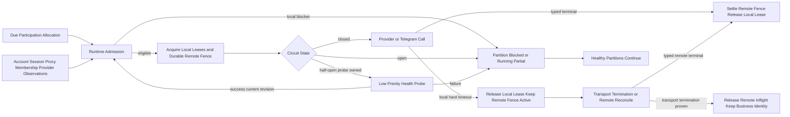

# 统一互动履约引擎 PRD

> **当前范围裁决（用户最新简化要求，优先于下文历史合同）：** 见 §19.13。忽略聊天编辑，不做历史回放/内容版本档案，只要求最近 72 小时成功次数；取消新增模型费用/调用预算持久化与发前扣减，取消历史样本审批和完整实时准备编排作为交付门槛。保留当前上下文、轻量生成/发前复核、数量并发占位、未知结果防重与故障隔离。该范围调整不等于相关代码已全部简化或上线。

## 0. 文档状态

| 项目 | 内容 |
|---|---|
| Intake ID | `intake-2026-09-03-unified-engagement-fulfillment-engine-001` |
| 需求级别 | L3：四类 Telegram 互动任务的调度、执行和远端副作用主链重构 |
| 用户原始目标 | 先完整阅读现有发送流程，再统一设计；活群、频道评论、点赞、浏览共用同一履约引擎；每个 Task 显式绑定账号分组，先确定哪些账号参与、当天做多少，再做上下文与全天排期；产品核心是拟人化和高互动，其中活群、评论必须理解并参与正在发生的对话，点赞、浏览不做内容互动；在完成有波动的数量目标前提下让计划参与账号真实活跃，并避免单账号、面具或代理故障拖停全部任务 |
| 本文范围 | `group_ai_chat`、`channel_comment`、`channel_like`、`channel_view` 从来源事实、业务义务、排期、账号/目标占位、内容准备、Action、Dispatcher、Gateway 到类型化远端事实与完成投影的完整数据面 |
| 设计结论 | 采用“统一履约内核 + 四个类型化适配器”，统一生命周期和资源时间线，不统一四种业务事实语义 |
| 设计状态 | 当前轻量范围（§19.13–19.16）已完成本地设计/代码/定向验收，`implementation_status=local_verified`、`production_status=unproven`；证据见 `docs/05-implementation/unified-engagement-local-acceptance-20260904.md`。该状态不宣称历史已撤销的复杂合同全部实现，不继承或扩张为生产验收 |
| 当前边界 | 用户确认全面支持自然人设互动，支持账号作为独立真人参与、制造社群与频道用户热度，`implementation_authorized=true`。发布仍须 Release Gate，运行状态与任务远端事实分别验收 |

本文是四类互动任务的顶层目标合同。`ai-group-dual-lane-send-chain-redesign-prd.md` 降为本文的 AI 活群适配器专项，不再单独定义跨任务公共内核。

> **2026-09-05 本地实现复核：** 修复了三个会直接造成业务停摆或错回的实现缺口。其一，活群日账本不再因“已有一个消息槽”而拒绝补齐后来冻结的账号覆盖槽；当前 effective target/覆盖分母增长时只追加缺失 ordinal，不删除、不重写已有 Action/远端事实，避免多账号计划被 `quantity_slot_invariant_mismatch` 整批拦截。其二，统一评论 linked-discussion update 已接入 channel PTS differential、peer 故障隔离、真人评论增删改投影与 Planner wake；真人目标可在不增加总量、单帖 response 不超过 65%、未出 Gateway 和 source deadline 内抢占直评槽，旧生成显式取消并按真实目标重建，己方 remote ID 判定按 discussion peer 隔离，发前复核目标正文 hash。其三，0209 不再把所有历史评论机械留在空 peer：只有全部历史 source revision 唯一指向同一 discussion peer 且当前 binding 可证明的评论才回填；换绑歧义或证据缺失继续 fail closed，避免升级后历史互动全部消失或错误混入新讨论组。以上只是可运行纵切片；跨 Task turn claim/service binding、完整 Attention、动态 tempo、跨 adapter journey、fleet activity 与远端 invocation fence 仍未闭合，`implementation_status` 保持 `in_progress`、`production_status` 保持 `unproven`。

合同优先级按 route/version 判断，不能按文档日期猜测：

1. 尚未启用 `unified_engine_route_v1` 的现行生产 Task，继续由 `hourly-random-pacing-and-ai-humanization-prd.md`、`task-fulfillment-classified-recovery-prd.md`、`production-planner-pacing-and-memory-remediation-prd.md`、`all-task-fulfillment-recovery-prd.md` 及各类型既有合同解释；本设计不能被误报为已上线；
2. 新 revision 一旦经 manifest/fence 启用 `unified_engine_route_v1`，公共 pacing、Timeline、materialization、Action/Attempt/Gateway、wake、recovery 和 coverage projection 只认本文；上述历史文档中的 executor 独立最终排期、相对间隔串行、提前 future Action、due-by-now 批量物化或 future/overdue-to-now 描述只能用于 legacy 收口；
3. 各 adapter 专项仍拥有任务专用数量、来源、能力、grounding、关系和 typed remote fact 语义；与本文公共内核冲突时，公共生命周期以本文为准，任务事实语义以 adapter 为准，未知 route/version 一律 blocked 而不是“兼容执行”。

> **2026-09-03 业务闭合修订：** 本版冻结互动容量预留与安全释放、deadline-aware 跨类型优先级、群聊/讨论组实时事件入口、评论关系义务兼容矩阵、逐任务全账号完成语义、自然节奏、Provider 容量和量化质量 Gate。互动响应不再依赖“刚好存在普通空位”，portfolio activity 不再替代任何 Task 的逐账号完成，自有账号互评不再伪装成真人事件响应；同一真人话轮在同租户同会话内只能由一个 Task、一个账号取得响应所有权，真人对我方消息的后续接话也进入独立效果反馈闭环。

> **2026-09-03 终审补正：** intent/style 改为真实 relation/turn/planned-call 后 late binding；账号合法换绑必须重建对应 voice/persona reservation；`conversation_attention_v1` 以可重叠 blocker、有界真人 P90 等待窗和版本化 wake 阻止无关主动内容插入真人会话，同时保证状态不会永久占用。整点两侧合法 response window、多个明确 addressee、owned followup 比例并发与真人抢占均已冻结为可验收合同。

> **2026-09-03 执行所有权终审：** response 日计划只冻结 capacity window 与 tentative supply，不预判未来真人 `planned_call_at`；canonical turn 分类归公共单 owner，Task/adapter 只消费冻结结果。真人 owner 后先冻结 natural window，再在 compatible supply/Timeline 交集中原子建立 `InteractionServiceBinding + planned_call + effective reservation`。每个 binding 的调用上限与 Task/source-plan 总预算分离，数量义务 pre-Gateway 归还不会清零旧调用，也不会导致后续 binding 永久失去调用身份。materialization/latest-safe/release/protected slack 全部按冻结 `ExecutionTimingProfileRevision + path-start stage` 派生。

> **实时链路基础校正（本地实现，非完整服务绑定验收）：** Telegram 输入的 UTC/offset 时间先按项目统一北京时间规范转换，再参与 turn close/wake/freshness/source deadline 比较；禁止仅删除 tzinfo，使新消息被误判为已过期。`ConversationTurnClaim` bind 按行锁后重新读取的状态校验 tenant、task epoch 和冻结账号；同 Action 重复 bind 幂等，served/stale/missed/unknown 等终态不得复活，旧 Action 失败不构成同 turn 换 Action/账号重开的授权。后续机会必须走新的 admitted opportunity 与正式 binding budget，不得由 Action retry 偷换服务身份。该修复不代表 `InteractionServiceBinding`、耗时画像、Provider 容量预留或总调用预算已经落地；这些 owner 仍须分别实现和验收。

> **2026-09-03 最终遗漏终审：** classification admission 现在必须为 Task candidate projection 与 peer claim finalize 预留尾部时间，不能把全部 3/5 秒 cutoff 都交给分类模型；response planned call 只从“完整准备链按 P95 可到达”的交集中抽样，并与 Provider permit、每 binding/Task 总预算同一 admission 事务冻结，预测上已迟到的 binding 不再创建。真人互动效果新增 event-level attribution claim：原生 reply 优先且不受语义推断窗限制，非原生续聊最多归因一条我方 fact，禁止一条真人消息重复抬高多条 AI 内容的互动率。owned unknown 则跨滚动窗口持续占用 O，直到有权威对账终态。

> **2026-09-03 账号分组、生产韧性与拟人弹性终审：** unified route 的正常生产 Task 必须显式绑定一个或多个用途一致的普通运营 `AccountPool`，禁止以缺省 `all` 动态扫描全租户账号，也禁止绑定接码、搜索降权等专用组；规范配置为 `account_selection_mode=group + account_group_ids[] + concurrency_limit_per_group`。配置分组成员并集、策略 eligible、规划准入、计划参与者、运行时 admitted/sendable 与 confirmed 六层集合分离；数量和参与范围由同一计划修订联合冻结，稳定抖动可重放，worker 重启或故障不能重抽。参与规则由 adapter 拥有：活群按群覆盖绑定组策略 eligible 全成员，评论按任务日覆盖全成员并在单帖 55%～65%/Cap 内跨来源轮转，点赞按每消息目标选 distinct 参与者；浏览每天先冻结 80%～95% 的共同 cohort，再冻结账号—来源自然子集，不默认逐帖全刷。Task 中途启动的 initial source 与动态新帖只有在 planning anchor 后剩余合法时间足以自然分散其冻结曝光目标时才纳入当日，否则显式延后到首个完整适用日，禁止把整批浏览量压到日末。面具、Session、账号、代理、成员资格、Provider 与 Listener 按故障域、舱壁和断路器隔离；局部失败形成 `running_partial` 与对应 shortfall，健康分区继续履约；计划激活还必须证明单故障域失效后仍有可服务路径。

> **2026-09-03 群聊真人原生回复权威终审：** unified AI 活群不再沿用“真人消息只能作 semantic context”的旧限制。可发送关系固定为 `semantic_direct|native_reply_external_human|native_reply_owned_fact`：external-human 只由 canonical `ConversationEvent` 的同 tenant/peer/thread/topic、精确 remote message/revision、`author_class=external_human`、current 未删除和闭合 stream watermark 授权；owned 继续只由同 Task/群的 bound typed remote fact 授权。每个 response binding 冻结唯一 `ConversationReplyAuthorityDecision`，Provider/Action/Gateway 复用，发前 CAS 复核；原始上下文行、昵称、正文或 Action.result 不具备授权力。一个真人 turn 仍最多一个 `ConversationTurnClaim` winner，call-issued/unknown 后禁止换 target 或让另一账号补答。

> **2026-09-03 第二层遗漏终审：** 本版进一步冻结统一 Task lifecycle/config successor、固定北京时间 Task calendar 与 legacy timezone 无重叠接管、同类型 canonical target 单写者、跨任务组合容量、Telegram FloodWait/SlowMode typed backpressure、观察路由接管、非文本/语言上下文判定和人工 retry/replan 边界。pause/resume/stop/delete 不再由各 adapter 各自猜测；配置编辑不得清空计划后把 `next_run_at/scheduled_at` 改成当前时间；同类型重复 Task 不得仅靠 Timeline 错开后继续双份履约；结构化 rate-limit 只移动 `release_not_before_at`，缺 remote-mutation false 证据仍按 unknown；无可解释媒体或语言证据的 turn 显式不参与，不能生成泛化回复。该补正已进入分阶段实现，但只有代码、迁移与验收逐项具备证据的合同才能标记 implemented。

> **2026-09-04 深层组合业务终审：** 单 Task 可行不再等于组合可行。统一引擎新增 AccountPool 全局并发与跨 Task 行为预算、自然机会/受管占比承诺状态、同一来源跨点赞/评论/浏览联合旅程、目标完成后的受限真人续答容量、账号身份事实 provenance、未归属平台 Action 的账号外发占用、点赞任务日容量公平分配和 reaction 发前 source-revision 终审。依赖未来真人解锁或来源供给的目标只能标记 `forecast_conditional`，不能承诺必达；受管账号也不能仅靠与少量真人消息交替就长期占据群聊或讨论区主导占比。完整规范见 §19.2；该补正设计完成，当前按合同分项实现与验收，未具证据项不得提前宣称完成。

## 1. 为什么必须重做统一边界

### 1.1 当前不是一条链，而是“前半段四套、后半段一套”

当前系统已经具备一部分公共基础设施：统一 Task Center drain、共享 Telegram 来源采集、统一 Action/Dispatcher、ExecutionAttempt、Gateway 调用边界、`FulfillmentRemoteFact` 信封和投影状态。但四类 executor 仍分别完成需求量计算、账号选择、节奏计算、业务占位和 Action 创建。

这意味着真正决定用户体验的部分仍发生在共享 Dispatcher 之前：

- 每个 Task 单独计算 due，无法保证同账号、同群/频道、同来源消息跨 Task 全局错峰；
- 不同类型分别预占账号和 source pacing，局部都“随机”仍可能在全局同一分钟碰撞；
- Listener 唤醒 Planner 后，还要经过义务选择、Action 物化、AI Generation claim、质量门和 Dispatcher claim，上下文回复不是事件直达；
- Dispatcher 只领取 `scheduled_at <= now` 的 Action，不能把上游已经集中或逾期的到期点重新变成自然分布；
- Action 已经混入部分数量、排期、内容、重试和业务事实身份，类型间的恢复口径不一致。

### 1.2 统一引擎不等于把四种 Action 变成同一种 JSON

四类任务的 Telegram 完成事实不同：

- 活群：某账号在某群发出一条具体消息，需非空 Telegram remote message id；
- 评论：某账号对固定频道来源版本/讨论组身份发出一条通过 grounding 与内容哈希校验的评论；
- 点赞：某账号对某条来源消息形成指定 reaction 状态；
- 浏览：某账号对某条来源消息执行一次当日本地日界内的浏览操作事实；该事实不等于 Telegram 计数器一定增加。

因此统一的对象是“履约生命周期、节奏、资源仲裁、调用边界与事实投影”，不是业务 payload 和成功判定。

### 1.3 两类工作负载是顶层产品边界

| 工作负载 | 任务 | 产品目标 | 是否读取对话上下文 | 是否调用 LLM | 完成质量 |
|---|---|---|---|---|---|
| `interactive_content` 内容互动型 | AI 活群、频道评论 | 拟人化地加入正在发生的对话，形成提问、回答、接话、求证和讨论 | 是 | 是 | 数量 + 逐账号发言覆盖 + 上下文互动质量 |
| `passive_operation` 被动行为型 | 点赞、浏览 | 在自然时间分布下完成精确远端操作 | 否；只读取目标/能力事实 | 否 | 数量/账号覆盖 + typed operation fact |

统一引擎必须允许两类工作负载共享节奏、资源和执行内核，但不得让点赞、浏览进入 ContextTurn、语义生成、对话回复或自然语言质量链。高互动也不等于高频刷量：互动质量优先看是否在合适的时机对合适的人说了与现场相关的话。

## 2. 现状链路审计

### 2.1 公共入口与后半链

当前 Task Center 主循环按以下顺序运行：

```text
Listener drain
  -> recovery
  -> due Task planner
  -> non-search Dispatcher
  -> search Dispatcher
```

Planner 通过任务类型注册表调用四个独立 `build_plan()`。Dispatcher 只 claim `pending AND scheduled_at <= now` 的 Action。进入发送后，公共链为：

```text
Action claim
  -> pre-dispatch gates
  -> ExecutionAttempt
  -> persist gateway call-issued boundary
  -> Telegram Gateway RPC
  -> attempt/result finalization
  -> FulfillmentRemoteFact
  -> obligation/action/task-read-model projection
```

`fact_first_v3` 已把 `safely_not_executed`、`remote_outcome_unknown` 和 confirmed fact 区分开。Gateway 已调用但结果未知时，义务进入 reconcile-only，不得自动重放。

### 2.2 四类任务 as-is 对照

| 阶段 | AI 活群 `group_ai_chat` | 频道评论 `channel_comment` | 点赞 `channel_like` | 浏览 `channel_view` |
|---|---|---|---|---|
| workload | `interactive_content` | `interactive_content` | `passive_operation` | `passive_operation` |
| 来源 | 群上下文轮询，插入真人消息后唤醒 Planner | 共享频道 Listener 的帖子、来源修订、讨论组身份与评论能力 | 共享频道 Listener 的帖子与 reaction capability | 共享频道 Listener 的 active 帖子；仅浏览可在限定条件下使用 stale active snapshot |
| 数量真相 | TaskDayLedger、群日目标、TaskGroupDailyMessageSlot、逐账号 coverage 等多层对象 | 每条来源消息的评论计划、55%～65% 参与账号、Daily Cap、CommentFulfillmentObligation | 每条来源消息、选中账号、reaction 计划与 ReactionFulfillmentObligation | TaskDayLedger、每消息日目标、账号绑定、ViewFulfillmentObligation 与每日 identity |
| 账号选择 | 发送资格、群成员事实、全账号日覆盖、声线和 speaker rotation | 固定 eligible snapshot、ordinal-account binding、频道/讨论组准入 | 消息级稳定排序、成员资格、distinct account | 账号池、日/小时安全容量、跨日间隔和每日唯一身份 |
| 节奏 | `schedule_source_pacing_points` + account reservation；部分 legacy 逻辑仍在超大 executor 内 | 每消息 ordinal 的 source pacing + JIT materialization + account reservation | 每消息 ordinal 的 source pacing + source capacity + account reservation | 当前路径经 `channel_view_pacing` 使用 source pacing + account reservation |
| 内容准备 | 先创建空正文 Action；在 30 分钟 lookahead 内由独立 AI worker 生成、质量校验并持久化 ready | 先创建待生成评论 Action；评论 generation worker 做 grounding、规则、重复、风格和 fallback 质量 | 无 LLM；冻结 reaction emoji/状态意图 | 无 LLM；冻结 peer/message/account/local-date 操作意图 |
| 去重 | candidate reservation：同账号 10 天 exact/similar/semantic/template shell，同群 5 分钟 exact；Gateway 前再查；unknown 占位 | 对同一来源消息，把系统 pending/claiming/executing/success/unknown 与采集到的远端评论合并做语义去重；accepted hash 在发送前复核 | 义务唯一键 + remote fact identity，确认前不得重复创建/发送同一状态 | 义务唯一键 + 当日 identity + remote fact identity；call-issued 后不得补发 |
| Gateway | `send_message`/带受控 reply authority 的 reply | 频道评论/讨论组 reply RPC，核对 discussion identity 与 outbound hash | `send_channel_reaction` | `view_channel_message` |
| 类型化事实 | `remote_message_observed` + remote message id | `channel_comment_remote_fact` + 来源/讨论组/content hash | `ReactionRemoteFact` + peer/message/account/reaction revision | `ViewRemoteFact` + peer/message/account/local date |
| 完成口径 | 群日数量 + 每账号 coverage；当前自然参与质量未成为统一运行状态 | obligation、账号参与比例、cap、grounding 与 typed fact | reaction obligation confirmed | view obligation confirmed；不宣称远端计数器增长 |

### 2.3 当前重复过滤发生在什么时候

当前不是一个统一时点：

1. 活群在候选生成后调用 `reserve_group_ai_message()`；reservation 持久化成功才允许内容进入 ready，发送前 `ensure_group_ai_message_sendable()` 再次检查。
2. 评论在生成质量门读取同一频道消息的系统开放/成功/unknown 内容与已采集远端评论，语义重复则拒绝；之后还核对固定来源修订、grounding assignment 和 accepted content hash。
3. 点赞、浏览不做文本相似度，而在义务创建、Action 绑定、Gateway 前和远端事实确认时检查业务 identity。
4. `FulfillmentObligationProjection` 会阻断同一 obligation 同时存在多个 open Action，但它只是统一索引，不是任务专用数量真相源。

结论：现有防重能力不少，但阶段和责任分散；统一设计必须把它们收敛成共同门禁协议，不能把文本去重强行套到点赞/浏览。

## 3. 问题根因

### 3.1 上下文回复慢

现有群聊链是：

```text
Telegram 新消息
  -> Listener 到达下一个轮询窗口
  -> collect_group_context 持久化
  -> wake Planner
  -> AI executor 重新装载上下文并选择义务/账号
  -> 空正文 Action
  -> generation worker claim
  -> Provider + 质量/去重
  -> Dispatcher 到达下一个 claim
  -> Gateway
```

即使各 worker 本身轮询很快，端到端仍叠加 Listener 等待、数据库唤醒、Planner、Generation 和 Dispatcher 多段排队。普通 direct 内容可在生成前刷新上下文；绑定 reply target 的内容为了保持引用身份不会同样刷新，等待越久越容易错过现场。

### 3.2 消息集中

仓库已实现按小时权重、最大余数分配、小时内等分 strata 和稳定随机偏移，算法本身不是简单整点批发。集中仍可能来自：

1. 四个 executor/多个 Task 分别调用 pacing，没有一个跨类型、跨 Task 的账号/peer 总时间线计划；
2. 同一来源内随机不等于同一账号或同一群/频道全局随机；
3. 某些 Action 提前物化，后续恢复、容量释放和 overdue release 会在共享 Dispatcher 前形成新的可领取簇；
4. Dispatcher 批量领取全部已到期 Action，只能限制执行资源，不能改变业务 due；
5. 动态来源集中到达时，多个任务被同一 Listener 事件同时唤醒；
6. AI 生成在 30 分钟 lookahead 内成批准备，内容与发送时间、上下文新鲜度并非同一所有者。

### 3.3 “总量完成”不等于“所有账号活跃”

账号日覆盖目前主要在 AI 活群中作为专用账本处理；频道评论有消息级 distinct account 计划，点赞/浏览有消息—账号义务，但缺少一个跨四类任务的账户活动组合视图。结果可能出现：

- 总 Action/事实数达标，但少数账号承担大多数互动；
- 一个账号的成功被统计层误看成整个账号池已完成；
- 为补未覆盖账号在日末集中产生动作；
- 浏览/点赞事实被误当成“该账号已经像真人发言”，掩盖发言覆盖不足。

## 4. 目标与非目标

### 4.1 必须达成

1. 四类任务共用一个 Engagement Fulfillment Kernel；四个 executor 降为类型化 adapter，并明确分成 `interactive_content` 与 `passive_operation` 两类 workload。
2. Task 专用义务账本继续是业务真相源；公共层只持有统一 projection、时间槽、资源 reservation 和执行生命周期。
3. 全部主动互动先形成稳定的全天/小时计划，再在小时内做确定性分层随机；跨 Task、跨类型按账号和 peer 聚合错峰。
4. AI 活群与频道评论的真人上下文都走事件驱动互动泳道，不等待普通 Task planner 周期；但不能绕过数量、账号/peer 容量、质量、去重和 Gateway 安全边界。
5. 一个远端事实可以同时结算一个数量单位和一个账号覆盖单位，但不能替其他账号完成覆盖。
6. 所有完成状态均回到 task-type-specific typed remote fact；Action success、Generation ready、队列清空和容器健康都不是业务完成。
7. Gateway call-issued 后的 unknown 只能 reconcile；禁止基于超时自动再创建替代 Action。
8. overdue 不压缩追赶；过 deadline 显式 shortfall。
9. 内容型任务在生成前、候选后、并发 reservation、Gateway 前经过统一阶段协议；操作型任务在相同阶段使用业务 identity 门。
10. 互动质量以时机、上下文贴合、自然表达与真实服务效果衡量；点赞与浏览等被动操作保持独立事实对账，不宣传为发言活跃。既有拟人化以自然融入社群、支持自然人设（Persona）与降低违和感为目标。
11. 点赞、浏览不创建 InteractionOpportunity、不调用 LLM、不做语义回复；只保留自然节奏、账号错峰、业务 identity 和 typed fact。
12. AI 活群和评论必须在既有数量目标内部冻结 `response_reserved` 互动容量；活群按群日总量冻结约 40% 后再分散到预测有人活动的小时，不能把“每小时至少 1 条”误算成低配额小时 100% 预留；未使用柔性容量按确定性 release cutoff 转回主动内容，既不超发也不因预留少发。
13. 互动成效的分母必须在容量判断之前冻结；被参与策略选中但因时间线、Provider 或账号容量未响应的 turn 必须计为 missed，不能从分母中删除。
14. 活群和评论的任务日完成都要求本 Task 冻结账号范围逐账号取得自己的合格内容远端事实；跨 Task 的 portfolio activity 只作观察，不能关闭任务缺口。
15. 实时性拆成“事件识别/决策/生成延迟”和“自然发送等待”；发送时点按群或讨论串真人节奏选择，不用固定秒数形成机器指纹。
16. Provider admission、响应并发、排队截止和每义务生成预算必须在任务启动前可计算；容量不足显式阻断高互动目标，不能排队到上下文失效。
17. 同一真人话轮即使同时命中多个 Task 订阅，也只能在同 tenant、同 canonical peer/thread 内选出一个响应 owner；其余候选必须显示为跨任务合并，不能多账号抢答。
18. 真人对我方 confirmed 消息的原生回复与可解释语义续聊必须形成独立互动结果事实；它不增加发送数量，却必须进入高互动效果比较，不能只统计 AI 发了多少。

### 4.2 非目标

- 不把四类任务合成一张无类型 JSON 总账。
- 不让 LLM 决定精确数量、发送时间、重试权限、账号安全容量或远端成功。
- 不要求每条真人消息都回复；但进入冻结参与策略的 turn 必须获得响应、明确 wait，或计入可见 missed，不得用容量条件把它排除出统计。
- 不把点赞、浏览包装成“与内容对话”，也不为它们增加 Prompt、ContextSnapshot 或内容自然度评分。
- 不通过签到、固定 emoji、模板短句或静默 fallback 伪造“账号活跃完成”。
- 不把浏览操作事实解释为 Telegram 浏览计数器一定增长。
- 历史设计轮不实施、不迁移、不发布；当前自然人设与热度营造边界见 §19.4，发布仍独立执行 Release Gate。

## 5. 目标架构

```mermaid
flowchart LR
  S[Telegram Source Events] --> N[Source Normalizer]
  T[Task + Account Group Binding Set + Policy] --> M[Versioned Group Membership Snapshot Set]
  M --> V[Joint Participation and Quantity Plan]
  N --> V
  V --> O[Typed Obligation Adapter]
  N --> O
  O --> P[Fulfillment Obligation Projection]
  P --> G[Global Pacing Coverage and Interaction Capacity Planner]
  G --> R[Hierarchical Timeline Reservations]
  R --> Y[Runtime Admission and Bulkhead-Circuit Arbiter]
  C[Versioned Session Proxy Membership Provider Observations] --> Y
  Y --> I[Interactive Content Materializer]
  Y --> B[Passive Operation Materializer]
  Y -. partition blocker .-> P
  N -. group/comment context .-> K[Peer-level Context Turn Builder]
  K --> L[Canonical Turn Intent Classifier]
  L --> H[Interaction Opportunity Router]
  H --> U[Peer Turn Response Owner]
  U --> G
  I --> Q[Content Quality and Dedupe Gates]
  B --> Q2[Operation Identity Gates]
  Q --> A[Immutable Ready Action]
  Q2 --> A
  A --> D[Shared Dispatcher]
  D --> E[ExecutionAttempt and Call-issued Journal]
  E --> W[Typed Telegram Gateway Adapter]
  W --> F[FulfillmentRemoteFact Envelope]
  F --> X[Typed Fact Projector and Settlement]
  X --> O
  X --> C[Quantity Coverage Quality Read Models]
  N --> J[Human Engagement Projector]
  X --> J
  J --> C
```



### 5.1 内核职责

| 内核组件 | 唯一职责 | 不允许承担 |
|---|---|---|
| `ConversationEventIngestor` | 以单 owner stream cursor 采集群和 linked discussion update，原子写事件/outbox，并在断线后按 watermark 补洞 | 不创建业务义务、不调用 LLM/Gateway |
| `ContextTurnBuilder` | 在 Task 路由前按 canonical peer/thread、稳定首事件和 coalesce policy 建立全局 turn family，并随 edit/late event 追加 revision | 不读取 Task 容量、不为每个 Task 重建不同 turn identity |
| `TurnIntentClassifier` | 对至少有一个预冻结有效互动订阅的 canonical turn revision 先做结构化确定性分类，必要时以唯一 request identity 调一次共享 classification lane 并冻结 class/confidence/evidence | 不读取 Task 参与率、发送账号、response slot，不允许无订阅群或每个 adapter/Task 重复分类 |
| `SourceEventRouter` | 接收持久化后的群/频道来源事件，按订阅唤醒相关任务 | 不创建业务义务、不调用 LLM/Gateway |
| `TaskLifecycleCoordinator` | 以 append-only lifecycle/config successor 统一处理 start、pause、resume、stop、delete 和配置生效范围 | 不原地重写已冻结 plan/due、不得把编辑或恢复变成 run-now |
| `TaskCalendarCoordinator` | 冻结统一 `Asia/Shanghai` task-day 的 UTC period 边界，并收口 legacy IANA timezone 到北京时间 successor 的无重叠切换 | 不使用 naive local datetime、不开放 unified route 任意时区 PATCH、不生成第二份日目标/日额度 |
| `TargetScopeCoordinator` | 在激活前冻结同 adapter + canonical target/source subscription 的单一 quantity writer，并隔离旧 lifecycle reconcile | 不把跨类型任务误判为冲突、不允许两个同类型 Task 靠错峰重复履约 |
| `TaskAccountScopeCoordinator` | 解析 Task 显式绑定的一个或多个账号分组，冻结各组成员版本、规范化成员并集和 adapter 专用参与单元 | 不读取瞬时在线状态来改写成员分母，不把缺省字段解释为全租户 |
| `ParticipationQuantityPlanner` | 在 obligation/pacing 前联合冻结参与比例、selected/standby 顺序、数量抖动、coverage floor、source/Cap 约束和结果 hash | 不读取运行时故障重抽参与者、不让 adapter 各自使用进程随机数 |
| `PortfolioFeasibilityPlanner` | 把全部 active/proposed Task 对 account/peer/source/Provider/Gateway 的需求与自然时间线做联合匹配，冻结可行性和缺口 | 不用每 Task 单独可行替代组合可行、不自动缩目标/参与分母 |
| `ObligationCoordinator` | 调用类型 adapter 建立/读取稳定业务义务，并写公共 projection | 不重算已冻结业务目标 |
| `CoverageCoordinator` | 维护任务覆盖和账号组合活动目标，选择尚未覆盖账号 | 不把一种活动等级冒充另一种 |
| `DependencyDomainCoordinator` | 把 account mask、Session、proxy route/verified egress、peer membership、Provider lane、source listener 观察投影为参与账号的运行时 sendable/blocked 分区和 Task 聚合状态 | 不因一个依赖失败暂停无关账号、代理路线/出口或任务类型 |
| `TelegramBackpressureCoordinator` | 消费结构化 FloodWait/SlowMode/平台 retry-after，按 authorization/session 或 peer scope 冻结 transport availability | 不解析展示文本猜秒数、不把限流归因给代理/Provider、不暂停全部 Task |
| `ConversationObservationRouteCoordinator` | 为每个 required peer 冻结 primary/standby observer、接管 epoch、canonical watermark 与 gap closure | 不让多个 observer 同时推进业务 watermark、不在 gap 未闭合时恢复 response |
| `PacingPlanner` | 生成稳定 due/window/deadline，并建立跨任务分层计划 | 不修改远端事实、不物化内容 |
| `InteractionCapacityPlanner` | 在既有数量内冻结 response reserve、release cutoff、参与目标和容量 shortfall | 不增加隐藏数量、不在运行时缩小互动分母 |
| `TimelineArbiter` | 原子协调 account、peer/conversation、source-message 多级时间线 | 不改业务 due；只计算合法 release/effective claim 或 shortfall |
| `InteractionOpportunityRouter` | 只为活群/评论把真人 ContextTurn 转成可审计互动机会 | 不处理点赞/浏览，不保证每个 turn 都回复 |
| `TurnResponseCoordinator` | 在容量判断前对同 tenant、同会话、同逻辑 turn 的多个 Task 候选选出唯一响应 owner | 不按当前空闲容量挑 owner、不允许多个 Task 依次补答同一 turn |
| `ConversationResponseAuthorityCoordinator` | 冻结同 tenant、同 peer/thread 的互动响应 writer kind，隔离 legacy listener/Campaign、静态 reply planner 与统一引擎 | 不阻断合法 proactive 内容，不让两个响应 writer 并存 |
| `MaterializationCoordinator` | 到 JIT 窗口后调用类型 adapter；互动型生成内容，被动型生成操作 command | 不提前批量生成整日内容 |
| `ProviderAdmissionCoordinator` | 按 deadline slack、测得延迟、并发和预算原子冻结 Provider admission；classification 为下游 candidate/claim 留足尾部，response 只在完整准备链可命中 planned call 时准入 | 不把来不及完成的 Job 排队到过期、不决定业务参与率、不在 binding 后补记一个无并发守恒的预算 |
| `WakeCoordinator` | 在业务状态提交时写 durable stage wake，并发送低延迟通知；worker 始终回读数据库 owner | 不把通知当真相、不靠固定全表轮询串联实时链 |
| `GatePipeline` | 执行统一阶段顺序并记录 typed decision | 不使用通用文本相似度替代业务 identity |
| `Dispatcher` | claim 已到期且 ready 的 Action，完成调用边界和结果持久化 | 不生成内容、不追赶数量、不更换账号 |
| `FactCoordinator` | 落通用 fact envelope，再调用 typed projector 结算 | 不以公共信封替代专用事实表 |
| `HumanEngagementProjector` | 先对真人 event 建唯一正向归因 claim，再把对我方 confirmed fact 的权威回复或可解释续聊投影为互动结果 | 不把推断关系冒充原生 reply，不让同一真人 event 重复抬高多条 fact，不结算发送数量 |
| `RecoveryCoordinator` | 回收 pre-call lease、处理 safely-not-executed、打开 unknown reconcile | 不推断 Telegram 未执行、不集中补发 |
| `OperatorCommandCoordinator` | 把人工 wake、safe retry、replan 请求转为版本化命令并复用正常 owner/gate | 不提供 humanized Task 的 force-send-now，不重开 unknown 或修改原 due |

### 5.2 适配器接口

每种任务必须实现以下类型化接口；返回强类型对象，不返回任意结构 dict：

```text
SourceAdapter.normalize(event) -> TypedSourceFact
ParticipationAdapter.define_units(task_day, source_facts, account_group_snapshot_set, policy_revision) -> ParticipationUnitSpec[]
QuantityAdapter.freeze_constraints(participation_unit, task_config, source_caps) -> QuantityConstraintSet
ObligationAdapter.reconcile(task_day, source_fact) -> TypedObligationDelta
EligibilityAdapter.snapshot(obligation) -> EligibilityDecision
InteractionAdapter.participation_candidate(turn, canonical_classification, frozen_policy) -> ParticipationCandidateDecision
InteractionAdapter.bind_capacity(turn_claim, capacity_plan) -> InteractionServiceDecision
InteractionAdapter.project_context(turn_claim, task_binding) -> TypedContextSnapshot
ContentPreparationAdapter.build_generation_spec(obligation, context_snapshot, late_bound_assignment) -> GenerationSpec
OperationPreparationAdapter.prepare(obligation, frozen_identity) -> PreparedCommand
CommandAdapter.materialize(obligation, accepted_candidate_or_operation_command) -> PreparedCommand
IdentityAdapter.intent_identity(obligation) -> StableBusinessIdentity
IdentityAdapter.candidate_identity(command) -> CandidateIdentity?
GatewayAdapter.execute(prepared_command, committed_request_identity) -> GatewayOutcome
FactAdapter.persist(outcome) -> TypedRemoteFact
SettlementAdapter.project(typed_fact) -> ObligationSettlement
```

四类 adapter 都必须实现 `ParticipationAdapter + QuantityAdapter`，但只能返回参与单元与类型约束；selected 集、standby 顺序、稳定抖动和联合 plan hash 由公共 `ParticipationQuantityPlanner` 唯一计算。canonical `ContextTurn` 只由公共 `ContextTurnBuilder` 在 Task 路由前建立；adapter 只能通过 `project_context` 把既有 canonical turn 投影成 Task 专用只读 snapshot，不得生成第二个 turn identity。只有 AI 活群和频道评论实现 `InteractionAdapter + ContentPreparationAdapter`；点赞、浏览只实现 `OperationPreparationAdapter`，不得提供伪 Interaction 实现或空 Prompt。`ContentPreparationAdapter` 只产生 GenerationSpec/候选，不产生 PreparedCommand；内容候选通过质量和去重后，`CommandAdapter.materialize` 才能创建最终不可变 command。所有类型 adapter 都不得自行实现全局时间算法、直接 claim Action、绕过 Attempt 或自行重试 Gateway。

## 6. 统一状态模型和所有权

### 6.1 真相源层次

```text
TaskAccountGroupBindingSetRevision    Task 配置使用哪些版本化账号分组
AccountGroupMembershipSnapshotSet     该计划单元看见的各组版本与规范化成员并集
TaskFulfillmentPlanRevision           任务日数量与参与策略的联合计划 owner
TaskParticipationUnitPlan             某 task-day/source-message 的 selected/standby/目标
Task-specific obligation ledger       业务应做什么、做多少
FulfillmentObligationProjection       跨类型统一索引和当前 materialization 状态
EngagementPacingSlot                  何时允许尝试
TimelineReservation                   哪个账号/peer/source-message 在何时被占用
PreparedCommand / Action              一次不可变 Telegram transport command
ExecutionAttempt + Gateway journal    是否跨过远端调用边界
TypedRemoteFact                       Telegram 侧观察到了什么
Read models                           数量、覆盖、质量、shortfall 展示
```

公共 projection 永远不成为第二套数量账本。评论、reaction、view 和 AI group quantity/coverage 仍由各自 typed owner 定义。

### 6.2 通用状态机

```text
open
  -> paced
  -> reserved
  -> preparation_due
  -> preparing
  -> ready
  -> claiming
  -> executing_pre_call
  -> gateway_call_issued
      -> confirmed
      -> remote_reconcile_only

open/ paced/ reserved/ preparation_due/ preparing/ ready
  -> blocked | expired_shortfall | safely_released
```

不允许：

- `gateway_call_issued -> open`；
- `remote_reconcile_only -> replacement Action`；
- `expired_shortfall -> now`；
- 通过删除义务或缩小账号分母把 shortfall 变成完成；
- 已冻结 identity、账号、peer、来源版本或 content hash 在原 Action 上原地改写。

### 6.3 Action 的新边界

Action 只在以下条件全部满足后创建：

1. obligation 仍 open 且 projection CAS 成功；
2. pacing slot 已冻结且当前进入 materialization horizon；
3. 账号、peer、source identity 与 task lifecycle epoch 已冻结；
4. 内容型任务的候选已经通过质量和 candidate reservation；
5. 操作型任务的业务 identity gate 已通过；
6. request identity 和 remote mutation key 可确定。

Action 不再承担“未来可能要做的一整天计划”，也不允许以空正文等待稍后补齐。它是临近执行才物化的 immutable ready command。

### 6.4 核心对象最小数据合同

以下不是建议命名，而是开发交接必须保持的业务字段和唯一性；实现可按现有模块拆表，但不得省略 owner、revision、deadline 或唯一身份：

| 对象 | 最小业务字段 | 唯一身份 / 并发合同 |
|---|---|---|
| `AccountGroupMembershipRevision` | tenant、account pool、revision、effective at、ordered member ids、member-set hash、change reason | `(tenant, account_pool, revision)`；成员变更 append-only，分组改名不改变 pool identity |
| `TaskAccountGroupBindingSetRevision` | task/lifecycle、按数值 ID canonical-sort 后的 distinct account group ids、每组 tenant/purpose/system-marker contract hash、per-group concurrency limit、route/config revision、effective from/to、supersedes | `(task, lifecycle_epoch, binding_set_revision)`；输入顺序不影响 identity/hash，unified current 一次仅一个 active set；四类运营 Task 的每组必须是 enabled、用途标记一致的 `normal` 组；增删/换组或改并发上限创建 successor，不因组内普通成员变化复制 Task 配置 revision |
| `AccountGroupMembershipSnapshotSet` | binding-set revision、participation plan/unit、各组 membership revision/set hash 与 group-state revision、规范化 member union/hash、每账号 origin group、captured at | `(fulfillment_plan, participation_unit, snapshot_set_revision)`；计划冻结时钉住各组 current membership/state。重复 account id 或用途不一致不可任意选择归属或静默删组；首次激活不接受 disabled group，已激活 binding 后续组禁用则按 §19.3.6 记录真实状态、保留可证明分母并隔离该分区，不阻断健康分区未来计划 |
| `TaskParticipationPolicyRevision` | task type、mode、base/min/max bps、jitter bps、min/max count、fairness window、replacement policy、quantity-jitter policy、effective revision | `(task, lifecycle_epoch, policy_revision)`；比例和数量单位明确，禁止用同一字段双重抖动 |
| `TaskLifecycleEvent` | task、from/to status、old/new lifecycle epoch、event kind `start|pause|resume|stop|delete|config_successor`、occurred at、actor/reason、current plan set hash、unsettled call-issued/unknown set hash | `(task, new_lifecycle_epoch, event_kind)`；append-only。pause/resume 不改 deadline/due，stop/delete 不删除远端历史；同 expected epoch 只有一个 writer |
| `TaskConfigSuccessorRevision` | task/lifecycle、change set/hash、change scope `runtime_safety|new_preparation|next_unfrozen_unit|next_full_task_day|new_lifecycle_target`、requested/effective at、supersedes、expected config/binding/calendar revisions | `(task, config_revision)`；每个字段必须有唯一生效范围，禁止 PATCH 后清空整日计划或把 Task 重排到 now |
| `TaskCalendarRevision` | task、timezone snapshot（unified current 固定 `Asia/Shanghai`）、calendar version、effective UTC boundary、local date、UTC period start/end、legacy transition kind、supersedes | `(task, calendar_revision, local_date)`；一个 UTC instant 只归属一个 period；旧 IANA task 只读收口并在旧 period 结束后切换北京时间 successor，不产生重叠日目标/额度 |
| `TaskFulfillmentPlanRevision` | task/lifecycle/task day、binding/membership/policy/config revision、adapter constraint hash、stable seed、raw/effective quantity、coverage/cap adjustment、unit-set hash、state/version | `(task, lifecycle_epoch, task_day, plan_revision)`；参与与数量同一 owner 联合冻结，重放输入相同则 hash 完全一致 |
| `TaskTargetScopeClaim` | tenant、adapter kind、canonical target、normalized source predicate/hash、predicate overlap proof、lifecycle/config revision、active UTC window、writer task、conflicting task set、state/version | 同 `tenant + adapter + canonical target + overlapping source predicate + overlapping active window` 最多一个 active quantity writer；只有可证明互斥的有限 message-id/time/filter 集才可并存，动态/未知 overlap fail closed；旧 epoch 仅 reconcile 不占新计划 writer，跨 adapter 允许共存并进入 Timeline |
| `PortfolioFeasibilityPlanRevision` | proposed/active Task set/hash、calendar/binding/policy/timeline/provider/gateway revisions、account-task-day load、peer/source load、response forecast、maximum matching、deficits/reasons、decision | `(tenant, planning horizon, task-set revision)`；每个 Task 单独可行但组合超卖时仍为 unachievable，不能自动降量或挤压自然间隔 |
| `TaskParticipationUnitPlan` | fulfillment plan、unit kind/key、eligible member set/hash、effective ratio/count、selected ordered set、standby ordered set、quantity target、coverage floor、source/cap feasibility、deadline、decision hash | `(fulfillment_plan, unit_kind, unit_key)`；AI 为 task+group+day，评论为 task+day 并派生 source allocation，点赞为 source message，浏览先有 task+day shared cohort、再由每个 source message+local date 引用该 cohort |
| `FirstApplicableDayDecision` | adapter/task/canonical source identity、source revision、published/durably-observed/available/effective-intake at、ingest lag、task day/cohort、planning anchor、timing/source-policy revision、deadline、minimum natural span、frozen timeline input hash、latest same-day intake、decision/reason、next applicable date、predecessor decision | 按 `(task, canonical source identity, task local date)` 持有唯一业务决策链，source revision 仅追加评估证据，不新增需求。按 durable observation sequence 串行 CAS；同日必须能容纳该来源完整冻结曝光边集并保持全日图约束，不要求单帖容纳整个 cohort；不可达则 `pending_first_full_day`。次日另建 decision/target 并引用 predecessor，旧 row 不原地升级，不得部分执行后再缩目标 |
| `TaskParticipantAllocation` | participation unit、ordinal、selected account、origin account group、selection debt/last-selected basis、binding-set revision、state | `(participation_unit, ordinal)`；plan commit 后 selected account 不可替换，standby 只用于本次 plan 提交前的确定性候选求解和后续 participation unit 公平轮转，不继承当前账号的 obligation/due/completion credit |
| `AlbumReactionParticipationObligation` | like task/source+album revision、selected account、distinct-account ordinal、frozen child-set revision/hash、deadline、confirmed/partial/unknown/shortfall | `(task, album source revision, account)`；配置 quantity 只计 distinct account，一名账号不因 1～2 个 child RPC 重复计参与 |
| `AlbumReactionChildSet` | album participation obligation、current ordered child message ids、stable seed、planned child count、每 child reaction intent/capacity decision、source revision、state | `(album participation obligation, child-set revision)`；plan commit 后 child set/emoji 不因重试重抽；全部 child typed fact 才关闭父义务，partial/unknown 保持占位 |
| `ExecutionDependencyObservation` | subject kind/key（account/account-group/proxy/provider/listener/target-peer）、dependency kind/domain key、observed revision/at、status、reason、valid until、evidence ref | `(subject kind, subject key, dependency kind, domain key, observed revision)` append-only；最新有效观察投影运行时 readiness，不改计划集合；group disable/purpose mismatch 是组级 blocker，不伪装成每个账号独立失败 |
| `TaskParticipantRuntimeProjection` | participation unit/allocation、account、mask/session/proxy/membership/provider/listener dependency revisions、sendable/blocked、blocker set、next wake、projection revision | `(allocation, projection_revision)`；Task 聚合只读该分区投影，局部 blocker 不写成全局 pause |
| `ExecutionResiliencePolicyRevision` | stage timeout ceilings、proxy-route/proxy-egress/account/group/task/workload bulkhead limits、task contention share/borrow policy、circuit failure window/threshold/open duration、half-open probes、effective/version | `(tenant, policy revision)`；plan/Attempt 冻结所用 revision，worker 不持有私有超时/并发常量 |
| `ExecutionBulkheadLease` | local lease kind `worker|stage|fair_share`、domain kind/key、work identity、task/group/workload、limit revision、owner fencing token、acquired/expires/released at、state/version | 只表示本地 Worker、阶段队列与公平份额占用；每个 domain 的 active lease 数不超过冻结上限。hard timeout 持久化后可以释放该层，让 Worker 返回；过期回收必须先 fence 旧 owner。它不证明底层调用已停止，也不释放远端在途容量或业务 identity |
| `RemoteInvocationFence` | invocation/request identity、work/Job/Attempt、call kind、account/group、proxy route/canonical verified egress 或 direct egress、provider route/lane、runner generation、transport state `reserved|active|termination_proven`、business outcome state `not_issued|pending|unknown|terminal`、call-issued/timeout/cancel-requested/cancel-ack/terminated at、terminal/reconcile evidence、state/version | `(tenant, invocation identity)` 永久唯一；`reserved|active` 按全部适用远端 domain 计入 hard in-flight 上限。call-issued 后本地 timeout 只释放 `ExecutionBulkheadLease`，fence 仍 active；只有同 invocation 的权威终态，或当前隔离 runner 明确证明本地 transport 已终止，才停止计算远端在途。后者不能把 Telegram 业务结果从 unknown 改成 safely-not-called，业务 identity 仍占 dedupe/reconcile；TTL、Worker 重启和 cancel-requested 本身均不能释放 |
| `FailureDomainCircuitState` | domain kind/key、state closed/open/half-open、qualifying failure observations、window、opened/quarantined until、probe owner/lease、success streak、policy revision/version | `(tenant, domain kind, domain key)` 一个 current；只由 typed observation CAS 推进，open 到期只进 half-open，不自动健康 |
| `TelegramTransportAvailabilityObservation` | tenant、authorization/session generation、scope `authorization_global|peer_slowmode`、canonical peer nullable、structured retry-after/blocked-until、remote mutation state、source Attempt、observed/effective at、state/version | 同 scope 一个 current；FloodWait 只阻断对应 authorization/session，SlowMode 只阻断对应 peer/authorization 组合。只有权威 `remote_mutation_state=false` 才可安全重排，缺失/歧义仍是 unknown |
| `HealthProbeAttempt` | circuit、probe identity、dependency revision、started/deadline/completed at、typed outcome、evidence | 每个 half-open circuit 同时最多一个低优先级 probe；业务 Action 不承担探活 |
| `ConversationSourceCursor` | tenant、collector authorization/session generation、stream kind、provider cursor/sequence、last observed at、lease owner/fencing epoch/expiry、health、gap state | `(tenant, authorization, session_generation, stream_kind)` 单 active lease；cursor 只单调前进，lease expiry 后旧 fencing epoch 不得提交 |
| `ConversationObservationRouteRevision` | tenant、canonical peer/thread、surface、primary observer authorization/session、ordered standby set、route epoch、handoff anchor/watermark、state `ready|taking_over|gap|blocked`、reason/version | `(tenant, canonical peer/thread, surface)` 一个 current；standby 接管先从旧 watermark 补洞并 CAS 新 epoch，gap 关闭前只采集不服务 response，其他 peer 不受影响 |
| `ConversationEvent` | tenant、canonical peer、source/thread、remote message id、parent id、event kind、remote revision/date、author class、content hash、observed at | `(tenant, canonical_peer, event_kind, remote_message_id, remote_revision)`；重复 update 只返回既有事件 |
| `ContextModalityDecision` | turn revision、message ids/revisions、content modalities、author/forward origin、language/confidence、usable evidence `text|caption|approved_transcript|typed_media_metadata`、unsupported reasons、eligibility/decision hash | `(turn revision, modality policy revision)` 一个 terminal current；无可解释证据的 media/sticker/voice turn 不生成泛化回复，forward origin 不冒充本群在场真人 |
| `ConversationReplyAuthorityDecision` | service-binding/preparation revision、relation kind、source event/fact identity+revision、tenant/peer/thread/topic、remote message id、author class/managed account、cursor watermark/gap、validity deadline、decision hash、supersedes/state | 每个 response binding revision 最多一个 active decision；external-human 只能引用 current canonical event 且 author 为外部真人，owned 只能引用同 Task/群 bound typed fact；semantic direct 的 target message 为空。Provider、Action 与 Gateway 必须引用同一 decision，pre-Gateway stale 只 append successor |
| `SourceEventOutbox` | event id、routing key、created/claimed/delivered at、claim owner/version | `(event_id, routing_key)`；与 ConversationEvent 同事务写入 |
| `StageWakeOutbox` | source object/revision、target stage、routing key、not-before、priority/deadline、created/claimed/delivered at、attempt/version | `(source_object, source_revision, target_stage, routing_key)`；与触发状态同事务写入，通知丢失时仍可恢复 |
| `ContextTurn` | tenant、peer/thread、turn family、coalesce policy revision、first/last event、ordered event ids、turn revision、watermark、closed/reopened at、state | `(tenant, peer/thread, turn_family, turn_revision)`；turn family 在 Task 路由前建立，同 revision 最多一个 current |
| `ConversationAttentionState` | tenant、peer/thread、watermark、active blocker set、primary state、open human turn、admitted response、awaiting-human-response、human quiet-until、quiet-after、policy/profile/projection revision | `(tenant, peer/thread)` 一个 current projection；只由权威事件/claim/quality decision/typed fact 与有界 expiry 推进，控制低优先级内容是否应等待，不能用可无限续租的 worker lease 代替 |
| `InteractionOpportunity` | turn、task/lifecycle、policy revision、opportunity class、eligibility、participation candidate decision、decision hash、freshness deadline、owner result、capacity/service-binding result、terminal reason/supersede evidence | `(task, lifecycle_epoch, turn_id, participation_policy_revision)`；先冻结 candidate，再做跨 Task owner claim，最后判断容量；不提前拥有 planned call，supersede 不删除 admitted identity |
| `ConversationTurnClaim` | tenant、canonical peer/thread、turn family、current turn revision、decision round revision、subscription set revision/hash、expected/terminal candidate count、candidate decision cutoff、next eligible wake、candidate opportunity ids、winner task/lifecycle/opportunity、ordered required account hint set + precedence basis、required owner task hint set、selection basis、state/version | `(tenant, canonical_peer/thread, turn_family)` 最多一个 active/served owner；每个 decision round 的候选集关闭后不可追加，只有尚无 admitted owner 且未过 freshness deadline 才可 CAS 开下一 round；required hints 在 Task 路由前冻结，call-issued 后不得换 winner |
| `TurnClassificationCapacityRevision` | tenant、provider route、surface/peer scope、planning period、ambiguous-turn arrival/sample/confidence、service P95、最大 eligible-Task fanout projection P95、claim finalize P95、permits、call/token/cost budget、used/unknown、policy/effective revision | `(tenant, provider_route, surface_scope, planning_period, revision)`；canonical turn revision 最多消费一次共享调用，重叠 Task 只引用同一 readiness/result，不各自预留预算；分类预计完成必须早于扣除下游 candidate projection、claim finalize 与 margin 后的 latest-safe |
| `InteractionServiceBinding` | admitted opportunity、response quantity obligation、binding revision、account/relation/turn/source、turn natural window、slot service-window intersection、timing-feasible call interval、planned call、preparation-timing revision、provider admission reservation、provider call plan/used count、task-level budget reservation、state、unbind/terminal reason | `(admitted_opportunity)` 最多一个 active binding，`(response_obligation, binding_revision)` 唯一；planned call 只能从 turn/slot/Timeline 与完整准备链 P95 都可到达的交集中冻结，绑定后 account/relation/turn 不可换；每个 binding 最多 2 次 Provider 调用且 unknown 计数，pre-Gateway unbind 可为同一数量义务在后续 opportunity 建 successor binding，但绝不在同 turn 换号、重置已消费调用或任务级总预算；call-issued 后不可解绑/复用 |
| `ConversationResponseAuthority` | tenant、canonical peer/thread、surface、writer kind、route revision、enabled lifecycle set、cutover manifest、state/version | `(tenant, canonical_peer/thread, surface)` 最多一个 active writer kind；统一引擎接管前 legacy contextual writer 必须 retired 或 fenced |
| `InteractionCapacityPlan` | task/day/source plan、peer forecast revision/confidence、replayed eligible/candidate/unique-owner/still-needed-owner/provider-requiring-owner P95、forecast superseded count、required service slots、valid response slots、shared classification-capacity revision、response binding/call budget 及 reserved/used/unknown/released-unissued counters、hour/validity window、total quantity、proactive floor、response reserved、released/consumed/shortfall、policy revision | `(task, lifecycle_epoch, task_day/source_plan, capacity_bucket, revision)`；需求回放发生在容量过滤之前，各类别之和始终等于冻结数量；重叠 Task 引用共享分类容量，所有本 Task successor response binding 共用冻结总预算；binding identity 一经建立即消耗 binding budget，call budget 只有从未发起的预留可在 binding terminal 时释放 |
| `ExecutionTimingProfileRevision` | adapter/lane、sample window/count、materialization/quality/dedupe/Gateway 各段 P95、按 path-start stage 索引的 remaining-path P95 map、materialization-through-Gateway P95、各 path safety margin、confidence、effective/version | `(tenant, adapter, lane, revision)`；只由批准 shadow/remote attempt 样本生成，冻结到 plan/slot，不允许运行 worker 自带不同常数；每个派生时点同时保存所用 path-start stage |
| `OwnedFollowupAdmissionReservation` | task/source plan、parent fact、bound account、rolling-window/policy revision、confirmed-human fact set hash/count、owned exposure set hash/count、unresolved carryover set hash/count、ratio after candidate、state/version | `(task, source plan, parent fact, policy revision)`；Task/policy 锁内只用滚动窗内 confirmed 真人目标回复作正向分母，owned 的窗内 active/call-issued/unknown/confirmed 加所有窗外未终结 call-issued/unknown 一并作暴露分子后插入；unknown 不因滚动窗滑走而释放 |
| `EngagementPacingSlot` | obligation projection、plan revision、ordinal、slot class、capacity window start/end、fixed proactive/operation due 或 null、response release cutoff、released-due revision、deadline、state/version | `(projection_id, plan_revision, ordinal)`；response-reserved 计划时只冻结 capacity window，不伪造未来 turn planned call；fixed/released due 不原地改写 |
| `TimelineReservation` | domain、resource key、obligation/slot、priority class、reservation kind `tentative_supply|effective_service`、timeline-policy revision、resource-occupancy quantum duration、movable window、current reserved interval/anchor、effective claim、state、move revision | 同 resource 的 active interval 不重叠；response 计划时只占一个按该 domain 出站动作/自然间隔策略计算的 tentative resource quantum，不锁住整个 stratum，也不把 Provider 生成时长误算成账号占用；绑定时在 turn natural window 与 movable window 的交集内 CAS 移动并转 effective service |
| `ConversationTempoProfile` | peer/thread、time-band、sample window、human interval quantiles、activity class、sample count、profile revision | `(tenant, peer/thread, time_band, revision)`；只由真人事件样本投影 |
| `ConversationAttentionForecastRevision` | peer/thread、time-band、sample window、human-open/awaiting intervals、quiet-window distribution、P95 occupied duration、confidence、revision | `(tenant, peer/thread, time_band, revision)`；只用于计划可行性，不改写运行时真实 attention state |
| `MessageStyleReservation` | AI group obligation、account-binding revision、profile eligibility cutoff、persona revision、style policy revision、stable distribution rank、allowed set、seed、supersedes/state | 每个 AI group obligation/account-binding/style policy revision 一个且只有一个 active；quantity-only 合法换号必须换 persona reservation，日计划不预判具体语气 |
| `MessageStyleAssignment` | style reservation、content intent/turn binding、preparation-timing revision、planned-call time band、community profile/persona revision、length/punctuation/emoji/register、compatibility decision、supersedes/state | `(reservation, content_intent_revision, turn_binding_revision, preparation_timing_revision)` 一个；response 必须晚于真实 turn/addressee/anchor，同一 preparation 不重抽，Gateway-started 后不可替换 |
| `CommentIntentReservation` | comment obligation/grounding revision/ordinal、relation lane、evidence、allowed speech-act set、semantic rank、policy revision、supersedes/state | 每个 comment obligation/grounding/policy revision 一个；response 计划时不得预选具体 speech act |
| `CommentRealizationIntentAssignment` | intent reservation、binding kind/revision、turn/target、response intent、speech act、used evidence、compatibility decision、supersedes/state | `(reservation, binding_revision)` 一个；response 必须在真实 turn/relation 后建立，每个 reservation 最多一个 active assignment |
| `CommentStyleReservation` | comment obligation/grounding/account-binding revision/ordinal、discussion peer、source cluster、account voice revision、profile eligibility cutoff、style policy revision、stable distribution rank、allowed set、seed、supersedes/state | 每个 comment obligation/grounding/account-binding/style policy revision 一个且只有一个 active；换号必须换 voice reservation，计划时仍不冻结尚未知上下文的具体语气 |
| `CommentStyleAssignment` | style reservation、active realization-intent assignment、binding kind/revision、preparation-timing revision、relation/turn class/speech act、planned-call time band、profile/voice revision、length tier、voice style、seed、supersedes/state | `(style reservation, realization-intent assignment, preparation_timing_revision)` 一个；每个 reservation 最多一个 active assignment，必须晚于真实 intent/binding，同一 preparation 不重抽，Gateway-started 后不可替换 |
| `PreGatewayContextDecision` | prepared command、reviewed at、expected/current turn/source/attention revisions、reply-parent state、unresolved/answered state、new relevant/unrelated counts、topic compatibility、freshness、decision/reason、policy revision | `(prepared_command, preparation_timing_revision)` 最多一个 terminal current decision；必须在 call-issued 前 1 秒 review window 内与 expected revisions CAS，stale 不跨原窗口/预算静默重生 |
| `ProviderCapacityReservation` | tenant、provider route、lane、classification request 或 service binding work identity、capacity/budget revision、estimated start/finish、downstream-tail P95、planned-call/latest-safe、reserved/used/unknown/released-unissued calls/tokens/cost、state/version | 一个 classification request 或 response binding 最多一个 active admission；与共享 classification 或 Task/source-plan budget conditional CAS 同事务，预计完整路径越过 latest-safe 时禁止调用；成功、失败、stale 或取消终结时只释放从未发起部分，used/unknown 永不回滚，重复 terminal 不二次释放 |
| `OperatorFulfillmentCommand` | task/lifecycle/config revision、command kind `wake|safe_retry|replan_preview|activate_successor`、target obligation/action set/hash、requested by/at、precondition snapshot、result/reason/version | `(task, idempotency key)` 唯一；wake 只唤醒，safe retry 只处理权威 safely-not-called 且仍在原窗口的同一义务，replan 只建 future successor。不存在 force-send-now |
| `PreparedCommand` | obligation、materialization revision、adapter kind、account、peer/source/reply identity、payload/content hash、request identity、due/deadline | `(obligation_id, materialization_revision)`；创建后不可原地换账号、关系、正文或目标 |
| `HumanEngagementAttributionClaim` | human event/revision、peer/thread、author class、native parent fact 或 inferred candidate fact set、ordered evidence/score、winner fact、attribution kind、confidence、terminal reason、policy revision | `(tenant, peer/thread, human_event_revision, positive_outcome_family)` 最多一个正向 winner；native reply 精确父事实优先且不受 inference window 限制，非原生事件只有唯一高置信 winner 才可计 inferred positive，歧义保持 unattributed |
| `HumanEngagementObservation` | attribution claim、originating typed fact nullable、human event、peer/thread、relation kind、confidence/evidence、inference window、outcome class、classifier revision | 正向 observation 必须引用唯一 attribution claim；同 event/native parent 不再追加 inferred positive。负向信号可保留全部显式 evidence，但 route/peer 指标按 human event 去重；不关闭任何 quantity/coverage obligation |

状态变更统一带 `state_version` CAS；所有 business shortfall 必须保存 `reason_code + basis_revision + observed_at`。`PreparedCommand` 可以和 Action 共表，但必须在语义上满足上述不可变合同，不能重新让 Action 承担数量计划或生成草稿。

## 7. 统一节奏引擎

### 7.1 四层时间语义

固定 proactive/passive 或已释放 flexible 义务分别持久化：

```text
due_at                    业务随机计划点，不可改写
window_end_at             当前分层允许的最晚时间
release_not_before_at     恢复/容量使其不能早于此时释放
effective_claim_at        多级时间线仲裁后的实际最早 claim 时间
deadline_at               业务义务最终截止
```

`effective_claim_at = max(due_at, release_not_before_at, account_not_before_at, peer_not_before_at, source_message_not_before_at)`。

若 `effective_claim_at >= min(window_end_at, deadline_at)`，该 slot 进入 typed shortfall，不挤入下一个 slot。

`response_reserved` 在真人 turn 出现前没有 `due_at/planned_call_at`，只持久化 `capacity_window_start_at/capacity_window_end_at + tentative_supply reservation`。tentative supply 只在窗口内占一个由冻结 `TimelinePolicyRevision(adapter,lane,domain)` 派生的出站资源量子和当前稳定 anchor，并保存整个 movable window；它不把整段窗口都视作账号/peer 已占用，也不在账号 Timeline 中占用 Provider 生成 P95。peer-level owner 冻结后先形成 turn natural window，再选择与其 movable window 相交、账号/关系兼容的 supply；只有绑定事务能在交集的合法空隙内稳定抽出 `InteractionServiceBinding.planned_call_at`、CAS 移动资源量子并转为 effective service。出站量子必须完整落入交集；从当前 stage 到 planned/natural-window end 的内容准备可行性另由冻结 `ExecutionTimingProfileRevision` 和 Provider admission 校验，两类时间不得相加成一个 Timeline 锁。任一条件失败都是 admitted capacity/provider miss，不把未来 slot 拉到当前。flexible 到 cutoff 释放时才 append `released_due_revision` 并获得主动内容 due；上述 `effective_claim_at` 公式从此 due 或 service binding planned call 二选一取值，绝不同时存在两个排期 owner。

### 7.2 全天和小时内分布

`hourly_activity_curve` 是所选版本化系统 profile（首版 `natural_full_day_v1`）在任务时区的只读快照，不是运营填写的“每小时条数”。除显式 quiet/无效来源窗口外，profile 在批准 active window 内保持正权重，避免任务天然只挤在少数峰值小时。

全天排期之前必须先完成参与账号与数量联合冻结。抖动不是每次 Planner 运行时调用随机函数，而是把 SHA-256 plan identity 映射为可重放的均匀样本：

```text
u_quantity = uint64(SHA-256(stable_seed, "daily_quantity")) / 2^64
signed_quantity_jitter_bps = round_half_up((2 * u_quantity - 1) * daily_target_jitter_bps)
raw_quantity_target = clamp(round_half_up(base_quantity * (10000 + signed_quantity_jitter_bps) / 10000), min_quantity, max_quantity)

u_ratio = uint64(SHA-256(stable_seed, "participation_ratio")) / 2^64
effective_participation_bps = ratio_min_bps + floor(u_ratio * (ratio_max_bps - ratio_min_bps + 1))
selected_count = clamp(round_half_up(eligible_count * effective_participation_bps / 10000), min_count, max_count, eligible_count)
realized_participation_bps = round_half_up(selected_count * 10000 / eligible_count)  # eligible_count > 0
```

`daily_target_jitter_bps` 允许范围为 0～3000（0%～30%）；任何语言都必须实现相同的 unsigned hash 映射与 `round_half_up`，不能使用进程 `random`、Python `hash()` 或银行家舍入。`stable_seed` 至少包含 tenant、Task、lifecycle、task local date、全部绑定账号分组 membership revisions、参与/数量 policy revision、adapter kind 和 participation unit key；数量抖动与参与率使用独立 purpose。随后 adapter 把 `raw_quantity_target`、selected count、coverage floor、单帖比例、Daily Cap、来源数量和合法窗口交给联合 compiler 形成唯一 `effective_quantity_target`。运行时账号、代理、面具、Provider 或 Listener 失败不得重新抽样、缩小目标或更换 plan hash。

比例配置约束的是 `effective_participation_bps` 的抽样区间，不等于任意规模账号组都能得到落在同一区间的整数人数比例。`selected_count` 必须同时保存抽样期望值、round-half-up 结果、`min_count/max_count` 调整和 `realized_participation_bps`；`group_majority_ratio_daily_v1` 的 `min_count=floor(eligible_count/2)+1`，保证实际人数严格过半。小账号组因整数化使 realized ratio 低于 80% 或高于 95% 是显式 `integer_quantization_adjustment`，不重抽比例、不偷偷改人数；UI/验收必须同时展示 sampled 与 realized，不能用其一冒充另一项。

`daily_target_jitter_bps` 只适用于 adapter 明确定义了 task-day base quantity 的目标（首版为 AI 活群）；评论的每 source 55%～65%、点赞的 per-message quantity jitter、浏览的每日 80%～95% cohort 各自就是该业务单位唯一的数量波动，必须使用不同 policy purpose，API 必须拒绝再叠一层通用 daily jitter。这样“自然波动”不会变成两个随机器相乘后无法解释的目标漂移。

1. 先按任务日目标、hourly activity curve 和有效运行窗口，把整数目标分到小时；
2. 若目标 `N >=` 正权重小时数，每个正权重小时先放 1 个，再按权重最大余数分配剩余整数；若 `N <` 正权重小时数，用 task-day seed 做加权系统抽样选择 `N` 个不同小时，跨日 phase 轮转，禁止永远取最早或最高权重的 N 小时；
3. 每小时 `q` 个 slot 切成 `q` 个连续 strata，每个 stratum 使用持久 seed 产生稳定随机点；
4. 任务首次中途启动且当前 participation unit 尚未冻结时，从 `planning_anchor_at` 开始且不产生启动前历史债务；若首次激活发生在任务日有效活动窗口开始之后（`planning_anchor_at > active_window_start_at`）且配置了 `late_start_proportional_scaling=true`（默认启用），`raw_quantity_target` 在分到小时前先按剩余正权重曲线比例做确定性折算：`scaled_quantity_target = max(selected_account_coverage_minimum, round_half_up(raw_quantity_target * remaining_curve_weight / total_curve_weight))`。resume 明确不进入本分支，继续使用原 task-day target/due/deadline。该规则防止首次创建时把 24 小时配额强行挤入极短剩余时间，同时不允许恢复操作重写既有目标；
5. 账号 coverage slot 先跨全天交错，额外数量再填剩余 strata；
6. 同一个 source 的 slot 先保持来源顺序和时效，再进入全局时间线；
7. 已冻结 due 不因 worker 重启、Planner 重跑、账号暂时失效而变化。

### 7.3 跨类型多级时间线

统一引擎强制以下 reservation domain：

| Domain | 作用范围 | 目的 |
|---|---|---|
| `account` | tenant + account，跨四类 Task | 防止同一账号短时间连续浏览、点赞、评论、发言形成机器簇 |
| `peer` | canonical group/channel/discussion peer，跨 Task | 防止同一目标瞬时出现大量系统账号动作；受 Telegram 目标群慢速模式与物理吞吐约束 |
| `conversation` | 群或讨论串 | 保护群聊/评论区的自然间隔和 slow mode |
| `source_message` | 频道帖子 | 防止一条帖子在短时被批量评论、点赞、浏览 |
| `task_obligation` | 单一 typed obligation | 保证一个业务单位最多一个 active Action |

时间线策略必须按 interaction class 配置，不用一个全局 magic gap：浏览是轻量操作，点赞次之，评论和群发言更重；同账号的最小间隔是硬约束，peer/source 的自然错峰可按业务窗口计算。任何 adapter 都不能绕过全局 account timeline。

目标群慢速模式（Slow Mode）与物理吞吐约束：
1. `TimelineArbiter` 在为目标群排期前，必须先读取该群权威的 Telegram `slow_mode_seconds`（覆盖群全局 slow mode 与每用户发言冷却）；
2. 目标群的最小动作间隔必须满足 `peer_min_interval = max(policy_peer_interval, observed_slow_mode_seconds)`，严禁将两个动作排入小于 slow mode 的时间间隔内；
3. 任务启动预览与计划冻结前必须执行目标群慢速物理吞吐可行性断言：若 `slow_mode_seconds > 0`，计算该群在活动窗口内的最大物理吞吐量 `max_physical_group_daily_capacity = floor(active_window_seconds / slow_mode_seconds)`；若分配到该群的目标数量 `effective_group_target > max_physical_group_daily_capacity`，直接以 `peer_slow_mode_throughput_exceeded` 阻断计划激活并提示调整目标或更换目标群，严禁上线必然接收 `SLOWMODE_WAIT` 导致全天大面积欠量的无效任务。

账号拟人作息与行为旅程合同（`AccountBehaviorSessionPlan` & Source Journey）：
1. **账号长期作息画像（Chronotype）**：每个受管账号绑定持久作息画像（如早鸟型 `07:00-19:00`、夜猫型 `13:00-02:00`、常态白领型 `09:00-22:00`），并定义工作日与周末的活跃时间带差异；调度器分配槽位时仅在其活跃时段内生成候选；
2. **每日自然行为会话（Behavior Sessions）**：账号不进行全天 24 小时均匀无休止的可见动作，每天规划 2～4 个行为 Session（每个 15～45 分钟、稳定抖动、互不重叠），跨任务可见动作在 Session 内自然交错。它不是 Telegram 传输连接窗口：Listener、`desired_online`、授权保活与无副作用探活可常驻，不能因为行为 Session 关闭而停止接收真人事件；
3. **明确点名的有限唤醒**：只有 canonical turn 已证明该账号是明确 addressee/required account，且 peer/account 准入与安全状态健康时，才可按冻结策略创建 response-only micro-session；唤醒次数、休息债务、response deadline 和失败原因必须结算，不能把所有真人消息都当作无限唤醒许可；
4. **单帖行为自然旅程（Source Journey）**：旅程是分支 DAG，而非强迫的线性 `View -> Reaction -> Comment`。账号取得 `SourceContentReadEvidence` 后，冻结决策只能是 `read_only | reaction | comment | reaction_and_comment`；评论不要求先点赞，也不能为满足评论任务偷偷制造点赞。`SourceContentReadEvidence` 证明该账号已获得可解释内容，可由本地内容准备或既有 confirmed view 提供，但它本身不是远端浏览事实、不得计入浏览数量；
5. 作为评论/点赞前置条件的 read preparation 继承依赖动作的优先级和截止期，不得被全局低优先级 browse 队列饿死；只有 adapter 明确要求远端 view 时才创建 view obligation，禁止隐式增加浏览任务数量。

### 7.4 Deadline-aware 优先级与安全 reflow

所有 `materialization_horizon / generation_latest_safe / response_release_cutoff / protected_slack` 共用冻结的 `execution_timing_policy_v1`，禁止各 worker 写 magic number：

```text
execution_safety_margin
  = max(5 seconds, ceil(complete_remaining_path_p95(path_start_stage) * 20%))

materialization_horizon
  = complete_materialization_through_gateway_p95 + execution_safety_margin

protected_slack
  = complete_remaining_path_p95(path_start_stage) + execution_safety_margin
```

complete path 对互动内容包含从所存 `path_start_stage` 起当前 lane 仍需的 intent/style binding、Provider、强制 reviewer、确定性质量/去重与 Gateway preparation；classification lane 还必须包含模型后最大 eligible-Task fanout projection、terminal decision 持久化与 peer claim finalize tail；对点赞/浏览包含从当前阶段起仍需的 identity/capability gate、Dispatcher/Attempt 与 Gateway preparation。`materialization_horizon` 固定使用 `pre_materialization` path，实时 Provider admission 使用 `pre_provider` path，classification latest-safe 使用 `post_classification` path，ready Action 的 protected slack 使用 `ready_action` path；不得拿已完成阶段的耗时重复相加。每个 plan/slot 冻结同一 `ExecutionTimingProfileRevision`，每次派生值保存 `profile_revision + path_start_stage + derived_at`，后续样本只生成 successor。有效样本或批准 shadow profile 缺失时状态为 `execution_timing_profile_unproven`，新 unified route 不得激活，也不得临时回退固定 30 分钟、5 秒或 worker 本地估算。

TimelineArbiter 的排序键固定为：

```text
priority_class
-> deadline_slack = deadline_at - estimated_finish_at
-> original_due_at
-> persistent_fairness_key
```

`priority_class` 从高到低为：同 request 的 Gateway reconcile、真人 `context_response/discussion_response`、已到期 proactive/grounded content、点赞、浏览。reconcile 只确认既有远端结果，不获得创建替代调用的权限。

实时响应优先消费自身 `response_reserved` slot；仍发生账号/peer 冲突时，只能移动满足以下全部条件的低优先级 reservation：尚未进入 preparation、移动后仍在自己的原始 window/deadline 内、没有改变 frozen due/ordinal/account/source identity、CAS move revision 成功。任何 late-bound intent/style assignment 的首次 active 创建就是 preparation 边界，必须与 timeline reservation/version 校验及 `preparing` 转移同事务完成；同一 `preparation_timing_revision` 内 planned call/time band 不可移动。已 preparing/ready、移动后会过期或已进入保护区的 reservation 不可被普通 reflow 抢占；Gateway call-issued 永不可移动。

互动型 peer/thread 还必须执行 `conversation_attention_v1`：当 `ConversationAttentionState` 显示真人 turn 尚未关闭、已有 admitted response 正在准备，或平台发问后仍处于 `awaiting_human_response` 时，未绑定该 turn 的 `proactive/grounded_top_level/owned_peer_followup` 不得开始 Provider，Gateway Tx A 也不得 call-issued。它只能把 `release_not_before_at` 推到冻结 quiet-after，且仍须留在原 window/deadline；放不下即 typed pacing shortfall，不把 due 改成 now、不借下一日补发。若真人事件在 Gateway call-issued 后才到达，只追加 `human_turn_interruption_after_call_issued` 负向 observation，不撤销、不重放。这样“response 优先”不仅是队列排序，也能拦住已 ready 的低优先级内容插进真人对话。

`conversation_attention_v1` 的状态与退出时间固定如下，防止实现端过早插话或永久占用：

1. current projection 保存可重叠的 blocker set，枚举为 `human_turn_open | human_recent_activity | admitted_response_inflight | awaiting_human_response`；页面可按该顺序显示 primary state，但发送门读取完整集合，不能用单一状态覆盖掉另一个 blocker；
2. 权威外部真人事件到达后打开/推进 `human_turn_open`，由该 turn 冻结的 `BurstAssemblyPolicyRevision` 决定 2.5/5/8/12 秒候选等待窗并在 quiet、deadline 或 max-window 时关闭；AttentionEngine 只消费 `ContextTurn.closed_at`，不得另设固定 3 秒计时器。回补的历史事件若该时间已过，只补事件和漏斗，不重新阻塞当前发送；受管账号、bot、服务通知和重复 revision 都不能延长 attention；
3. `attention_wait_horizon = clamp(同 peer/thread + time-band 外部真人消息间隔 P90, domain_min, domain_max)`：活群低优先级 proactive 为 60～180 秒，评论为 180～900 秒；同时间带有效真人间隔不足 30 个时使用对应上界（活群 180 秒、评论 900 秒）并标 `confidence=low`，不能把未知当作立即 quiet。明确点名/问题的 admitted response 不受 proactive quiet-after 阻断；
4. admitted owner 从 claim 成功到 `served | validly_superseded | missed | deadline_terminal` 期间持有 `admitted_response_inflight`，其当前 expiry 为 `min(natural_window_end_at, freshness_deadline_at)`；提前终结时由同一 outcome 事务移除，不能靠 worker lease 过期释放；
5. 只有通过质量门且明确标记 `expects_human_reply=true` 的我方正文在 typed remote fact confirmed 后才打开 `awaiting_human_response`；问号、模板字段或 Provider 自报不能单独打开。expiry 为 `confirmed_at + attention_wait_horizon`，同 thread 权威真人回应或带 evidence 的明确转题可提前关闭，但该真人事件仍按第 2 条重新打开自己的真人活动 blocker；
6. `quiet_after_at` 是当前全部 blocker expiry 的最大值；blocker 集为空且 `now >= quiet_after_at` 才是 `quiet`。每次新增、提前关闭或 expiry 都 CAS 生成 projection revision，并同事务写 `StageWakeOutbox`；旧 revision 的延迟 wake 只能幂等退出，因此任一 attention 最迟在上述有界 deadline 自动结束，不允许无限顺延；
7. attention 只阻断未绑定当前真人 turn 的低优先级内容；当前 claim winner 的 response、既有 Gateway reconcile 和远端事实收口不受阻。`ConversationAttentionForecastRevision` 只从上述真人间隔与已结算 blocker 时长生成，用于计划 capacity，不得反向修改运行时状态。

attention 在 preparation 前后使用不同的不可变处理，不能把 ready 内容直接“睡到以后再发”：

- slot 尚未进入 preparation：TimelineArbiter 可按前述规则 CAS 新 move revision，把 `release_not_before_at` 推到 quiet-after；
- 已 `preparing/ready` 但 Telegram 尚无 call-issued：在统一锁序下原子写 `attention_preempted_before_gateway`，fence 当前 GenerationJob/PreparedCommand/Action，supersede 当前 style assignment，安全释放当前 timeline/candidate/dedupe reservation，并令同一 obligation 的 `preparation_timing_revision + 1`。Provider 已发起/unknown 的 invocation identity、调用数和成本永久保留，迟到结果受旧 preparation fence 拒绝；successor 只有在 adapter 原预算仍允许且完整链仍落在原始 window/deadline 时才能新调用，不能靠 preemption 重置调用预算。重新仲裁通过后才 append 新 planned call/style assignment 并重新准备；source intent/grounding 仍有效时可复用其语义 reservation，但旧候选正文、旧 style assignment 和旧 request identity 均不得复用；
- 原窗口放不下：形成 typed pacing shortfall；不得跨小时/来源 deadline/任务日追赶，也不得把主动内容偷换成当前真人 response；
- 已 call-issued：不 fence、不重排、不创建 replacement，只追加 interruption observation 并按原 identity 收口。

低优先级义务进入 `deadline_slack <= protected_slack` 后自动成为 protected，后续响应只能使用其他资源或形成 response shortfall。每次 reflow 都记录 blocker、原/新 effective claim 和被服务的 opportunity；禁止通过无限后移让点赞、浏览永不完成。

### 7.5 overdue 和恢复

- 仍在窗口内：保留原 due，只计算新的 `release_not_before_at`，按剩余窗口分层释放；
- 已过 window_end/deadline：标记 shortfall，不追赶；
- pre-Gateway safely-not-executed：释放 reservation，同一 obligation 可按剩余窗口重新物化；
- Gateway call-issued unknown：reservation 与 identity 持续占用，进入 reconcile；
- 大面积恢复：以 source/peer/account 三层剩余容量重新仲裁，不能把全部 overdue 设为 `now`。

### 7.6 Task 生命周期与配置 successor

四类 Task 共用一套 lifecycle，adapter 只能补充来源/事实语义，不能另写一套 pause/resume：

| 操作 | 未 materialize / 未调用 Provider | Provider 已调用、未进 Gateway | ready / pre-call | call-issued / unknown | confirmed |
|---|---|---|---|---|---|
| pause | 停止新 claim，释放可安全释放的 future reservation，保留原 due/deadline | fence 旧 generation；used/unknown 调用和成本保留，迟到结果不能复活 | 证明未 call-issued 后终结 command/Action 并释放安全 reservation | 原 identity 只 reconcile，不取消、不补发 | 保留事实 |
| resume | 仅重开仍在原 window/deadline 的同一义务，`release_not_before_at=max(old, resume_at)` | 不能复用旧 candidate/request；预算允许且原窗口可达才建 successor preparation | 重新走 Timeline/JIT/质量/去重，不把 scheduled time 改为 now | 继续 reconcile | 不变 |
| stop | 未完成项记 `terminated_by_operator`，不算 completed/shortfall | 同 pause 并终止后继资格 | 同 pause 并终止后继资格 | 原 identity 只 reconcile | 保留事实 |
| soft delete | 先执行 stop 语义，再写不可逆 lifecycle/outcome/unknown tombstone；读模型隐藏 Task 不删除证明链 | 同左 | 同左 | tombstone 必须保留 reconcile 路由 | 保留事实 |

pause 不冻结业务时间，也不顺延 deadline。暂停跨过 window/deadline 的义务按 `missed_task_paused` 结算；resume 不追回已逝时间。stop/delete 是运营终止，不得用已有 confirmed 数把 Task 显示成完成。物理删除必须在 adapter runtime cascade 前证明每个 plan/obligation 的终态、call-issued/unknown 集与 typed fact 已固化到不随 Task 删除的 tombstone；证据不齐禁止物理删除。

日内目标修改与暂停/恢复的唯一结算规则：
1. **日目标修改只建 successor**：`daily_target`、数量 jitter、参与比例和 coverage floor 的调大/调小都只写下一完整 task day 的 successor revision；当前 task-day plan、目标分母、selected、due 和事实不变。禁止通过把 `new_target` 调到 `already_confirmed_count` 将真实欠量改写成 completed。若运营要立即终止剩余发送，必须执行 stop，并将未完成项明确结算为 `terminated_by_operator`；
2. **pause 保留原业务身份**：pause 停止新 claim，并 fence/释放可证明尚未进入 Provider/Gateway 的执行资源；原 obligation、due、deadline 和任务日分母不删除、不改成 `paused_cancelled`。暂停期间业务时间继续流逝，跨过 deadline 的义务结算为 `missed_task_paused`；call-issued/unknown 继续原 identity reconcile；
3. **resume 只恢复仍合法的原义务**：resume 不建立新的 planning anchor、不按剩余时间缩小当前日目标，也不重抽 selected/jitter。仍在原 window/deadline 内的义务以 `release_not_before_at=max(old, resume_at)` 重新经过 Timeline/JIT/去重；已经过期的保持 missed，不追赶、不补发。§7.2 的迟到启动比例折算只适用于任务首次激活且当前 participation unit 尚未冻结，不适用于 resume。

配置字段必须分四种生效范围：

1. `runtime_safety`：账号/组紧急 disable、Session/代理/权限失效只更新 runtime projection，立即阻断相关新调用，但不改 planned denominator、due 或 fact；
2. `new_preparation`：内容政策、Prompt、persona/voice successor 只影响尚未开始的 preparation；已准备内容若违反新硬内容政策可在 pre-Gateway 被显式 fence，但必须在原数量、窗口和调用预算内重建，不能借编辑增加数量；
3. `next_unfrozen_unit/next_full_task_day`：账号分组、参与比例、数量、节奏和 Daily Cap 等只影响下一未冻结 source unit 或下一完整任务日；calendar 由系统固定为北京时间，只有 legacy timezone 接管可生成无重叠 successor；当前 plan 不清空、不重抽；
4. `new_lifecycle_target`：canonical target/source scope 变化必须创建新 lifecycle epoch 与 target-scope claim；旧 epoch 只收口已存在/unknown，不能把旧 Action 改发到新目标。

PATCH 必须返回每个字段的 `effective_scope/effective_at/successor_revision`。编辑 paused Task 只保存 successor，不自动 start；编辑 running Task 不允许把 status 改回 pending/running并把 `next_run_at=now`。任何“清空未完成计划后立即重建”的 legacy 行为均不属于 unified route。

### 7.7 Task calendar 与统一北京时间基准

系统统一且固化所有运营任务的业务日历为**北京时间（`Asia/Shanghai`, UTC+8）**。目标引擎边界统一传递带时区的 instant；这不意味着现有数据库所有字段已是 UTC-aware。既有北京墙钟 naive 字段、UTC 日账本字段和 Telegram aware 时间必须按 §19.3.4 的字段级编码合同分别转换，禁止统一删除或附加 tzinfo。`now`、deadline CAS 和 lease 判定读取数据库时钟后统一为 instant。Task day 由冻结 `TaskCalendarRevision("Asia/Shanghai")` 把北京时间日界投影为唯一 UTC 半开区间 `[period_start_at, period_end_at)`：
- 任务日日历日零点（00:00:00）、活跃运行窗口（如 09:00～23:00）、Pacing hourly activity curve 的 24 个小时桶，统一严格按北京时间切分与计算，消除跨时区动态换算的歧义与业务误解；
- rolling 24h、3 个适用任务日、消息有效期和 unknown carryover 均按明确的北京时间任务日集合或精确 UTC instant 计算；
- 同一 UTC instant 只能属于一个 period；改配置、重复保存、worker 重启都不能多建一份数量目标、Daily Cap 或 view local-date identity。

跨日（00:00:00）在途作业与日界账本归因隔离合同：
1. 任何 Pacing Slot、Action、RemoteAttempt 与 typed fact 必须携带其所属的不可变 `task_day_date`（北京时间任务日日期）；
2. 跨越北京时间 00:00:00 时仍在 Telegram Gateway 执行或网络在途的动作，其结果次日确认时，事实始终归原任务日；是否关闭原数量/覆盖义务还必须满足 adapter 的期限与可见性合同（§19.3.5）。`confirmed_after_midnight_reconcile` 只标记迟到确认，不能把“远端实际执行已过期”当成按时履约；
3. 严禁将跨日迟到确认的事实冲抵今日新任务日的计划配额或计入今日账号覆盖；今日任务日（Day N+1）在 00:00:00 独立进行全新抽样、排期与账本初始化，两日账本绝对隔离、互不借调；
4. **跨午夜自然会话流与账本重绑**：`ConversationTurn` 可跨 00:00:00，但已经冻结的 Task-day obligation、binding、slot 和 budget 不可按实际 `call-issued_at` 临时改账。Day N 的 binding 若预计跨日，必须在 Gateway 前安全终结为 `cross_day_carryover_required`；Day N+1 计划和容量完成冻结后，才可创建 `CrossDayConversationCarryover`，引用旧 turn 并原子绑定 Day N+1 新建的 response obligation/budget。该 successor 仍须通过 freshness、required-account、Session wake、Timeline 和完整准备链可达性门；未在 deadline 前取得次日容量则结算 `cross_day_carryover_shortfall`。旧 turn 的互动 attribution 可跨日追溯，但 Day N 数量在日界独立关闭，任何一条 remote fact 只能结算一个 task day。

### 7.8 同目标单写者与同群活群独占（防“左右互搏”）

Timeline 只能错开合法工作，不能解决两个同类型 Task 对同一真实目标重复创建两份需求。unified v1 实行严格的单写者互斥：同 tenant、同 adapter、同 canonical group/channel-source subscription、active UTC window 重叠时，最多一个 `TaskTargetScopeClaim` 可以创建 quantity obligations。

**同群活群单任务独占与“左右互搏”物理阻断**：
1. 在同一个目标超级群（Canonical Group Peer），平台内强制**只允许最多 1 个处于 `running` 或 `enabled` 状态的 AI 活群任务**；
2. 若需要多批不同来源或属性的账号参与同一个群，必须将这些账号分组统一绑定到该群唯一任务的 `account_group_ids[]` 中，由单一调度内核进行统一人数分配、拟人排期错峰与上下文话轮仲裁；
3. 系统在创建或启动活群任务时，必须前置校验目标群写者排他性：若该群已存在其他 `running` 状态的任务，直接抛出 `peer_task_writer_conflict` 错误并阻断激活；
4. 彻底杜绝因同群创建多个并行任务导致的配额翻倍（如两个任务各发 50 条导致群被刷 100 条）、以及不同任务的 AI 账号在群里相互争抢接话、自说自话乃至“左右互搏”的穿帮故障。

评论/点赞/浏览按 `canonical channel + normalized source predicate + active UTC window` 判冲突：相同或可相交的 message-id/time/filter 范围不能有两个同 adapter quantity writer；只有 predicate solver 能证明两个有限集合严格互斥时才允许并存。`listen_new/dynamic/latest-N` 等未来集合无法证明互斥时 fail closed，动态新帖继承既有 source claim。跨类型任务（如同一频道同时有点赞、评论、浏览）允许共存，但必须共享 account/peer/source Timeline 与组合容量。激活冲突必须显式展示 holder Task、adapter、canonical target、overlap predicate/evidence，不能静默合并数量。

单 Task 的 coverage-to-slot 可行不代表所有 Task 一起可行。create/start、影响 quantity/participation/binding/calendar 的 successor 激活，以及每日计划冻结前，都必须生成 `PortfolioFeasibilityPlanRevision`，将全部 active Task 的 selected account、账号组并发、account/peer/source Timeline、响应预测、Provider/Gateway permits、Daily Cap 和已存在 protected/call-issued/unknown reservation 做确定性兼容匹配。每个账号的跨四类任务累计负载由冻结 Timeline/自然活动 profile 编译成 `account_task_day_load`；不得再由每个 executor 各自认为账号全天都空闲。

若组合不可行，新 Task/新 successor 保持 `activation_unachievable` 并显示每个 domain 的 deficit；既有已冻结计划不被新 Task 抢占。运行后因真实故障才形成 `runtime_shortfall`。两者都不能通过缩小 selected、重抽 jitter、压缩间隔、日末追赶或提高并发伪装完成。

### 7.9 Telegram backpressure 与人工命令

FloodWait、SlowMode 和平台 retry-after 是 transport availability，不是普通失败重试：

1. Gateway 必须返回结构化 `retry_after_seconds/blocked_until/scope/remote_mutation_state`；严禁从 `detail/error_message` 正则解析秒数。缺结构化 duration 时标 `transport_backpressure_unproven`，不得默认 60 秒；
2. FloodWait 作用于当前 authorization + session generation 的全局 Telegram mutation scope；SlowMode 作用于 authorization + canonical peer。二者不得计入 proxy/verified-egress 或 Provider circuit failure，也不得暂停整个 Task；其他账号/peer/任务继续；
3. 只有 Telegram 权威结果明确 `remote_mutation_state=false` 时，当前 Action 才可安全终结，并让同一 obligation 在 `release_not_before_at=max(old, blocked_until)`、原 window/deadline 和未变 due 下重新仲裁；若已 call-issued 且 mutation state 为 `true|unknown|missing`，进入 remote unknown/reconcile，零 replacement；
4. `blocked_until >= window_end/deadline` 时直接形成对应 pacing/transport shortfall，不把 Action 的 `scheduled_at` 改到下个小时/次日；SlowMode 新观察还要更新 peer Timeline 的合法 not-before；
5. blocked-until 到期只产生 wake 并重读 authorization/session/peer revision，不自动认定健康；新 session generation 不继承无法证明仍适用的旧状态，但旧 call-issued identity 继续 reconcile；
6. source media cache 的 FloodWait、Provider 429 和 Telegram send FloodWait 是三个不同 domain，指标、预算与恢复不得混用。

人工操作只有四种版本化命令：`wake`、`safe_retry`、`replan_preview`、`activate_successor`。`wake` 不改数据计划；`safe_retry` 只允许权威 safely-not-called 且仍在原窗口的同一 obligation；`replan_preview` 只计算未来 successor；`activate_successor` 仍需 target-scope/portfolio/calendar/binding CAS。humanized 四类 Task 不提供 `force_send_now/run_now`；远端 unknown、已过 deadline、已终止计划和被重复目标 claim 阻断的工作均不可人工强推。

## 8. 拟人化高互动快泳道：AI 活群与频道评论

### 8.1 群聊与讨论组实时事件入口

```text
Telegram group / linked discussion update
  -> ConversationEventIngestor single-owner cursor
  -> idempotent ConversationEvent + SourceEventOutbox in one transaction
  -> ContextTurnBuilder：先建立 peer-level turn family/revision
  -> task subscriptions + per-Task ContextSnapshot projector
  -> InteractionOpportunity
  -> deterministic ParticipationCandidateDecision
  -> ConversationTurnClaim：同会话跨 Task 唯一 owner
  -> response-reserved obligation claim
  -> GenerationJob -> quality/dedupe -> Action
```

群聊订阅 canonical group peer；频道评论订阅权威 `linked discussion peer + source thread root`，不能只监听频道帖子。一个 tenant 下同一账号 Session 的 update stream 只有一个 active cursor owner；多个账号都观察到同一消息时按 canonical event identity 合并，不能向同一 Task 重复投递。

每个 required peer 另有一个逻辑 `ConversationObservationRouteRevision`：冻结一个 primary observer 和有序 standby。primary 的 authorization/session/proxy domain 异常时，只对该 peer 进入 `taking_over`；standby 先从旧 canonical watermark 做有界 backfill，再以 route epoch CAS 成为 primary。接管期间可持久化事件，但 gap 未闭合前不产生可发送 response opportunity；旧 primary 的迟到批次因 fencing epoch 不匹配只能幂等丢弃。观察路由与最终发言账号分离，且 collector lane 有独立保护容量，不能被大量 send/like/view lease 饿死。没有 standby 时显示 `observer_redundancy_unproven`，不能把单 Session 心跳当成实时链可用。

事件与 outbox 必须同事务持久化，路由 worker 只消费 outbox。cursor/sequence 不连续、Session 断线或租约转移时进入 `stream_gap_detected`，从最后 confirmed peer watermark 做有界 history reconcile；回补事件仍使用原远端 identity。现有 30/60 秒轮询只负责 gap reconcile、编辑/删除核对和健康探测，不再承担实时主入口。实时流不健康时 `interaction_readiness=degraded`，不得继续宣称低延迟能力正常。

远端 edit/delete 分别追加新 revision 或 tombstone event：尚未调用 Provider 的 turn 重开 revision；Provider 已调用但未进 Gateway 的候选重新做 stale 判定；Gateway call-issued 后只记录后续事实，不改写既有调用历史。

### 8.2 ContextTurn、参与分母与状态

| 任务 | ContextTurn | 上下文边界 | 可形成的互动 |
|---|---|---|---|
| AI 活群 | `GroupContextTurn` | 同 canonical group 的连续真人消息、reply chain、未回答问题和群主题 watermark | semantic direct 接话、提问、补充、求证；原生 reply 可引用权威 external-human canonical event 或我方 bound typed fact |
| 频道评论 | `DiscussionCommentTurn` | 同 source revision + discussion thread root 下的真人 root comment/reply、原帖 grounding 与 thread watermark | 回复真人问题、回复其他真人评论；不负责触发自有互评 |

共同规则：

1. **连续真人消息自适应汇聚（Adaptive Burst Assembly）**：取消固定 3 秒机械合并，改用基于会话语义特征的自适应动态汇聚：
   - 汇聚维度：同 author、同 canonical peer/thread、引用同一父消息目标及作者近期打字节奏；
   - 语义完整度与动态静默窗口：
     * 完整问句或语义闭合陈述句（句尾带问号/句号/感叹号）：快速闭合（`min_idle = 2.5s`）；
     * 碎片化输入、逗号连击或语义未完成短句：延长等待（`expected_idle = 5.0s`，`max_idle = 8.0s`，设置硬上限 `hard_cap = 12.0s` 防止恶意等待卡死）；
   - `turn_family_id = SHA-256(tenant, canonical peer/thread, first event identity, coalesce policy revision)` 在 Task 路由前冻结，late event/edit 只推进同一 family revision；
   - **发前终审保护（Pre-Gateway Burst Check）**：若在网关 call-issued 前收到该作者新发出的补充碎片消息，系统必须立即推进原 turn revision，作废已准备但未发出的旧响应，并重新触发汇聚，彻底杜绝在真人尚未说完半句话时粗暴抢答；
   - 同一 turn、Task、participation policy revision 最多一个 active opportunity，同一 turn 命中多个 active Task 时仍只形成一个 peer-level response owner；
2. AI 自己的消息、机器人消息和服务通知不产生真人 InteractionOpportunity；
3. 所有真人 turn 先进入 append-only 分母，再依次投影 `observed -> business_eligible/ineligible/deferred_wait -> participation_candidate/skipped -> admitted/peer_turn_coalesced -> served/validly_superseded/missed`；
4. eligibility 只判断上下文是否适合参与；冻结参与策略和稳定 hash 只产生 `participation_candidate`，随后由 `ConversationTurnClaim` 在全部候选中选出唯一 admitted owner；账号、时间线、Provider 和 response reserve 容量只能影响 owner 的 `served/missed`，不能把 admitted turn 从分母删除；
5. 真人仍在连续回答、平台问题正等待真人回应、候选没有新增信息时，在 admission 前记 `deferred_wait + next_eligible_at`；新事件或定时 wake 只推进同一 opportunity revision，达到 freshness deadline 仍不适合参与则终结为 `deferred_expired`，两者都不进入 admitted 服务分母、也不冒充 served；
6. 生成前读取最新 snapshot，Gateway Tx A 再校验 turn revision/watermark、上下文新鲜度和引用目标；转题、已被真人回答或目标删除时禁止发送，并按下述时点区分 `validly_superseded` 与 typed missed；
7. 互动失败不能降级成签到、表情、无关 proactive 或无关顶层评论。

每个 turn revision 在业务 eligibility 前必须形成 `ContextModalityDecision`：

- 文本与 caption 可直接成为可解释证据；图片/视频只有已批准且绑定同 remote revision 的 caption、typed media metadata 或独立预算内生成并通过质量门的描述才可参与事实 grounding；
- voice/audio 只有批准 transcript 与语言置信度满足策略时可参与；贴纸、GIF、无 caption 媒体或无法读取的附件默认 `context_modality_unsupported`，可以进入事件/attention，但不能触发泛化“哈哈/不错”式回复；
- forward 的当前发送者仍可构成真人 event，但 forwarded origin 只是引用来源，不得冒充本群在场真人、明确 addressee 或可回复 parent；
- language 以 active turn 为主、peer profile 为辅冻结；回答语言/混合语比例必须与 turn 兼容。语言不确定或模型/账号声线不支持时显式 `context_language_uncertain|unsupported`，不得静默翻译、套中文默认句或用 emoji 完成 normal contextual coverage；
- modality/language 判定只能引用同 turn 的 message/revision/evidence，pre-Gateway 若证据被编辑、删除或 transcript successor 改变，按 stale 合同处理。

跨 Task owner 选择发生在容量判断之前。turn close 时先冻结该 peer 的 eligible Task subscription set revision/hash，并为每个匹配 Task 原子建立 opportunity placeholder；禁止首个 worker 抢到就直接成为 owner。subscription eligibility 只读取首事件发生前已冻结的 route/lifecycle、peer/source binding、至少一个能观察该 peer/thread 且 watermark 健康的授权 Session、`ConversationResponseAuthority` 和 `InteractionCapacityPlan` 是否成立，不读取当前发送账号空闲、剩余 response slot 或 Provider permit。观察 Session 与最终发送账号可以不同；前者只证明事件入口可用，不能替后者取得发送资格。匹配 peer 但合同未就绪的 Task 记 `task_subscription_contract_blocked`，其 `interaction_service_status` 不得完成，也不能成为 owner 抢走可服务 Task 的机会；后续 readiness revision 只影响新的 turn family。

所有 expected candidate 都进入 terminal eligibility/candidate decision（`ineligible/deferred_wait/skipped/candidate` 均是**当前 decision round** 的 terminal decision），或到冻结 `candidate_decision_cutoff_v1`（群聊 turn close 后 3 秒、评论 5 秒）把未完成项记 `candidate_decision_missed`，当前 round 的候选集才关闭且不可追加；运行目标仍是群聊 decision P95≤1 秒、评论≤3 秒。`deferred_wait` 不阻塞当前 round：若该 round 已产生 admitted winner，所有 deferred wake 只能结算为 `peer_turn_coalesced_after_owner`，永不补答；若该 round 没有任何 winner，最早 `next_eligible_at` 或新真人事件可在 freshness deadline 前 CAS 递增同一 claim 的 `decision_round_revision`，重新冻结 subscription set 并让仍适用的 Task 全部重做该 round 决策，禁止向旧 round 迟到追加。deadline 到达仍无 winner 时，deferred 项统一终结为 `deferred_expired`。

结构化 @/mention 或原生 reply 指向我方 confirmed fact 时，`ContextTurnBuilder` 必须在 Task 路由前从 canonical event/fact 冻结 `ordered_required_account_hint_set + required_owner_task_hint_set + precedence_basis`，不能等某个 Task classifier 自己发现。排序固定为正文中结构化 mention 的实体位置，再追加未重复的 native-reply fact 作者；因此单一明确 mention 优先，多个 addressee 仍只产生一个平台响应。候选集关闭后只允许在已返回 `participation_candidate` 的 required owners 中按该顺序选 winner；缺失/blocked required owner 被永久封为本 turn 非 owner，不能迟到补答。若一个合法 required candidate 都没有，本 turn 才终结为 `required_candidate_decision_missed`，任何 non-required Task/账号均不得代答。明确 addressee 的 candidate decision coverage 运行目标仍为 100%，部分缺失即使已有合法 required winner 也进入 observation-integrity failure 指标。

只有 `participation_candidate` 进入 `ConversationTurnClaim`；它随后对同 `tenant + canonical peer/thread + turn family` 使用如下稳定排序：上述 required account/owner、relation hard obligation、冻结业务 deadline slack、长期未获 owner 的 Task fairness、稳定 hash。排序不得读取当前账号空闲、Provider permit 或 response slot 是否可用；否则会用容量反向缩小互动分母。未获 owner 的候选记 `peer_turn_coalesced`，不创建 GenerationJob/Action、不消费数量；winner 无容量时必须记自身 admitted miss，不能让第二个 Task 在同一 turn 继续补答。turn edit 只 CAS 推进同一 claim revision；winner 已 call-issued/confirmed 后不得因 revision 再产生第二个 owner。

admitted 后上下文自然变化不能被粗暴全算成容量失败，也不能从分母删除：若真人回答、转题或目标删除发生在冻结 `planned_call_at` 之前，且 Telegram Gateway 尚无 call-issued，则 opportunity 记 `validly_superseded_before_planned_call`，保留在 admitted 分母但作为“正确沉默”解决；若发生在 planned call 之后，而候选未 ready、时间线未放行或 Provider 未完成，则按真实 blocker 记 missed。两种情况只要仍处于 pre-Gateway，都必须 fence/retire 该 turn 的 GenerationJob 或 ready Action，并把同一数量义务按 append-only unbind revision 返回原 response 类别：`response_hard` 继续等待同 source/window 的下一真人 turn，永不转 top-level；`response_flexible` 在 cutoff 前可等待其他 turn，cutoff 后只按既定 release policy 转 proactive/top-level；剩余窗口已不足则形成 quantity shortfall。已经发生的 Provider 调用和互动 miss 仍保留成本/服务事实，不能因容量回收而改写。若 Gateway call-issued 后上下文才变化，只追加 observation，不解绑、不改写远端结果。

`TurnIntentClassifier` 只输出受限 `turn_class + confidence + evidence message ids`，不能输出发送账号、数量或 participate。结构化规则能确定点名、reply、服务通知时先确定性分类；只有语义不明确的候选才调用受 deadline/Provider budget 约束的分类模型。低置信度记 `turn_classification_uncertain` 并进入人工可审计 skipped，不静默套普通类。`participation_policy_v1` 冻结 candidate 比例：

语义分类调用属于独立 `turn_classification` Provider lane，不得占用 response generation/reviewer permits，也不能藏在普通 worker 重试中。只有 frozen subscription index 表明至少一个 interaction Task 对该 peer/thread 有效时才进入分类；无订阅 turn 零调用。每个 canonical turn revision 最多一次语义分类调用，request identity、unknown 和成本永久保留。分类不能把整个 candidate cutoff 当作自己的 deadline：`classification_latest_safe_at = candidate_decision_cutoff_at - max_eligible_task_fanout_projection_p95 - claim_finalize_p95 - execution_safety_margin(post_classification)`；fanout P95 必须按当前冻结 `expected_task_candidate_count` 从批准的 cardinality profile 取值，并覆盖全部 expected Task 的并行投影收口、terminal decision 写入和唯一 owner finalize。当前 fanout 超过 profile 批准上界时不调用模型，直接 `turn_classification_capacity_unproven`，不能拿较小历史 fanout 外推。上述 P95 与 margin 必须来自同一冻结 classification timing profile。只有预计分类完成不晚于 latest-safe 才准入；否则或结果 unknown 一律形成 `turn_classification_uncertain` terminal decision，不以默认普通观点补位。tenant/provider/surface 共享的 `TurnClassificationCapacityRevision` 用历史 ambiguous-turn arrival P95、分类服务 P95 和上述下游 tail 冻结 permits/call budget；重叠 Task/adapter 只引用同一 classification readiness/result，不重复扣费。分类画像或容量未证明时只能进入显式 low-confidence canary，不能宣称实时互动 ready。

| turn class | 活群 participation candidate 比例 | 评论 participation candidate 比例 |
|---|---|---|
| 明确点名当前账号或直接问题 | 100% | 100% |
| 未回答开放问题 | 70% | 80% |
| 活跃讨论中的实质观点/求证 | 40% | 60% |
| 普通陈述/观点 | 20% | 30% |
| 单纯附和、问候、emoji/micro-ack | 5% | 5% |

同一 turn class 使用 `SHA-256(turn identity, task lifecycle, participation policy revision)` 稳定决定 candidate/skipped；多个 Task candidate 再由上述 peer-level claim 合并为一个 admitted owner。任务启动前以冻结历史分布和同 peer Task 重叠量计算预计 admitted 数；若预计 response capacity 不能达到 95% 服务率，状态为 `interaction_plan_unachievable`，必须调整数量/策略 revision 后重新预览，运行中不得为了报表自动下调 candidate 比例。

### 8.3 互动容量预留、释放与数量守恒

互动响应不是额外超发。`InteractionCapacityPlan` 在任务日/来源计划首次冻结时，把既有数量拆成互斥类别：

```text
total_quantity
  = proactive_or_top_level_fixed
  + response_hard
  + response_flexible
```

首版冻结规则：

- 活群按每个 `task + canonical group + task day` 计算 `response_flexible_total`：默认基准为 `min(effective_group_daily_target, ceil(effective_group_daily_target * 40%))`。只有紧邻当前 task day 之前存在连续 7 个完整、observer coverage 达标且 stream gap 已收口的 applicable task days，才允许以其中全部已规范化的外部真人 turn 计算 `avg_daily_human_turns`；受管账号、Bot、gap/backfill 不完整日不进入分子或分母。若 `avg_daily_human_turns < 5`，启用 `cold_group_adaptive_policy_v1`，以 `cold_group_flexible_ratio_bps = 1500 + round(clamp(avg_daily_human_turns, 0, 5) / 5 * 500)` 确定性得到 15%～20% 的比例并随 plan revision 冻结，其余分配给主动内容。证据不足、任一日观察不完整或分类版本不可重放时不得猜测为冷群，保持 40% 并标记 `cold_group_classification_unproven`；
- 评论每个 source plan 的 `response_hard = reply_min_per_message`；`response_flexible = max(0, ceil(required_comment_count * 30%) - response_hard)`，因此总 response 容量为 `max(response_hard, ceil(required_comment_count * 30%))`，hard 业务下限可高于 30% 基线。其余为 grounded top-level fixed。Daily Cap 不足以容纳 hard relation 时在计划冻结前 blocked。

40%/30% 是容量分池策略，不是“必然够用”的证明。每次 Task/peer scope 或参与策略 revision 激活前，`InteractionCapacityPlanner` 必须对同 peer 最近 30 天外部真人 turn 做确定性 replay：先按 turn class 和各 Task participation policy 产生 candidate，再按同一 `ConversationTurnClaim` 规则合并跨 Task owner，绝不能先看当前 slot/账号/Provider 容量过滤样本。replay 同时保存 unique-owner demand、按当时 tempo planned point 可证明在发送前已由真人解决的 superseded、以及 `still_needed_owner_demand_p95`；只有带原事件时序证据的 planned-point 前解决才可从 still-needed 中扣除。`required_service_slots = ceil(still_needed_owner_demand_p95 * 95%)`，并与在自然窗、账号/peer Timeline、source deadline、完整 Provider preparation 下真实合法的 response-hard/flexible slots比较。

容量证明不是两个总数相减。Planner 必须把 replay demand 冻结为 `peer + time_band + turn_class + ordered_required_account/owner_hint_set + relation/source-validity` 需求单元，把 supply 冻结为 `task + account + relation_class + natural/source window + provider lane` 槽单元，按兼容边建立确定性最大匹配；稳定 tie-break 为 required hint precedence、deadline、长期未服务 Task fairness、Task/slot identity hash。只有匹配数达到 required service slots，且每个 required-account/hard-relation demand 都有可用边，才算 achievable。总 slot 足够但集中在错误账号、错误时间带、错误 source plan 或错误 relation 仍是 `interaction_plan_unachievable`；不得靠降低参与率、删除预计 turn 或事后把 miss 解释为 wait/superseded 通过。

历史不足 7 个完整 active 日或可回放真人 turn 少于 50 条时，容量预测为 `interaction_capacity_forecast_unproven`。系统仍可在预注册的单 Task/peer 限量 canary 中使用显式 `cold_start_interaction_forecast_v1`：纳入现有全部 observed turns、按参与策略回放且不做容量过滤，冻结低置信度 demand/stop conditions，并把超出 valid slots 的真实 turn 留在 missed 分母；不得静默降低参与率或把该 canary 标成 capacity ready/product accepted。达到样本门槛后按滚动 30 天生成 successor forecast，不能原地改写已冻结 Task day/source plan。该门约束“高互动 capacity 已证明”和扩大灰度，不阻止受控冷启动验证，也不改变既有 legacy 主动数量收口。
- 以上 40%/30%（冷群 15%～20%）是 `interaction_capacity_policy_v1` 的冻结值；只在新 task-day/source-plan revision 建立时根据其冻结历史证据计算一次。日内真人突然增多不原地改写比例，而是优先消费既有 response reserve，再按 §7.4 从尚未物化且仍可移动的 proactive/flexible supply 安全 reflow；仍不足必须进入 interaction missed/shortfall。冷群策略只改变数量分池，不降低 §8.2 的 candidate 比例、95% capacity service 目标、逐账号参与要求或监听完整性门禁。页面必须显示分类证据窗口、冻结比例、计划数量、预测 admitted turns 和预计 capacity shortfall。
- response-reserved slots 在全部小时 strata/source validity strata 中用稳定系统抽样均匀穿插，不能集中在小时开头、末尾或来源窗口最后一天。每个 flexible slot 先从冻结 `ExecutionTimingProfileRevision` 计算 `derived_release_lead_time = complete proactive remaining-path P95(pre_materialization) + attention_quiet_window_P95 + execution_safety_margin(pre_materialization)`，再冻结 `effective_release_lead_time = max(policy_floor_release_lead_time, derived_release_lead_time)`；v1 的版本化 `policy_floor_release_lead_time=15 minutes`，不是 executor 私有常数。最终 `response_release_cutoff = window_end - effective_release_lead_time`。只有 `cutoff > window_start`，且冻结 `ConversationAttentionForecastRevision` 证明 cutoff 后仍有完整 quiet/JIT/Gateway 可达区间时才是合法 flexible slot。否则 Planner 必须稳定选择另一个可释放 stratum，不能冻结一个明知无法回收的 flexible slot；短窗口或合法 strata 不足以承载目标 response-flexible 总池时，启动预览直接给出 `interaction_plan_unachievable`，不得缩短安全提前量、把释放集中到边界或宣称数量与高互动可同时完成。历史不足时 attention forecast 明确 low-confidence/canary unproven，不能把未知 quiet capacity 当 100%。`response_hard` 本来就不释放，但也必须在 source deadline 内存在足够完整 response 窗口，否则计划前 blocked。

取得 `ConversationTurnClaim` 的真人 admitted turn 后，先按 tempo profile 冻结 turn natural window，但不先生成 planned call；再从 winner Task、同 task day/source plan、同 peer/thread、同账号 binding、与该 natural window/deadline 相交的 `tentative_supply` movable window 中选合法 response capacity，当前与相邻 hour/source stratum 均可参与但不得跨 task day/source deadline。对每个候选 supply，Provider admission 先按当前 permit 队列与冻结 timing profile计算 `estimated_candidate_ready_at`，再得到 `preparation_feasible_call_not_before_at = estimated_candidate_ready_at + gateway_prepare_p95 + execution_safety_margin(pre_provider)`。只有 `turn natural window ∩ slot capacity/movable window ∩ timeline legal free intervals ∩ [preparation_feasible_call_not_before_at, freshness/source deadline]` 能完整容纳出站 resource quantum 时才是 timing-feasible call interval；planned call 只能在该区间内用持久 seed 冻结。claim、数量义务、slot/timeline、`InteractionServiceBinding`、Task/source-plan binding/call budget conditional CAS 与 `ProviderCapacityReservation` 必须在同一 admission 事务提交，随后才把 tentative supply 转 `effective_service`；网络调用仍在事务外。这样 Provider P95 只裁剪可选 call interval，不扩大账号/peer Timeline 占位。原始 Timeline 交集为空是 admitted capacity miss；因完整准备链或 permit 队列导致 timing-feasible 区间为空则是 provider/deadline miss，此时不创建 active binding、不消费调用预算，并保留可供其他合法机会使用的 tentative supply。binding 唯一拥有 relation/turn/account、可行交集、planned call、preparation-timing revision、Provider admission 和本次调用计划；quantity obligation 本身不被改写成 turn identity。一次绑定保留原 ordinal、数量身份、账号 coverage、cap reservation 和 slot audit；`sum(active + confirmed + terminal_shortfall)` 始终等于冻结总量。

真人 response 在 Provider/质量/去重/deadline 门失败且 Telegram 尚无 call-issued 时，当前 admitted opportunity 与 `InteractionServiceBinding` 按真实 blocker 记 missed，全部调用数/成本和失败证据保留；同一数量 obligation 只 append unbind revision 并回到原 `response_hard|response_flexible` 类别，不能在同一 turn 无限重生成，也不能把互动失败直接改成 quantity terminal。后续真人 turn 只能建立 successor binding：它有新的每-binding 调用上限，但必须从同一冻结 Task/source-plan 总 binding/call budget 继续扣减，旧调用绝不清零。hard 等下一合法 turn；flexible 在 cutoff 前继续等、cutoff 后才按既定 release policy 转主动内容；只有最终 source/slot deadline 到达仍未 confirmed 才形成数量 shortfall。具体 adapter 的单 binding 调用预算和 reply fallback 禁令继续生效。

service binding 建立后账号失效、persona/voice 不兼容或授权漂移也按当前 admitted blocker missed + pre-Gateway unbind 处理，不允许同一 turn 内换另一个账号继续生成/发送。只有数量义务回到池后，后续新的真人 opportunity 才能按其 required hints 和 compatible supply 建 successor binding。普通 proactive/grounded top-level 的合法 pre-materialization 换号继续由 adapter 处理，但不得套到 `discussion_response/context_response`；owned followup 的 bound-account admission 失效时必须先释放 admission 并归还 hard 义务，不能原地换账号维持自有回复。

未使用的 `response_flexible` 在自身 slot 的 `response_release_cutoff` 到达后原子转为 proactive/grounded top-level preparation，使用该 slot 剩余窗口内的确定性随机 due；不得改成 now。`response_hard` 不得转 top-level。若 admitted turn 的预留已耗尽，只允许使用 §7.4 可安全 reflow 的尚未物化柔性 slot；仍无容量则计 `interaction_capacity_missed`，不得超发或挪用未来任务日。

### 8.4 AI 活群互动与 reply authority

- `proactive` 在无人对话或 response reserve 释放后保持自然存在感；`context_response` 参与当前真人 turn；
- response 必须命中具体语义锚点，不生成适用于任何群的泛化句；同 tenant、同 canonical 群的一个真人 turn 跨全部 Task 最多一个平台账号响应；
- 真人明确 @/点名一个或多个受管账号，或原生回复我方 confirmed fact 时，claim 冻结 ordered required account set；只允许最终胜出的 required account 消费 compatible response slot，没有其容量时显式 missed，不能让 non-required 账号冒名接话。无明确 addressee 时才在 winner Task 的合法 response slots 中优先未完成 coverage 且 persona 适配的账号；
- account-bound response slot 只能由原绑定账号消费；若该 persona 不适合当前 turn，尝试另一个合法 response slot，不能换号结算原账号 coverage；
- response relation 显式为 `semantic_direct|native_reply_external_human|native_reply_owned_fact`。external-human 仅接受同 tenant/peer/thread/topic 的 current canonical `ConversationEvent`，精确 remote message/revision、`author_class=external_human`、非受管账号/bot/服务通知且 stream gap 已闭合；owned 仅接受同 Task/群、已有成功 Attempt 与 bound typed remote fact 的精确远端消息。旧 `GroupContextMessage`、sender name、正文或 Action.result 单独都不能授权；
- relation/target 在唯一 turn owner 后以 `ConversationReplyAuthorityDecision` 冻结；明确问题、引用链或需要消歧时可优先 native external-human reply，普通参与可用 semantic direct，不以拟人指标强制所有响应都引用。Provider、immutable Action 与 Gateway call-issued 前复核同一 decision/hash；
- 指标分别记录 `semantic_human_response`、`native_reply_to_external_human` 和 `native_reply_to_owned_fact`，并回读实际 Telegram parent relation；不得把 direct 接话伪报为远端 reply；
- 平台消息提出问题后进入 `awaiting_human_response`，真人回答、明确转题或业务等待窗口结束前，其他平台账号不得自问自答接管。

账号在同群人设事实卡片（AccountPeerPersonaFactCard）与防穿帮合同：
1. 每个受管账号在参与目标群发言前，系统依据其分配的面具配置与目标群属性建立并持久化 `AccountPeerPersonaFactCard`，字段固定包含：`gender_and_age_band`（性别年龄段）、`profession_identity`（职业身份背景）、`community_stance`（核心立场与价值取向）、`language_tone_style`（语言声线与常用表达口癖）、以及 `confirmed_personal_facts[]`（该账号在群聊中已向群友表达过的个人事实切片，例如“坐标北京”、“做前端开发”、“刚入市半年”等）；
2. 该账号在该群的所有内容生成（无论是 proactive 主动暖场还是 context_response 接话回复），必须将该 `AccountPeerPersonaFactCard` 作为硬性不可变约束注入大模型 GenerationSpec；
3. G2 质量门强制执行 `persona_consistency_validation`：严禁生成与该账号历史已声明事实相冲突的内容（例如前天声称自己是 25 岁新手程序员，今天却在闲聊中声称自己是 40 岁资深金融分析师）；
4. 冲突候选直接标记为 `persona_fact_contradiction` 并打回重试，注入人设事实校准修正，确保同一账号在同一群组内的发言历史长期保持人设统一、不自相矛盾、不穿帮。

同群连续系统发言上限与自嗨强锁止合同：
1. **优先级第一铁律**：`拟人化与真实感（不自嗨） >> 当日数量目标与全账号覆盖`；
2. 为防止多个受管账号在群内自言自语形成机器刷屏串，同一个目标超级群内我方受管账号连续发言上限强制为不超过 2 条（`max_consecutive_system_turns = 2`）；
3. 调度器与发前复核（G4）在拟发送前读取当前群最新历史消息序列：若最新连续 2 条消息均来自我方受管账号，且中间没有出现任何外部真人消息，系统判定进入强锁止状态（`self_chitchat_locked`）；
4. **锁止解除条件绝对唯一**：必须且只能由群内外部真人发布的新发言打破沉默（`cleared_by_external_human_only = true`），才允许解除锁止并清空连续计数；
5. **严禁按时间计时器重置**：绝对禁止单纯依靠时间流逝（如 15～30 分钟）重置连续计数或强行解锁发言！只要外部真人没有说话，Telegram 聊天历史中最新两条就依然是我方受管账号，发第 3 条即属严重违规的“水军自嗨”；
6. **机会缺失独立结算**：若因群内整日无真人发言导致排期槽位无法释放，当日未完成量在日末严格结算为 `natural_conversation_shortfall`（自然会话机会不足缺失），不计入系统执行失败，不扣除履约健康分；
7. 任务启动预览必须依据冷群自适应策略（§8.3）计算“依赖真人参与的容量”，不可向运营承诺在零真人互动的冷群中达成 100% 全账号发言覆盖。

每条我方 confirmed normal contextual fact 都可进入只读互动观察；它不会创建发送义务。真人 Telegram 原生 reply 精确指向该 remote message 时形成 `authoritative_human_reply`，只要远端 parent relation 与保留的 typed fact 可核验，就不受 10 分钟/24 小时语义推断窗限制；观察发生日按真人 event 时间归档。没有原生关系时，才允许在同一未转题 turn 内按群聊 10 分钟、评论 24 小时窗口寻找明确锚点。`HumanEngagementAttributionClaim` 对每个真人 event revision 先应用 `native parent > structured mention/quoted anchor > unique semantic continuation` 的固定优先级；非原生候选只有唯一最高分且超过冻结置信阈值与 runner-up margin 时，才能把该 event 归因给一条我方 fact 并形成 `inferred_human_continuation`，否则记 `ambiguous_unattributed`。同一 event 已有 authoritative winner 后禁止再计 inferred positive，也不能同时给多条近期 AI 消息各加一次互动。

负向互动观察与运行时自适应降级策略（NegativeOutcomePolicy）：
1. 真人质疑机器人感、消息在发送后被管理员/用户删除撤回、以及真人已回答而平台仍抢答三类负向事件，不仅记录为只读 outcome，而且实时驱动运行时自适应降级状态机；
2. 系统维护 `peer + route + account + time_band` 维度的滑动负向事件窗口；
3. 当在滑动窗口内检测到负向指标超标（如 1 小时内连续 2 次真人质疑机器人、或 1 次消息被群管删除）：
   - **主动泳道降级**：立即暂停该群的 Proactive 主动发帖（`proactive_lane_throttled`），仅保留高置信度的外部真人直接点名应答（direct mention response）；
   - **人设与 Prompt 阻断**：将触发质疑的近期话题、句式与 Prompt 模板列入该群避让黑名单，下调大模型采样温度；
   - **单号群写权隔离**：若同一账号在该群被删帖或被禁言，立即隔离该账号在该群的写权限，任务状态更新为 `at_risk_throttled` 并通知人工复核；
   - 严禁为了完成当日指标而对高风控状态视而不见顶风作案。
所有 observation 只进入效果评估与上述负向自适应控制，不结算 quantity、coverage 或 reply relation。

### 8.5 评论关系义务与兼容矩阵

评论 adapter 使用三种明确关系用途；只有前两种属于真人互动链：

| 关系用途 | 触发 | 目标 | 是否计真人互动 |
|---|---|---|---|
| `grounded_top_level` | source slot/release cutoff | 原帖事实、老师、亮点或可验证问题 | 否；计正常内容和发言覆盖 |
| `discussion_response` | 真人 DiscussionCommentTurn | 未回答真人问题，再到未回答真人评论 | 是 |
| `owned_peer_followup` | 我方 confirmed parent fact + 自身 pacing | 同 Task 已确认自有评论，执行账号必须异号 | 否；只计受限自有互动 |

义务转换矩阵固定为：

| 冻结义务类别 | 可绑定真人 response | 可绑定 owned followup | 到 cutoff 可转 top-level |
|---|---|---|---|
| `top_level_fixed` | 否 | 否 | 已是 top-level |
| `response_hard` | 是，第一优先 | 已有足够真人 response 分母、当前无真人目标且加入后仍满足 80%/20% 时才允许 | 否 |
| `response_flexible` | 是 | 否 | 是 |

所有转换必须保持同一 Task/lifecycle、source plan/revision、discussion/thread、ordinal、bound account、eligible snapshot、Daily Cap reservation、coverage binding 和 source deadline。`discussion_response` 使用 `discussion peer + reply_to(remote_comment_id)`；`grounded_top_level` 使用 `comment_to(source_id)`，两种 RPC 不可互换。目标正文与来源 grounding 冲突时只能谨慎求证或 shortfall，不能改成无关赞美。

`owned_peer_followup` 不由真人事件唤醒，不创建 DiscussionCommentTurn，也不进入真人响应率。它只消费 `response_hard`，必须在无未回答真人目标时才能进入准备；同一父评论每 Plan 最多一个、系统链深最多 1。创建前按 `Task + 当前滚动 3 个任务日` 冻结 `H=窗口内 confirmed human-target discussion_response facts` 与 `O=窗口内 owned active admission/call-issued/unknown/confirmed exposures + 窗外仍未终结的 owned call-issued/unknown carryover`，加入本候选后必须同时满足 `H/(H+O+1) >= 80%` 和 `(O+1)/(H+O+1) <= 20%`。只有 typed confirmed 真人回复能进入 H；planned/preparing/ready 真人回复不能提前垫高分母，owned call-issued/unknown 不能因为三日窗口滑走、TTL 或任务重启从 O 删除，只有权威 reconcile 终态才能结束 carryover。`H=0` 显示 `interaction_opportunity_unobserved`，不能先发一条 owned 再把它解释成允许的 20%。该判断必须在规范化 Task/policy 事务锁内重读 typed facts、active reservations 与 unresolved carryover，并同事务写唯一 `OwnedFollowupAdmissionReservation`；pre-Gateway 明确终结才释放，窗内 call-issued/unknown/confirmed 和窗外 unresolved carryover 保持占位，双 worker 不能各自读取旧比例后同时放行。Provider 前与 Gateway Tx A 还要重读同 thread watermark/未回答真人目标和上述 H/O；call-issued 前出现新真人 target 或比例不再成立时 fence owned 工作、release admission，并把原 hard 义务归还真人 response 等待态。call-issued 后才出现时不撤销或重放，只记负向 observation。比例不允许时 `response_hard` 保持等待，source deadline 后显式 shortfall，不用自问自答补足。目标失效时只能在同 relation、同账号、同 source plan 内递增 target-attempt revision，不能降级顶层评论。

### 8.6 基于真人节奏的发送时序

“实时接入”要求快速看见和快速决策，不等于所有消息固定秒回。`ConversationTempoProfile` 以同 peer/thread、同时间带最近外部真人消息间隔的 P25/P50/P75/P90 建模；受管账号、bot 和服务通知不进入真人样本。`time_band_v1` 按统一北京时间固定为 `night=[00:00,06:00)`、`morning=[06:00,12:00)`、`afternoon=[12:00,18:00)`、`evening=[18:00,24:00)`；legacy 非北京时间历史只按其冻结 snapshot 只读解释，接管后新 profile 使用北京时间 successor，既有计划不重写。样本不少于 30 个间隔后，从与当前 turn class 对应的真人分布区间做可重放稳定抽样。不得使用固定 2～8 秒或 12～60 秒作为所有上下文的统一指纹。

冷启动与 freshness deadline 使用以下 `tempo_policy_v1`：

| 场景 | 冷启动自然发送窗 | freshness deadline |
|---|---|---|
| 群聊明确问题/点名 | 8～35 秒 | 45 秒 |
| 群聊活跃话轮接话 | 12～60 秒 | 90 秒 |
| 群聊普通讨论参与 | 45～180 秒 | 180 秒 |
| 评论明确问题 | 30～180 秒 | 180 秒 |
| 评论活跃讨论串 | 60～300 秒 | 300 秒 |
| 评论普通观点回复 | 180～900 秒 | 900 秒 |
| 自有异号 followup | 10～120 分钟 | source deadline |

turn owner 冻结后立即以 `turn observed_at + tempo profile` 得到 `natural_window_start_at / natural_window_end_at`；随后按 §8.3 先扣除冻结 permit 队列、完整准备链 P95、Gateway prepare 与 margin，再在 compatible response supply 的 timing-feasible call interval 内用 stable seed 一次性冻结 `InteractionServiceBinding.planned_call_at`。因此 owner/opportunity 不预判未来账号时点，slot 也不伪造未来真人 planned call；同时预测上已经赶不上 planned point 的 binding 不会被创建。Provider 完成早于 planned point 时等待；只有实际耗时超过冻结估计的 tail 才允许晚于 planned point、但仍在原 binding 交集与 natural/freshness window 内发送并记录 `planned_point_late_unexpected_tail`，不得把计划阶段已知的排队延迟伪装成 tail。越过交集、natural window end 或 freshness deadline则 shortfall，不重新抽一个更晚时点。真实 profile 可收窄或移动 natural window，但不得早于账号/peer 最小间隔，也不得晚于 freshness/source deadline。若在发送等待中出现真人已回答、转题、目标删除或新 revision，Gateway 前按 stale 终止；不为追求数量发送过时回复。

链路 SLO 固定为：update 到事件持久化 P95 ≤3 秒；turn close 到 participation decision，群聊 P95 ≤1 秒、评论 P95 ≤3 秒；decision 到 accepted candidate，群聊 P95 ≤12 秒、评论 P95 ≤20 秒。call-issued 必须落入对应自然发送窗且不超过 freshness deadline，不能用单一 event-to-call P95 强迫所有场景秒回。

#### 8.6.1 JIT 上下文与发前终审

current route 彻底取消固定提前 30 分钟生成。主动内容的 `materialization_due_at`、实时响应的 Provider admission 都按冻结完整链路耗时倒推：

```text
jit_start_at
  = planned_call_at
  - complete_remaining_path_p95(pre_materialization)
  - execution_safety_margin(pre_materialization)
```

只有批准实测 profile 证明完整生成、强制质检、去重和 Gateway prepare 能在 5～10 秒完成时，JIT 才会自然落在计划点前 5～10 秒；评论 reviewer 或 Provider 较慢时必须更早启动，无法落入自然窗则在调用前 shortfall，不能硬等到最后 5 秒再超时。response owner 建立前不生成，active turn 一到即可完成分类/claim，并只在 timing-feasible interval 内 admission。

生成快照按信息角色而不是裸 `last N` 截断：固定保留 active turn 全量、精确 reply/mention chain、未回答问题和来源 grounding；再从同 peer/thread 当前 watermark 向前选最新 10～20 条与当前话题相关且非重复/非服务通知的消息，受总 token budget 限制。引用目标即使早于 20 条也必须保留；无关机器人/系统噪声不能把它挤掉。每次 generation revision 保存 message IDs、remote revisions、watermark 和 truncation reason。

“相关”只能由已持久化的 canonical turn/topic/reply graph、作者/实体重合、来源 grounding 与已有共享 turn classification 决定；context selector 不得为每个 Task 另发一次未预算 LLM 调用。按 `(tenant, peer/thread, remote_date DESC, remote_message_id DESC)` 及 current turn/topic revision 有界读取，不能全群扫描后再排序。发前终审同样只做索引读取、关系/版本比较和 CAS，不调用 Provider、不重新拉整段历史；若无法在 1 秒 review window 内完成，零 call-issued 并记 `pre_gateway_context_review_deadline_missed`。

Gateway Tx B 写 `gateway_call_issued` 前必须在不超过 1 秒的 pre-call review window 内读取最新 `ConversationAttentionState + ContextTurn/current source revision`，并把 `PreGatewayContextDecision` 与预期 revision CAS 一起提交：

1. native reply：按 `target_kind` 复核 external-human canonical event 或 owned bound typed fact；父消息仍存在、未删除，peer/thread/topic 与 authority revision 一致，问题没有被权威真人明确解决；其后消息多不自动使精确回复 stale；
2. semantic direct/top-level：anchor 仍在 current topic/turn。anchor 后超过 5 条被分类为不相关的新真人消息，或 topic/turn revision 已切换，记 `context_stale_topic_advanced`；
3. 所有关系：真人已回答、明确转题、source/grounding revision 变化或 context watermark 超过 freshness deadline 时 stale；
4. stale 发生在 planned call 前可记 validly superseded；发生在 planned call 后按真实 preparation/queue blocker 记 missed。只有原 natural window、Provider 调用总预算和去重 identity 都仍允许时才 append regeneration revision，否则放弃发送并形成 shortfall；禁止把旧回复降级成无关 proactive；
5. review CAS 后若在 Telegram RPC 前又有新事件，既有 Tx B 已属于 call-issued 边界，只追加 interruption observation，绝不能因竞态补发第二条。

### 8.7 高互动的产品定义

高互动不是单纯消息条数堆砌，而是：真人 turn 被及时识别；同一 turn 不被多个 Task/账号抢答；admitted turn 的容量兑现率高；回复目标、关系和上下文真实；真人愿意继续接话且负向反馈不恶化；不同账号在语言长度、词汇、观点角度和响应习惯上可区分；系统会等待真人，不形成多账号自问自答。AI 账号全面支持自然表达与独立真人人设，服务于制造真实活跃的社群互动热度。

“别人一定发现不了”不是可证明承诺。产品 Gate 使用机器感盲评相对基线、上下文贴合、无意义插话、重复、关系回读、事实错误和真人后续互动共同验收，具体阈值见 §15.3。

## 9. 统一 Gate Pipeline 与防重

### 9.1 五阶段协议

| 阶段 | 公共动作 | 内容型 adapter | 操作型 adapter |
|---|---|---|---|
| G0 来源幂等 | 对 source event/revision 建稳定 identity | 同一 context turn/帖子修订只处理一次 | 同一 peer/message capability revision 只处理一次 |
| G1 意图幂等 | obligation identity 唯一、最多一个 active materialization | proactive/top-level 在 JIT preparation 冻结 topic/intent；response 只在真实 turn/relation/target 和 `InteractionServiceBinding` 成立后冻结 speech-act/reply target，生成前排除近窗已用意图 | 冻结 message/account/reaction 或 local-date identity |
| G2 候选质量 | 持久 decision 与版本 | exact/similar/semantic/template/grounding/persona/content-policy | 校验业务 identity 与当前 capability，无文本相似度 |
| G3 并发 reservation | 唯一索引/CAS，覆盖 pending 到 unknown | reserve content fingerprint/semantic intent | reserve remote mutation key |
| G4 Gateway 前复核 | 核对 obligation、lifecycle epoch、timeline、bulkhead/circuit、authority 与最新 fact | 在 call-issued 前 1 秒 review window 内 CAS 最新 turn/source/attention revision，重查重复、新鲜度、content hash、reply/grounding binding；stale 按关系与 planned-call 时点结算 | 重新查 typed fact、capability、每日 identity |
| G5 远端事实 | request/mutation identity 去重并投影 | remote message/comment fact | reaction/view fact |

### 9.2 状态范围

防重查询必须覆盖：`preparing`、`ready`、`pending`、`claiming`、`executing`、`gateway_call_issued`、`remote_reconcile_only`、`confirmed`。只有明确 safely-not-executed 或业务窗口过期且未跨 Gateway 的 reservation 才能释放。

### 9.3 类型规则

- AI 活群：保留当前同账号 10 天 exact/similar/semantic/template shell；新合同把同群跨 Task/账号的 `normal_contextual` 规范化 exact 扩为滚动 30 天硬拒绝（原 5 分钟检查只是该窗口内的快速子集），并对同群最近 100/20 条做 semantic cluster、speech-act/topic/template、词汇和开头频率门，避免不同账号换皮复读；micro-ack 单独限频，不能结算 normal contextual coverage。
- 评论：同一来源消息内比较系统 preparing/open/unknown/confirmed 与远端已采集真人评论；同账号同 discussion peer 再做跨 source 10 天 exact/similar/semantic/template，同 peer 全部受管账号做跨 source 30 天 normal exact，并用最近 100/20 条表达窗口阻断换槽位模板、开头与词族复现。跨 source semantic 只有在主张/问题及 grounding anchor class+value 均相同时才拒绝，避免误杀不同来源的真实事实；所有阶段同时固定 source revision、discussion identity、grounding evidence、style/voice assignment 和 accepted content hash。
- 点赞：identity 至少包含 tenant、task lifecycle、peer、message、account、reaction state revision；capability unknown 时 fail closed。
- 浏览：identity 至少包含 tenant、logical task、peer、message、account、local date；事实只表示操作已执行，不表示计数器增长。

### 9.4 “已经由 AI 发过”的过滤时点

互动内容不是发送完成后才去重，而是同一 identity 连过四道门：

1. **生成前检索**：JIT snapshot 同时读取当前 peer/source 的受管内容索引，范围覆盖 preparing、ready、pending、Gateway-started、unknown、confirmed 和已采集远端内容；把最近已用 claim/topic/speech-act/template/开头与 exact fingerprint 作为 GenerationSpec 的禁用集合。此阶段只减少模型撞稿，不把“同话题”误判为重复；
2. **候选后硬判**：对 accepted candidate 计算 canonical exact/similar/semantic/template signature。semantic 重复必须同时命中相同主张/问题、speech act 与 context/grounding anchor，单纯讨论同一话题不能拒绝；复制真人原句、不同账号换皮复述和固定开头则拒绝；
3. **原子 reservation**：候选通过后，按账号长窗与 peer 跨账号短/长窗写唯一 reservation；并发两个 worker 只能一个 winner。reservation 从 ready 一直覆盖 call-issued/unknown，不能因 worker lease 过期释放；
4. **Gateway 前复核**：在 Tx B 的 pre-call context review 中重读候选生成后新增的受管/远端内容与 reservation revision。若出现真正 duplicate，尚未 call-issued 的候选被 fence；只在原 natural/source window、原 quantity obligation 和剩余 Provider 预算允许时生成 successor，否则 typed shortfall。call-issued 后不因重复观察另发替代消息；
5. **去重/质检损耗防范与语境偏置（Topic Shift Bias）**：若候选生成因高相似或模板重复被 G2 拒绝，且原 natural/source window、冻结意图和单 binding/Task 总 Provider 预算仍允许 successor，则新的 GenerationSpec 必须使用不同的 topic-advance/speech-act/claim 组合并保留 predecessor evidence，禁止原样重试导致连续撞墙。预算或窗口耗尽后显式形成 duplicate/quality shortfall；主动内容与真人响应都禁止用静态确认句、模板短句、场景化表情或其他确定性 fallback 伪造 normal contextual coverage/评论数量。这样宁可暴露真实可生成性缺口，也不以高重复、无语义内容完成数字目标。

typed remote fact 落地后把同一 accepted/outbound signature 单调推进为 confirmed；unknown 保持占位直到权威 reconcile。这样过滤既能覆盖“数据库里 AI 已计划但还没发”的撞稿，也能覆盖“刚刚由别的账号发出”的竞态，而不会为了去重把不同事实锚点下的正常讨论全部压成沉默。

## 10. 四个类型化适配器

### 10.1 AI 活群适配器

- workload：`interactive_content`；
- participation unit：`task + canonical group + task local date`；成员来自 Task 显式绑定账号分组快照集合的规范化并集，默认 mode 为 `all_group_members_daily`；
- typed obligation：群日 quantity unit + 每个 selected account 的硬 coverage binding；`effective_group_daily_target=max(jittered_group_daily_target, selected_account_count * per_account_min_normal_contextual)`，coverage floor 抬高必须在 plan 中显式记录，不能运行时偷偷超发；
- 两个 intent lane：`proactive`、`context_response`；
- preparation：JIT GenerationJob、account mask、上下文/主题、群级 external-human community style + 账号 persona 的冻结 assignment、质量与 message memory reservation；
- Gateway：send/reply；external-human canonical event 与 owned bound typed fact 两类 reply authority 均须携带冻结 decision/hash 并在 call-issued 前复核；
- typed fact 与四段可见性确认：
  1. `delivery_confirmed`：Telegram Gateway 接受 RPC 并返回权威 remote message ID；
  2. `visibility_pending`：进入发送后观察期（版本化窗口，首条消息/风控观察期 60 秒，普通正文 15 秒）；
  3. `visible_confirmed`：观察期结束经由 Listener 核验确认该消息依然在远端可见，此时才真正生成 confirmed normal contextual fact 并投影数量与 speaking coverage；
  4. `post_send_intercepted`：若在观察窗内被群管/Bot 删除或撤回，标记为拦截，绝不结算 speaking activity 与 coverage，并触发负向风控流；
- settlement：只有 `visible_confirmed` 的事实才允许 confirmed 并分别投影 quantity 与账号 speaking coverage。

### 10.2 频道评论适配器

- workload：`interactive_content`；
- participation unit：`task + task local date`，默认 selected 为显式绑定账号分组的全部 policy-eligible 成员并集；各 source message 再独立冻结其中 55%～65% distinct account 数，跨 source 按 selection debt 公平覆盖任务日 selected 集；没有足够来源/Cap 时保留逐账号 shortfall，不把单帖比例抬到100%；
- typed obligation：source revision + discussion identity + target ordinal + bound account；
- 来源消息业务类型过滤（Source Content Filter）：来源摄取流水线在创建 source plan 前，强制过滤以下非正文内容类型，不产生评论与点赞任务义务：
  1. Telegram 系统服务消息（`service_action`，如频道换头像、修改标题、更新置顶等系统通知）；
  2. 官方互动投票与测验（`poll / quiz`，不支持常规评论挂接与反应）；
  3. 纯转发广告推广帖（包含 `#ad`、`#sponsor`、`广告推广` 或第三方推广声明等关键词的纯外部转发）；
  过滤消息显式记录为 `source_filtered_non_content` 并归档，不进入待评论/待点赞分母，不扣除任务履约健康分；
- 频道历史存量与动态新帖划分合同（Initial Backlog Limit N + Dynamic Intake，四类频道任务共用）：
  1. 频道评论、点赞和浏览任务绝不全量操作频道历史全部陈旧存量帖子；
  2. 任务首次启动（或首次绑定新频道）时，系统只回溯摄取该频道在任务启动时刻之前的最新 N 条帖子（由参数 `initial_historical_post_limit` 配置，默认最新 3～5 条，上限不超过 10 条）；
  3. 早于该 N 条的历史陈旧帖子自动标记为 `source_archived_skipped`，绝不生成点赞、评论或浏览义务，彻底杜绝老频道成百上千条存量历史引发几万次高频操作打崩账号池；
  4. 初始 N 条摄取完成后，后续流水线严格以监听器捕获的“启动后动态新发布帖子（dynamic new posts）”为唯一有效来源对象；
- 来源预期模式（Source Expectation Mode）与结算分流：
  1. `continuous_event_driven`（持续被动监听）：完整观察证明频道当天自然无新帖时，运行中为 `waiting_no_opportunity`，日界结算 `neutral_no_opportunity`（正常合规无机会，不扣履约健康分，也不伪造完成）；
  2. `finite_existing_sources`：`SourceObservationCompleteness=complete` 且有限集合为空/耗尽时结算 `missed_no_source`；
  3. `promised_daily_sources`：完整观察证明发布方当天未发布时为 `missed_promised_source`；Observer gap、接管未闭合或完整性不明时为 `source_ingestion_unproven`，不得误报成发布方违约或爬虫确定故障；
  4. 目标帖子已发布但关闭评论区或权限受限：结算为 `source_capability_blocked`（目标能力受阻，独立归档）；
- 讨论组能力与发言准入前置核验：创建 source plan 前，必须通过 Gateway 确认频道具备权威 `linked_chat_id`、目标帖子未关闭评论、且讨论组未开启 `CHAT_GUEST_SEND_FORBIDDEN`（若开启，账号必须先具备讨论组成员资格）。讨论组缺失、单帖禁评或权限不足时，该帖子标记为 `source_comment_capability_blocked`，作为来源不可用归档，不盲目创建 Action 浪费配额，不计入任务履约失败分；
- 三个 relation purpose：`grounded_top_level`、真人触发的 `discussion_response`、我方 confirmed fact 独立 pacing 触发的受限 `owned_peer_followup`；只有 `discussion_response` 进入真人互动分母；
- 保留 3 天/配置化滚动来源、60%±5% 参与、Daily Cap、distinct account 与 grounding/老师相关性；fallback 仅供存量 legacy 评论 identity 收口，不进入 unified current。来源不可用时按上述来源预期模式分流结算；
- preparation：到 source slot JIT 生成，不在整日提前生成；每个 source plan 对 response ordinal 只冻结 evidence、allowed intent/speech-act set/rank 与 `CommentStyleReservation`，不预选具体回应。top-level 在 source intent 与 `planned_call_at` 已冻结后、互动在真实 turn/parent/relation 与 `planned_call_at` 已冻结后先 append `CommentRealizationIntentAssignment`、再 append `CommentStyleAssignment`。统一内核只传递当前 binding 对应的不可变身份，不预判也不重算具体意图/风格；
- Gateway：top-level discussion comment 或受控 reply；
- typed fact 与发送后可见性确认：执行与活群相同的 `delivery_confirmed -> visibility_pending -> visible_confirmed | post_send_intercepted | visibility_observation_unknown`，只有 `visible_confirmed` 且 accepted content hash 匹配才 confirmed；Observer gap/不可用的 unknown 保留原 identity 且禁止补发。

#### 10.2.1 编辑保存与首次来源完整性补正（2026-09-04）

- 四类任务的 PATCH schema 必须接收创建配置中已开放的统一引擎字段；仅提交字段生效，省略字段保留原值。跨字段约束在与当前配置合并后验证，不放开未知字段。
- 三类频道任务编辑必须独立提交 `initial_historical_post_limit` 与 `source_expectation_mode`，不能因不编辑频道目标而丢弃。已冻结的历史范围不重抽；N 修改只影响尚未冻结的范围。来源预期保留已有任务日快照语义。
- 共享频道监听的 `ready` 仅证明快照可用，不证明新订阅任务的历史 N 已完成。首次 intake 之前，readiness 必须验证同一 listener 下 task/lifecycle/type/anchor/N 的 completed-history 证明。没有证明则保持 pending，等待正常分页轮次；已初始化任务不因其他任务补历史而重新冻结。
- 分页中途新增任务或调整未冻结 N，不得继承旧分页的证明；当前分页完成后的下一次头页采集纳入新要求。有限来源不足 N 但已到历史末尾时允许真实不足的集合冻结；显式 specific 来源保持原有按 ID 的入口。
- 验收：四类编辑持久化、部分更新保留、无效字段/范围拒绝；三个频道前端实际 payload 含两个来源字段；旧 ready 快照不可提前冻结，新任务及分页中途加入均在证明完成后冻结，重启/重复规划不重抽。

本补正为已确认三项缺陷的 L2 开发交接，设计子合同完整；仅本地实现与测试，不声明生产验证。

### 10.3 点赞适配器

- workload：`passive_operation`；不实现 InteractionAdapter，不读取对话上下文，不调用 LLM；
- participation unit：每个 source message；该消息的稳定 quantity target 就是 distinct selected account count，候选只来自 Task 绑定账号分组并集的冻结 eligible set，并按跨日 selection debt 排序；
- typed obligation：source message + account + frozen reaction intent；
- 来源消息业务类型过滤：与评论适配器共用同一 `SourceContentFilter`，排除服务消息、投票与纯广告转发；
- 照片与多图相册离散随机点赞（Randomized Photo Likes）：针对频道发布的图片或带 `grouped_id` 的多图相册：
  1. 系统严禁机械地让全量账号对相册内所有子图重复点赞（彻底杜绝 50 个号对 9 张图每个都点赞产生 450 个赞的机器刷赞指纹）；
  2. 一个 album 是一个 logical source unit；配置 quantity 表示 distinct selected account 数，不是 child reaction RPC 数。每个 selected account 建一个 `AlbumReactionParticipationObligation`，再以 `task/source revision/account/policy` 持久 seed 在本相册 current child message set 中稳定选择 1～2 个不同 `photo_message_id`，形成不可变 `AlbumReactionChildSet`；重试、worker 重启和进程不同都不能换图；
  3. child 数先受该账号剩余 Telegram 安全容量、Timeline 与 source deadline 的可行性约束；只能合法容纳 1 个时冻结 1 个，两个都可达时才按稳定 seed 选择 1 或 2，不能先冻结 2 再把其中一个失败静默忽略。每个 child 再从冻结时权威 `channel.allowed_reactions ∩ task configured reactions` 中稳定抽样一个 Reaction emoji；
  4. participation obligation 只有全部 frozen children 都取得匹配 peer/message/account/reaction revision 的 typed fact 才 confirmed；部分成功显示 `partial_child_confirmed` 并在 deadline 后成为该账号 album shortfall，不能按“至少成功一张”把计划标完成。页面分列 configured distinct accounts、confirmed accounts、planned child RPC、confirmed child reactions 和 partial/unknown children，避免配置 50 却把 80 次 reaction 当 50 或反向重复计量；
  5. 相册编辑、拆分或 child 删除只产生 source revision；pre-Gateway child set 可按新 revision append successor，call-issued/unknown/confirmed child 保留原 identity，仅未开始的已删除 child 形成 typed source shortfall，不能重选另一张掩盖；
- reaction 白名单与意图安全子集抽样（ReactionIntentProfile）：
  1. 将 Reaction emoji 规范化分类为四种意图：`positive`（👍, ❤️）、`support`（🙏, 🤝）、`celebrate`（🎉, 🚀, 🔥）、`neutral`（👀, 👏）；
  2. 默认点赞只能从 `positive ∪ support` 批准的安全子集内抽样；
  3. 来源内容情感互斥保护：若来源帖子包含严肃、故障或负向关键词（如“悼念/黑客/亏损/维权/被盗/暂停运营/故障维护”），硬性排除 `celebrate` 意图，严禁在严肃负向公告下出现庆祝表情；
  4. 最终抽样表情必须落在 `channel.allowed_reactions ∩ task.configured_reactions ∩ safe_intent_reactions` 的交集内；若交集为空，该消息标记为 `source_reaction_capability_blocked` 并跳过；
- coverage：按 task day 跨适用 source messages 优先尚未取得本 Task reaction fact 的账号；不改变每消息 configured target，aggregate slots 不足显式 shortfall；
- eligibility：reaction capability、成员资格、账号状态和当前 reaction facts；
- preparation：不调用 LLM，生成 immutable reaction command；
- Gateway：send reaction；
- typed fact：peer/message/account/reaction state revision；
- settlement：确认 reaction obligation，不用 Action success 直接代替。

### 10.4 浏览适配器

- workload：`passive_operation`；不实现 InteractionAdapter，不读取对话上下文，不调用 LLM；
- participation unit 与三层解耦模型：
  1. **`daily_participant_cohort`（当日浏览参与账号集）**：unified v1 默认 `group_majority_ratio_daily_v1`，`account_ratio_min_bps=8000`、`account_ratio_max_bps=9500`，每天只抽一次 80%～95% 的 `sampled_ratio_bps` 并按 round-half-up + strict-majority min_count 得到整数 cohort；
  2. **`per_message_exposure_target`（单帖浏览曝光目标）**：每篇帖子按自身重要度与配置确定需要的独立浏览账号数；
  3. **`account_source_subset`（账号自然浏览帖子子集）**：每个被选中的 cohort 账号，今天在当日全部 active 帖子中被分配一个离散子集（默认每号 2～4 篇自然离散分布），而不是机械地把每一篇帖子都完整刷一遍；
  4. 默认策略保证 cohort 内每个账号今天至少获得一次真实浏览事实并计入操作活跃，但只分配自然来源子集；只有当运营显式配置 `every_active_message=true` 时，才要求 cohort 内全部账号逐帖执行；
- source 首次附着：initial 与 dynamic source 都以 `source_available_at=max(source_published_at, source_durably_observed_at)`、`effective_intake_at=max(source_available_at, task_day.planning_anchor_at)` 和冻结 timing/source-policy/Timeline inputs 形成 `FirstApplicableDayDecision`。只有 planning anchor 后的剩余合法 strata 能承载分配的子集分布、满足最小自然分布跨度且不移动/压缩既有 due 时才 append 当日 active target；否则当日 target 保持 `pending_first_full_day`。次日 bootstrap 先于新来源批量匹配全部 predecessor-pending source；仍在活动期且完整集合可规划时另建 target/decision 并引用 predecessor，旧 row 不原地升级；完整自然日仍不可行则为 `coverage_plan_unachievable`，不得逐日隐藏，过活动期则冻结 `source_expired_before_first_full_day`。partial day 不进入 quantity denominator 或三日滚动窗口，也不允许先发一小批；晚采集另记 Listener SLA failure，不能被首日延后掩盖；
- typed obligation：task day + source message + bound account + local-date identity；
- coverage：当天所有通过首日准入的 active source messages 依据上述子集分配复用 day cohort，因此 cohort 外账号当日保持免打扰；每个 source message 仍要求被分配账号自己的 daily fact，不能用另一消息上的一次浏览代替。选择顺序先满足“三个有适用来源的连续任务日内每个账号至少被选一次”的滚动 coverage debt，再按 last-selected/hash 排序；legacy `all_accounts_daily` 只在旧 route 收口；
- quantity：依每帖 exposure target 分配，不再叠加第二次 `view_count_jitter`，避免参与率和数量双重抖动；
- eligibility：消息活动窗口、账号安全容量、12 小时跨日间隔/配置合同；
- preparation：不调用 LLM，生成 immutable view command；
- Gateway：view message；
- typed fact：peer/message/account/local date 的 `daily_view_operation`；
- settlement：确认操作义务，同时明确 `counter_increment_status=unproven`。

## 11. 账号分组、计划参与和活跃完成的统一定义

“哪些账号参与”必须早于“何时执行”。每个 unified production Task 显式绑定一个或多个租户内 `AccountPool`：规范 API 为 `engagement_contract_version=unified_engagement_v1`、`account_selection_mode=group`、非空去重 `account_group_ids[]` 与 `concurrency_limit_per_group`。四类运营 Task 只接受 enabled、`pool_purpose=normal` 且 purpose/system marker 一致的普通运营组；接码、搜索降权或用途不一致组在保存与激活时直接拒绝。参与母集是各组冻结成员快照的规范化并集，每个账号保留 origin group；组内账号还必须是相同 tenant、`account_identity=normal` 且 `pool_id` 指向该组。当前 `TgAccount.pool_id` 单归属模型不允许同一账号同时出现在两个绑定组，检测到重复或 purpose mismatch 时计划 blocked，不能任意扣某组并发额度。

`engagement_contract_version` 是显式 cutover fence，不是展示字段。历史 Task 缺失该字段时迁移读取固定投影为 `legacy_v0`，继续只读收口其原义务；只有完成账号组等价性预览、运行策略安装和下一完整任务日 successor 激活后才写 `unified_engagement_v1`。运行时不得把 absent/legacy 任务静默解释成 unified，也不得因新表/策略未补齐而让全部历史 Task 同时停摆。新 UI 创建的四类任务必须写 unified v1；任何写 unified v1 但缺 binding、membership snapshot 或运行策略 revision 的任务在激活/发前明确 blocked。

联合编译器在任务配置保存与每日冻结计划前，必须执行账号安全容量与目标倒挂前置断言：根据绑定的 `policy_eligible_members` 账号总数与每账号日安全频控上限（`per_account_max_daily_messages`，防封安全阈值，默认 5～10 次/天），计算该 Task 当日物理安全总供给 `max_safe_daily_capacity = |policy_eligible_members| * per_account_max_daily_messages`；若 Task 配置的 `base_quantity > max_safe_daily_capacity`，在启动预览与保存时直接以 `account_safety_capacity_deficit` 阻断激活，并提示运营“需要增加绑定账号分组或调低目标数量”，严禁上线因账号供给物理不足必然导致严重欠量的矛盾任务。

既有 `all` 只作为 legacy 输入，不能一律映射到单个“默认组”：迁移必须先按同一稳定业务资格规则冻结 legacy `policy_eligible` scope，再枚举全部 enabled、用途兼容的普通账号组，并用同一规则投影其 `policy_eligible` 并集；只有两侧 account-id set/hash 完全相等时，才可生成显式多组 binding-set successor。存在未分组 policy-eligible 账号、组投影缺失/多出账号或用途不一致时自动迁移 blocked，必须先由运营明确归组或选择 binding set；不得静默移动账号、漏号或继续动态扫描全租户。迁移后 binding IDs 固定，未来新增账号组不会自动扩入该 Task。`manual` 只保留 legacy/诊断用途，不是 unified 正常生产配置。分组改名不换 identity；Task 增删分组或改组并发上限形成 binding-set successor，账号迁入/迁出只形成该 AccountPool 的 membership successor，下一尚未冻结的 participation plan 再用 `AccountGroupMembershipSnapshotSet` 引用，不能为每次成员变动复制全部 Task 配置。

AccountPool 运行中被 disable 时不得从已冻结分母删除：该组立即形成 `account_group_disabled` 运行时 blocker，其他绑定组继续，Task 聚合为 `running_partial`。这不构成整 Task 的 pause，也不阻断下一日健康分区的计划；按 §19.3.6 保留被禁用组的可证明业务分母并分别判定可服务路径。零可服务分区才显示 blocked，不能因某一轮恰好只有坏组工作到期就暂停整个 Task。首次绑定 disabled 组仍拒绝；恢复只唤醒仍在原 deadline 内的既有工作，不追赶过期义务。仍被 current/unsettled binding revision 引用的组不能 hard-delete，引用检查必须读取正式 binding-set 关系。

统一计划严格分开六层集合：

| 集合 | 所有者 | 是否可在运行时变化 | 用途 |
|---|---|---|---|
| `configured_group_members` | AccountGroupMembershipSnapshotSet | 否；新 revision 才变化 | Task 所绑各组的规范化成员并集及 origin group |
| `policy_eligible_members` | TaskParticipationUnitPlan | 否 | 在计划时满足业务资格且进入公平排序的成员 |
| `planning_admissible_participants` | PlanningAdmissionSnapshot | 否；新 snapshot 才变化 | 计划 horizon 内具有完整、有效、可解释执行路径的候选供给；不改变业务分母 |
| `planned_selected_participants` | TaskParticipationUnitPlan | 否 | 当前参与单元必须完成的账号分母 |
| `runtime_sendable_participants` | TaskParticipantRuntimeProjection | 是；只做状态投影 | 此刻哪些 frozen selected 能合法执行；standby 不能执行当前已冻结 allocation |
| `confirmed_participants` | typed remote facts + qualification/visibility evidence | 按证据版本投影；事实 append-only，不等于 credit 永不纠正 | 谁在当前 as-of 满足完成条件；迟到反证按 §19.3.5 修订，不自动补发 |

`policy_eligible_members` 只允许使用任务日可冻结的稳定业务资格，例如租户/分组归属、账号启用与用途、非永久撤销/删除和 adapter 的静态范围规则。在线状态、Session freshness、代理健康、quarantine、目标 peer membership/capability、面具和 Provider/Listener 健康不得缩小 eligible/selected，但必须在计划冻结前进入 `PlanningAdmissionSnapshot`：缺少有效证据不算供给，required 分母全部有完整路径才为 achievable，部分有路径则从启动起为 partially-serviceable/running-partial，零路径才 blocked。materialization/claim/pre-call 仍重算 runtime admission；计划门与执行门不能互相替代。

绑定组成员并集非空但 `policy_eligible_members=0` 时 participation plan 必须是 `no_policy_eligible_accounts/blocked`，不能因 selected/required 都为0显示 met；空来源则使用 adapter 自己的 source waiting/missed 状态，不能与空账号合并成一个 generic “无任务”。

不允许用 `runtime_sendable` 反算或缩小 `planned_selected`。任一绑定组 membership 在 task day/source unit 冻结后，新迁入账号默认从下一任务日参与；紧急 disable/移出会立即使运行时不可执行，但不删除既有 plan、义务或事实。若业务另行创建 successor plan，只能影响尚未开始的未来 participation unit，并保留旧 revision。

每次 materialization、Action claim 和 Gateway pre-call 都重算同一版本化动态准入断言：

```text
RuntimeAdmissionEligible
  = InBoundAccountGroupSnapshot
  AND BoundAccountGroupOperational
  AND SessionValid
  AND ProxyRouteAndEgressVerified
  AND ProxyRouteAndEgressCircuitsClosed
  AND AccountCircuitClosed
  AND NotQuarantined
  AND TargetPeerAdmissionReady
  AND TypeSpecificDependencyReady
```

`TargetPeerAdmissionReady` 由 adapter 定义：
- 活群要求账号已真实加入目标群、发言权限正常（未被 Admin 禁言），且已通过群内欢迎/防脚本验证码机器人（如 Shieldy、MissRose 等按钮或数学题验证）；仍处于 Join Request 待审批状态或 Bot 验证未解开的账号标记为 `membership_admission_blocked`，不进入 `runtime_sendable_participants`。若目标群内具备发言权限的健康账号数少于任务单群最低覆盖要求，系统立即触发 `membership_admission_backpressure` 诊断告警，避免调度器反复遭遇 `membership_no_ready_account` 造成全天轮询空转；
- 评论要求具备目标频道的 `linked_chat_id` 讨论组身份、帖子开放评论且讨论组允许发言；
- 点赞要求目标帖子可访问且 reaction capability ready（配置表情必须在 `channel.allowed_reactions` 白名单内）；
- 浏览只要求目标帖子可访问与 view capability ready；公开频道不得因为“不是成员”被误阻断。

`TypeSpecificDependencyReady` 对活群/评论包含 active mask/voice、relation、Provider lane；对点赞/浏览不包含 mask 或 LLM。代理账号必须有与当前 binding generation 一致的健康 route 和未过期 verified exit observation；两个 route 观测到同一出口时共享 egress domain，不能靠不同 proxy ID 绕过。显式 direct transport 的 proxy predicates 为 `not_applicable=true`，不伪造 proxy observation；若部署为 direct transport 配置了共享出口保护，则使用独立 `direct_egress` domain。half-open 仅供独立只读 health probe，业务 Action 必须等全部适用 account/route/egress circuit 真正回到 closed。准入失败只改变 runtime projection，并携带 typed domain blocker，不回写 policy eligible/selected。每个 allocation 同时获取 account、origin account-group、适用的 proxy-route/verified-egress 或 direct-egress、Task 和 workload bulkhead lease；任一 lease 不可得时进入等待或原 deadline shortfall，主链不在 worker 内原地 sleep/retry。

同一账号跨 Task、跨类型始终共享 `TimelineArbiter`。`TimelinePolicyRevision` 保存有方向的 action-type pair gap；v1 的 `view_message -> interactive_content` 默认下限为 300 秒，其他 pair 由批准 profile 冻结。多个 Task 绑定相同账号分组时仍按同一 account identity 仲裁，不能因 Task 或 group binding 不同绕过冷却；计划预览若因此不可完成，必须先显示容量 shortfall，不能运行时压缩间隔。

### 11.1 三层目标解耦与配置所有权

统一引擎把三层目标拆成三个独立 owner，禁止用一个 Task 字段同时表达任务参与和跨任务账号组合活跃：

1. **`TaskQuantityTarget`（任务数量履约）**：由各 adapter 的 Task-day/source plan 持有，定义本任务需完成的 typed facts 数量；
2. **`TaskParticipationTarget`（单任务账号参与）**：由 adapter-specific `participation_mode` 持有，定义当前 participation unit 的业务分母；
3. **`AccountFleetActivityPolicyRevision`（账号组组合活跃）**：由 AccountPool/tenant portfolio coordinator 独立持有，定义日历日或滚动窗口内“账号至少在任一合法 Task 产生合格事实”的目标、事实分类和公平债务。它不是 Task 的 `coverage_mode`，不得替代或修改任何 Task 的 quantity/participation 完成状态。

Portfolio coordinator 只可在 adapter 已给出的同等合法候选中，用 fleet activity debt 作为 selection tie-breaker；不得为补组合活跃而新增 Task obligation、提高来源目标、越过评论 Cap/浏览 cohort，或把某 Task 的账号义务转给另一个 Task。联合预览必须单列 `portfolio_activity_plan=achievable|unachievable`、预计未覆盖账号与原因；不可行时提示调整账号组、Task 组合或下一日策略，但现有 Task 仍按各自合同真实结算。

Task 不再提供通用 `coverage_mode=ratio_per_task|portfolio_daily|portfolio_rolling|all_members_per_task`。统一字段只有 `participation_mode`，且合法值和默认值由 adapter 唯一拥有：

| Task 类型 | participation unit | 规范 `participation_mode` | 默认业务分母 |
|---|---|---|---|
| AI 活群 | `task + canonical group + task day` | `all_group_members_daily` | 绑定组并集中该群全部 policy-eligible 成员，每个成员每日每群至少一个正常上下文可见事实 |
| 频道评论 | `task + task day`，再派生 source allocation | `all_task_members_daily_with_per_source_ratio` | 任务日全部 policy-eligible 成员；每个来源仅分配 55%～65% distinct accounts，跨来源轮转覆盖，受 Daily Cap/来源机会约束 |
| 频道点赞 | `task + source message` | `source_quantity_distinct_accounts` | 每来源冻结 quantity target 对应的 distinct accounts |
| 频道浏览 | `task + task day`，再派生账号—来源边 | `group_majority_ratio_daily_v1` | 每日冻结 80%～95% cohort，再冻结自然来源子集；默认不逐帖全刷 |

任何未来新增模式都必须在对应 adapter PRD 中定义分母、数量关系、不可行状态、迁移和 QA，不能复活通用默认。历史 `all` 只在迁移时映射为显式 account groups；AI 活群既有全员业务语义映射为 `all_group_members_daily`，不得映射为 ratio。

**活跃分类守恒与事实隔离**：
- 点赞、浏览仅能生成 `operation_activity`（操作活跃事实），可计入全局操作活跃，但**严禁冒充发言活跃**；
- 只有 AI 活群和频道评论经四段可见性确认（`visible_confirmed`）的 normal contextual typed fact，才能完成 `speaking_participation`（发言活跃）；
- 任何 Task 不得以静态占位、降级表情、或者点赞/浏览事实混淆充当发言完成。

### 11.2 规则与四类覆盖关系矩阵

1. `TaskFulfillmentPlanRevision` 在义务与 pacing 前联合冻结 membership snapshot、eligible、selected、standby、数量、比例、coverage/cap adjustment 与稳定 seed；相同输入重放 hash 必须一致，严禁使用进程 `random.uniform/randint`；
2. 需要选择子集的 adapter（点赞的 source quantity、浏览 cohort/edge、评论的 per-source allocation）按 `selection_debt DESC -> last_selected_task_day ASC -> stable hash` 排序，先选择长期未参与账号；所有 participation unit 都写 selection history，不能因为账号当天不可发送就永远不累积选择公平性。未覆盖账号从全天第一批 strata/source plans 开始稳定交错，不留到日末；
3. 全员与子集 adapter 都在 participation plan 原子提交前完成 eligibility、planning admission 与 selected/standby 求解；提交后 selected account 即成为当前 participation unit 的业务分母，不因 Session、代理、FloodWait、面具或 Provider 故障换号、缩分母或重抽。blocked 成员形成自己的 waiting/shortfall，健康成员继续；standby 只参与下一 participation unit 的 selection-debt 公平轮转；
4. 一个 remote fact 可同时结算所属 Task quantity、task coverage 和 portfolio activity，但不能结算其他账号、群、source identity 或 Task；
5. 签到、静态 fallback、Unicode/图片表情、被质量降级的占位内容不能完成 speaking participation；评论只有正常 grounded top-level 或有效 discussion response 可以；缺少 active account mask 时，该账号互动内容 blocked，禁止用通用模板冒充完成；
6. 四类覆盖 identity 与数量关系固定如下：

| Task 类型 | task coverage identity | 与 typed quantity 的关系 |
|---|---|---|
| AI 活群 | `task + canonical group + task day + selected account` | selected 固定为该群全部 policy-eligible 成员；A 群事实不能关闭 B 群覆盖，任何成员缺失都按原分母形成 shortfall |
| 频道评论 | `task + task day + selected account`，跨当日适用 source plans | task-day selected 固定为全部 policy-eligible 成员；每帖选 55%～65% distinct accounts，跨帖公平覆盖，不提高单帖上限、不越 Daily Cap，不可行时显式 shortfall |
| 频道点赞 | `task + source message + selected account` | 每消息稳定 quantity target 直接决定 distinct selected count；不为 Task-day 覆盖偷偷增加单帖点赞量，跨日消息通过 selection debt 轮转 |
| 频道浏览 | `task + active source message + task local date + day-cohort selected account` | 每日抽 80%～95% 账号进入 cohort，每篇帖子分配自然来源子集（默认每号 2～4 帖）；仅 `every_active_message=true` 逐帖全刷 |

7. 来源预期模式只在 `SourceObservationCompleteness=complete` 后允许结算“无来源”；Observer gap、watermark 未闭合或接管未完成时一律为 `source_ingestion_unproven`：
   - `continuous_event_driven`：运行中为 `waiting_no_opportunity`，日界结算 `neutral_no_opportunity`，Task 持续运行且不伪造 completed/failed；
   - `finite_existing_sources`：已证明有限来源集为空或耗尽时为 `missed_no_source`；
   - `promised_daily_sources`：先区分发布方确实未发布的 `missed_promised_source` 与采集不完整的 `source_ingestion_unproven`，禁止把发布方未发内容报成爬虫故障；
   - 帖子存在但禁评或禁 reaction：独立记为 `source_capability_blocked`。
8. 页面分开显示 group binding set/各组 membership revision、policy eligible/planning admissible/selected/standby/admitted/sendable/confirmed，以及 `quantity_status`、`task_coverage_status`、`rolling_participation_status`、`portfolio_activity_status`、`speaking_participation_status`、`interaction_service_status` 和滚动 `quality_acceptance_status`。

任务日完成矩阵固定为：

| Task 类型 | `day_business_status=fulfilled` 的必要条件 |
|---|---|
| AI 活群 | 各群 quantity met + 每群全部 policy-eligible selected account coverage met + speaking participation (经 `visible_confirmed`) met + interaction observation integrity met + interaction service met + Gateway/visibility unknown=0 |
| 频道评论 | source quantity/cap 合同 met + 任务日全部 policy-eligible selected account coverage met + speaking participation (经 `visible_confirmed`) met + hard reply relation met + 来源模式匹配 + interaction observation integrity met + interaction service met + Gateway/visibility unknown=0 |
| 点赞 | 普通消息 reaction quantity/selected set met；album 则每个 selected account 的冻结 child set 全部 confirmed，partial/unknown child=0；Gateway unknown=0 |
| 浏览 | 每消息曝光 target met + cohort 内账号来源子集浏览 met + Gateway unknown=0；仍不宣称 Telegram 计数器必然增长 |

`quality_acceptance_status` 使用多日样本，不能因为单日样本少就伪造通过；但已经发生的重复、关系错误、无意义插话或事实错误必须立即使该日显示 quality warning。`portfolio_activity=met` 永远不能把任一 Task 的 partial/shortfall 改成 completed。

## 12. Worker 和唤醒模型

目标 worker 拓扑：

```text
Source ingestion workers
  -> durable source event/outbox

Account scope/plan workers
  -> group binding set + membership snapshot set + participation/quantity plan

Obligation coordinator workers
  -> typed ledger + projection

Pacing/timeline workers
  -> stable slots + reservations

Materialization workers
  -> AI group/comment GenerationJob or like/view prepared command

Dispatcher workers
  -> Attempt + Telegram Gateway

Fact projection/reconcile workers
  -> typed settlement + read models
```

唤醒必须持久化并可合并，至少覆盖：账号分组 membership successor、Task group binding/policy successor、新 group context turn、新频道 source revision、capability 更新、账号/Session/面具/成员资格恢复、proxy route 恢复、slot 进入 JIT horizon、Provider lane 恢复、accepted candidate/ready Action、Gateway reconcile 结果、任务策略/生命周期变更。每次业务事务同时写 `StageWakeOutbox`；提交后可用 PostgreSQL notify 或等价低延迟信号唤醒目标 worker，但信号 payload 只带 routing identity，worker 必须 claim 数据库行并重读 owner/version。现有 2 秒 worker tick 只可作为普通吞吐/恢复扫描，不能让实时 response 依次等待 listener→planner→generation→dispatcher 四个独立 tick。dependency 恢复只唤醒受该 domain 影响的 allocation/unit，不全表唤醒或重算全 Task。

未来 due work 由 `(target_stage, not_before, priority, deadline)` 索引读取最早一项；新增更早工作时发 wake，不能把全天 future rows 全部轮询成 due。通知丢失不丢业务：durable outbox watchdog 有界扫描未 delivered 行并记录 `wake_delivery_lag`; lag 超过 5 秒必须告警并计入对应链路 SLO 失败，不得静默称实时。唤醒只是“重新评估资格”，不是直接创建 Action，也不能把 future due 改成 now。

## 13. 并发、事务与安全

### 13.1 事务边界

```text
Tx P: obligation/projection/slot/reservation CAS -> commit
Tx G1: GenerationJob claim + request identity + Provider reservation + local lease/RemoteInvocationFence reserve -> commit
Provider call outside DB transaction
Tx G2: Provider transport/outcome observation + RemoteInvocationFence state + candidate quality/reservation/result -> commit
Tx A: Action claim + final gates + ExecutionAttempt prepare + local lease/RemoteInvocationFence reserve -> commit
Tx B: gateway_call_issued + request/mutation identity + RemoteInvocationFence active -> commit
Telegram call outside DB transaction
Tx C: transport termination/outcome evidence + RemoteInvocationFence state + fact envelope -> commit
Tx D: typed projection/settlement -> commit
```

Provider unknown 和 Telegram unknown 是两种不同状态，不得共用重试规则。数据库事务不得包住 Provider 或 Telegram 网络调用。

### 13.2 并发所有权

- obligation：typed unique identity + projection CAS；
- conversation attention：同 peer/thread current projection + revision CAS；blocker transition 与 wake 同事务；
- pacing slot：plan revision + ordinal 唯一；
- timeline reservation：domain + resource key + slot key 唯一；
- late-bound adapter assignment：每个 reservation/binding/preparation-timing revision 最多一个 active intent/style assignment；
- GenerationJob：同 obligation 同 generation revision 最多一个 active lease；
- Action：同 obligation 同 materialization version 最多一个 active；
- Gateway：committed request identity + remote mutation key；
- fact：mutation hash + request hash + fact kind 唯一。

所有会同时触碰互动 claim 与公共执行对象的事务使用同一全局锁序：

```text
ConversationTurnClaim（如有）
-> ConversationAttentionState（互动 peer/thread）
-> task-specific obligation / FulfillmentObligationProjection
-> EngagementPacingSlot
-> TimelineReservation domain rank:
   account -> peer -> conversation -> source_message -> task_obligation
-> InteractionServiceBinding（如为 admitted response）
-> InteractionCapacityPlan response budget counter
   或 TurnClassificationCapacityRevision shared budget counter
-> ProviderCapacityReservation
-> late-bound adapter assignment（AI message style；评论 intent -> style）
-> GenerationJob 或 immutable Action
-> ExecutionAttempt / fact projection state
```

同一 domain 内按规范化 resource key 的 UTF-8 byte 顺序取锁；一次需要多个 Task/source/Plan/policy parent 时也按 `parent kind rank + canonical UTF-8 key` 排序。类型 adapter 的 parent lock 可以位于最前，但取得公共对象后不得反向重取 parent；claim owner 选择只读已冻结 candidate，不在 claim 锁内临时追加无序 Task 锁。attention 必须在 claim 后、obligation/timeline 前，service binding 必须在 timeline 后、Provider budget/capacity 与 late-bound assignment 前。classification 路径没有 response binding，只能按 `TurnClassificationCapacityRevision counter -> ProviderCapacityReservation -> classification request` 顺序。activated plan 的运行事务不得先锁完整 Plan parent 再反锁 slot/timeline；只对冻结 budget counter 做 conditional CAS，失败则整笔 admission 回滚。

调用 admission 必须在同一短事务按上述顺序取得本地 lease、全部适用远端 domain counter 和唯一 invocation fence；终结也按相同 domain 顺序释放/结算，禁止只更新一个计数器。禁止先锁 Action/style/GenerationJob/Provider reservation/remote fence 再反锁 attention/turn/obligation/timeline。worker 必须先无锁解析 IDs，再按上述顺序锁行，不能因为入口对象是 Action/GenerationJob 就先锁子对象。Provider/Telegram 调用永远在锁和数据库事务之外。

### 13.3 Provider 容量与 deadline admission

Provider 只服务活群和评论。每个 `tenant + provider route + lane` 在新策略 revision 生效前，用最近批准窗口的真人 turn arrival P95 与 generation service P95 计算：

```text
required_classification_concurrency
  = ceil(ambiguous_turn_arrival_rate_p95_per_second * classification_service_p95_seconds * 1.30)

required_response_concurrency
  = ceil(arrival_rate_p95_per_second * provider_occupancy_per_binding_p95_seconds * 1.30)

classification_call_budget
  = ceil(replayed_ambiguous_turn_count_p95 * 1.30)

response_binding_budget
  = ceil(provider_requiring_owner_demand_p95 * 1.30)

response_call_budget
  = response_binding_budget * max_provider_calls_per_binding

classification_estimated_finish_at
  = max(database_now, classification_permit_available_at)
  + classification_service_p95

classification_latest_safe_at
  = candidate_decision_cutoff_at
  - joint_path_p95(post_classification, claim_finalized)
  - execution_safety_margin(post_classification)

estimated_candidate_ready_at
  = max(database_now, provider_permit_available_at)
  + joint_path_p95(pre_provider, ready_action)

preparation_feasible_call_not_before_at
  = max(database_now, provider_permit_available_at)
  + joint_path_p95(pre_provider, gateway_call_issued)
  + execution_safety_margin(pre_provider)

timing_feasible_call_interval
  = turn_natural_window
  ∩ slot_movable_window
  ∩ timeline_legal_free_intervals
  ∩ [preparation_feasible_call_not_before_at, freshness_or_source_deadline]

generation_latest_safe_at
  = planned_call_at
  - joint_path_p95(ready_action, gateway_call_issued)
  - execution_safety_margin(pre_provider)
```

分类、生成、reviewer、确定性门、Task fanout/claim tail 和 Gateway prepare 的各段 P95 必须来自计划冻结的同一 `ExecutionTimingProfileRevision` 对应 lane/path-start stage，不能在本节另建本地估算。`complete_response_preparation_p95` 必须按 lane 覆盖 accepted candidate 前的完整串行路径，而不是只测第一次 realizer：活群包含主生成以及冻结策略允许的质量修复/备用 route 加权 tail；评论必须包含 1 次 realizer + 1 次独立 reviewer 及确定性门。classification 只有 `classification_estimated_finish_at <= classification_latest_safe_at` 才调用，不能用模型输出占满 cutoff 后再让 candidate/claim 超时。response 先以冻结 permit 队列计算 timing-feasible call interval，再在区间内抽 planned call；区间为空不创建 active binding。binding、Task/source-plan 总预算 conditional CAS 和完整路径 `ProviderCapacityReservation` 同事务提交，不能先创建 binding、后补预算，也不能先让 realizer 全部占满再让 mandatory reviewer 排队过期。

`joint_path_p95(start,end)` 必须从同一批准样本集中逐条计算 `end_at-start_at` 再取 P95，不能把独立阶段 P95 相加冒充路径 P95。未知样本不能用零代替。`provider_occupancy_per_binding_p95_seconds` 按每个 route/lane 对同一 binding 内实际占用该 route 的调用时长求和，再取 P95；不包含排队和非 Provider 阶段。不同 route 的 realizer/reviewer 分别计算需求，共享 route 则共同扣额度；这只是预估，实际许可仍以 §19.3.1 的剩余容量和区间预留匹配为准。路径 P95 是预测，不是每次调用必达的保证。

30% 是 `provider_capacity_policy_v1` 的重试/波动 buffer，不是隐藏发送量。若真实可用 permits 小于 required concurrency，`interaction_readiness=capacity_blocked`；主动数量是否可服务仍须独立求解，不得直接声称能完成主动数量。

classification jobs 按 `classification_latest_safe_at - classification_estimated_finish_at`，response jobs 按 `generation_latest_safe_at - estimated_candidate_ready_at` 分别在各自 lane 内做 EDF；response 再先于 proactive/top-level generation。群聊和评论不靠固定类型抢占，而是谁更接近自身可完成截止谁优先。每个 `InteractionServiceBinding` 最多 2 次 Provider 调用：活群为 1 次主生成加最多 1 次质量修复/批准备用 route；频道评论因独立 semantic reviewer 是硬门，固定为 1 次主生成加 1 次 reviewer，reject/unknown 不在该 binding 上继续重生成。admission 先把本 binding 的最大调用数记 `reserved`；每次调用边界原子转 `reserved -> used|unknown`，binding 成功、失败、stale 或 unbind 终结时把尚未发起部分转 `released_unissued`。binding budget 因服务机会已经发生而不归还，used/unknown call budget 与成本也永不归还，重复 terminal 必须幂等。pre-Gateway 解绑后的 successor binding 可以重新拥有最多 2 次，但只有同一冻结总 binding/call budget 在扣除 active reserved、used 和 unknown 后仍有余额时才准入；禁止借数量义务重绑清空旧调用或无限消耗。预计 `estimated_candidate_ready_at > generation_latest_safe_at` 时不调用 Provider，直接记录 `provider_capacity_missed`；预测可命中 planned point、但真实未预测 tail 才允许在原 binding 窗内 late，不得把 admission 时已知排队伪装成 `planned_point_late`。proactive/grounded top-level 继续使用各 adapter 已冻结的非实时质量预算，不得借此占用 response permits 或越过自身 latest-safe。

任务启动预览必须显示共享 classification 和本 Task response 各自的 estimated daily calls/tokens/cost、required/available concurrency、P95 queue delay，以及 classification call budget、response binding/call budget和预算不足的预计 missed turns。response 总预算按 replay 的 `provider_requiring_owner_demand_p95`、每 binding 最多 2 次及 30% buffer 冻结，不能只按 response slot 数计算；主动内容预算按 adapter 合同另列。预算或 permits 修改形成新 revision，只作用于尚未 admission 的 work/binding。

### 13.4 系统韧性、舱壁、断路器与故障域隔离



图中的本地 lease、远端在途 fence 与业务 identity 是三件事：hard timeout 后先让 Worker 返回；未确认终止的底层 transport 仍占远端 hard in-flight；Telegram 已 call-issued 的业务 identity 即使 transport 后续确认结束，仍保持 unknown/dedupe，直到同一 request 的权威对账终结。三者不得用同一个 TTL 一并释放。

#### 13.4.1 强硬超时与远端边界

2026-09-05 深层停摆修复补充合同（本切片 design_status=complete）：

- 生产发布后观察确认频道 source listener 的 page fetch、discussion identity、exact deletion、reaction capability 与 comment read 曾未显式传递本合同的远端上限，因而可能继承 `TELETHON_OPERATION_TIMEOUT_SECONDS=300`；单轮 7 个频道来源串行故障实测可占用 listener 约 113 秒。上述频道/群聊上下文读取统一受“连接不超过 5 秒、完整 RPC 不超过 10 秒”约束，调用方参数只能缩短、不能扩大 hard ceiling；超时只标记当前 source unavailable 并让其他 source、Planner、Dispatcher 与其他 task-type worker 继续，不能因读取链路没有业务 mutation 就允许无限等待。optional probe 同样必须显式使用该上限，主 page fetch 失败时不得继续 discussion/deletion/reaction probe。频道 source 的 credential 不能永久取 eligible 列表第一号；必须在 Task 配置范围内优先复用该 source 最近成功的健康账号，没有成功记录时才按健康顺序选择，当前账号失败后下一轮切换到其他健康候选；若候选账号已全部失败过，必须优先选择已到重试时间且最久未尝试的账号，尚在退避期的账号不能挡住已到期候选，从而保证持续公平轮转而不是重新固定首账号。若当前 source state 没有可复用成功账号，还必须把同一 canonical channel 最近 72 小时已有 typed remote message/reaction/view fact 的账号作为候选先验，但每个候选仍需重新通过当前 Task 的账号组/手选范围与运行资格过滤；其他 Task 的事实只证明“该账号近期能访问此频道”，不得借用其数量、参与分母或完成事实。这样同频道零事实 Task 不会在已有近期可用账号时仍只轮询低价值旧候选，并可在账号范围相交时自然收敛为一次共享 fetch。同一频道上的多个任务只有选中了同一读取账号时才能共享一次 source fetch；若任务绑定范围最终选出的读取账号不同，必须形成隔离的 source，不得让一个任务借用另一个任务范围之外的账号，也不得让一个分组的读取故障阻塞另一个分组。历史失败 state 只作为读取路由事实，不改变任务参与分母，也不得跨出 Task 所绑定的账号组。
- 生产观察发现点赞 Planner 已按 `message_active_days` 冻结 10 天 `AccountPacingReservation.source_deadline_at`，但 Gateway 前 source admission 又把同一来源硬算成 1 天，导致 3 条仍在合法业务窗口内的 Action 分别累计 786、406、2581 次 `pacing_source_period_exhausted`，并不断把 `scheduled_at` 递延到过去。运行时 admission 必须优先使用当前 Action 已绑定 reservation 的冻结 `source_deadline_at`，缺失时才使用来源类型默认周期；不得用运行时重算值覆盖规划冻结值。这样合法窗口内继续按原计划履约，真正到达同一个冻结 deadline 后由既有 claim-deadline 一次性安全结算，禁止过去时间递延、同 Action 高频重领、重复创建 Attempt 或用提高 Worker 数掩盖。
- 聊天 close-turn wake 不得在全局 Planner 维护事务中阻塞所有任务。采用独立事务、逐条隔离、turn→outbox 的锁序；锁忙保持 pending，其他 turn/Task 继续。只物化当前领取的 turn，禁止借一个 wake 阻塞锁全群到期 turn；未物化的 wake 不得标为 delivered。turn/outbox 领取使用非阻塞行锁，savepoint 内其他关联写的锁等待以 `WAKE_LOCK_TIMEOUT_MS=100` 毫秒约束，退出恢复原会话值；设为0可显式禁用该等待上限。异常显式记录，不能伪造成功。
- Telegram 超时异常保留该调用真实 runner 的终止信号；Dispatcher 以 tenant/action/attempt 精确身份登记待确认 receipt，正常轮询将晚到 ACK 写入原 Attempt。Event 未完成、取消请求、健康探测均不能释放。写库失败或行锁忙保留 receipt；提交成功后才移除，持久 ACK 由既有资源回收结算，业务 unknown 与去重身份不变。进程若在终止证据持久化前崩溃仍属 unproven，本切片不依据重启补造确认，不增加历史重放/新的费用预算。
- Recovery 批量扫描 stale Action 时，Action recovery claim 与 GenerationJob generation claim 是两个独立 CAS owner。若生成 Worker 已先推进 job version/lease epoch，恢复方收到 `generation_recovery_job_claim_lost` 只能回滚该 Action 的未提交恢复改动、释放仍由自己持有的 recovery claim，并把该行记为本轮未处理；不得把它降为普通超时失败、不得改写或重放新 owner 的 GenerationJob，也不得中断同批其他 stale Action、租约回收或 unknown 收口。只有非预期异常才能使本轮显式失败。QA 必须以同批“首行 claim lost、后行可恢复”证明后行仍完成且首行没有遗留 5 分钟 recovery claim。
- 准入、结算、后台回收在访问账号日预算之前均先取得适用的 resilience 策略锁；结算使用原 fence 钉住的 revision，不能切换到新的 active。事务内不得反向持有预算锁再等待共享策略锁。
- QA 必须覆盖真实取消晚到、DB失败/锁忙重试、ACK与终态单调性、锁忙轮次与健康轮次并存、单wake失败隔离，以及 PostgreSQL 准入与回收并发；本地验证不等于生产恢复。

2026-09-05 停摆修复合同：后台 lease 回收只处理 Attempt 已记录的可结算终态/transport ACK，不以 Action failed 或 15 分钟 TTL 代替远端证据；未决保持原 identity。查询先排除已结算的 held unknown，再取批次，行内错误显式记录并隔离回滚，不吞异常释放。Runtime policy 仅首次无历史时建默认值；无 active 但历史 retired/superseded 时继承最后配置建立下一 revision，并发初始化以唯一键仲裁；paused/disabled 维持明确停用，不恢复默认值。

`ExecutionResiliencePolicyRevision v1` 冻结以下远端单次调用 ceiling；实际 timeout 还必须取剩余业务 deadline 扣除后续安全尾部后的更小值：

| 阶段 | v1 hard ceiling | 超时后的 typed 结果 |
|---|---:|---|
| Telegram 连接/握手，尚未写业务 `gateway_call_issued` | 5 秒 | `telegram_connect_timeout_safely_not_called`；释放本地 lease，记对应 session/proxy failure；若底层 connect runner 尚未确认终止，其 route/egress 远端在途 fence 继续占位，但没有业务 mutation identity |
| `send_message/post_comment/like/view` Gateway RPC，已经提交 call-issued journal | 10 秒 | `telegram_remote_outcome_unknown`；只释放本地 Worker/stage/fair-share lease。远端在途 fence 在 transport 终止或远端终态前持续占位，remote mutation identity 在权威 reconcile 前持续去重，禁止替代发送 |
| 单次 LLM 面具生成、内容生成或强制质检 invocation | 15 秒 | `provider_invocation_timeout_unknown`；只释放本地 lease，本次调用/成本计入预算，Provider remote fence 在响应或 transport 终止确认前持续占位。只有原 deadline 和总调用预算仍允许时才能用新 invocation identity 继续，不创建假结果 |

```text
effective_call_timeout
  = min(stage_hard_ceiling,
        business_deadline - database_now - complete_remaining_post_call_tail_p95 - safety_margin)
```

`effective_call_timeout <= 0` 时零调用并记 deadline admission shortfall。任何远端 await 都必须携带 timeout/cancellation scope，并运行在按 provider route 或 Telegram route/egress 分区的有界隔离 runner 中；严禁 timeout 后遗留不受计数的 detached coroutine/thread。timeout 后先持久化 typed observation 和 `RemoteInvocationFence`，再释放本地 Worker/stage lease并发起 cancellation。只有当前 runner generation 的 completion/termination acknowledgement 才能结束远端在途占用；`cancel_requested`、Future timeout、Worker lease 到期、进程心跳丢失都不等于 cancellation ack。关闭 socket、杀掉隔离 runner 或收到 cancellation ack 只证明本地 transport 已停止，不能证明 Telegram 未执行；call-issued 的业务结果仍只能由同 request 的 terminal evidence/reconcile 收口。

#### 13.4.2 多层舱壁与公平借用

每次远端工作必须同时取得两层容量：本地 `task -> workload_pool -> worker/stage` lease，以及 durable remote invocation fence 对应的 `account -> account_group -> proxy_route -> verified_proxy_egress/direct_egress -> provider_or_gateway_pool` hard in-flight。两层在一次短事务内按规范锁序预留；Tx B/call boundary 把 fence 从 reserved 转 active。本地 timeout 仅释放第一层，远端 active fence 的所有 domain counter 必须一起等同一终结证据，不能逐个提前释放。v1 规则为：

- 每账号同一时刻最多 1 个 active Telegram remote fence；某 invocation timeout 后只要 transport termination 尚未证明，该账号不得发起第二个 mutation。transport 已终止但业务结果仍 unknown 时，只冻结原 request/obligation 的替代与依赖其结果的后继动作；其他互不依赖义务仍须重新经过 timeline、circuit 与数量 owner，不把一个历史 unknown 永久伪装成账号在线并发；
- 每个 proxy binding route 和 canonical verified egress 默认各最多 2 个 active remote fences，具体值由 resilience policy revision 冻结。`proxy_route_key` 至少含 provider/node/binding generation；`proxy_egress_key` 取当前未过期的权威 observed exit identity。两个不同节点/绑定若观测到同一出口，仍共享同一个 egress cap；需要代理但出口未知、过期或与 binding generation 不一致时，不得只凭“proxy 已配置”准入；
- 每 Task 对每个绑定账号组申请的 active Telegram remote fences 不超过 `concurrency_limit_per_group`（规范配置默认 5）的 share ceiling；同一 AccountPool 的跨 Task 物理总并发另受 `AccountPoolConcurrencyLease` 约束，同一账号仍受跨 Task account timeline 与 `AccountBehaviorBudgetLedger` 限制；
- 共享池使用自适应 anti-monopoly 上限，而不是固定 30%：令 `R` 为同一 pool 内至少有一条“全部下层依赖已满足、当前可取得 lease 且 deadline-feasible”工作的 distinct runnable Task 数，`C` 为 pool capacity；`R=1` 时该 Task 上限为 `C`，`R>=2` 时 `effective_task_share_ceiling_bps=max(task_contention_base_cap_bps, ceil(10000/R))`，其中 v1 `task_contention_base_cap_bps=3000`，整数槽上限为 `max(1, ceil(C*effective_task_share_ceiling_bps/10000))`。因此 2 个 Task 各最多 50%，3 个各最多约 33.34%，4 个及以上单 Task 最多 30%；全池容量仍由全局 lease 计数守恒；
- Scheduler 每轮先给所有 runnable Task 一个 weighted-round-robin 公平 quantum，完成这一轮后才允许借用其他 Task 当下无法使用的份额。只有“无当前可 lease 工作/依赖阻断/已不具 deadline 可行性”的 Task 份额可借；它一旦由 durable wake 重新 runnable，借用方立即停止取得超额新 lease。既有 in-flight 与 call-issued 工作不取消，也不得靠把 waiter 标成 blocked 来放大可借容量；
- workload 至少拆为 `mask_generation`、`turn_classification`、`interaction_response`、`interactive_proactive`、`interactive_gateway`、`passive_gateway`、`health_probe`。Provider 仍受真实 tenant/provider-route 父级并发/RPM/TPM 硬上限守恒，实际调用以 active `RemoteInvocationFence` 计并发，子 lane 不是凭空增加额度；`interaction_response` 与 `turn_classification` 先冻结保护份额，mask/proactive 只能在没有 protected waiter 且不突破父上限时借用空闲，waiter 出现后停止新借用。面具重建卡顿不能占用实时接话或点赞/浏览池；interactive Provider 卡顿也不能耗尽 passive gateway；probe 只用低优先级专池，不与业务主链原地竞争重试。

所有限制都作用于 claim/admission，不通过 worker 内 sleep 占住槽位。公平队列使用 deadline-aware weighted round-robin/EDF 组合：先保证各 runnable Task 的基础份额，再在份额内按 latest-safe 排序，空闲容量才可借用。

#### 13.4.3 断路器、隔离与探活

`circuit_breaker_v1` 默认窗口为 5 分钟、连续 2 个 qualifying timeout/network failure 后 `open` 15 分钟。阈值是版本化默认值，不写死在 executor。状态机固定为：

```text
closed --threshold reached--> open/quarantined
open --quarantined_until reached--> half_open
half_open --single probe success--> closed
half_open --probe failure--> open with new quarantined_until
```

- account circuit 只接收能明确归因到该账号/session 的 transport timeout、连接或授权环境失败；结构化 FloodWait 不进入 account/proxy/provider circuit，而是写入 §7.9 的 authorization/session scoped `TelegramTransportAvailabilityObservation`，到 `blocked_until` 后以当前 session generation 复核。它只阻断该账号对应 transport scope，健康账号、其他 peer 和其他 Task 继续；
- proxy-route circuit 只接收能明确归因到当前 provider/node/binding generation 的 transport/credential 错误；proxy-egress circuit 只接收同一窗口内至少 2 个 distinct accounts 经同一 current verified exit identity 出现的相关网络失败。一个账号自身错误只能进入 account/session domain，不能熔断 route 或真实出口；两个配置 route 共用同一出口时，egress circuit 必须共同隔离；
- Provider lane 与 source-listener peer 分别有自己的 circuit，不上卷为全平台 circuit；每个 `interaction_provider_lane` 必须配置主备双路由（`primary_provider_route` 与 `fallback_provider_route`）。主 Provider 在权威 pre-call failure、明确无候选输出的 429/配额拒绝，或 circuit open 时，后续尚未绑定 Provider invocation 的 JIT GenerationJob 才能按冻结 route precedence 使用备用 Provider；已 started 且 outcome unknown 的 invocation 继续占调用预算和 remote fence，不允许以 failover 重放同一次调用。监控标记 `provider_failover_active`、原因和受影响 job 数；主 Provider 经低优先级 probe 关闭 circuit 后，只有新 job 使用恢复后的 route，不原地改写既有 job；
- open/quarantined domain 在 runtime admission 中直接失败并产生 `next_probe_at`，业务 worker 不原地等待、不执行探活；
- half-open probe 只能执行无业务副作用的最小连接/能力读回，不绑定 Task obligation、Action 或 remote mutation identity；probe 成功先以当前 dependency revision CAS 将 circuit 关闭，之后新业务 claim 才能恢复；
- quarantine/FloodWait 不改 planned selected/quantity/due。只有还未冻结 task-day selected cohort、账号尚未成为 typed obligation identity 的计划前阶段，才可按同一 deterministic selection policy 使用 standby 填补资格缺口；一旦 selected/account-bound obligation 已冻结，任何任务都不得用另一账号继承该账号的 due 或 completion credit。被阻断账号保留自身 waiting/shortfall，健康账号继续，避免“热备换号”破坏全员活跃、浏览 cohort、公平轮转和防重身份；
- half-open 只允许一个 `HealthProbeAttempt` owner。探活成功需要与当前 session/proxy/provider revision 匹配；旧 revision 的迟到成功不能关闭新 circuit。
- pre-Gateway 切换到另一条已验证健康代理只允许通过 append-only proxy binding/egress successor 后重新走 runtime admission；它保留原 account/allocation/due，不在同一次 Gateway Attempt 内 silent failover。旧 route 已 call-issued/unknown 的 identity 仍留在旧 domain reconcile，不能借换路重放。

运行时 blocker 必须带 `dependency_kind + domain_key + observation_revision`，固定故障域为：

| 故障域 | 影响边界 | 不得影响 |
|---|---|---|
| `account_voice_profile` | 仅该账号的活群/评论内容 preparation | 其他账号；点赞、浏览；已有 active 旧 mask 对应的合法生成 |
| `mask_generation_lane` | 仅缺少可用 mask 的账号之新建/重建 | 已有 active 且版本匹配 mask 的账号；turn classification/response 保护份额；点赞、浏览 |
| `account_session` | 仅该 Session/account 的 Telegram 动作 | 其他 Session/account |
| `proxy_route` | 使用该 provider/node/binding generation 的账号集合 | 其他 route 或 direct 账号；其他 Task 分组 |
| `proxy_egress` | 当前观测为同一 verified exit identity 的全部 route/account | 其他真实出口；不得因不同 proxy ID 绕过共享出口隔离 |
| `account_peer_membership` | 该 account + peer/relation | 同账号其他 peer、其他账号 |
| `interaction_provider_lane` | 精确到 `turn_classification/interaction_response/interactive_proactive/reviewer` 子 lane 的相关工作 | 点赞、浏览、mask generation 和其他健康/受保护 Provider lane；任何子 lane 均不得突破父 Provider 真实配额 |
| `source_listener_peer` | 该 group/channel/discussion 的来源与互动观察 | 其他 peer；已冻结且无需该来源更新的被动义务按各 adapter stale 边界处理 |

聚合规则：

1. 任一 selected allocation blocked 时只记该 allocation/unit blocker；同 Task 仍有健康、到期、合法工作时为 `running_partial`，Planner、materializer 和 Dispatcher 必须继续处理健康 dependency partitions；
2. Task 只有在当前到期工作没有任何 sendable participant，或一个真实共享依赖阻断该 Task 全部相关 participation units 时才显示 `blocked`。如果绑定组全部账号恰好共享同一失败代理，该 Task 可以 blocked，但其他分组/代理上的 Task 必须继续；
3. tenant/global 状态只在相应公共基础设施的权威观察证明所有相关 Task 均不可服务时才 blocked，不能从单 Task `last_error` 或一个账号 PlanAbort 上卷；
4. unified route 的正常账号异常策略为 `isolate_account`。legacy `ban_policy=pause_task` 不得因单账号、单面具、单 Session 或单 proxy route 失败暂停整个 unified Task；整 Task pause 只接受运营显式命令或第 2 条的真实共享硬依赖；
5. 面具重建失败不删除仍 active 且版本匹配的旧面具；无 active mask 的账号只阻断互动内容，不生成签到、通用模板或静态 fallback，不占用点赞/浏览 lane；
6. proxy/session/membership 恢复只重投影 runtime sendable 和未跨 Generation/Action/Gateway 边界的 allocation。已 call-issued/unknown 继续按原 identity reconcile，不因恢复换号或重放；
7. failure 不能触发参与率、selected set、数量 target、due seed 或公平债务重抽；最终未恢复项按原计划分母形成 typed shortfall。

### 13.5 权限和隐私

- adapter 只能读取同 tenant、同 Task lifecycle、同 canonical peer 的来源与授权事实；
- 上下文 prompt 使用最小必要窗口和脱敏滚动摘要；不跨群携带原文；
- 账号/群/频道/讨论组 mutation authority 在 Gateway 前重新校验；
- 规则版本、grounding、account mask、capability 和 source revision 都必须冻结并可审计；
- 不通过虚构真人身份或经历实现自然度。

## 14. 配置和产品读模型

### 14.1 统一配置

公共配置只包含：

```text
timezone = Asia/Shanghai                 # unified current 系统托管只读，不接受其他时区
task_calendar_revision
legacy_timezone_transition_policy = next_non_overlapping_beijing_task_day_v1
active_window
hourly_activity_profile = natural_full_day_v1
hourly_activity_curve_snapshot   # profile 在固定北京时间的只读 24 小时权重，不是每小时条数
planning_anchor_policy
account_selection_mode = group
account_group_ids[]                      # 1..N，去重、同租户、enabled
account_group_binding_set_revision
account_group_membership_snapshot_policy = freeze_per_participation_unit_v1
concurrency_limit_per_group = 5
account_pool_concurrency_policy_revision       # 账号池全局硬并发；Task 值只能作为本 Task share ceiling
account_behavior_budget_policy_revision        # 同账号跨四类 Task 的日/Session 动作预算
participation_mode                         # adapter-specific；禁止设置通用默认，合法值见 §19.1
source_expectation_mode = continuous_event_driven | finite_existing_sources | promised_daily_sources
initial_historical_post_limit = 5              # 频道任务首次启动回溯最新 N 条上限，默认 3~5 条
every_active_message = false                   # 浏览适配器是否强制 cohort 逐帖全刷，默认 false (按自然子集分散)
view_exposure_mode = natural_auto | explicit_per_source
per_source_exposure_target?                    # explicit_per_source 时使用；须通过联合可行性方程
per_source_exposure_ratio?                     # 与 target 二选一；按冻结 cohort 换算 distinct exposure
reaction_intent_policy = positive_support_safe_v1 # 点赞意图安全子集与负向互斥保护
reaction_capacity_policy_revision              # 点赞任务日总容量与跨来源公平分配
daily_reaction_cap                             # 点赞 adapter 必填正整数；不以 1_000_000 关闭保护
behavior_session_policy_revision
managed_presence_policy_revision               # authored/reaction 在 peer/source 的受管占比与绝对上限
natural_opportunity_supply_policy_revision     # 当前保证量、外部机会条件量与不可行量分列
cross_adapter_source_journey_policy_revision   # 同来源 view/reaction/comment 联合选人
interaction_continuity_policy_revision         # 目标完成后仅服务明确真人关系的有界容量
account_identity_policy_revision               # 稳定身份事实 provenance 与 peer projection
external_account_use_policy_revision           # 未归属外发的 Timeline/Session hold
fleet_activity_classification_policy_revision  # operation/reaction/authored/human-linked 分层
burst_assembly_policy_revision
post_send_visibility_policy_revision
negative_outcome_policy_revision
resilience_topology_policy_revision
max_consecutive_system_turns = 2               # 同群连续系统发言硬上限，达到后仅外部真人可解锁
late_start_proportional_scaling = true   # 中途/迟到启动时按剩余可用时间比例动态折算首日目标
primary_provider_route                   # 主 LLM 路由标识
fallback_provider_route                  # 备用 LLM 路由；仅 safely-not-started 或明确无输出的拒绝可 Failover，Provider unknown 不重放
participation_policy_version
participation_ratio_min_bps
participation_ratio_max_bps
participation_min_count
participation_max_count
participation_fairness_policy = selection_debt_v1
quantity_policy_version
quantity_base
daily_target_jitter_bps                  # 0..3000
quantity_min
quantity_max
stable_jitter_distribution = uniform_seeded_v1
timeline_policy_version
execution_resilience_policy_version
execution_timing_policy_version = execution_timing_policy_v1
execution_timing_profile_revision
interaction_capacity_policy_version
conversation_tempo_policy_version
provider_capacity_policy_version
target_scope_policy_version = single_writer_per_adapter_target_v1
portfolio_feasibility_policy_version
telegram_backpressure_policy_version = structured_transport_availability_v1
conversation_observation_route_policy_version
context_modality_policy_version
operator_command_policy_version = no_force_send_now_v1
```

任务类型配置继续由 adapter 拥有：

- 活群：`participation_mode=all_group_members_daily`、每账号合格发言下限、群日数量及独立数量抖动、40% response flexible（冷群自适应降为 15%～20%）、turn 静默窗、分场景参与决策、tempo/freshness、`proactive_quiet_after=60..180s`、`context_tail_relevant_messages=10..20`、`semantic_topic_advance_unrelated_count=5`、发前 1 秒 review policy、账号声线和群主题、目标群 Slow Mode 物理吞吐断言（`peer_slow_mode_throughput_exceeded` 检查）、入群与 Bot 验证码准入流水线（`membership_admission_pipeline`）；
- 评论：任务日 selected 策略、每 source 60%±5% distinct participation、30% response 基线（`reply_min_per_message` hard relation 可使总占比更高）、真人优先、owned followup≤20%、grounding、Daily Cap、最大回复链深、JIT/reviewer timing profile、发前 context/source revision review、讨论组与未入群发言能力前置核验（`linked_discussion_prevalidation`）、来源帖子不足独立结算（`coverage_source_unavailable`）；
- 点赞：每消息数量/抖动、必填 `daily_reaction_cap`、跨来源公平 allocation epoch、reaction capability 与 reaction 分配、频道 reaction 白名单过滤抽样（`channel.allowed_reactions` 严格校验）、来源帖子不足独立结算（`coverage_source_unavailable`）；selected count 由最终数量唯一派生，动态来源不得绕过任务日总容量；
- 浏览：`participation_mode=group_majority_ratio_daily_v1`，默认 `account_ratio_min_bps=8000`、`account_ratio_max_bps=9500`、`rolling_participation_days=3` 和消息活动天数；一天只抽一个 shared cohort，不再同时配置第二个每消息 count jitter。dynamic source 首日最低自然分布跨度、合法 strata 和 matcher 版本来自统一 `ExecutionTimingProfileRevision` 及 source-policy revision，不是可被单 Task 调小以抢跑的运营字段；缺失或未验证时 unified 浏览不激活。来源帖子不足独立结算。

新 unified Task 的 `account_group_ids` 为空、重复、跨租户、包含 disabled/dedicated/non-normal/purpose-marker-mismatch group，或其成员快照出现跨组重复账号、账号用途/归属不一致时配置/激活失败，不允许回退为全租户账号；通过校验后按 group numeric ID canonical-sort，单纯调换提交顺序不得创建新 revision。`daily_target_jitter_bps` 超出 0～3000、浏览 ratio 不满足 `5000 < min <= max <= 10000` 时拒绝保存。点赞、浏览的 schema 不得出现 interaction/context/prompt/model 配置。禁止在通用配置中出现无法解释到全部类型的字段。

创建/编辑与 API 合同固定为：

- 新 unified route 不展示可选的 `all/manual` 正常模式；账号范围是必填多选控件，新选择列表只列当前 tenant 的 enabled normal groups，并同时展示每组成员数、policy-eligible 数、用途和状态。若 current binding 中的组后来 disabled/用途异常，控件必须保留该组为带错误原因的不可新增 token，等待运营移除或恢复，不能因选项列表过滤而在保存时静默丢组。legacy `all/manual` 详情只读展示迁移阻断原因，不伪装为可直接保存的新配置；
- v1 的 `concurrency_limit_per_group` 是一个应用到每个已选分组的相同正整数，UI 标签必须写“每个分组最大并发”，并另显 Task/共享池实际有效上限，不能让运营误读为 Task 总并发；
- 保存/PATCH 必须提交完整 `account_group_ids[] + concurrency_limit_per_group + expected_binding_set_revision`，服务端按 canonical IDs 全量比较并以 CAS 创建 successor；禁止把遗漏数组元素解释成“保持不变”，也禁止同一请求一边改成员归属一边改 Task binding；
- 预览必须展示每组 revision、规范化 configured union、stable policy-eligible、下一 participation unit 的预计 selected/standby、跨 Task account Timeline 冲突、合法槽容量和分组/出口故障域。运行中修改只标记“下一未冻结参与单元生效”，当前计划、Action、unknown 与事实不变；
- start/create-and-start 在一个无远端副作用的 preflight 中重读 expected binding/group-state/member revisions 与用途一致性；发生 revision drift 返回可见 conflict 和新 preview，不自动采用新成员或缩小范围。
- start/create-and-start 还必须取得 `TaskTargetScopeClaim` 并通过 `PortfolioFeasibilityPlanRevision`；同 adapter/canonical target 已有 active writer 或组合 account/peer/source/Provider/Gateway 容量不足时保持不可激活，页面展示冲突 holder 与 deficit，不能只提示“稍后重试”；
- PATCH 响应逐字段展示 `effective_scope/effective_at/successor_revision`；timezone/数量/参与/分组/目标变化不得清空 current plan 后立即从 now 重建。paused Task 编辑后仍 paused，只有显式 resume/activate-successor 才进入运行；
- 任务操作区只提供唤醒、可安全重试、重排预览和 successor 激活。四类 humanized Task 不展示“立即执行/强制补发”；unknown、deadline 后或 terminated 单元的按钮必须禁用并展示事实原因。

### 14.2 任务详情

每个任务详情至少显示：

- typed target / confirmed / blocked / shortfall / unknown；
- 当前 account groups/binding-set/各组 membership revision、per-group concurrency，以及 configured union、policy eligible、planning admissible、planned selected、ordered standby、runtime admitted/sendable、confirmed 六层集合；
- current lifecycle/config successor/calendar revision、旧 legacy/新北京时间 UTC period、transition 状态、字段生效范围，以及 pause/resume/stop/delete 对各阶段 work 的结算结果；
- current target-scope holder/conflict、portfolio feasibility task-set hash、account-task-day/peer/source/provider deficits；
- AccountPool 全局并发上限、各 Task share ceiling、当前全局/Task-group lease 使用量；逐账号跨 Task 行为预算的计划/已占/未归属外发占用/剩余量；
- effective participation ratio/count、raw/effective quantity、coverage/cap adjustment、stable plan hash、selection debt 和替换历史；
- 每个 blocked allocation 的 dependency kind/domain key/revision，本地 bulkhead lease/等待原因、remote invocation fence 的 transport/business 两层状态与占用 domain、circuit closed/open/half-open/quarantined-until/next-probe，以及 Task 聚合为 running/running_partial/blocked 的依据；
- 未来 24 小时 slot 分布、实际 call-issued 分布、每小时/每分钟最大簇；
- account/peer/source-message timeline 延迟原因；
- Telegram transport availability：authorization/session 或 peer scope、结构化 blocked-until、source Attempt、remote mutation state、是否仍在原窗口可安全仲裁；不得只展示解析后的错误字符串；
- source event → obligation → slot → Action → Attempt → fact trace；
- 内容互动型任务的 InteractionOpportunity、关系泳道、generation、quality、dedupe、context freshness；
- AI response 的 `ConversationReplyAuthorityDecision`：relation kind、external event 或 owned fact revision、精确 parent、author class、watermark/gap、pre-call decision 与实际 Telegram parent readback；
- eligible/blocked subscription snapshot、expected candidates/terminal decisions/candidate-decision-missed，以及 observed/eligible/ineligible/deferred-wait/deferred-expired/participation candidate/admitted/peer-turn-coalesced/served/validly-superseded/missed turn 漏斗、response reserve 的 planned/consumed/released/shortfall、tempo class 与自然发送窗；
- 每个 required peer 的 primary/standby observer、route epoch、handoff watermark、gap closure 与 redundancy 状态；每个 turn 的 modality/language/evidence decision 和 unsupported reason；
- peer turn claim 的候选 Task、唯一 winner、selection basis，以及权威真人 reply/推断续聊/负向互动 observation；
- current `ConversationAttentionState`、冻结 attention forecast/confidence、quiet-after、低优先级因真人 turn 延后/shortfall 与 call-issued 后 interruption；
- 冻结 `ExecutionTimingProfileRevision`、各段/完整剩余链 P95、派生 materialization horizon/protected slack/safety margin 与 unproven blocker；
- 共享 classification 与本 Task response Provider required/available concurrency、queue delay、classification latest-safe/downstream tail、response timing-feasible call interval、每个 service binding 及 Task/source-plan 总调用/Token/成本、successor 剩余预算、主动内容 adapter 预算和 deadline admission 结果；
- peer interaction forecast 的 replay window/sample/confidence、unique-owner/still-needed-owner demand P95、forecast superseded evidence、required service slots、valid response slots 与 unachievable 原因；
- natural opportunity/presence 的 `guaranteed_now|forecast_conditional|unproven|unachievable`、当前连续受管发言 headroom、外部真人/source 供给假设、受管 authored/reaction 占比及绝对上限；不得把 conditional 展示成“预计必达”；
- 同一来源跨 view/reaction/comment 的联合 journey edge、重叠率、各 adapter 数量守恒与 `cross_adapter_journey_unachievable`；
- 数量内 response 与目标完成后的 continuity response 预算、used/remaining/exhausted 分列；continuity fact 不计 quantity；
- account identity profile、account-peer persona projection、事实 provenance、冲突 Task，以及未归属外发 observation/hold 与被其压住的自动化 slot；
- 操作型任务的 capability/identity gate；
- quantity、task coverage、portfolio operation、visible reaction、authored content、human-linked interaction、speaking、interaction quality 分列状态；点赞、浏览不适用的维度显示为 `not_applicable`，不能合并成一个模糊“全部账号已活跃”。
- 最近 OperatorFulfillmentCommand、precondition hash 与结果；任何记录都不能显示为 force-send-now。

## 15. 指标与验收

### 15.1 履约和覆盖

- `confirmed / target` 按四种 typed obligation 分别计算；
- 账号分组 configured、eligible、selected、sendable、confirmed 数量和 set hash 分列，任何两层不能用同一计数冒充；
- 每个 planned selected 账号的 task coverage 只接受自己的 typed remote fact；
- participation 的 `sampled_ratio_bps/expected_fractional_count/rounded_count/min-max adjustment/selected_count/realized_participation_bps` 分列；浏览每天只冻结一次 sampled 80%～95% shared cohort，所有当日已通过 `FirstApplicableDayDecision` 的 active messages 的 selected set hash 都引用它。整数 selected 必须严格过半；小账号组 realized ratio 越出 sampled 区间时只能有可重放 `integer_quantization_adjustment`，不能重抽或误报；
- view initial/dynamic source 的 published/observed/available/effective-intake at、planning anchor、ingest lag、latest same-day intake、frozen timeline input hash、decision/reason、predecessor 与 first applicable date 可读回；晚启动或晚到 source 不产生同日 partial cohort，次日首个完整义务与前日 decision 一一对应，Listener 迟到另计 SLA failure；
- 浏览从第三个有适用来源的任务日起，任意连续三个适用任务日的 selected union 和至少一条 typed view fact union 分列验收；前者必须覆盖全部 frozen members，后者有 blocked 时显示 shortfall，不能把无来源日期计入窗口；
- 参与率抖动和数量抖动的 seed、raw result、clamp/coverage/cap adjustment 分列；相同计划重放 hash 一致；
- selection debt 与 last-selected 分布证明跨日/跨消息轮转，不允许稳定 hash 长期固定同一小群账号；
- 日末未覆盖账号数、blocked 原因和首次/最后覆盖时间；
- active target-scope claim 冲突数、legacy 重复 Task 清单、portfolio feasible/unachievable task-set 和 account/peer/source/provider deficit 分列；
- `running_partial` 时健康 dependency partition 的计划/confirmed 增长必须持续，按 mask/session/proxy/membership/provider/listener 分域统计阻塞和恢复延迟；
- coverage 在全天 strata 的分布，不允许集中在开始后或 deadline 前最后一小时；
- like/view 不得抬高 speaking participation。

### 15.2 节奏

- `due_at`、`effective_claim_at`、`gateway_call_issued_at` 三条时间线分别可观测；
- response 的 `natural_window_start/preparation_feasible_call_not_before/planned_call/natural_window_end`、candidate ready 和 `planned_point_late_unexpected_tail` 分开可观测；admission 时已知会晚于 planned call 的 binding 数必须为 0；
- 各 stage 的 wake created/notified/claimed/delivered 与 delivery lag 分开可观测；通知不是完成事实；
- 每小时 slot 数符合冻结整数配额；同小时每个 stratum 最多一个同 domain 主动义务；
- 同账号跨类型最小间隔违规为 0；
- 同 peer/source-message 的 1 分钟、5 分钟动作簇不超过版本化容量；
- legacy IANA 任务 23/25 小时旧任务日的 UTC segment、slot 与 quantity 守恒；切到固定北京时间 successor 时不重复建立日目标、Cap 或 view identity；unified current 本身只有北京时间自然日；
- FloodWait/SlowMode 按 authorization/session/peer scope 的 blocked-until、safe-replanned/unknown/shortfall 数分列；展示文本解析得到的 retry-after 数必须为 0；
- operator wake/safe-retry/replan 不改原 due；force-send-now 数必须为 0；
- overdue compressed-to-now、future-to-now、deadline 后追赶均为 0；
- 重启重算的 due hash 完全一致。

### 15.3 高互动与拟人化

所有漏斗使用 `observed human turns -> business eligible/ineligible/deferred-wait -> participation candidate by policy -> admitted owner / peer-turn-coalesced -> served/validly-superseded/missed`；`deferred_wait` 到期仍不适合参与时进入 `deferred_expired`。跨 Task 唯一 owner 是显式业务合并，发生在 capacity 之前；容量判断只发生在 owner admitted 之后，`interaction_capacity_missed`、`provider_capacity_missed` 和 deadline missed 都留在 admitted 分母。`validly_superseded` 也保留在分母，只按 planned call 前真实会话变化进入正确解决分子。

`interaction_quality_policy_v1` 的运行阈值固定为：

| 指标 | 活群 | 频道评论 |
|---|---|---|
| update 到事件持久化 P95 | ≤3 秒 | ≤3 秒 |
| stage wake delivery lag P95 | ≤1 秒，>5 秒告警 | ≤1 秒，>5 秒告警 |
| turn close 到 participation decision P95 | ≤1 秒 | ≤3 秒 |
| 语义分类 uncertain / classifier-eligible ambiguous turns | ≤5%；unknown/deadline miss 计入 | ≤5%；unknown/deadline miss 计入 |
| expected Task candidate terminal decision coverage | ≥99% | ≥99% |
| 明确点名/原生回复 required candidate decision coverage | 100% | 100% |
| interaction observation integrity | 每个 required group observer coverage≥99%、未收口 gap=0、watermark fresh≥99%、双 writer=0 | 每个 required linked-discussion peer observer coverage≥99%、未收口 gap=0、watermark fresh≥99%、双 writer=0 |
| decision 到 accepted candidate P95 | ≤12 秒 | ≤20 秒 |
| valid response slots / replay required service slots | required>0 时≥1；required=0 为 not_applicable；不足不得扩大，样本不足仅限预注册 cold-start canary且状态 unproven | required>0 时≥1；required=0 为 not_applicable；不足不得扩大，样本不足仅限预注册 cold-start canary且状态 unproven |
| admitted resolution `(served + validly_superseded_before_planned_call) / admitted` | ≥95% | ≥95% |
| still-needed response capacity service `served / (admitted - validly_superseded_before_planned_call)` | ≥95% 或分母为 0 | ≥95% 或分母为 0 |
| context watermark 新鲜度 | ≥99% | ≥99% |
| 上下文/目标锚点人工通过率 | ≥95% | ≥95% |
| 未回答明确问题的 admitted response 覆盖率 | ≥90% | ≥90% |
| 无意义插话率 | ≤3% | ≤3% |
| active attention 内无关低优先级 call-issued | 0 | 0 |
| attention 有界退出/旧 wake 幂等正确率 | 100% | 100% |
| exact duplicate | 0 | 0 |
| semantic/template duplicate | ≤3% | ≤3% |
| 固定 ordinal/tier/style 序列 | 0 | 0 |
| accepted/remote length tier 与冻结 assignment 不一致 | 0 | 0 |
| AI 消息递归触发真人机会 | 0 | 0 |
| 同一 peer turn 跨 Task/账号多重响应 | 0 | 0 |
| 非 required account/Task 代答明确点名或原生回复 | 0 | 0 |
| reply RPC/父消息关系回读一致率 | native external-human 与 native owned-fact 分层样本均 100% | discussion response 100% |
| 真人目标占全部 discussion responses | not applicable | ≥80% |
| owned peer followup 占全部 discussion replies | not applicable | ≤20% |
| 事实或 grounding 明确矛盾 | canary 为 0，滚动率 <1% | canary 为 0，滚动率 <1% |

发送等待按 §8.6 tempo class 验收：call-issued 必须落在自然发送窗内且不超过 freshness deadline；不再要求所有消息满足同一个 event-to-call 秒数。stale context 必须被 Gateway 前阻断且可见，不能改成 unrelated proactive/top-level。

正式 canary 至少连续 3 个任务日，并分别满足：

- 活群：至少 100 条 confirmed normal contextual facts、50 个 admitted human turns、30 条 served responses、30 条预注册盲评样本，覆盖至少 3 个群/话题簇和 10 个账号；
- 评论：至少 100 条 confirmed grounded facts、30 条真人目标 discussion responses、30 条预注册盲评样本，覆盖至少 3 个 source 内容簇和 10 个账号；
- 每条样本在开始前按 account、peer/source、tempo class、relation lane 冻结 sampling manifest，不能只抽成功或好看的内容；不足样本必须延长观察期，不能降低门槛。

盲评由至少 3 名不知道 route 的人工评审做新旧版本成对比较。上下文贴合通过率 ≥90%，账号表达可区分通过率 ≥70%，新版“明显机器生成”票率 ≤30% 且相对批准旧基线至少下降 20 个百分点；任一事实矛盾、跨话题回复或模板批量复现直接计失败。活群按 group+time-band 外部真人 community profile 比较 planned、accepted、remote-confirmed 的长度、问句、标点与 emoji 分布；评论按 peer+time-band+content-cluster 比较 assigned、accepted、remote-confirmed 三阶段，并证明具体 style assignment 晚于真实 relation/turn/planned-call 绑定。两者都禁止固定比例、固定 ordinal 风格轮转或跨窗口重复同一序列；样本不足走 domain 级稳定宽区间 cold-start profile，并保持结果可重放，不得退回全局固定配比。账号层以冻结 persona/voice revision 验收同账号稳定性和跨账号可区分度，但固定口头禅、账号专属模板或从既有 AI 成稿自学习均直接失败。

真人互动结果按 `HumanEngagementAttributionClaim + HumanEngagementObservation` 比较同 peer/time-band 的批准旧基线：权威原生回复率、唯一高置信语义续聊率不得下降，明确质疑机器人感、我方发言后删除/撤回和抢答负向率不得上升。原生与推断关系分列；native parent 优先且不受 inference window 截断，非原生正向 event 最多归因一条 fact，歧义进入 unattributed，负向率按 human event 去重。每类 route 至少积累 30 条我方 confirmed fact 且至少观察满 24 小时才判定，样本不足显示 `interaction_outcome_unproven`，不能填 0、不能伪造通过，也不以单一真人行为决定某条文本质量。

点赞、浏览不参与本节分子、分母或评分；portfolio activity 也不能提高互动率。产品不承诺 100% 无法识别为 AI，只承诺上述可测指标改善。

### 15.4 Provider 容量与成本

- response 在 `required>0` 时必须满足 `available_effective_concurrency / required_concurrency >= 1`，且真实 deadline 预留匹配通过；不足为 `interaction_readiness=capacity_blocked`。required=0 为 `not_applicable`，available=0 且 required>0 为 blocked，缺样本/路由证据为 unproven；不得用反向比值或配置上限替代真实剩余容量；
- peer-level `valid_response_slots / required_service_slots` 在 required>0 时必须 ≥1，required=0 时显示 `not_applicable` 而非除零通过；历史不足门槛时为 forecast unproven，只能进入预注册限量 cold-start canary，不能把固定 40%/30% 当作容量证明或扩大依据；
- classification 的 model finish 与 downstream candidate/claim tail、response 的 estimated candidate ready、timing-feasible interval、planned-call latest-safe 和 deadline rejection 按 provider route/lane 分开统计；预测已晚于 planned call 却创建 active binding 的数量为 0；
- 每个实时 `InteractionServiceBinding` Provider calls ≤2，unknown 也计入；Task/source-plan 读模型分列 binding budget used/remaining 与 call budget reserved/used/unknown/released-unissued/remaining。successor binding 不重置总预算，terminal 只释放从未发起部分且重复 terminal 不二次释放；主动内容按 adapter 冻结预算单列；
- 每任务日实际 tokens/cost 不超过冻结预算；未发送候选和 stale regeneration 的 token 占比单独展示；
- Provider capacity missed 必须计入 admitted interaction missed，不能改成普通 wait。

### 15.5 远端事实

每类 E4 必须抽样追踪：

```text
Task
  -> task-specific ledger/obligation
  -> FulfillmentObligationProjection
  -> pacing/timeline reservation
  -> Action
  -> ExecutionAttempt + call-issued
  -> task-specific Telegram outcome
  -> FulfillmentRemoteFact envelope
  -> typed remote fact
  -> quantity/coverage/read-model settlement
```

浏览验收必须明确操作事实与计数器增量的证据边界。

## 16. QA 合同

### 16.1 确定性与分布

- 相同 task/group membership/policy/source/plan revision 重算得到相同 eligible、selected、standby、比例、数量、小时配额、strata 和 due；不同进程、worker 顺序、重启和重试的 plan hash 完全一致；
- 同一 album/source revision/account/policy 重放得到相同 1～2 个 child message 与 reaction intent；distinct-account target、planned child RPC、confirmed account、confirmed child reaction 四个计数守恒，任一 child partial/unknown 不得把账号 participation 结算为 confirmed；
- 稳定均匀 hash 抖动的 golden vectors 覆盖区间两端、0 jitter、round-half-up、min/max clamp 和跨语言一致性；参与率与数量使用独立 purpose，不能相关或双重应用；
- 目标不少于正权重小时数时每小时先有 1 个，目标较小时按稳定加权抽样选不同小时且跨日不会固定最早 N 小时；
- 多 Task、四类型同时绑定同账号/peer 时，TimelineArbiter 无时间冲突；
- response 优先消费 reserve；低优先级只在未物化、移动后仍在原窗口时 reflow，进入 protected slack 后不可抢占；
- response-reserved 日计划只有 capacity/movable window 和一个按 Timeline policy 派生的出站 resource quantum、没有 `planned_call_at`，且不得锁住整个 stratum或把 Provider P95 当账号占用；turn owner 后先冻结 natural window，再在其与 compatible slot/timeline free intervals 的交集内原子移动量子并建立唯一 service binding/planned call。交集容不下 resource quantum 时 admitted capacity miss；内容准备 P95 另由 execution timing/provider admission 验证，当前/相邻合法 stratum 可选但不得把未来 slot 拉到 now；
- materialization horizon、latest-safe、release cutoff 与 protected slack 都从同一 frozen execution timing profile 派生并保存 path-start stage；safety margin 精确为 `max(5 秒, ceil(complete remaining path P95(path-start stage) * 20%))`，已完成阶段不重复计时，缺 profile 时 route unproven/不激活，不存在 worker 私有常数；
- 30 天真人 turn replay 先做 participation candidate/跨 Task claim、后做容量比较；不足 7 个完整 active 日或 50 turns 时只允许显式低置信度、预注册 stop conditions 的限量 canary且 acceptance 保持 unproven，达到门槛后 required service slots 不得大于合法 response slots；
- 容量 forecast 用 demand-to-slot 确定性最大匹配而非总数比较；required account/owner、relation、time-band、source validity 或 Provider lane 不兼容时，即使 aggregate slots 足够仍必须 unachievable；
- 连续 response 不会使点赞/浏览无限后移，所有 reflow 均能按 move revision 重放；
- partial start 不生成 anchor 前债务；
- worker 停机后不会在恢复分钟批量 call-issued；
- pause/resume/stop/delete 与配置 PATCH 的阶段矩阵逐格验证：pause 不顺延 deadline，resume 不追赶，stop/delete 不伪 completed，call-issued/unknown 始终只 reconcile；编辑 paused Task 不启动，running Task 不清空 current plan 或把 next-run 改成 now；
- unified current 对非 `Asia/Shanghai` timezone 写入返回 typed validation error；legacy IANA 任务在其既有 23/25 小时 period 完整结束后无重叠切到北京时间 successor，重复迁移和 worker 重启都满足一个 UTC instant 只归一个 period，quantity/Cap/view identity 不重复；
- 两个同 adapter/canonical target 的重叠 Task 并发 start 只有一个 target-scope claim winner；跨 adapter Task 可共存并进入共享 Timeline；
- 每个 Task 单独可行但组合 account/peer/source/Provider 容量不可行的反例必须被 PortfolioFeasibilityPlanner 阻断，且既有 frozen plan 不被新 Task 抢占；
- source event、candidate terminal、GenerationJob、ready Action 的 stage wake 与状态同事务；通知丢失可从 outbox 恢复，重复通知不重复执行，实时链不串行等待多个 2 秒 tick；
- deadline 不足时产生 shortfall，而不是减少目标或集中补发。

### 16.2 防重与 unknown

- 两个并发 generation 对相同/相似候选最多一个取得 reservation；
- 等待发送期间新出现重复，Gateway 前能阻断且不跨调用边界；
- comment pending/unknown 与远端采集评论都参与同帖语义去重；
- 评论同账号跨 source 10 天、同 peer 受管账号跨 source 30 天 exact、最近 100/20 条模板/开头窗口在 candidate 与 Gateway 前使用同一 revision；Gateway unknown 持续占位，不同 grounding anchor 的合法评论不被主题级误杀；
- reaction/view 相同业务 identity 并发最多一个调用；
- call-issued 后 worker 崩溃进入 remote_reconcile_only，重启不补发；
- 构造底层 coroutine 忽略 cancellation、响应晚到、Worker 超时返回、runner 随后终止四类竞态：本地 lease 在 typed timeout 落库后释放，但 active `RemoteInvocationFence` 在 termination/terminal evidence 前持续占 account/group/route/egress/provider domain；TTL、重启或 cancel-requested 均不能放出第二个远端调用；
- runner termination 先于远端结果时，只结束 remote in-flight counter，不清除 Telegram mutation identity/unknown；迟到结果只能结算同一 invocation，一次且仅一次释放全部远端 domain counter，不能覆盖 successor candidate 或产生第二个 fact。
- FloodWait/SlowMode 使用结构化 scope/duration/mutation-state：false 且原窗口可达才建立同 obligation successor，true/unknown/missing 零 replacement；不得修改原 due/scheduled-at、不得暂停整个 Task、不得错误打开 proxy/provider circuit；
- blocked-until 越过 deadline 形成 typed shortfall；到期 wake 必须复核 session generation/peer revision，不把时间到达本身当健康事实；
- operator safe-retry 对 failed/skipped/cancelled 的泛化状态不足以放行，必须有同 request 权威 safely-not-called 证据；unknown 和 terminated action 始终拒绝。

### 16.3 上下文

- 群聊真人新 turn 和 linked discussion 真人评论 turn 都通过单 owner cursor、ConversationEvent/outbox 进入响应决策，不等待普通 Planner；
- 每个 Task required group/linked-discussion peer 都有独立 subscription 与 observer coverage；一个 peer 健康不能让另一个缺失/断流 peer 的 observation integrity 通过；
- authorization update ingress 只保留一个 Telegram collector；同一 Task lifecycle 可订阅多个 linked-discussion peer，且不会因旧 task-epoch 单 peer 唯一键覆盖订阅；
- primary observer 失效、standby 接管、旧 owner 迟到提交和接管 backfill 四类竞态下，每个 peer 只有一个 current route epoch；gap 未闭合时 response Gateway 调用为 0，其他健康 peer 继续；
- 重复 update、多账号重复观察、cursor takeover 和 history backfill 对同一远端 revision 最多形成一个业务事件；stream gap 显式 degraded，轮询只补洞；
- 同一真人 turn 同时命中两个以上 Task 时，各 Task candidate 可重建，但同 tenant+peer/thread+turn family 最多一个 `ConversationTurnClaim` winner；loser 为 `peer_turn_coalesced`，winner 无容量也不能让其他 Task 补答；
- claim 必须等待冻结 eligible subscription set 的全部 terminal decisions 或 3/5 秒 cutoff；首个 worker 不能抢先 owner，cutoff missing 进入质量分母且 candidate decision coverage≥99%；合同未就绪 Task 显式 subscription blocked 且不能抢 owner，当前账号/slot/Provider 容量不得用于排除 eligible Task；明确点名/原生回复的 required account/owner 在 Task 路由前冻结，其 decision coverage 目标为 100%，部分缺失时只能由已合法返回的 required candidate 响应且迟到者永不补答，一个合法 required candidate 都没有时全体 non-required 零响应；
- `ConversationResponseAuthority` 为 unified 时，legacy listener Campaign、旧 context planner 和静态 reply planner 对该 peer 的 context response Gateway 调用均为 0；切换/回滚期间只有一个 writer kind；
- stale/已被真人回答/转题 turn 不发送；
- 真人 turn/open response/awaiting-human 窗口内，未绑定该 turn 的 proactive、grounded top-level 和 owned followup 在 Provider/Gateway 前均等待；原窗口放不下显式 shortfall，call-issued 后才出现真人只记负向 observation；
- `conversation_attention_v1` 的四类 blocker 可重叠且按完整集合判定：有效真人样本不足时活群 proactive 使用 180 秒、评论使用 900 秒上界；权威真人事件/response terminal/typed fact/有界 expiry 均产生可重放 revision 与 wake，历史 backfill、AI/机器人消息和旧 revision wake 不延长 current attention，最终不会过早 quiet 或无限阻塞；明确点名/问题 response 不被 proactive quiet-after 阻断；
- attention 在未 preparation 时只产生合法 Timeline move；在 preparing/ready 且 pre-call 时原子 fence 旧 materialization、supersede style、释放可安全释放的 reservation 并递增 preparation-timing revision，重新走 generation/quality/dedupe。旧候选/旧 request identity 不复用，既有 Provider invocation/unknown/成本不抹除且不能借 revision 重置调用预算，原窗口放不下即 shortfall；call-issued 后只 observation；
- pre-Gateway stale/superseded 必须 fence 已 preparing/ready 工作并以 append-only revision 归还同一原 response 类别的数量义务；hard 仍为 hard，flexible 才可在 cutoff 后释放；互动 outcome 与数量后续结算分离，Gateway call-issued 后绝不归还或替换；
- response 的 Provider/质量/去重/deadline 失败按 blocker 结算当前 admitted miss并保留成本，pre-Gateway 只解绑并归还同一 hard/flexible 数量类别；同 turn 不突破 adapter 调用预算，reply 不转 fallback，source/slot 最终 deadline 前不提前形成 quantity terminal；
- observed/eligible/ineligible/deferred-wait/deferred-expired/participation candidate/admitted/coalesced/served/validly-superseded/missed 漏斗可从事件重建；deferred wait 在 admission 前且到期不冒充 served，planned call 前真人解决才可 validly superseded，容量不足发生在 admitted owner 之后并计 missed；
- deferred wait 是当前 decision round 的 terminal decision：已有 admitted owner 时后续 wake 只能 coalesced；没有 owner 时才可在 deadline 前 CAS 新 round 并重冻全部 expected decisions，旧 round 永不接收迟到 candidate；
- 确定性规则无法分类的 turn revision 最多调用一次独立 classification lane；request unknown/成本不清零。classification latest-safe 必须先从 candidate cutoff 扣除最大 eligible-Task fanout projection P95、claim finalize P95 和统一 margin，预计越过该时点即 `turn_classification_uncertain`，不能只证明模型在 cutoff 前返回；classification permits/call budget 与 response generation/reviewer 分列，uncertain rate 超过 5% 时高互动 Gate 不通过；
- response reserve 消费或 release 后 quantity 总数守恒，coverage account、ordinal、cap reservation 和 source identity 不被偷换；
- `top_level_fixed/response_hard/response_flexible` 严格通过兼容矩阵，hard reply 不转顶层，flexible 到 cutoff 才确定性释放；
- 评论 response 继续满足参与比例、Daily Cap、source deadline、discussion thread、RPC relation 和 grounding；
- 真人评论目标优先；owned peer followup 由我方 confirmed fact 和独立 pacing 触发，不产生真人 turn，必须异号、深度最多 1。比例 H 只计滚动窗内 typed confirmed 真人目标回复，真人 planned 不垫高；O 计窗内 owned active/call-issued/unknown/confirmed，并额外携带窗外尚未终结的 call-issued/unknown。候选加入后的最坏情况仍须真人≥80%/owned≤20%，H=0 不允许先发 owned，unknown 不能靠窗口滑动释放；
- 一个真人 event revision 的 native reply 或 inferred continuation 最多产生一个正向 attribution winner；native parent 不受语义推断窗限制，native 与 inferred 不双计，多条近期 AI fact 打分接近时必须 unattributed。负向 evidence 可以保留多目标，但互动率按 event 去重；
- 群聊 `semantic_direct|native_reply_external_human|native_reply_owned_fact` 分开结算；external-human 必须命中 canonical event exact identity/revision/author class，owned 必须命中本 Task bound typed fact，任一原始上下文行、昵称、正文或 Action.result 越权授权为 0；
- 真人对我方 confirmed fact 的原生 reply 与语义续聊分别形成 observation；低置信度推断、机器人质疑、删除/撤回和抢答负向结果不被过滤，且不增加 quantity/coverage；
- tempo profile/冷启动窗口决定 call-issued 时点；不同 turn class 不形成统一固定秒回指纹；
- Provider 早完成则等 planned call，晚完成只可在原 natural window 内发送；过 generation latest-safe 零调用，不能二次抽时点；
- current route 不存在固定 30 分钟预生成；JIT start 必须由完整剩余链 P95+margin 倒推。只有实测可达时才落在 5～10 秒，评论完整 reviewer 链不能被固定 5 秒挤压；
- Generation snapshot 固定保留 active turn/reply chain/unresolved anchors，再选最新 10～20 条相关消息；噪声不能挤掉引用目标，每条 accepted candidate 可回放同一 message set/watermark；
- text/caption、无 caption 图片/视频、贴纸/GIF、voice transcript、forward origin 与混合语言分别产生可回放 ContextModalityDecision；unsupported/uncertain 只进入 attention/漏斗，不生成泛化 response，也不完成 normal contextual coverage；
- Gateway call-issued 前 1 秒 review window 的 revision CAS 能分别覆盖父消息删除、真人已回答、topic 切换和 semantic anchor 后超过 5 条不相关消息；精确 native reply 不因单纯消息条数机械失效，stale regeneration 只在原窗口/总预算内发生；
- prompt 不跨 tenant/group/thread，reply authority 不越权；
- 点赞、浏览不会创建 ContextTurn、GenerationJob 或 interaction metric。

### 16.4 账号分组、故障域、Provider 与质量 Gate

- 新 unified Task 必须显式绑定一个或多个 enabled、用途一致的普通运营 `AccountPool`；空/重复/跨租户/dedicated/non-normal group IDs、purpose marker 不一致、账号用途/归属不一致或跨组重复成员不能回退全租户。Task 分组集合/并发上限变化生成 binding-set successor，组内成员变化生成 membership successor，下一未冻结 plan 引用新的 snapshot set；已冻结 participation unit 不被原地改写，新成员默认次任务日生效，账号或组紧急 disable 只改变 runtime projection；
- legacy `all` 迁移必须证明“全部兼容 normal groups 按同一稳定规则得到的 policy-eligible 并集 set/hash = 冻结 legacy policy-eligible scope”；单个默认组映射、未分组 eligible 账号、漏组/多组或用途不一致均阻断自动切换。组 disable 后其他组继续且新 plan blocked，re-enable 只恢复原 deadline 内工作；被 current/unsettled binding 引用的组不能 hard-delete；
- AccountPool 初始 member set backfill 的 count/hash 必须可读回；账号创建/迁组/移出/disable/delete 的每个正式 writer 都与 membership successor revision + durable wake 同事务。漏 writer、直接 `pool_id` 更新或并发双 current revision 时 unified activation fail-closed；
- 六层集合边界可验证：configured members、policy eligible、planning admissible、planned selected、runtime sendable、confirmed 各有独立 set hash；规划/运行时 blocked 都不缩 selected 分母；
- 活群每个 task+group+day 的 selected 账号各有自己的 normal contextual remote fact；默认 selected 是绑定组全部 policy-eligible 成员，多群 effective target 使用 group-account pair 数逐群计算，跨群事实不能代替；
- 评论任务日 selected 默认是绑定组全部 policy-eligible 成员；在不突破单帖 55%～65% 和 Daily Cap 的前提下跨来源公平轮转，容量不足在 preflight 可见且任务不伪 completed；
- 点赞每消息最终 quantity 与 distinct selected count 相同；浏览每日 shared cohort 的 sampled ratio 默认 80%～95%，整数 count 经 round-half-up 与 strict-majority clamp 后冻结，sampled/realized/量化调整可回放；所有同日准入 active messages 共同进入 `ViewAccountSourceAllocationPlan`，DueSet 只等于冻结账号—来源 edge set，默认每账号 2～4 条来源，只有 `every_active_message=true` 才逐帖全刷，`view_count_jitter` 不得二次应用；initial/dynamic source 必须取得可重放 `FirstApplicableDayDecision`，edge commit 后的新来源延后首个完整适用日；三日滚动 selection/fact coverage 分别闭合；
- selection debt/last-selected 使长期参与机会收敛；相同稳定 hash 不能让同一批账号长期占满 selected；standby 只影响 plan commit 前求解和后续 participation unit，当前已冻结 selected 分母零替换；
- 四类 participation plan 都用 coverage-to-legal-slot 确定性匹配证明可行；required units 超过全天合法 Timeline/source/relation 容量时为 `coverage_plan_unachievable`，不能通过日末集中、缩间隔、隐藏增量、重抽或缩分母解决；
- 单账号面具/Session/membership、单 proxy route/verified egress 或单 Provider lane 失败产生 `running_partial`，健康账号/真实出口/被动任务继续产生 due、Action 和 typed fact；只有所有当前到期工作不可服务或真实共享依赖阻断整个 Task 才 blocked；
- 无 active mask 的账号不能用签到/模板完成互动覆盖；已有 active 且版本匹配的 mask 不因重建 lane 故障失效。mask generation、turn classification、interaction response、proactive/reviewer 使用独立子舱壁并共同服从父 Provider 真配额，response/classification 有保护份额；点赞、浏览完全不读取 mask，面具 worker/Provider lane 卡住时其吞吐不下降；
- Telegram connect 在 5 秒 ceiling 前超时且未 call-issued 时为 safely-not-called；四类 Gateway RPC 在 10 秒 ceiling 后若已 call-issued 必须进入 remote unknown 且零 replacement；Provider invocation 在 15 秒 ceiling 后计 used/unknown budget，三者不能共用失败状态。三者超时只立即释放本地 lease，未终止 transport 的 active remote fence 仍计入 hard in-flight；
- proxy binding route 与 canonical verified egress 的 active remote fences 默认各不超过 2，两个 proxy IDs 指向同一出口也共享 egress cap；Task-group active Telegram fences 不超过配置 cap。Task 竞争份额按 runnable Task 数自适应为 100%/50%/约 33.34%/30%（1/2/3/4+ 个），先完成公平 quantum 再借当下不可用份额，竞争恢复后只停止新超额 lease、不取消 in-flight/call-issued。一个爆量 Task/慢代理时其他 Task/真实出口仍取得可运行份额；
- circuit 在 5 分钟 2 次 qualifying failure 后 open 15 分钟，open 期间业务零原地等待，期满只有一个无业务副作用 half-open probe；业务 Action 等适用 circuit CAS closed 后才恢复。单账号失败不能误开 proxy-route/egress circuit；route 明确错误与两个 distinct accounts 的同 verified-egress 相关失败分别归因，旧 dependency revision 的迟到 probe success 不能关闭 current circuit；
- 评论任务日无适用 source plan 时明确 `coverage_source_unavailable`，不得以 not-applicable 或 portfolio activity 完成；
- 点赞以任务日跨适用消息轮转未覆盖账号，但不增加 configured per-message target；aggregate slots 不足时 shortfall 且不 completed；
- 浏览对每个 active source message×account×local-date 的 daily identity 分别完成，另一消息或另一 Task 的 view fact 不能替代；portfolio 只展示；
- Provider required concurrency 由 arrival/完整 response preparation P95 和 30% buffer 可重算；评论的 mandatory reviewer、活群批准的修复 tail 都计入路径和 permit，预计来不及的 Job 在第一次调用前 shortfall；
- 每个实时 `InteractionServiceBinding` 最多 2 次调用；同一数量义务 pre-Gateway 归还后建立 successor binding，但全部 successor 共用冻结 Task/source-plan 总 binding/call budget。active binding、总 budget conditional CAS 与 Provider capacity reservation 同事务；planned call 只能从包含完整准备链 P95 的 timing-feasible interval 抽取，预测已来不及的机会直接 missed 且不消费调用预算。response deadline slack 排序和预算扣减在并发 worker 下保持一致，主动内容预算不能挤占 classification/response permits；
- 评论 source plan 对 response 只冻结 allowed intent/speech-act set 与 rank；真实 turn/relation 后的 intent assignment 必须实质回答 target，明确问题不能用 reaction/附和敷衍，纠错/投诉不能被无依据反问或调侃，无 compatible intent 显式 shortfall。随后才应用 2～6/7～17/18～35 无空洞长度分档；style reservation 可重放，top-level 只能在 source intent 与 `planned_call_at` 已冻结后、互动只能在真实 intent/turn/parent/relation 与 `planned_call_at` 已冻结后建立具体 style assignment；后继真人样本不改旧 reservation/assignment，Provider/清洗不得跨 tier，assigned/accepted/remote-confirmed 分布均能回贴同一 profile 与 binding revision；
- 真人样本达合同门槛时使用 `human_observed` profile，样本不足使用每 source plan/time-band 稳定抽取的 cold-start simplex；受管账号不能训练 community profile，账号 voice 也不能从既有 AI 成稿自学习。新 route 不出现固定 20%/60%/20%、固定 style 序列或账号专属模板，账号差异源自独立立体的人设设定与生活化表达风格；明确求助、事实纠正、负向投诉及直接提问不得为凑分布选择不兼容语气；
- canary manifest、样本量和 §15.3 每项阈值均可机器或人工复核；capacity service 与 admitted resolution 两个分母分别可重建，容量 miss、失败样本和 unknown 不得从样本中剔除；真人互动结果不足 30 条或未满 24 小时只能 unproven。
- 活群的 group+time-band community style 与账号 persona assignment、评论的 community style 与账号 voice assignment 均可重放；受管账号/AI 成稿不进入真人基线，successor 不改旧 assignment，三阶段分布与 remote-confirmed 账号声线同时通过反指纹检查。活群 quantity-only 义务合法换号时必须 append 新 account-binding/persona 的 style reservation，旧账号 persona 不得随义务转移；coverage-bound 义务仍禁止换号。

### 16.5 类型适配器

- 评论保留 source revision、discussion membership、grounding、参与比例和 cap，并同时验收 grounded top-level/discussion response 两个关系泳道；
- 点赞 capability unknown/none 时不创建替代 reaction；
- 浏览每日 identity、跨日间隔和 typed operation fact 不被通用内核削弱；
- AI 活群 quantity、coverage、context quality 分别投影；
- 点赞、浏览的 interaction quality 固定为 `not_applicable`；
- 任一 adapter 不能直接调用 Gateway 或自行把 Action success 计完成。

## 17. 迁移、灰度与回滚

### 17.1 阶段

1. **Membership Revision Foundation**：在一致性快照中为每个 `AccountPool` 建初始 `AccountGroupMembershipRevision` 与 group-state revision，按 account ID canonical-sort 并读回 count/set hash/purpose marker；随后所有创建账号、迁组、移出、账号 disable/delete、组 enable/disable/delete 的正式写入口必须在同一事务推进对应 membership/group-state revision 并写 durable wake。当前 `seed_account_pools()/list_account_pools` 一类读取路径若会给未分组账号回写默认组，必须在 activation 前退休该读时副作用；历史补组改为显式 migration command，经相同 expected-version、membership successor、audit/outbox 合同执行。直接更新 `TgAccount.pool_id`、只改账号/组不追加 revision、读接口隐式改成员或漏掉任一 writer 时 Release Gate 失败，unified Task 不得激活；并发迁组只有一个 expected-version winner，账号不能同时进入两个 current membership revision。Task/账号用途必须与普通运营组一致；current/unsettled binding 引用检查切换为正式 binding-set 关系。
2. **Inventory/Shadow**：只读投影四类现有 Task 的 selection mode、单 account group/manual/all 解析结果、group membership/purpose/state、task-specific obligations、Actions、Attempts、facts、pacing 和逐账号分母；legacy `all` 先按稳定业务资格规则冻结 policy-eligible account set，再把全部 enabled、用途兼容 normal groups 组成显式 binding set，并以同一规则投影其 policy-eligible 并集；只有两侧 set/hash 精确相等且不存在未分组 policy-eligible 账号才允许生成 successor，不得假定默认组等于全租户范围。旧单组配置投影为一个元素的 binding set。legacy manual 不自动建组或猜测用途，必须由运营显式选择/创建业务分组后才能生成 successor，否则继续 legacy 收口。比较 unified 的 binding-set/membership-union/eligible/selected/standby、quantity、due/coverage/identity 决策；同时基于批准的 shadow/Attempt 样本生成并冻结各 adapter/lane 的 `ExecutionTimingProfileRevision`。任一成员集合/hash 不一致、分组 purpose/state 不合法、all/manual mapping 未决、样本不足或 timing profile 未批准时保持 unproven，不创建 Action。
2A. **Lifecycle/Calendar/Target-Scope Foundation**：为四类 Task 回放 create/start/update/pause/resume/stop/delete 和 timezone 历史，建立 current lifecycle/config/calendar successor 与未结 call-issued/unknown tombstone；按 canonical target/source subscription 枚举同 adapter 重叠 Task。存在无法确定唯一 writer、naive time 不能映射唯一 UTC period、update/retry 曾把 scheduled time 改为 now 或 lifecycle 终态缺远端证明链时只报告 blocker，不自动修历史；运营选择唯一 successor writer 后，其余重复 Task 仅收口旧 identity。
3. **Event/Capacity Shadow**：并行采集 group/discussion stream，不唤醒业务发送；核对 cursor gap/backfill、event 去重、turn 漏斗、tempo profile、response reserve 和 Provider required concurrency。
4. **统一 Timeline/Resilience Shadow**：用同一冻结 timing profile 重放 materialization horizon、generation latest-safe、response release cutoff、跨类型 account/peer/source 冲突、priority/reflow、protected slack 和拟议 effective claim，不影响生产；浏览另按历史 initial/dynamic source 与 Task start 的 published/durably-observed sequence 重放 `FirstApplicableDayDecision`，验证 cutoff 前/等于/后、并发来源及晚采集不会产生日末 partial burst。并以真实 timeout/late-completion 样本 shadow `ExecutionBulkheadLease` 与 `RemoteInvocationFence` 的分离计数，任何结果不得读取 adapter/worker 私有提前量、安全余量或把本地 TTL 当远端终止证据。
4A. **Portfolio/Backpressure/Observer Shadow**：同时装载全部 active Task，而不是逐 Task 单算容量；验证 target-scope 单写者、account-task-day/peer/source/Provider 组合匹配和新 Task 不抢旧 frozen plan。把现有 `TelegramAuthorizationTransportState`、Gateway result 与 Attempt journal shadow 投影为结构化 transport availability，禁止继续依赖 detail 文本解析或 `scheduled_at=retry_at`。每个 required peer 演练 primary/standby route takeover、gap backfill 和旧 fencing epoch 拒绝；media-only/voice/forward/多语言样本先生成 modality decision，零业务发送。
5. **Like/View Canary**：仅在授权测试目标验证无 LLM 操作型 adapter 的 obligation、timeline、逐 Task 账号覆盖、Gateway unknown 与 typed settlement，测试阶段的操作事实独立对账，生产上线后正式用于制造频道用户热度；浏览必须跨至少一个日切，证明前一日 immutable `pending_first_full_day` decision 与次日新建 active target/predecessor 一一对应，只创建一次该来源完整冻结曝光边集，不展开整个 cohort，且前一日 denominator/三日窗口未被污染；完整日容量不足则显式 unachievable，不无限顺延。
6. **Comment Canary**：先接 grounded top-level，再接 response reserve、DiscussionCommentTurn 真人 response，最后接独立 owned peer followup；共同验证兼容矩阵、source revision、grounding、关系身份和 discussion fact。
7. **AI Proactive Canary**：接全天逐群逐账号 coverage、response reserve release 与 JIT 单消息生成。
8. **AI Context Response Canary**：最后开启事件快泳道、tempo timing、response reserve consumption 和三类 reply relation；external-human/owned-fact native reply 分别验证 canonical authority、Telegram parent readback 与 pre-call stale，semantic direct 验证不伪报 relation。

### 17.2 单写者和 fence

- route 以 `tenant + task_type + task_id + lifecycle_epoch` 冻结；同一 route 同时只有 legacy 或 unified engine 一个 Action writer；
- 互动响应另以 `ConversationResponseAuthority(tenant + canonical peer/thread + surface)` 冻结 writer kind；现有 `listener_auto_reply -> Campaign/drafts/tasks`、旧 AI context planner、评论静态 reply planner 与统一 ContextTurn response 不能同时拥有同一会话响应写权限；
- 一个 tenant/account Session 同时只有一个 ConversationSourceCursor owner；shadow collector 可以持久化隔离的 shadow event，但不得与 current cursor 共同推进同一业务 watermark；
- shadow 只能读，不得产生 reservation、Action 或 Gateway side effect；
- 切换前清点 open Action、active tentative/effective Timeline reservation、InteractionServiceBinding、classification/response Provider budget reservation、GenerationJob、本地 bulkhead lease、active remote invocation fence 和 unknown case；
- 存在 Gateway unknown 时不允许 route 回切并重物化同一 obligation；
- 历史 typed ledger/fact 不迁移为另一种业务身份，只建立 projection/backfill mapping。

### 17.3 回滚

回滚只停止新 obligation materialization，不删除历史 Action、Attempt、journal、reservation、reply-authority decision 或 fact。已 call-issued 的工作继续由原 route reconcile；未过 Gateway 且确认 safely-not-executed 的工作才能解除 fence 后回到旧 route。legacy own-only route 不能接管 unified 的 external-human native-reply binding：这类 pre-Gateway binding 必须终结并归还原数量义务，call-issued/unknown 只留在 unified reconcile。回滚不允许恢复 legacy future-to-now 或静态 fallback。

## 18. 实施边界映射

目标不是继续扩张现有巨型文件，而是按职责拆分：

- `service.py`：只保留 drain/orchestration，不含类型数量和节奏决策；
- Task create/update/pause/resume/stop/delete/retry 入口统一调用 `TaskLifecycleCoordinator + TaskCalendarCoordinator + OperatorCommandCoordinator`；现有仅对 `channel_comment` 做专项生命周期、普通 update 清 plan 后 requeue-now、retry 按 Action 状态泛化放行的分支不得进入 unified route；
- 现有 `AccountPool` / `TgAccount.pool_id` 继续作为唯一运营账号分组；新增 membership/group-state revision/snapshot、Task binding revision、共同 participation/quantity planner 和 dependency-domain projection。四类 Task 只绑定用途一致的普通运营组；不得在四个 executor 内复制分组解析或把 `all` 当正常默认。`list_account_pools` 等读取入口必须无账号归组副作用，默认组补齐走显式版本化写命令；账号组删除/禁用的引用检查必须读取正式 binding-set，不得只查 legacy 单值 JSON；
- `account_scope.py` / `account_pool.py` 分责：前者只解析版本化配置分组，后者只提供运行时 dependency/readiness 输入；两者都不能决定最终 selected set、数量或 due；
- 现有 `TelegramAuthorizationUpdateState/Event/Subscription/Delivery`：复用为唯一 authorization update ingress 和 cursor，不启动第二个 Telegram client；`ConversationEvent/ContextTurn` 是其 canonical peer/message 语义投影。现有 subscription 的 task-epoch 单 peer 唯一性不足以覆盖评论多 linked-discussion peer，必须按 `task lifecycle + authorization state + source peer` 扩展或引入等价多 peer subscription，不能覆盖旧订阅行；
- 现有 `TelegramAuthorizationTransportState`：演进为结构化 `TelegramTransportAvailabilityObservation`，保留 authorization/session-generation/global/target-slowmode scope；Gateway 必须直接传递 typed seconds/mutation state，禁止 Dispatcher 从 detail 字符串解析并覆盖 Action `scheduled_at`；
- 新增 target-scope/portfolio coordinator；四类 executor 不自行查询“是否已有同目标 Task”，也不能在单 Task preview 通过后绕过全组合容量 CAS；
- context/event projector 必须保留 caption/modality/language/forward 元数据；当前 AI Action 固定空 `media_segments` 或只取正文的路径不能宣称支持非文本上下文，未支持时必须显式 ineligible；
- `executors/*`：降为 adapter 入口，不拥有 Dispatcher、通用 pacing 和 account timeline；
- `pacing_stratified.py`：保留确定性分层算法；
- `source_pacing.py`：演进为通用 slot planner 的来源顺序策略，不单独成为最终时间权威；
- `account_pacing_guard.py`：并入多 domain TimelineArbiter；
- Dispatcher/Provider connector 统一接入有界隔离 runner、`ExecutionBulkheadLease` 与 `RemoteInvocationFence` coordinator；adapter 不得在 Future timeout 后自行清 remote in-flight counter，runner termination acknowledgement 与业务 remote outcome 分别投影；
- canonical turn classifier、共享 classification 容量、InteractionServiceBinding、`ConversationReplyAuthorityDecision`、Task-specific response 总预算与 `ExecutionTimingProfileRevision` 必须由公共 coordinator 拥有；adapter 只提供业务兼容边和 preparation path，不得在 AI/comment worker 内各自复制；
- `ai_generation_worker.py` / `comment_generation_worker.py`：通过 MaterializationCoordinator 消费 typed preparation job；
- `dispatcher.py`：拆出 claim、pre-call gates、attempt journal、typed gateway routing、fact finalization，避免单文件继续承担所有类型细节；
- `fulfillment_remote_facts.py`：继续作为公共 fact envelope/projection coordinator，不替代 typed fact models；
- `channel_fulfillment.py`：保留 reaction/view typed settlement，由 adapter 调用；
- AI 活群专项中的 ContextTurn、JIT、双泳道和内容防重作为 `group_ai_chat` adapter 子设计实现。

## 19. 明确退休的正常路径

统一引擎接管对应 route 后，以下行为不得继续存在于 current 正常路径：

1. executor 独立决定最终 `scheduled_at`，而不经过跨类型 TimelineArbiter；
2. 创建空正文 Action，再在 30 分钟 lookahead 内批量补内容；
3. 用 Action 作为全天数量或账号覆盖唯一 owner；
4. Listener 同一事件唤醒多个 Task 后各自立即排一批动作；
5. 恢复时把 future/overdue Action 改成 now；
6. Gateway unknown 因 lease/TTL 到期而释放重复占位，或本地 hard timeout 同时释放尚未终止的远端 invocation fence；
7. 签到、模板短句、固定 emoji 或静态 fallback 结算 speaking coverage；
8. like/view Action success 直接代替 typed obligation/fact；
9. 浏览事实被展示为 Telegram 计数器已增长；
10. 用一个通用 payload/schema 隐藏四种任务的业务身份。
11. 为点赞、浏览创建 ContextTurn、Prompt、GenerationJob 或互动质量分数。
12. 把评论高互动等同于自有账号互相刷楼；真人问题和真人评论必须优先。
13. 新统一响应 route 已启用时，`listener_auto_reply` 仍创建 legacy Campaign/多账号 drafts，或评论继续从静态 `reply_to_message_ids` 生成同一 discussion turn 的回复。
14. `account_group_ids` 为空时隐式扫描全租户账号，或在 Task 运行中把 binding set/分组成员变化直接改写当前计划分母。
15. 使用进程级 `random.uniform/randint` 重算每日参与比例或数量，或在账号/代理故障后重新抽一个更小目标。
16. 把 selected、sendable 和 confirmed 合并成一个“可用账号数”，或由一个账号/面具/Session/proxy 的错误写 Task 全局 pause。
17. 浏览同时应用参与比例抖动和第二次数量抖动，导致最终账号数脱离配置区间。
18. 把 legacy `all` 静默映射成一个并不覆盖全部 legacy eligible 账号的默认组，或把接码/搜索降权等专用账号组绑定给四类运营 Task。
19. unified AI route 仍禁止权威 external-human event 成为 native reply target，迫使所有真人问题只能 direct；或反过来把任意 `GroupContextMessage`、sender name/正文猜测当成 reply authority。
20. Task update/pause/resume/retry 清空 current plan，或把 `next_run_at/scheduled_at` 直接改成 now/retry-at，造成恢复集中；配置字段没有 effective scope/successor revision。
21. 两个同 adapter、同 canonical target/source 的 active Task 分别创建数量义务，只靠 Timeline 将重复履约错开；跨 Task fact 事后互相冲抵也同样禁止。
22. 用 naive local datetime、固定 24 个 wall-clock 小时或改 timezone 后的新 local date重复生成目标/Cap/view identity。
23. 从 FloodWait/SlowMode 展示字符串解析 retry-after、缺 duration 默认 60 秒、把 Telegram 限流归因到 proxy/provider circuit，或由单账号限流暂停整 Task。
24. primary observer 失败后在 gap 未闭合时继续响应，或旧/新 observer 同时推进同 peer 业务 watermark。
25. 对无 caption 媒体、贴纸、未转写语音、forward origin 或语言不确定 turn 生成通用接话并结算 normal contextual coverage。
26. 人工“立即执行/强制补量”绕过原 due、deadline、target-scope、Timeline、去重、remote unknown 或 typed fact。
27. 目标群 Slow Mode 物理吞吐小于日目标仍强行上线，导致全天动作被 `SLOWMODE_WAIT` 卡死欠量。
28. 任务绑定账号安全容量（账号数 × 单号日安全上限）小于日目标时未做前置阻断，造成上线即倒挂。
29. 中途/迟到启动未做按剩余时间比例动态折算，把 24 小时配额硬塞入剩余极短时间造成时间线挤爆或超期 shortfall。
30. 频道帖子等来源不足时，把来源欠量算作系统执行失败并扣除任务履约健康分。
31. 单账号触发 `FLOOD_WAIT` 后暂停整 Task、打开错误的账号/proxy/provider circuit，或让其他账号继承已经冻结到该账号的参与/覆盖/浏览 obligation；正确行为是 transport-scope 等待、健康分区继续、原账号按 deadline 真实结算。
32. LLM Provider 遭遇 429 限流或欠费时没有类型化备用路由，或对已经 started/outcome unknown 的同一调用执行 failover 重放。
33. 冷群在观察不完整时擅自降到 15%～20%、运行中随最新消息原地重算，或死守 40% 柔性互动预留且释放过晚；正确行为是以连续 7 个 observer-complete 日确定性冻结比例，并以版本化 15 分钟 floor 与完整剩余链共同倒推释放点。
34. 频道点赞不校验目标频道 `allowed_reactions` 白名单盲目发送，导致 Telegram 返回 `REACTION_INVALID`。
35. 针对包含多张照片的相册，机械式对所有图片全量并发点赞，产生严重机器刷赞指纹并打爆账号日配额。
36. 来源摄取流水线不校验非正文类型，对服务消息、投票或纯转发广告执行点赞和评论。
37. 同一账号在同一群组内发言缺乏人设事实卡片约束，前后人设自相矛盾导致穿帮。
38. 同一目标群创建多个并行活群任务，引发配额翻倍与跨任务 AI 左右互搏。
39. 任务中途调小目标时原地裁剪当前分母并把欠量洗成 completed，或 pause 删除原义务、resume 重建 planning anchor/缩量/追赶，造成审计失真或瞬时刷屏。
40. 受管账号在无真人参与的群内连续发言超过 2 条，形成机器人自嗨刷屏串。
41. 对老频道历史全部存量帖子并发回溯点赞/评论，而不是仅摄取启动前最新 N 条与后续动态新帖。
42. 跨日 00:00 迟到的在途操作被结算至今日新任务日配额，造成昨日账本残缺、今日计划配额被吃掉。
43. 强制同一账号组绑定多个任务时要求每个账号每天完成每个任务，导致动作倍增与水军指纹。
44. 仅凭远端 RPC 返回的 message ID 即判定发送成功完成，无视发送后被群管秒删的虚假履约。
45. 强制 cohort 内所有账号把频道所有 active 帖子重刷一遍，造成异常极高浏览量与账号风控。
46. 缺乏账号拟人作息与会话规划，全天均匀无休止挂机或出现“先发深度评论、后浏览帖子”的颠倒行为。
47. 连续真人消息采用固定 3 秒机械合并，打断真人碎片化输入粗暴抢答半句话。
48. 对严肃负面公告随机抽取庆祝类 reaction 表情，造成严重不自然与公关事故。
49. 连续出现真人质疑机器人或删帖风控时仍不降级主动泳道，继续顶风发帖。

### 19.1 2026-09-04 最终业务闭合补正（规范合同）

本节是 `unified_engine_route_v1` 的最终规范补正。它解决账号参与、规划健康、浏览分配、行为 Session、来源旅程、发送后可见性、跨日互动、负反馈、reaction 意图、无来源日结算和单故障域韧性之间的交叉冲突。本文其他段落或 adapter 专项若仍出现下列旧口径，一律以本节为准：通用 `coverage_mode` 默认抽样、每条浏览来源展开全 cohort、固定 3 秒 burst、评论必须先点赞、`call_issued_at` 临时决定跨日账本、仅首条内容检查可见性、删除即等于 AI 暴露、`all_available` 全池等概率 reaction。

#### 19.1.1 规范字段所有权

| 字段/决策 | 唯一 owner | 禁止行为 |
|---|---|---|
| `account_group_ids[]`、group concurrency | `TaskAccountGroupBindingSetRevision` | adapter 私自扫描全租户账号或运行中换组 |
| `engagement_contract_version` | Task cutover successor revision | absent/legacy 静默进入 unified；unified 缺策略仍调用 Gateway |
| policy eligible 分母 | `AccountGroupMembershipSnapshotSet + adapter eligibility policy` | 用瞬时代理/Session 故障缩小业务分母 |
| `participation_mode`、selected、coverage identity | 对应 adapter 的 `TaskParticipationPolicyRevision/UnitPlan` | 通用内核提供跨类型默认；portfolio 改写 Task 分母 |
| quantity/jitter/cap | 对应 adapter 的 `TaskFulfillmentPlanRevision` | participation 和 quantity 双重抖动；运行时重抽 |
| 账号组合日/滚动活跃 | `AccountFleetActivityPolicyRevision/Ledger` | 作为 Task 配置或替代某 Task 完成 |
| 行为 Session/唤醒 | `AccountBehaviorSessionPlan` | executor 自定在线时段或无限响应唤醒 |
| source read/reaction/comment 旅程 | `CrossAdapterSourceJourneyPlanRevision`；`SourceJourneyDecision` 仅为逐账号投影 | 各 adapter 先独立选人后再事后取舍；评论强制先点赞；隐式创建 view 数量 |
| burst close | `BurstAssemblyPolicyRevision + ContextTurn.closed_at` | AttentionEngine/worker 另设固定 3 秒 timer |
| post-send visibility | `PostSendVisibilityPolicyRevision/Observation` | 仅凭 RPC message id 结算 speaking participation |
| negative outcome 动作 | `NegativeOutcomePolicyRevision/CircuitState` | 单次删除直接判 AI 痕迹；worker 私自降温或停 Task |
| reaction emoji 决策 | `ReactionIntentPolicyRevision/Decision` | 从 `all_available` 做无语义全池随机 |
| source absence/day settlement | `SourceObservationCompleteness + TaskDayBusinessSettlement` | Observer 不完整时宣称自然无来源 |
| 跨日真人回复 | `CrossDayConversationCarryover` | 按实际 call-issued 时刻把旧 binding 改挂次日 |
| 故障域冗余 | `ResilienceTopologyPlanRevision` | 只配舱壁、不检查全员共享单一失败域 |

`coverage_mode` 自 unified current 配置退休。legacy 读取时必须在迁移预览中按 adapter 显式映射，并返回 successor revision；未知值、同一 Task 同时提交 `coverage_mode` 与 `participation_mode`、或试图把 `portfolio_daily/rolling` 映射成单 Task 参与模式时均 fail closed。

#### 19.1.2 六层账号集合与规划时健康门

集合只允许按以下顺序派生，不得合并展示或互相替代：

```text
configured_group_union
  -> policy_eligible_participants
  -> planning_admissible_participants
  -> planned_selected_participants
  -> runtime_sendable_participants
  -> confirmed_participants
```

1. `policy_eligible` 是业务分母，只处理稳定业务资格：在显式绑定组内、用途正确、Task/target 允许参与。短时 Session、代理、Provider、Listener、mask、quarantine 与 circuit 状态不得从该分母中删除账号；
2. `PlanningAdmissionSnapshot` 在计划冻结前，以统一 horizon 对每个候选记录 Session/授权、代理 route 与 verified egress、target membership/capability、mask、Provider/Listener、Timeline、日安全容量和 observation `valid_until`。没有有效证据等同 `unproven`，不得当作健康供给；
3. adapter 先按 `policy_eligible` 计算必需人数，再从 `planning_admissible` 求解可服务路径。比例型任务不得因健康人数不足而缩小比例；全员型活群/评论不得丢掉已知坏号后伪装全员；
4. 所有必需 allocation 均有完整路径才是 `plan_feasibility=achievable`。部分可服务时允许以 `partially_serviceable/running_partial` 激活健康分区并继续为阻断账号等待恢复，但必须从启动页起显示预计 shortfall；零可服务分区才是 `blocked`。这保证一个坏号不会拖停全部健康账号，同时不把不可能完成伪装为可完成；
5. plan commit 后的故障只更新 runtime projection，不换号、不缩分母、不重抽 due。恢复只允许原账号在原 obligation/deadline 内继续；未恢复项按原分母结算；
6. `PlanningAdmissionSnapshot` 的唯一身份是 `(task, lifecycle_epoch, participation_unit, planning_horizon, dependency_revision_set_hash)`，保存每账号 path、缺口、有效期和计划决策；开始 materialization 前仍必须再次执行 runtime admission，两道门不能互相替代。

#### 19.1.3 浏览的联合可行分配，不做 cohort × sources 笛卡尔积

浏览日计划先冻结 policy-eligible 数量 `E` 和 cohort 数量 `C=round(E×UniformStable(80%,95%))`，再对当日经 `FirstApplicableDayDecision` 接纳的 `M` 条 active source message 冻结账号—来源二部图；`DueSet` 是图中边集合，不是 cohort 与全部来源的笛卡尔积。

对 `M>0`：

```text
k_min_effective = min(2, M)
每个 cohort 账号 i 在 cohort 冻结时取得稳定 degree_cap_i ∈ [2,4]
每个 allocation revision 的累计 assigned_degree_i ∈ [k_min_effective, min(degree_cap_i,M)]
每个 active 来源 j 的 distinct exposure e_j ∈ [source_min_exposure_j, C]，v1 默认 floor=1
Σ_i assigned_degree_i = Σ_j e_j = frozen_edge_count
```

- `view_exposure_mode=natural_auto` 时，以稳定种子为每账号冻结 `degree_cap_i`，首版与后继 revision 只递增 `assigned_degree_i`，再按来源新鲜度、历史曝光债务、fleet activity debt 与时段容量平衡求出 `e_j`；所有纳入 target set 的 active 来源至少取得 exposure floor，无法同时满足时为 `view_allocation_unachievable`，不得建立 0 目标后宣称完成；
- `view_exposure_mode=explicit_per_source` 时，配置给出每来源 `e_j` 或比例，必须满足 `C×k_min_effective <= Σe_j <= Σ_i min(degree_cap_i,M)` 后才可求解；不满足时为 `view_allocation_unachievable`，禁止运行时调小 cohort、改目标或补到别的来源；
- `every_active_message=true` 是单独显式模式，此时 `k_i=M`、`e_j=C`，启动预览必须展示放大量和风控容量；默认 false；
- `M=0` 不创建边，由来源预期与观测完整性决定日结算；`M=1` 时每个 cohort 账号只产生一条边；
- `ViewAccountSourceAllocationPlan` 保存 cohort revision、source revisions、每账号度数/剩余度数、每来源曝光数、冻结边集/hash、算法与 seed；需求边 `(task, task_day, account, canonical source identity)` 唯一，source revision 仅为该边证据版本。远端防重身份按 §19.3.2 跨 plan/route revision 保持稳定；每条 confirmed `ViewRemoteFact` 只关闭一条边；
- 当日 dynamic source 在首版 edge commit 后到达时，可以建立 append-only allocation successor，但只能新增边，不能删除/换号/重排既有边，且每账号累计 `assigned_degree_i` 不得超过冻结 `degree_cap_i`，新增来源须达到 exposure floor，并通过剩余 Behavior Session、Timeline、12 小时间隔和 natural span 校验。任一条件不足则该来源 `pending_first_full_day`；worker 重启不得用 successor 重抽 cap 或旧边。

#### 19.1.4 行为 Session、实时点名与容量

`AccountBehaviorSessionPlan` 最小字段为 account/task-day、chronotype/profile revision、weekday class、2～4 个稳定抖动且不重叠的 15～45 分钟窗口、跨 Task visible-action capacity、rest debt、wake policy、seed、state/version。计划冻结必须证明所有已分配可见动作能落入 Session 与 Timeline；不能先分配全天动作再在运行时强塞进 Session。

`BehaviorSessionWakeDecision` 只服务已被统一 turn claim 绑定的真人响应工作：保存 turn、account、原 Session、wake reason、freshness deadline、当日 wake count/limit、rest-debt adjustment、admission revision 与 decision。计划阶段只建立有上限的 wake reservation，不提前消耗次数；只有 Action 在 freshness deadline 内通过 Timeline 复核、实际进入 claim 时才原子消耗 wake count，并将 reservation 标为 consumed，避免 Provider/面具/准备失败虚耗实时互动额度。允许时建立只承载该 response 的 micro-session；不允许、账号隔离、次日容量未就绪或 deadline 不可达时结算 typed response shortfall。普通主动内容、没有 canonical turn claim 的模糊群聊、点赞和浏览不能唤醒休眠账号。

Telegram 连接在线、Listener 接收和只读 health probe 不属于可见行为 Session。连接常驻不能授权 Session 外发言；Session 关闭也不能让群聊实时事件丢失。

#### 19.1.5 Source Journey 是分支决策，read evidence 不等于 view fact

`SourceContentReadEvidence` 保存 account、canonical source/revision、可解释内容 hash/modality/language、取得路径 `local_preparation|confirmed_view_fact`、observed/read at、有效期与 evidence ref。它只证明账号获得内容，不能结算浏览 quantity、不能声称 Telegram view counter 变化。

`CrossAdapterSourceJourneyPlanRevision` 是同一 source revision 上 view/reaction/comment 账号边与组合密度的唯一计划 owner；`SourceJourneyDecision` 按 `(account, source revision, task day, source-task-set revision, policy revision)` 保存该联合计划的逐账号投影，冻结 `read_only|reaction|comment|reaction_and_comment`、各分支 task obligation、顺序窗口、共同 deadline 与决策依据，不得在各 adapter 独立选人后再事后改写。任务集合变化只能在相关动作均未进入 Provider/Gateway 时 append successor，并保留旧 plan/decision；已 call-issued/unknown/fact 不改分支或重放。Comment 和 Reaction 都依赖 read evidence，但彼此不是前置条件。依赖读取继承其可见动作的 priority/deadline；若已有足够本地内容证据，评论不等待独立 browse 任务。任何新增远端 view/reaction 都必须来自对应 Task 的显式 obligation 与数量 owner。

#### 19.1.6 发送后可见性是所有正常互动正文的完成门

AI 活群和频道评论的所有 normal contextual 内容统一经过：

```text
delivery_confirmed
  -> visibility_pending
  -> visible_confirmed | post_send_intercepted | visibility_observation_unknown
```

`PostSendVisibilityPolicyRevision` v1 冻结普通内容观察窗 15 秒；账号首次完成 target admission、admission revision 变化、近期命中 moderation/bot 风险或策略明确要求的内容使用 90 秒。具体数值只来自冻结 policy，不允许 adapter 写 60/90 秒私有常量。

`PostSendVisibilityObservation` 以 `(typed remote fact, observation policy revision, evidence revision)` 唯一，每个 fact/policy 最多一个 current projection；保存 Observer route/watermark/gap、remote message current/deleted 状态、occurred/observed/checked/deadline at、predecessor 和 terminal reason。只有 `visible_confirmed` 才完成 speaking participation；`post_send_intercepted` 不计成功并进入负反馈分类；到观察 deadline 时 Listener 不可用、gap 未闭合或远端状态不确定则为 `visibility_observation_unknown`，原身份保持 reconcile-only，禁止补发。日界仍待观察或 unknown 时记录 pending evidence，并按 §19.3.5 保留可修订结算；不得释放给替代账号。旧 evidence revision 不原地修改，晚发生删除和晚到达的原观察期反证必须分别处理。

#### 19.1.7 来源机会与 Task-day 业务结算

`SourceObservationCompleteness` 保存 adapter/source scope、primary/standby route revision、watermark interval、gap/backfill 状态、expected observation period、decision `complete|incomplete|unproven` 与证据。只有 complete 才能证明“没有来源”。

`TaskDayBusinessSettlement` 的规范终态为：

| 状态 | 语义 |
|---|---|
| `fulfilled` | 有适用机会且全部数量、参与、可见性、关系和 unknown 条件完成 |
| `neutral_no_opportunity` | continuous 模式且完整观察证明当日无来源；不是完成数量，也不是系统失败 |
| `partial_natural_shortfall` | 有真实机会但冷群强锁、来源/Cap 等自然约束令部分目标无法完成 |
| `missed` | 可控条件下未完成，带 typed reason |
| `blocked` | 权威依赖阻断且无可服务分区 |
| `closed_with_unknown` | Gateway、visibility 或 source completeness 仍未知，禁止重放 |
| `terminated` | 运营 stop/delete，不算 fulfilled |

`promised_daily_sources` 的发布方未发内容为 `missed_promised_source`，采集未证明完整为 `source_ingestion_unproven`；二者不能合并成 crawler 告警。`partial_natural_shortfall` 也不能在 UI 命名为 completed。

#### 19.1.8 跨日真人会话必须显式 carryover

`CrossDayConversationCarryover` 保存原 turn/revision、Day N 原 opportunity/binding terminal、Day N+1 lifecycle/plan/response obligation/budget revision、required account/relation、freshness deadline、rebind transaction、attribution ref 与状态 `pending_next_day_plan|rebound|missed|stale|terminal`。只有 Day N+1 plan 已冻结且原子取得容量后才能 `rebound`；随后创建新的 binding/planned call。它不继承 Day N 的数量 credit、旧 Provider call allowance 或旧 Action/request identity。

午夜时已 call-issued 的旧动作仍归 Day N reconcile；尚未 call-issued 的旧 binding 不允许跨日调用。旧 turn 在次日仍新鲜不等于自动获得次日发送权；没有次日 selected account、Session/wake、quota 或 resilience capacity 时必须 honest shortfall。

#### 19.1.9 负反馈分类、滞回与恢复

2026-09-05 恢复入口补充：提供租户授权的负反馈列表及单条人工复核 API。运营核查后提交 current version、复核理由/证据说明；版本不匹配拒绝，防止覆盖新反馈。人工确认可解除命中 route/peer/account 的停发（含 manual_review），保存原事件与审计，不伪造 visible 事实；历史事件保留去重但不再进入新升级窗口。新反馈可重新升级。自动恢复仍要求 hold/window 与真实可见证据，不按时间自动放行。复核不补发历史消息、不改变目标/选人，既有调度仅处理仍合法的义务。本切片提供API，不扩展管理页面。

2026-09-05 全局可服务性修复合同：PostgreSQL 的带时区列回读后，conversation wake、机会新鲜度及 account/proxy circuit 开启期/探测租约的 Python 比较统一使用 `as_beijing`，不得混用 aware/naive 时间导致全局 Planner 前置阶段或整批健康探测异常。此修复不改变既有截止时间、熔断时长、探测独占权或“真实探测后恢复”的条件。QA 必须包含 PostgreSQL 回读及 UTC/+08:00 同一时刻，不能仅凭 SQLite 通过验收。负反馈无新发送时使用本节新增人工复核入口恢复，不能用时间到期伪造独立成功证据。

2026-09-04 本地入口修复合同：负反馈生产必须绑定我方 Action/远端身份或真人对我方已确认消息的原生回复，使用稳定事件键去重。单纯 `not_visible`、来源不明删除、无归属的 AI 话题讨论不能升级熔断；常规话题讨论本身不是负面事件。业务隔离至少包含 `tenant + task type/route + peer + account`，评论负反馈不得熔断活群，亦不影响点赞/浏览。读正常账号不创建熔断行；重复投递不延长窗口或累加阈值；人工复核层保持到人工处理。尚无明确证据的分类保留为未证明，不能用关键词猜测管理员身份。

同批修复验收：0223 的未发布 revision 必须满足 Alembic version 字段长度；已关闭但未 call-issued 的碎片聚合以新 turn/opportunity/claim 身份承接，旧认领保持 stale，禁止复活已绑定 Action。已有 Gateway 调用证据或 unknown 不得回收重放旧事件。Reaction 排期与发前终审都读取当前冻结来源正文，负向正文的庆祝表情不进入 Gateway；能力不支持与语义不匹配分别报告。

碎片 successor 与 Gateway 最后一跳共同锁定 `ConversationTurnClaim`。远端上下文 probe 结束后必须再次锁定/刷新 claim，并将该锁持有到 call-issued 提交；listener 持 claim 时仅读取 Action/Attempt/Provider lineage，不反向等待 Action 锁。这样既避免旧 identity 复活，也覆盖 probe 期间到达补充消息的竞态；已 call-issued 的旧事件不合并进 successor。

`NegativeOutcomePolicyRevision` 保存事件类型、分类证据/置信度阈值、去重窗、计数窗、scope、进入/退出阈值、minimum hold、动作层级、恢复证据、人工复核要求和版本。`NegativeOutcomeCircuitState` 按 peer/account/route/time-band 保存去重事件集、当前层级、entered/eligible-exit at、原因、policy revision 与 CAS version。

事件先分类为 `bot_intercept|admin_moderation|user_retract|ai_suspicion|premature_answer|unknown`。删除事实本身不能推出 AI 暴露；低置信度只能形成 warning/样本，不进入强制停发。运行层级固定为：

```text
normal
  -> proactive_throttled
  -> response_restricted
  -> account_peer_quarantined
  -> manual_review
```

升级只影响命中 scope，健康 peer/account/route 继续；降级必须满足 minimum hold、恢复观察窗和独立成功证据，需人工复核的层级不得自动恢复。直接点名也不能越过 account/peer quarantine 与内容安全门。策略动作是隔离触发的 prompt/style/provider/route revision 并小流量 canary，不把“降低 temperature”写成固定修复。所有未履约按 `negative_outcome_policy_blocked` 或更具体 reason 进入原 Task settlement，不能删减目标。

#### 19.1.10 Reaction 先判意图，再与能力取交集

`ReactionIntentPolicyRevision` 定义来源内容分类、语言/媒体可解释要求、允许/禁止 intent、emoji-to-intent 映射、严重负向互斥和版本。`SourceReactionIntentDecision` 按 `(task, account, source revision, policy revision)` 唯一，保存内容证据、分类/置信度、期望 intent、安全候选、capability revision、最终 emoji 与 reason。

`all_available` 只表示 Telegram capability candidate pool，不是最终抽样池。最终候选为：

```text
allowed_reactions
∩ intent_safe_emojis
∩ task_policy_emojis
∩ account_behavior_constraints
```

内容无法解释或置信度不足时为 `reaction_intent_unproven`；语义安全交集为空为 `reaction_intent_no_match`；频道不支持目标 reaction 才是 `reaction_capability_blocked`。三者都不发送、不以默认庆祝表情降级，也不算 completed。

#### 19.1.11 单故障域失效后的可服务性

舱壁限制“故障影响多大”，`ResilienceTopologyPlanRevision` 另行证明“一个域坏掉后是否还有路”。它保存 selected accounts 到 account-session、proxy route、verified egress/direct egress、Provider lane、Observer route 的拓扑图、domain concentration、主备独立性、single-domain-loss simulation、剩余可服务 quantity/participants、policy revision 与 decision。

互动内容 Task 在 selected accounts 数量不少于 2 时默认要求：发送路径至少覆盖 2 个独立 verified egress failure domains；Provider 主备不得共享同一实际 provider/credential/quota failure domain；必需 peer Observer 有 primary + 可接管 standby，且 standby 能从 watermark 补洞。配置 ID 不同但真实出口/provider/credential 相同仍算一个域。

若任一单域失效会让全部 required participation units 无可服务路径，激活预览必须返回 `resilience_topology_unachievable`，不得以“已有 circuit breaker”宣称韧性完成。运行中域故障时健康域立即继续、受影响 allocation 保留原身份并等待/shortfall，禁止全 Task 因一个 account/mask/proxy/provider lane 同步暂停。

#### 19.1.12 新增核心对象最小合同

以下对象补充 §6.4，均必须有 tenant、policy/config revision、created/updated at、state/version 和 append-only 决策证据；实现可合表，不得省略语义 owner：

| 对象 | 最小字段与唯一性 |
|---|---|
| `AccountFleetActivityPolicyRevision/Ledger` | pool、日/滚动目标、合格 activity classes、fairness debt、facts；policy 按 pool+revision 唯一，ledger 按 pool+account+period 唯一 |
| `PlanningAdmissionSnapshot` | participation unit/horizon、逐账号 dependency paths/validity/deficits、decision/hash；同 dependency revision set 重放一致 |
| `ViewAccountSourceAllocationPlan` | cohort/source revisions、per-account degree caps/assigned degrees、per-source exposure、edge set/hash、append-only successor、mode/seed/decision；account+source+date 边唯一 |
| `AccountBehaviorSessionPlan` / `BehaviorSessionWakeDecision` | chronotype、windows/capacity/rest debt；turn/account/wake reason/deadline/limit/decision |
| `SourceContentReadEvidence` / `SourceJourneyDecision` | account/source/content evidence；分支、依赖 obligation、窗口/deadline |
| `BurstAssemblyPolicyRevision` | peer/surface profile、候选窗 2.5/5/8/12 秒、quiet/max/deadline close 规则；ContextTurn 冻结 revision |
| `PostSendVisibilityPolicyRevision/Observation` | 普通/风险窗口、observer 完整性；fact+policy 对应一条 append-only evidence revision 链和一个 current projection，按 §19.3.5 处理迟到反证 |
| `SourceObservationCompleteness` / `TaskDayBusinessSettlement` | scope/watermark/gap/evidence；目标、事实、shortfall/unknown set 与规范日终态 |
| `CrossDayConversationCarryover` | old turn/binding、next-day obligation/budget、freshness/rebind/attribution；旧 binding 最多一个 current carryover |
| `NegativeOutcomePolicyRevision/CircuitState` | 分类/阈值/滞回/动作/恢复；scope 一个 current CAS state |
| `ReactionIntentPolicyRevision/SourceReactionIntentDecision` | intent map/content evidence/candidate intersection/final decision；account+source+policy 唯一 |
| `ResilienceTopologyPlanRevision` | dependency graph/domain concentration/single-loss simulation/decision；task+horizon+topology revision 唯一 |

#### 19.1.13 补正后的 QA 必验项

1. 同一账号组绑定四类任务时，活群仍按群全员、评论仍按任务日全员轮转、点赞按来源目标、浏览按日 cohort 子集；组合 activity ledger 不改变任何 Task 状态；
2. planning-admissible 少于 required 分母时，从启动起显示 partial/deficit，但健康分区继续；运行时一个 mask/session/proxy 失败不暂停其他分区；
3. 浏览 90 人 cohort/1 个来源得到 90 条边且每号一次；90 人/10 个来源默认每号 2～4 条、总边数守恒；显式曝光目标违反联合不等式时启动失败；
4. Telegram 连接常驻而行为 Session 关闭时能继续采集真人点名，但只有 required account 的合法 wake 可发送；普通事件不得唤醒；
5. 评论可在 read evidence 后直接发送而无需点赞或远端 view；read evidence 不增加浏览数量；
6. burst policy 变化只改变新 turn，AttentionEngine 不再有独立 3 秒 close；
7. 普通正文 15 秒、准入/风险正文 90 秒观察；Observer gap 得到 visibility unknown 且不补发；
8. continuous 零来源且完整观察结算 neutral；发布方未发与 Observer gap 分别结算；
9. 23:59 turn 必须在 Day N+1 计划完成后通过 carryover 重绑才能次日发送；旧 binding 不按 call-issued 时间改账；
10. 单次管理员删除不会直接 quarantine；达到策略阈值后只影响命中 scope，恢复满足滞回/复核；
11. 严肃负向来源没有安全 emoji 时 no-match，不发送庆祝 reaction；capability blocked 与 intent no-match 可分别解释；
12. 任一发送出口、Provider 或 Observer 单域失效模拟不得让全部互动任务停摆；拓扑不满足时启动预览明确阻断。

### 19.2 2026-09-04 深层组合业务影响补正（规范合同）

本节处理单个 Task、单个 adapter 各自可行，但多 Task、多账号、同一来源和真实社区活动合并后仍会破坏数量履约或拟人化的情况。它优先于本文中“Task 自己通过容量检查即可激活”“各 adapter 独立选完账号后再决定 Source Journey”“任务目标完成后不再服务真人”的旧解释。

#### 19.2.1 账号池全局并发与跨 Task 行为预算

`concurrency_limit_per_group` 只是当前 Task 在该 AccountPool 上的 **share ceiling**，不能作为账号池物理总并发。统一引擎必须增加两个全局 owner：

| 对象 | 最小字段与唯一性 | 业务合同 |
|---|---|---|
| `AccountPoolConcurrencyPolicyRevision` | tenant、account_pool、hard remote-inflight limit、按 workload 的保留/借用规则、effective revision；`(tenant, account_pool, revision)` 唯一 | 同一账号组被多少 Task 绑定都只共享一个 hard limit；Task 配置值不得大于该上限 |
| `AccountPoolConcurrencyLease` | pool policy、Task/group share、account、work/remote invocation identity、acquired/released state、fencing token；`(pool, invocation identity)` 唯一 | 每个 account-bound Telegram/可见动作远端调用同时取得 pool-global lease 与 Task-group share lease；缺任一 lease 都不得 call-issued。无账号远端副作用的 LLM Provider 生成不占该 lease，只占独立 Provider bulkhead/lease |
| `AccountBehaviorBudgetPolicyRevision` | tenant/account class、task day、visible action class budgets、Session budgets、wake budget、pair-gap policy、effective revision | 定义单账号跨全部 Task 的日/Session 硬预算，不由某个 Task 私有字段拥有 |
| `AccountBehaviorBudgetLedger` | account/task day、各 action class planned/reserved/call-issued/unknown/confirmed/unowned counts、Session/wake/rest debt、remaining、version | 所有 Task、未归属外发和未终结 unknown 原子占同一账本；一个 Task 释放不能释放另一 Task 或 unowned 的占用 |

`unified_engagement_v1` 的初始策略 revision 使用明确、可读回的生产默认值：AccountPool `hard_remote_inflight_limit=5`；普通账号每日跨 adapter `total=60`，并分别限制 `authored_message=10`、`authored_comment=10`、`reaction=50`、`view=20`；任一动作必须同时消耗所属 class 与 total，不能因分属四个 class 绕过总行为预算。行为 Session 为每日 2～4 段、每段 15～45 分钟；明确点名唤醒每日最多 2 次；`authored→authored` 与 `passive→authored` 跨 Task 最小间隔均为 300 秒。上述值在首个 unified Task 创建事务中仅在对应 active policy 不存在时建立 revision 1，并必须在创建结果/启动预览可见；已有 active revision 不被默认值覆盖。Task 的 `concurrency_limit_per_group` 不得大于所绑任一 pool policy 的 hard limit，超出时保存失败并指出具体 pool/value。后续调整只能创建 policy successor 并走影响分析，不能原地改 revision、不能由 executor 写私有常量。

account-bound Telegram/可见动作远端调用必须按固定顺序取得 `account hard fence -> AccountPool global lease -> Task-group share lease -> proxy/egress lease -> Timeline effective reservation`。`min(Task share ceiling, pool remaining, account remaining)` 才是当前可取得容量；任何 Task 都不能因为自己的 `concurrency_limit_per_group=5` 而让 10 个共享该组的 Task 合计取得 50 个并发。LLM Provider 调用走 `ProviderRouteLease -> interactive_generation bulkhead`，其卡顿只形成 generation shortfall，不能持有 AccountPool remote-inflight 容量或阻塞 passive gateway。

当前账号模型仍要求一个账号只归属一个 AccountPool。未来若支持多组重叠，在引入并冻结唯一 `AccountPoolCapacityChargeAssignment` 以前必须 fail closed，不能任选一个 origin group 扣账或在不同 Task 间轮换扣账。

#### 19.2.2 自然机会供给与受管账号存在感上限

数量目标和账号覆盖是系统想完成的需求；外部真人发言、新频道帖子和真人讨论量是系统不能控制的供给。二者不能都写成 `achievable`。`NaturalOpportunitySupplyPlanRevision` 按 Task/peer/source-scope/task-day 保存：

- current canonical history 可立即证明的 `guaranteed_now_capacity`；
- 使用的外部真人 turn/source 到达样本、完整观察日、forecast quantile/confidence 与 `forecast_conditional_capacity`；
- quantity/coverage 所需的最小 turn/source 数、最大匹配结果及 deficit；
- managed authored/reaction presence envelope、Timeline/Session/SlowMode/Cap 约束；
- 承诺状态 `guaranteed_achievable | forecast_conditional | opportunity_unproven | structurally_unachievable` 和版本化依据。

活群在当前历史末尾可无条件再发送的数量固定为：

```text
initial_headroom
  = max(0, max_consecutive_system_turns - current_consecutive_managed_turns)

capacity_with_external_unlocks(H)
  = initial_headroom + max_consecutive_system_turns * H
```

`H` 不是原始消息条数，而是去重后的 `ExternalHumanUnlockUnit` 数。该 unit 按 `(peer, external actor, normalized burst/turn, observation epoch)` 唯一，只接受 observation complete、非受管账号、非 bot/service、非 edit/replay/duplicate 的外部真人 turn；同一 actor 在每个 time band 可贡献的 unlock 数受 policy 上限约束，且高目标必须满足最小 distinct external actor 数。一个真人连续发送 100 条消息不能线性解锁 100 轮受管发言。`H=0` 才是当前保证量；历史预测的未来 `H` 只能形成 conditional capacity。评论任务还必须用账号—来源—Daily Cap 最大匹配证明当日全部账号 coverage：例如只有一个来源且单帖最多覆盖 65% 时，剩余 35% 不得被描述为已保证可完成。

另由 `ManagedPresencePolicyRevision/Plan` 控制受管账号在真实社区中的存在感：保存 peer/source/time-band、external-human authored/reaction observation、absolute cap、managed-to-external ratio cap、bootstrap allowance、forecast revision 和当前占用。运行与计划同时满足：

```text
allowed_managed_authored
  = min(
      absolute_policy_cap,
      bootstrap_allowance + floor(external_human_authored * managed_to_external_ratio),
      capacity_with_external_unlocks,
      Timeline/Session/source capacity
    )
```

参数只能来自已批准的 policy/canary revision；样本不足时为 `managed_presence_policy_unproven`，不能回退成无限占比。活群和评论 authored content 都受此 envelope；reaction 使用独立 source-level density envelope；view 不进入公开 share-of-voice，但仍受账号行为预算和 source Timeline。

计划需求超过 `guaranteed_now_capacity`、但落在合格 forecast 内时，不新增未闭合的 Task 生命周期状态；Task 保持既有 `running | running_partial`，并独立记录 `plan_commitment_status=forecast_conditional`。页面必须明确“依赖未来真人/来源机会”，不得展示“预计必达”。超过 conditional capacity 时记录 `plan_commitment_status=structurally_unachievable` 与 `natural_opportunity_plan_unachievable` blocker：新 Task 不得激活；已运行 Task 不撤销既有事实，进入 `running_partial` 并只执行仍满足硬拟人/容量约束的分区。这些承诺状态都不缩 quantity/coverage 分母；日终未兑现分别进入 `natural_conversation_shortfall | coverage_source_unavailable | managed_presence_shortfall`。

#### 19.2.3 同一来源跨 adapter 联合旅程分配

**履约分母与服务能力分离：** 已冻结 view cohort 的 requirement graph 不得与瞬时 `PlanningAdmissionSnapshot.admissible_account_ids` 求交后重定义目标。临时会话/代理/成员准入不足只影响执行候选和可服务证明；完整 cohort degree/source exposure 继续作为欠量分母。组合预算不足也不能删除 graph edge 并将剩余 exposure 回写为目标；每条 requirement edge 单独记录对应 portfolio plan/reserved units，Dispatcher/执行输入只消费已预留且实时准入通过的边，未服务边由组合计划的具体 deficit 解释。graph 可行、服务部分可行与远端履约完成是不同状态；不得将局部容量下降变为少选账号或降低目标，也不得反过来让一条不可服务边阻塞其他独立健康边。

**跨来源浏览图硬约束（实现修复补充）：** source-local Journey 不能仅保存 `|view_edges|` 后在每篇独立重抽账号。一次浏览 allocation revision 的联合求解单元必须包含全部适用 source、冻结 cohort、每账号 degree/cap、各 source exposure 和既有 append-only edges。读取同源已冻结的 comment/reaction edges 后，在该二部图上以最低覆盖/degree/exposure/forbidden edge 为硬约束，优化三联重叠、单源组合密度与稳定排序；必须使用可重新分配未冻结边的精确容量匹配，禁止把贪心失败宣称业务无解。联合图匹配结果及 hash 作为各 source Journey 的显式 hard-account witness，同事务写入 Journey 与 View allocation，不能先提交 allocation 再逐帖换号。原有已冻结边（包括其引用的历史 plan id）保持不变；后继只匹配剩余度数与新增来源。每个 source 的 view demand 保留完整 eligible 候选、hard-account witness 和联合图 hash，避免把优化结果伪装成 eligibility 缩小。QA 必须覆盖同账号参与其他 adapter、多来源度数守恒、受限匹配的穷举 oracle、source successor 和重复重算。

`SourceJourneyDecision` 不再拥有“各 adapter 已独立选完账号后的事后取舍”。规范 owner 为 `CrossAdapterSourceJourneyPlanRevision`：先读取各 adapter 冻结的 quantity、policy-eligible candidate set、评论 task-day selected、浏览 day cohort/exposure、账号行为预算与 presence envelope，再一次性求解该来源的 account × action-type 边；最后才原子提交各 adapter allocation。

对同一 canonical source revision，至少满足：

```text
|comment_edges|  = frozen_comment_distinct_target
|reaction_edges| = frozen_reaction_distinct_target
|view_edges|     = frozen_view_exposure_target

minimum_reaction_comment_overlap
  = max(0, |comment_edges| + |reaction_edges| - |joint_eligible_accounts|)
```

约束必须分成 hard constraints 与 optimization objectives。Task 冻结数量、账号 eligibility、AccountBehaviorBudget、Timeline、managed-presence、Telegram capability 和 policy 明确标记的 hard deny 不可放松；自然 overlap 上界、三联稀疏度、长期 selection debt 等只在 policy 明确标记为 objective 时参与词典序优化。实际 `reaction_and_comment` overlap 至少满足上述数学下界；若 hard constraints 可行但 objective 上界因账号池过小无法满足，求解器提交满足全部硬约束的最接近解并记录 `journey_diversity_degraded` 与差值，不得把可履约的三个 Task 一起卡死。view/reaction/comment 三联重叠、各 journey class 数量、账号长期 selection debt 和动作间隔一并冻结。分配优先让不同账号形成 `read_only | reaction | comment | reaction_and_comment` 的自然组合，但不能减少任何 Task 数量、扩大 Task 分母、隐式创建 view/reaction，或让一个 remote fact 关闭两个 Task。

`CrossAdapterSourceJourneyPlanRevision` 以 `(tenant, canonical source revision, source-task-set revision, task day, policy revision)` 唯一，保存每个 adapter constraint hash、hard/objective classification、candidate sets、matching result、edge set/hash、overlap metrics、degradation/infeasibility reason 和 successor。`SourceJourneyDecision` 只是其逐账号投影。同一 joint planning unit 只有在 hard constraints 确实无解时才不得部分 commit，并记录 `cross_adapter_journey_unachievable`；某个 source/adapter 的无解不能阻塞其他 source 或不共享该硬资源的 adapter planning unit。已经 call-issued/unknown/confirmed 的边永久保留，后到 Task 只能为尚未开始的剩余边建立 successor，不能重写或等待替换旧旅程；后到 Task 不得以等待全量重算为由冻结既有可执行 allocation。

#### 19.2.4 目标完成后的有界真人续答容量

Task quantity 是最低履约目标，不是“目标一完成就忽略真人直接回复”的许可。新增 `InteractionContinuityCapacityPlan`：按 Task/peer/task-day/source plan 保存明确点名/native reply 的预测需求、合法 account/peer/Session slots、Provider/Gateway 受保护份额、`protected_reserved/borrowed/recalled`、max service count、observed eligible demand、admitted、served、rejected-by-capacity、unknown、remaining 和 policy revision。

- quantity 尚未完成时，合法真人 response 仍优先绑定正常 `response_reserved` quantity obligation；
- quantity 已完成或所有正常 response quantity 已消费后，只有 `native_reply_external_human`、对我方 fact 的权威 native reply、或明确 required-account mention 可以消费 continuity capacity；普通 proactive、grounded top-level、模糊接话和 owned followup 禁止使用；
- continuity response 仍走 turn claim、persona、managed-presence、behavior budget、quality/dedupe、visibility 和 Gateway unknown 全链；在相同合法 deadline 内优先级高于 proactive/check-in/owned followup。无等待真人需求时普通数量可暂借 continuity 份额，但新合格 turn 到达后必须停止新增低优先级借用并召回尚未 preparation/call-issued 的容量，不取消已 call-issued/unknown；
- confirmed continuity fact 计 `authored_content`、`human_linked_interaction` 和服务指标，但 `quantity_credit=0`、`task_coverage_credit=0`，不得把目标从 N 改成 N+1，也不得反向重新打开 proactive slot；
- 所有 observation complete 且 relation/deadline 合法的真人 direct/native demand 都进入不可缩 `observed_eligible_demand` 分母；容量耗尽时结算 `interaction_continuity_capacity_exhausted` 并计 `rejected_by_capacity`，不得通过“不 admission”从服务指标中删除，也不允许静默忽略或借下一日普通数量补答。relation/deadline 本身不合法的 turn 另列 ineligible reason，不混入容量拒绝。

该 capacity 必须由真实 direct-turn demand 与完整路径最大匹配生成，不能写固定“多发 10%”或无限 overflow。日终 quantity 可为 met，但 `interaction_service_status` 仍可能 partial；总 `day_business_status` 继续按 §11 完成矩阵真实结算。

#### 19.2.5 账号身份事实与未归属外发

账号身份分成稳定核心事实和 peer 表达投影：

| 对象 | 唯一性与合同 |
|---|---|
| `AccountIdentityProfileRevision` | `(tenant, account, revision)`；保存允许声明的稳定事实、来源 `operator_confirmed|account_imported|remote_self_statement_verified`、禁止虚构字段、effective/supersedes。年龄、职业、地区、经历等不能由 Task/Prompt 临时创造 |
| `AccountPeerPersonaProjection` | `(tenant, account, canonical peer, identity revision, projection revision)`；只保存 peer stance、语域和已远端表达事实的 provenance，不得覆盖核心身份 |
| `AccountIdentityConflictDecision` | account/peer、冲突 Task/mask revisions、字段差异、decision；冲突未解决时该 account-peer 内容 allocation blocked |

现有 `AccountPeerPersonaFactCard` 降为上述 projection 的兼容读模型。Task mask 只能约束表达风格、话题边界和允许的观点，不能改写核心身份或自动生成个人故事；`confirmed_personal_facts` 必须引用权威 remote message/fact 与当时 identity revision。跨 Task 同 account+peer 必须复用同一 current projection，跨 peer 也不得出现核心事实冲突。

Listener 若观察到受管账号发出的远端内容/反应，却找不到匹配的 current Action/request/typed fact identity，必须建立 `UnownedOutboundActivityObservation`，不得猜成 Task 成功。它可能来自人工操作、另一客户端或未知写者，统一处理为：

1. 计入该账号行为预算、account/peer/source Timeline 和 managed-presence 占用；
2. 建立有界 `AccountExternalUseHold`，在观察到的动作后按 action class/policy 阻断会碰撞的自动化 slot；
3. 不结算任何 Task quantity/coverage，不自动学习 persona，不触发 replacement；
4. 若内容与身份事实冲突，生成 identity warning/人工复核，而不是让下一条 AI 自动圆谎；
5. Observer gap 时建立 scope 到 account-peer/source 的 `external_activity_observation_unproven` hold；受影响范围在 backfill/watermark 闭合前不得新增可能碰撞的 authored/reaction 可见动作，不能把“没看见人工动作”当作零占用。该 hold 不扩散到其他账号、peer、source 或 passive view，也不允许用超时自动清除。

#### 19.2.6 “所有账号活跃”的分层定义

Fleet activity 不再输出无类型的 `all_active=true`。每个账号、period 必须分列：

| activity class | 合格事实 | 不能替代 |
|---|---|---|
| `passive_operation` | confirmed view 等被动操作事实 | visible reaction、发言、真人互动 |
| `visible_reaction` | confirmed 且当前语义/能力合法的 reaction | authored content、真人互动 |
| `authored_content` | `visible_confirmed` 的活群/评论正文，或合格 continuity response | human-linked interaction |
| `human_linked_interaction` | 绑定 external-human turn/relation 且 served/visible 的 response | 不由 proactive、owned followup 或被动事实产生 |

`transport_ready/desired_online/health_probe` 不是 activity。`AccountFleetActivityPolicyRevision` 必须显式写 required activity class set 与每类日/滚动目标；若业务目标允许多个 class 的并集，也必须使用命名策略（例如 `any_confirmed_business_operation`）并在 UI 同时展示各 class 明细。任何 class 之间默认零隐式替代，“浏览过”不能显示成“发言活跃”，“发过主动消息”不能显示成“完成真人互动”。

#### 19.2.7 点赞任务日容量与 source-revision 终审

点赞新增 `ReactionCapacityAllocationEpoch`，按 `(task, task day, allocation revision)` 唯一保存全部已观察 eligible source plans、各 source 完整 distinct-account target、`daily_reaction_cap`、AccountBehaviorBudget/Timeline/presence 已占用量、不可移动 call-issued/unknown/confirmed、按 source round 公平分配的 future capacity、unallocated set/hash 与 reason。

新来源只 append demand 并创建 successor epoch；分配顺序为 `allocation_round -> source deadline -> source published_at -> source id -> account selection debt`，每轮每个 source 最多取得一个新增 slot，再进入下一轮。只允许移动尚未 preparation 的 future reservation；call-issued/unknown/confirmed 不动。总目标超过 Task 日 cap 或账号组合容量时保留每个 source 的完整 required target，并将未分配部分标记 `reaction_daily_cap_unallocated | reaction_behavior_capacity_unallocated`，不能把后到来源从分母删除，也不能把 cap 规范化成 `1_000_000` 后继续无界建单。

Reaction Gateway G4 必须同时 CAS：current source revision/content hash、`SourceReactionIntentDecision` revision、Telegram capability revision、Task/account/source identity 和尚无 remote fact。若 source 在 call-issued 前编辑：

- 新内容仍可解释且存在安全交集时，仅对未开始义务 append intent/allocation successor；
- 新内容变为负向、不可解释、删除或安全交集为空时，终结 pre-Gateway command 并记录 `reaction_source_revision_stale | reaction_intent_no_match | source_deleted_before_reaction`；
- 已 call-issued/unknown/confirmed 保留旧 revision 与当时证据，只 reconcile，不换 emoji、不补另一账号。

#### 19.2.8 规范所有权补充

| 字段/决策 | 唯一 owner | 禁止行为 |
|---|---|---|
| AccountPool 物理并发 | `AccountPoolConcurrencyPolicyRevision/Lease` | 各 Task 将相同 group limit 分别当作独立硬容量 |
| 单账号跨 Task 行为预算 | `AccountBehaviorBudgetPolicyRevision/Ledger` | executor 只检查自己 Task 的日上限 |
| 外部机会与受管存在感 | `NaturalOpportunitySupplyPlanRevision + ManagedPresencePolicyRevision/Plan` | 依赖未来真人仍展示 guaranteed；交替插入后无限刷屏 |
| 同来源跨 adapter 选人 | `CrossAdapterSourceJourneyPlanRevision` | adapter 独立选人后用 Journey 事后删义务 |
| 目标后真人续答 | `InteractionContinuityCapacityPlan` | 静默忽略 direct turn；普通数量耗尽全部服务容量；从未 admission 隐藏容量拒绝；无限超发；把续答算 quantity |
| 账号身份 | `AccountIdentityProfileRevision + AccountPeerPersonaProjection` | Task mask 改年龄/职业/地区/经历或自动编故事 |
| 未归属外发 | `UnownedOutboundActivityObservation + AccountExternalUseHold` | 当作 Task 成功或忽略其 Timeline/占比占用 |
| Fleet activity class | `AccountFleetActivityPolicyRevision/Ledger` | 用一个 all-active 布尔值混淆浏览、点赞、发言和真人互动 |
| 点赞日容量 | `ReactionCapacityAllocationEpoch` | dynamic source 绕过总容量；用 1_000_000 关闭业务保护 |

#### 19.2.9 深层业务 QA 必验项

13. 两个 Task 各配置同一 AccountPool 并发 5、pool-global hard limit 6 时，合计 active remote invocation 始终不超过 6；任一 Task 也不超过 5；释放一方 lease 不影响另一方占位；
14. 同一账号在活群、评论、点赞、浏览分别单独通过 Task 上限，但合计超过账号行为预算时，portfolio preflight 明确 unachievable，不能让四个 executor 各自通过；
15. 冷群当前连续已有 2 条受管消息且未来真人供给仅来自历史预测时，`guaranteed_now_capacity=0`、承诺状态只能 `forecast_conditional`，不能显示必达；
16. 100 个评论 selected、当天只有一个来源且单帖上限 65 人时，至少 35 人显示 source-supply conditional/shortfall，不得把 coverage plan 标 guaranteed；
17. 同一来源同时要求 60 个评论、50 个 reaction、80 个 view 时，联合 plan 严格守住三个数量，并证明 comment/reaction overlap 在数学下界与 policy 上界内；无解时三个 adapter allocation 均零部分提交；
18. 任务数量已完成后出现对我方 fact 的真人 native reply，只有 continuity capacity 可以服务；该事实 quantity credit 为 0，且 proactive/owned followup 不能占用该容量；
19. 两个 Task 为同 account+peer 提交冲突职业/地区事实时，内容准备 blocked 并展示 identity conflict；不得分别生成两个版本的人设；
20. 人工客户端在同账号发出一条未绑定平台 Action 的消息后，后续自动 slot 受 external-use hold/Timeline 约束；该消息不完成任何 Task，但计入 managed-presence 与行为预算；
21. 点赞任务同日突然新增 100 条来源时，新 epoch 在固定 `daily_reaction_cap` 内按轮次公平分配，未分配目标全部可见；来源在发前从喜讯编辑为事故公告时旧庆祝 reaction 零 call-issued；
22. Fleet 详情分别显示 passive、reaction、authored、human-linked coverage；只有浏览事实时不得显示“全部账号发言活跃”或“高互动已完成”；
23. 浏览 E4 对每个 source 校验 `DueSet == allocation_plan 中该 source 的冻结 edge subset`，默认模式不得要求 `DueSet == whole day cohort`。
24. 一个外部真人在 1 分钟内连发 100 条时，只按冻结 burst/actor 上限形成有界 `ExternalHumanUnlockUnit`；受管账号、自有 bot、edit/replay/duplicate 均不能解锁活群配额；
25. 同一来源的三个 adapter hard quantity 均可行、但自然 overlap objective 因账号池过小不可达时，提交最接近可行解并明确 `journey_diversity_degraded`，不得将三个 Task 全部置零；真正 hard constraint 无解时只阻断同一 joint planning unit；
26. 普通 proactive 已借用 continuity 份额后出现真人 native reply 时，停止新增低优先级借用并收回尚未 preparation 的份额；该 turn 无容量时仍进入 observed eligible demand 和 rejected-by-capacity；
27. 账号 Observer 出现 watermark gap 时只 hold 受影响 account-peer/source 的 authored/reaction，backfill 闭合后释放；不得全局停浏览，也不得超时假定没有人工外发。

### 19.3 深层业务一致性修订（本轮仅 PRD）

本节适用于已授权的拟人化互动与测试场景，优先修正前文同一事项的旧表述；不授权制造虚假违规互动或新增未经计划的实际发送。保留既有业务数量与远端事实，不在本轮改变代码或线上行为。

**审查记录与完成边界：** Intake 为“深度检查并修复影响业务的 PRD 问题”，分级 L3 设计复核；范围仅本文及关联 adapter PRD。步骤为核对规范冲突、只读对照时间/事实模型、修正文档、检查交叉引用和本轮修改范围。发现六类问题：容量判定、来源业务身份、浏览首日准入、时间编码、迟到事实结算、坏组跨日隔离。本文中的验收用例是待实现合同，不是已运行的代码测试。查找时两处推测模型文件名不存在，已通过类定义检索定位至 `models/task_center.py`、`models/fulfillment_facts.py`；一次补丁因整段匹配失败未生效，已缩小匹配范围重新应用。所有修正均不构成发布或生产验证。

#### 19.3.1 容量不是配置上限，路径分位数不能相加

原 §15.4 的 `required/available >= 1` 方向错误：需求 8、可用 4 会被放行。修正为 `available_effective/required >= 1`，且只作为必要条件，不能代替 deadline 区间匹配。

- `available_effective` 由共享 Provider 容量 owner 在同一快照下计算：配置 permits 扣除实际 active/unknown invocation、其他已承诺 reservations，再考虑该 route 的有效状态；同一占用从 reserved 转 active 只能扣一次。备用配置若共用 credential/quota failure domain，不能算作独立新增容量。
- 预留必须覆盖真实阶段依赖：评论的 realizer 与 reviewer 分别对应其 route/lane；第一次生成可用而 reviewer 无可达 slot，不得给整个 preparation 标 ready。局部 Provider 故障不能阻断不依赖它的被动操作。
- §13.3 的到达率 × service-time 仅为预估，不是硬并发许可证。Provider service-time 计它实际占用的 invocation 阶段；全链耗时另含队列、确定性门、持久化和 Gateway 准备，不能把这些时间全算成 Provider 占用，也不能忽略多次调用的需求。
- `joint_path_p95(start,end)` 对每个真实样本先计算完整路径，再取分位数；分阶段 P95 仅用于诊断。排队时间必须明确包含或排除，不能在 permit wait 与路径样本中重复计入。画像按 adapter/lane/阶段拓扑、route 与测量口径版本冻结；阶段或 route 改变时不能无证据沿用旧画像。
- 已冻结画像不原地重写；但运行时依赖变化必须重做准入，不能以“画像已冻结”绕过不可用 route。P95 之外的尾部仍记真实 missed/unknown，不宣称 100% 必达。

验收：需求 8/可用 4 必拒绝就绪，需求 4/可用 8 仍须匹配；零需求和缺样本分别 N/A、unproven；两个 Task 不得重复占有同一 permit。20 个反相关样本中两阶段分别有 10 个 1 秒、10 个 9 秒，逐样本总耗时均 10 秒时，完整路径 P95 为 10 秒而不是阶段 P95 之和 18 秒。

#### 19.3.2 来源 identity 与内容 revision 分离，编辑不新增业务需求

`CanonicalSourceIdentity` 是 peer 与稳定 remote message id（album 另用稳定 logical album identity）；`SourceRevision` 是其内容/能力证据版本。两者不得混为 obligation、数量、每日去重的身份。

| 对象 | 稳定身份 | source revision 变化的作用 |
|---|---|---|
| 普通浏览需求边 | task + task day + account + canonical source identity | 更新准备证据；不新增边、不增加 target、不重复计 degree |
| 浏览远端防重 | tenant + account + canonical peer/message + obligation local date + operation kind | route、Task epoch、allocation revision 变化均不能绕过同日既有调用身份 |
| 点赞参与义务 | task + canonical source identity + selected account + 原业务计划单元 | 意图/能力重新校验；修改 emoji 的 revision 不是新增一次参与目标 |
| 评论数量义务 | 原 source plan 的稳定 quantity ordinal/account identity | 新 grounding/preparation revision 仍消费原数量和预算，不因帖子编辑再建整份配额 |

业务自然支持的下一任务日浏览是新的 daily unit；同一日消息编辑不是。独立新 remote message（转发/重发）是否属于新来源由显式 source policy 判断，不能靠文本相似度猜成旧消息，也不能把编辑当重发。

pre-Gateway 编辑可以在原 obligation、原账号、原窗口和原预算内建立 preparation successor；已 call-issued/unknown/confirmed 的身份保留，禁止以新版 source、route 切换或新 Task 接管为由重放。新 Task 不可领取旧 Task 的成功 credit；若新需求与已发生操作冲突，明确显示 `business_identity_already_consumed`，不再次调用凑数。album 已冻结 child identity 仍遵守 §10.3，不因 album revision 重新抽选已执行部分。

验收：同一帖子一天编辑三次，需求边/target/degree 均不增长；旧调用 unknown 时新版 Action 零调用；次日合法独立义务仍受原跨日间隔与未决调用冲突约束。重复 update 与编辑 update 必须分别验证幂等和证据失效。

#### 19.3.3 首日准入校验完整曝光边集，不要求每帖全 cohort

§6.4、§10.4、§17.1 和 §19.1.3 使用同一口径：当日 cohort 是共同候选/覆盖集合，某篇来源只承诺该来源已分配的完整 `exposure edge set`。禁止仍用 `remaining_capacity >= |cohort|` 判每篇来源的首日可行性。

同一计划提交事务验证：全日账号 degree/minimum coverage、每来源 exposure、既有不可变边、剩余合法窗口与必要业务间隔。只有这些硬约束同时满足才纳入该来源；不能先发部分、再降低目标使其满足。进入 `pending_first_full_day` 的来源保留原 intake 与原因，不因 edit/restart 重置有效期或创建重复 predecessor。仅该未接纳来源不产生当日曝光分母，不能因此删除其他已接纳来源的目标或把整个任务日从适用日统计中删除。仅 `every_active_message=true` 的显式模式才有每篇 `exposure=cohort`。

验收：cohort=10，三篇曝光分别为 7、7、6，总边数 20，存在每号 degree=2 的完整合法图时，单篇无需容纳 10 个账号；只剩足够容纳其 6 条边的窗口不能因 cohort=10 被误拒。若全日图或该来源完整 6 条边确实放不下，则不得仅执行其中几条后将其标完成。

#### 19.3.4 时间先证明编码，再转换和比较

只读源码依据：`app/timezone.py` 的 `beijing_now/as_beijing` 输出/保留北京墙钟 naive，`app/database.py` 设置 PostgreSQL session timezone；`TaskDayLedger` 使用带时区字段且 `daily_ledgers.py` 按 UTC instant 建立日界。由此不能推断所有 naive 都是北京，也不能推断所有持久化值已是 UTC。

现有 Calendar/迁移 manifest 扩充字段级 `time_encoding_revision` 清单，不另建第二套日历 owner。每个跨链字段明确 writer、数据库类型、驱动读回形式、语义 `instant_aware | legacy_beijing_wall | legacy_utc_naive`、转换入口和比对样本：

1. aware 输入按其真实 offset 转为 instant；北京墙钟 naive 按 `Asia/Shanghai` 解释；只有经字段来源证明的 UTC-naive 才按 UTC 解释。禁止根据数值、服务器时区或“新/旧表”猜测编码。
2. `published_at/occurred_at`、`durably_observed_at`、`call_issued_at`、`confirmed_at` 分列；晚采集不能把陈旧消息的新鲜期从 observed_at 重新开始。
3. interval 始终为半开 `[start,end)`；等于日界属于次日，不能同时算两日。数据库时钟同样先归一为 instant，再与 deadline 比较；进程单调时钟只计单次耗时，不能存成业务日期。
4. 编码尚未证明的字段/记录只阻断其依赖的计算并显示 `time_encoding_unproven`，不误判“已过期”或波及不相关分区。新 route 激活必须有该 route 必需字段的 round-trip 证明；不在本轮批量改写历史时间。

验收：`2026-09-04T16:00:00Z`、`2026-09-05T00:00:00+08:00` 与已证明为北京墙钟的 `2026-09-05 00:00:00` 为同一 instant，均属于北京时间 9 月 5 日；已证明为 UTC-naive 的 `2026-09-04 16:00:00` 也必须得到同一结果。SQLite/PG 读回形式不同不能导致相差 8 小时。

#### 19.3.5 截止停止新执行，不停止证据结算

原 §7.7 把跨日确认直接描述为关闭昨日义务，§19.1.7 又只列终态而未定义迟到证据修订。必须区分：业务执行期结束、证据待定、事实结算修订三件事。

- 各 adapter 在 obligation 冻结 `execution_deadline` 与其验收语义：要求 call-issued 在窗内，还是还要求可证明的远端发生时间在窗内；不能在收到迟到结果后临时选择有利口径。visibility 的 15/90 秒证据观察期可以跨日，不授权跨日新发送。
- 日界未出 Gateway 的工作按原原因终结；已出 Gateway 但结果/可见性未知的继续 reconcile。未到 visibility 观察期末的已送达正文为 `visibility_pending`，不能提前判 `visible_confirmed` 或因日界直接判失败。
- `TaskDayBusinessSettlement` 以 `(task, task_day, settlement_revision)` 追加结算修订，保存 `as_of`、前版、输入事实/watermark、原目标分母、互斥义务状态计数和原因集；同一输入重放不再增加 revision。原关闭快照保留，迟到的权威事实只更新其所属日的当前结算，不重开执行权、不生成 replacement、不抵扣次日目标。
- 每个数量义务在同一 as-of 只属于一个桶：`confirmed | pending_evidence | open_executable | unmet_terminal | terminated`，各桶之和等于冻结目标。unknown、visibility pending 是 pending_evidence 的原因，不能又作为欠量重复相加；coverage 按唯一账号身份单独计算，不能与数量桶求和。
- `day_business_status` 与 `lifecycle_status/evidence_status` 分列。stop/delete 后即使全部迟到事实确认，lifecycle 仍 terminated；未停任务只在全部必需维度满足且无待定证据时 fulfilled。mixed partial/blocked/unknown 必须保留完整原因集，不能被单一“已完成”或最后一条错误覆盖。
- 可见性只证明冻结观察期的结果，不承诺永久可见。15/90 秒后新发生的删除保留原 as-of 可见性结果，另记后续可见性/质量事件；迟到证据若证明消息在原观察期内就被删除，则修订原 credit 和 settlement，仍不得自动补发。无法证明删除发生时间时保留证据不确定，不猜测。

验收：昨日窗口内已调用、次日才收到合法事实时，只修订昨日；窗口外发生且不满足冻结期限语义的事实保留但不能算按时完成。昨日 23:59:58 delivery confirmed、普通观察期跨日时，新日不得先将其冲抵今日覆盖。stop+unknown+迟到成功后不自动 resume；重复结果、乱序删除与可见性观察不重复计数。

#### 19.3.6 坏组隔离跨任务日延续，不能靠少算人解决

原 §11 “同一 binding set 不再创建新 participation plan”会让双组任务在其中一组停用后，下一日连健康组也无法规划，与局部隔离目标冲突。

首次创建/激活仍要求显式绑定 enabled、用途正确的组。已激活 binding 中某组后续 disabled 时，其下一日快照记录真实 disabled 状态，不伪造 enabled；只要 membership/用途证据仍完整，就保留该组按稳定资格定义的业务分母，将 disable 作为组级不可服务原因。联合计划按既有全员/比例规则冻结完整人数要求，不能删掉该组账号后再计算目标；健康 allocation 可提交并运行，坏组 allocation 留作对应 shortfall，Task 为 running_partial。

对比例型任务，候选选择仍遵守原比例和公平债务，不能因禁用组缩小 `E`；对全员型任务，不能遗漏该组必需成员。若连该组 membership/用途都无法证明，必须先显式标记计划分母 unproven；健康独立分区可继续已冻结工作，但不得凭残缺分母新造“完整计划”。比例型联合计划无法在未知分母下求解时明确等待，不能冒充同一种纯 runtime disable 故障。

运营移除组通过显式 binding successor，在规定未来单元生效；旧日目标/事实不变。reenable 只唤醒原窗口内义务，不能重抽 jitter/selected 或追赶过期工作。组状态、分母证据和依赖可服务性必须在 UI 分列，而不是一个“账号不可用”总错误。

验收：A/B 两组的已激活任务，A 组禁用但成员快照完整、B 组正常时，当前日与下一日都保留 A 的必要分母并允许 B 继续合法工作；全部组不可服务才 blocked。A 组证据丢失与 A 组仅 disabled 必须返回不同原因，不得都静默缩成 B 组全员完成。

本轮文档验证记录：四份 PRD 的 `git diff --check` 与 Markdown 代码围栏配对检查通过；容量反例、同样本路径 P95 和 7/7/6 曝光图算例已校验。本轮前后 `backend/frontend/.github` 共 1,990 个文件校验和一致，未改业务代码或测试。未执行后端测试、数据库迁移或生产 E4；上述六组验收仍属于实现阶段待验证合同。

### 19.4 拟人化自然表达与耗时画像开发交接

用户已确认全面解除“强制披露自动化身份”与“不得冒充独立真人”限制，系统恢复 Telegram 社群拟人化运营与自然人设（Persona）表达。账号依据配置的角色面具与表达风格生成真实自然的互动内容，系统提示词不再强行追加自动化身份免责或自报说明。该确认全面服务于制造社群与频道真实用户热度，自动化操作与真人参与指标分列。

执行画像子合同复核后进入 dev，`timing_profile_design_status=complete`、`timing_profile_dev_handoff_ready=true`；这不替代全量 Product Design Complete。交接边界：

- 样本与画像必须冻结同一 `execution_path`：preparation policy revision、measurement revision、各 Provider role 对应 route revision；同一 adapter/lane 不同路径独立版本。缺 route/角色或混合不同路径不能批准；passive 路径无 Provider，classification 单独角色，评论必须同时有 realizer/reviewer。
- `elapsed_boundaries_v1` 的 `pre_provider` 指首个已获 permit 的 Provider 执行入口；后续串行 reviewer 等内部等待包含在完整剩余路径中，外部初次 permit 等待单独计算。新增测量口径不可静默复用旧样本。
- 画像保存同一样本的所有合法起止边界 joint-path P95，以及每个规范起点到末端的兼容投影；latest-safe、materialization 和 ready-tail 使用该画像，不由 stage P95 相加。调用者必须传入精确路径 scope，不能从同 adapter 任取最新 profile。
- 生效窗口按半开区间解释。新 scope 没有批准画像为 unproven；未来 successor 不能提前取代当前生效画像，过期的新版本不能退回旧版本。冻结计划按 profile ID 保留历史引用，但 runtime route 改变仍需重新准入。
- 样本需有可重放来源/hash，以 `(tenant, evidence_kind, evidence_reference)` 唯一标识一次完整执行；reference 必须细化到单次样本，而不是整个批次。同一证据不能改 adapter/lane/route 后再次计样本数。remote-attempt 样本必须匹配真实 Action/Attempt tenant、adapter 和 Gateway 边界。只绑定 Gateway 终点不意味着其他阶段已经自动采集，采集器接入单列验收。shadow 样本只有显式批准后可用，不预填“生产已校准”记录。
- 本切片不新增对外 API 或配置页面；批准服务是内部受控入口，后续控制面接入另需权限和读模型验收。0215 仅新增样本与画像表，不回填伪造样本、不改历史任务或触发发送；迁移须验证 ORM/DDL 一致、真实 upgrade/downgrade、外键与 current 唯一约束。
- QA 覆盖路径作用域、完整路径分位数、非完整/乱序/混合时间证据、来源重放、未来/过期 successor、缺样本与迁移。该切片通过只表示画像 owner 可用，不表示 JIT/ServiceBinding/ProviderCapacity 已接通，更不表示生产 E4。

本轮实现证据：样本、画像、路径 scope、子路径派生及 0215 迁移已在本地实现；最终相关联合回归 `70 passed in 11.08s`，compileall/diff/代码度量检查通过。SQLite migration 已实际执行，PostgreSQL 集成和生产未执行；阶段自动采集、计划/profile 绑定与实际 worker 接入仍未完成。这个结果更新“画像完全缺失”的旧状态，不更新为“完整 JIT 已实现”。

### 19.5 自然人设运行指令修订与开发交接

依据用户最新边界裁决，系统全面解除“强制披露自动化身份”与“不得冒充独立真人”限制，全面支持 Telegram 社群拟人化运营与自然人设（Persona）表达：

- 活群主动/回复、评论直评/回复、结构化 brief/realizer/reviewer、账号风格生成全面支持自然角色，系统提示词不再追加 `AUTOMATION_IDENTITY_SYSTEM_POLICY`（已置为空），`with_automation_identity` 仅透传系统提示词，不再向末尾追加任何强制披露合同。
- 移除提示词中所有“身份被问及时如实说明 AI/自动化身份”、“不冒充独立真人/真实订阅读者”、“不编造亲历/经历”等生硬指令，恢复丰富多样的人设背景、日常话题和生活化表达习惯。保留基于上下文的自然短句、原生回复目标、JSON/slot 合同、内容审查、去重与失败显式反馈。
- 账号面具与风格生成器支持真实、鲜活的受众角色与生活化表达习惯，不限制设定合理的年龄、性别、职业和日常偏好，保证同群多账号人设风格鲜明互补。
- 内容过滤保留对思考过程（`<think>`）、内部提示词、后台操作说明及违规敏感词的正常拦截，不再把自然人设发言误判为违规。
- 点赞与浏览任务全面服务于制造频道阅读量与真实热度，保持独立被动操作履约事实闭环。
- 本切片已完成代码与测试落地：`test_automation_identity.py` 等测试用例全部通过，验证了系统提示词无强制披露残留且自然人设正常生效。

### 19.6 生成截止期单一读口径修订与交接

反查确认：活群 runtime 只取 `TaskDayLedger.deadline_at`，而 GenerationJob/retry 另从 reservation/projection/payload 按优先级取一个 deadline；较晚日界会掩盖较早 source/freshness，旧 job 值也可能掩盖后续收窄约束。本子合同 `generation_deadline_design_status=complete`、`generation_deadline_dev_handoff_ready=true`，修复范围是统一真实截止约束，不替代尚未接通的 pre-Action JIT/ServiceBinding。

- deadline 不是不同来源之间的 fallback 优先级，而是已存在约束的交集：account pacing source deadline、义务投影 deadline、quantity 所属任务日 deadline、payload obligation/deadline/freshness 均参与最小值。返回同一北京时间墙钟用于当前 runtime；明确 TaskDayLedger 的 SQLite UTC-naive 还原规则，其余当前字段按各自 writer 的北京墙钟/aware 转换，不直接丢 offset。
- 读取必须匹配 Action 的 tenant/task；projection 还需匹配 task lifecycle epoch，pacing 需匹配 account。存在但归属不一致的 owner 显式报错，不能借其他任务的截止期延长窗口。无任何可证明 deadline 的历史任务继续返回 missing，不凭本地常数编造一个；统一新路径要求批准画像和完整 owner 的准入规则仍保留。
- 同批生成以全部 Action 中最早的约束作为共享调用截止期，不能只看 batch[0]。GenerationJob 已冻结的 deadline 与最新约束再取最小值，重试不得延期或因字段删除而扩窗。未达 deadline 但下一 retry 已越界时继续走现有显式 shortfall/归还语义，不生成模拟成功。
- 活群 runtime、parallel/comment job 建立和 generation wait 共用该读口径；此切片不新增 API/DB/前端状态、不触发远端调用，错误沿既有生成错误/shortfall 页面读口径暴露。评论 source/turn 完整 binding owner、画像可达性、pre-Action preparation 和精细阶段预算仍待后续接线，不把当前固定 Provider 超时假称画像预算。
- QA 覆盖日界晚于 source/freshness、不同 offset、同批不同 deadline、job deadline 不可放宽、错 tenant/task/account/epoch、没有 deadline 的旧任务；回归现有生成/重试/截止结算。保留全部数量、覆盖分母和已有远端事实。

§19.6 本地实现证据：`generation_deadlines.py` 已接入 runtime/job/wait，批量 owner 读取最多三次 SELECT；Provider 前 deadline 比较修复为真实 offset 转换。最终生成/评论/身份/时钟/画像联合回归 `262 passed in 23.36s`，compileall/diff/新文件度量通过。没有数据库结构变更、真实 LLM/Telegram 或部署；固定 30 分钟 lookahead、pre-Action preparation 与完整画像预算接线仍未实现，不将本次截止点修复误记为完整 JIT。

### 19.7 GenerationJob 耗时画像消费者交接

本子合同将 §19.4 的批准画像接入真实生成请求，`generation_timing_consumer_design_status=complete`、`generation_timing_consumer_dev_handoff_ready=true`。不是在 Action 后补字段并宣称 pre-Action JIT 完成：当前旧空正文 Action 仍须后续迁移，新增 binding 只以 GenerationJob 为 owner，不依赖 Action FK，未来由 pre-Action preparation 复用。

- `GenerationTimingBinding` 每 job 唯一，冻结 tenant/task/epoch、adapter/lane、完整 execution path hash、批准 timing profile FK、resilience policy FK 和 LLM invocation ceiling。job 行锁下建立，重放只能返回同一绑定；同 job 不得因新 profile 或路由变化静默换画像。完整路径同时包含实际冻结 router/realizer/reviewer role-route 身份；preparation revision 包含 prompt/example/voice 与自然人设版本，不能只按 adapter 随便取最新画像。
- 仅 unified engagement 路径强制消费；原兼容路径维持现有行为。unified 缺 job、冻结路由/内容合同、批准画像、有效超时策略或真实 deadline 时显式 unproven，不能默认 30 分钟或伪造样本。初始绑定以 `pre_provider -> gateway_call_issued` 的完整同样本 P95 与 margin 验证当前启动是否可达；各调用后续只按 `ready_action -> gateway_call_issued` 的尾部和冻结 margin 计算最晚 candidate ready，不重复收费已经完成的整条准备路径。
- 每次 Provider 调用前重算剩余候选窗口，传输 timeout 取剩余窗口与冻结 LLM ceiling 的更小值；不足一个可执行秒时不调用。政策 ceiling 必须在 `(0,15]` 秒，来源为当前 ExecutionResiliencePolicyRevision；调用中内部 transport 是否真正 wall-clock 可终止仍需独立验证，传递 timeout 参数本身不算工业级 hard timeout/remote-fence 验收。
- 旧 job 截止期与当前 deadline 取最小，不扩窗；批量 generation 的 profile/ceiling/readiness 取全部 job 的共同可行区间。生成重试不得换 profile，未来预算 owner 仍须限制已发起/unknown 调用数。分类 fanout、Provider 未来容量预留、总调用预算和正式 InteractionServiceBinding 不由本 binding 替代。
- 当前内控 API 仍使用已有批准画像服务，无新前端参数。未校准/不匹配通过既有生成错误和 blocker 读模型显式暴露。新增表迁移不回填默认批准，不改历史事实；未校准的新路由不能据局部测试发布。QA 需验证路径匹配、profile successor 稳定性、deadline 收窄、并发唯一 owner、三类实际生成入口、超时参数与迁移；SQLite 通过不替代 PostgreSQL 并发/生产验收。

消费者反查补充合同：同批 binding 建立使用整体事务子边界，后续 job 缺画像/错归属/不可达时不得遗留前序绑定；原业务事务的已存在 job 不因此删除。`bound_send_deadline_at` 首次冻结，此后只允许收窄并持久化，后续删除约束不能使窗口重新变宽。缓存恢复只能复用原 binding，按剩余发送尾部加原 margin 进行检查，不再次要求整段模型时间；该恢复配置禁止新 Provider 调用，缺原 binding 显式未证明，不补造批准记录。完整缓存归属、发前新鲜度仍走既有检查，本切片不以缓存文本非空证明最终可发。

路径标识必须包含实际 batch size、两阶段开关与 fallback stages，租户开关在 binding 前读取一次，构造 request 后不覆盖。统一路径的直接活群/评论入口同样解析已冻结 realizer route/candidate model，不能拿默认 Provider 的调用冒充已批准路径。独立 Grok CLI 不在当前冻结路由合同内，显式 `generation_timing_grok_route_unbound`，不作为统一路径的静默 fallback；兼容路径不因此改变。总调用预算、完整阶段采集、真实 wall-clock 中断与排队后首调用容量再仲裁仍属未完成，不因 timeout 参数已经传入而宣称解决。

### 19.8 硬时限前置：Provider 结果未知的贯通合同

反查发现候选路由虽然停止直接 failover，但 unknown 被上层包装为普通生成失败后仍可能重跑整段生成；因此先完成本子合同（`provider_unknown_design_status=complete`、`provider_unknown_dev_handoff_ready=true`），再启用强制中断。Provider 结果未知与本地结果落库失败必须分开：前者没有可证明结果，后者可能持有可验证缓存。

- Provider 类型共用 `AiProviderResultUnknown`；保留 Antigravity 既有异常子类兼容。候选路由、最终异常包装、两阶段/普通活群与评论的重试层均不得把它降成普通失败、配额不足或可 failover 的网络错误。
- 实际 attempt 写 `provider_result_unknown`，不能写已失败或已成功；payload 和 GenerationJob 同步进入对应 unknown 状态。活群批量 action/job 变化在同一事务且受原 tenant/task/epoch、obligation、claim owner/token/attempt CAS 约束；过期 worker 不得覆盖新 worker 的结果。
- Provider 已返回成功或结果未知后，attempt 持久化失败不得转换成可安全重试；保留原持久化异常为 cause，抛类型化 `provider_attempt_persistence_unproven_after_call` 进入 unknown 收口，不伪造 attempt 已落库。普通调用前错误/已确认失败的原错误处理保持不变。
- 释放已返回的本地 worker claim，不释放 unknown 所关联的业务 obligation/quantity ownership，不重新生成 Action、不结算发送量、不借其他账号补同一未知工作；未知 Provider 调用仍须由未来调用预算 owner 保留占位。这里释放 worker 不代表远端调用已终止。
- 顺序/并行 worker 的结果收口识别已持久化 provider unknown，不把它再次标为 failed/pending；正常 generation 选择器不重新领取 provider_result_unknown。缓存恢复仍只处理真实缓存，不把未知结果伪装成缓存。
- 本切片不新建 DB/API、不中断线上调用、不伪造 Provider 确认，也不声明 HTTP 总时限/代理舱壁完成。现有错误读模型显示 typed unknown。QA 覆盖 group/comment/draft/structured/两阶段异常传播、候选和整段流程不重试、实际事务收口、旧兼容异常、stale CAS 与普通失败仍可按原规则处理。

### 19.9 外部 HTTP 调用总时限与可回收隔离

本子合同 `bounded_http_design_status=complete`、`bounded_http_dev_handoff_ready=true`。统一生成请求和账号风格生成使用进程隔离的 HTTP transport；不是把阻塞请求放进线程后仅停止等待。沿用既有 socket timeout 作为内部约束，新增 monotonic 总截止点覆盖子进程启动、输入传输、DNS/连接、响应头/正文和本地回收；OpenAI reasoning/parse 修复请求共用同一截止点，不重复获得完整预算。

- HTTP 子进程只使用标准库、单次请求、关闭无关文件描述符，不连接业务数据库。凭据和请求经匿名管道传递，不写文件或命令行；既有代理/证书行为保留。父进程对业务 scope 和预算负责，子进程不改变数量、coverage、job 或 Gateway 状态。
- 预算内预留有界进程回收时间；到达 I/O 等待边界即终止自己创建的进程并确认退出。无法证明退出时必须显式 `local_http_termination_unproven`，不得宣称释放了全部执行容量。已启动后超时/异常退出/网络结果不明均沿 §19.8 保留 Provider unknown；启动前预算已耗尽属于未调用，不伪造远端结果。
- 完整 HTTP 状态/响应体按现有规则解析，429 和 Retry-After 继续生效，明确的调用前连接失败与结果未知分开。错误正文读取也必须受同一总时限约束，不能在异常处理里再次无限等待。
- 保留既有 HTTP 重定向行为；一旦已收到重定向响应，后续连接拒绝/DNS 错误不能证明首个请求未执行，必须保留 unknown，不能作为安全重试依据。子进程回收和管道关闭异常同样不能把已启动调用的 unknown 降为普通可重试失败；是否已退出以实际进程状态为准。
- 统一路径 Antigravity 不再额外增加 20 秒 HTTP 等待；远端 request_id 与 server 端超时保持原合同。杀掉本地 HTTP 子进程不是杀掉远端 CLI，不解除 unknown 的业务占位。
- 兼容路径保持显式旧 transport，统一请求内部传递 hard deadline，不自动更改租户开关。准备路径标识加入 transport policy revision，旧画像不得冒充新隔离路径的实测耗时。新路径禁止在截止后返回可发送的生成结果；本地内容解析本身的 CPU 隔离、进程启动的内核不可中断情形不由 HTTP 回收冒充已验证。
- QA 使用本机可控 HTTP server，验证成功、无响应、慢速滴流、错误正文滴流、并发慢/快互不拖住、子进程确实退出、共享重试 deadline、Antigravity 不加时及实际生成入口接线。测试不请求真实 LLM/Telegram，不将本机延迟当成生产 P95。生产进程容量、真实路线画像、整机压力和远端终止仍须另外验收。

### 19.10 Provider 预算前置：真实 HTTP 调用账本

本子合同 `provider_exchange_design_status=complete`、`provider_exchange_dev_handoff_ready=true`。现有 AiProviderAttempt 是候选级结果，不能把包含多个 reasoning/parse 请求的一次候选当成一次远端调用。本节新增真实 HTTP exchange 事实，不另建 Timeline、数量或容量 owner；完整 ServiceBinding、总调用/成本预算和 Provider 区间容量仍按 §8.3/§13.3/§19.3.1 实现。

- 每次统一生成的实际 HTTP 请求在网络前用独立短事务持久化 exchange identity、逻辑请求 identity、provider/model/purpose、请求摘要和全部关联 GenerationJob/timing binding；不保存原始凭据、Prompt 或响应正文。记录不能提交时零网络调用。
- 生命周期分开 `started -> response_received -> settled`、`not_started`、`unknown`。拿到完整 HTTP 响应不等于模型生成成功，尤其 Antigravity 的 started/unknown 响应；候选级 AiProviderAttempt 与 exchange 的语义结算在同事务提交。进程崩溃、结果未知或语义结算未完成时占位保留，不凭 lease 到期删除。
- 同一批次真实请求只记一条 exchange，并关联全部 jobs，不能按 batch size 放大调用数/成本。内部 reasoning/parse HTTP 请求逐次记账；同一调用链可继续已经收到响应的修复步骤，但另一执行链不得绕过仍 unresolved 的同 job 记录。不同 job/任务不因此全局停发。
- 发前事务按 Task 共享锁、GenerationJob 稳定顺序锁校验当前 running/epoch/lease owner，使用 NOWAIT；锁冲突是 `provider_exchange_admission_busy`，沿既有 admission 等待链在原 deadline 内 1 秒后重试，不算模型质量失败、不创建 exchange。不在数据库事务内等待 HTTP；连接池/数据库语句和提交的完整 wall-clock 韧性仍须独立验证，不能由 HTTP 子进程的退出证明代替。
- HTTP 明确未发起、完整错误响应、网络未知分别保留；本地 timeout 或回收证明不是远端模型取消证明。真实 HTTP 次数和 Provider 计费执行次数分列，Antigravity 同 request_id 的幂等查询/重放不能直接推断成多次计费，不用缺失 usage 推导零成本。
- 旧无统一 timing binding 的入口保持既有合同；统一路径必须关联当前冻结 job 与路由，不自动造画像或预算批准。新增迁移不把历史 AiProviderAttempt 回填成未经证明的 physical exchanges。
- 已产生 exchange 的迁移不得直接 downgrade 丢弃执行证据；应用回退须保留该账本和 unresolved 停止重试语义。空表可逆迁移不代表有在途/历史调用时可以删表回退。
- QA 验证两次内部 HTTP 对应两条记录、批次关联不重复计量、发前提交失败零网络、响应与语义结算之间的崩溃占位、unknown 不换路重试、同链修复与跨链冲突、真实入口和迁移/FK。SQLite 本地回归不替代 PostgreSQL 并发、真实 Provider、生产容量或四类 E4。

#### 19.10.1 空库升级与真实数据库验收修订

真实 PostgreSQL 首轮发现 `0001_initial` 直接使用当前全部 ORM `create_all`，提前建立 0197 之后的表、列和唯一约束，导致严格执行增量迁移时重复建表。这不是测试应跳过的异常，也不能以 `stamp head` 或忽略 DDL 错误冒充升级完成。

- 修复空库 bootstrap 的边界：冻结统一引擎引入前的表集合，并在独立 metadata 副本中移除本轮后续迁移负责的既有表新列/相关约束，恢复评论旧身份唯一约束；不修改运行时 ORM metadata、不删除实际数据库对象、不改变已部署 0196 库的增量升级路径。
- 0197—0217 继续执行真实 DDL 与回填；不向所有新迁移增加吞错或无条件跳过。未来新表不进入初始表名单，新增旧表列须维护相应 bootstrap 边界并加入空库升级回归。既有 0001—0196 历史 ORM 依赖保持兼容，本切片不声称已改为完整不可变历史 schema 快照。
- 新增迁移的 Alembic revision identity 必须不超过默认 version 表的 32 字符上限。未发布的过长 revision 缩短并同步其 successor 的 down_revision，文件名不必随 identity 改动；不修改已发布的历史 identity，不靠放宽线上 version 表掩盖超限。静态回归检查单头、父链与长度。
- 验收分别覆盖：空库到 head、0196 到 head、ORM metadata 未被污染、强 FK 与唯一约束、Task 共享/排他锁及 job NOWAIT、未决事实跨事务保留。仅在隔离本机测试库执行，不用生产库作测试 reset。
- 本修订 `bootstrap_repair_design_status=complete`、`bootstrap_repair_dev_handoff_ready=true`；生产迁移与全量 release 仍须单独验收。

### 19.11 补充交接：生成 successor 不重放未决 Provider 调用

代码反查发现评论 source edit/realtime preemption/stop 等共用失效函数会把 `unknown` Job 写成 `failed`，而 HTTP 账本仅按当前 Job id 查未决记录，导致同一数量义务换 generation sequence 后可以绕过旧调用。该修订 `provider_lineage_design_status=complete`、`provider_lineage_dev_handoff_ready=true`，只完善原调用证据链，不替代正式 ServiceBinding 或总预算。

- Provider 未决检查按稳定 `(tenant, task, obligation_type, obligation_id)` 查所有 GenerationJob 序列；来源编辑、prepare revision、Job id 和 task epoch 改变不清除同一义务的 started/response_received/unknown。不同数量义务不互相阻断，同一 active chain 的已收完整响应修复仍按原合同，旧链未结算不能由新链接管。
- 评论失效保留已有 unknown；有未决物理 exchange 的 pending/generating Job 转 unknown，并追加原 invalidation reason，不能伪造成明确失败。安全未调用的工作仍可正常失效，数量/上下文失效与调用事实是否确定分别记录。新鲜度失效不会授权重发。
- unknown Job 不可被普通生成 claim 重领；唯一允许的是同 Job、同 Action 冻结 attempt 的完整缓存落库恢复，且没有上下文/来源 invalidation。缓存恢复禁止 Provider 调用，不以缓存存在替代 provenance 校验；不满足时持久显示 provider_result_unknown 并退出普通生成队列。
- 稳定 lineage 查询提供持久索引；旧库仅补索引、不回填或改写历史调用。空库 bootstrap 不提前创建该后续索引。QA 覆盖旧 Job failed 后 successor 仍零调用、跨 epoch 同身份、不同义务不受影响、source invalidation/普通 claim 未决保护及合法缓存恢复。
- 该 lineage 保护针对当前尚无正式 ServiceBinding 授权的 generation/source successor，不取消 §8.3 允许的“后续不同 admitted turn + 新正式 binding + 同冻结总预算继续扣减 + 独立容量准入”。后者是新服务而不是旧调用重放；正式绑定实现必须显式区分其服务身份，继承旧 used/unknown 成本与容量占位，不能把本轮按数量义务的保护永久当作禁止所有后续互动，也不能由旧 Action 私自声称已获新服务授权。

### 19.12 已撤销：历史需求回放与调用预算预览

用户最新简化决定撤销本节原设计及其独立预览实现。无需聊天历史回放、canonical 历史导出、7 日/50 turn 样本审批、需求 P95 回放或由回放推导调用预算；这些不再是开发、启动或发布的前置条件。先前 111 项测试仅为已撤销切片的历史记录，不属于当前功能完成量。

### 19.13 当前开发交接：轻量实时链与最近三天成功次数

**优先级：本节是用户最新范围裁决，覆盖本文及专项 PRD 中与下列范围冲突的历史要求。** 不是在运行失败时偷偷降级，也不修改既有生产路由。自然人设互动、任务分组、数量目标和四类任务目标保持不变。

1. **忽略消息编辑事件。** 活群与讨论区评论的 message_edit 不生成新机会，不更新话轮版本档案，不撤销重建回复、不唤醒补偿或重放。新消息继续正常监听；删除消息继续使未发送引用失效。发前现查若发现引用已不存在或正文已变化，当前候选明确作废，而不是恢复编辑追踪或自动回复编辑事件。频道源帖现有版本校验属于目标正确性，不能因忽略聊天编辑而绕过。
2. **不建设聊天历史档案。** 不新增 ConversationEventRevision / ContextTurnRevision 表，不保存可重建的版本历史，不提供聊天历史回放页面或 CLI。只保留完成当前回复所需的短期上下文与未结算执行状态；用户查看聊天记录使用 Telegram。监听 gap 的差量补齐属于获取当前上下文的运行机制，不是历史聊天回放产品。
3. **成功次数只看最近三天。** 默认滚动 72 小时、统计事件发生时间而非同步入库时间，按任务、账号和任务类型汇总。活群/评论只计确认发送且有 remote message id 的唯一业务动作；点赞/浏览分别显示其类型化成功操作次数，不混入“发送消息数”，全面服务于真实热度营造。pending/failed/unknown 不计成功，重试、重复回调或迟到对账不重复计数。统计复用既有成功事实；不新增聊天档案或完整历史统计平台，不因超过 72 小时释放未决操作身份。此次不删除存量数据、不执行历史数据清理。
   Fleet activity 首次启用也只为迁移开始时最近 72 小时内的类型化成功事实创建待投影状态，不回放更早历史；迁移必须使用数据库集合式写入并显式写齐真实表的非空字段，禁止在应用启动事务中逐条遍历全部历史事实。已存在的同类投影按 `(fact_id, projection_kind)` 跳过，避免发布重试重复创建；迁移失败整体回滚并阻止新版本接管，旧版本恢复不得依赖部分回填。
4. **取消费用/模型调用预算工程。** 不新增预算表、发送前费用扣减、历史需求预算审批、逐 binding 调用预算或 interval capacity 预约服务。既有超时、真实请求状态和未知结果保护继续保留；它们用于避免卡死或重复调用，不是费用结算。每日目标冻结、并发数量占位与成功后结算仍必须存在，避免多个账号超发；不把业务剩余量删成普通内存计数。
5. **只保留必要实时准备链。** 到达生成时机或收到真人新消息 → 从绑定组挑选健康账号、确认目标与剩余量 → 读取最新相关短上下文 → 生成 → 发前核对引用目标/当前上下文新鲜度/重复/任务状态 → Gateway → 成功事实与计数。不提前半小时冻结聊天文案；主动任务和实时响应复用现有队列，响应优先且不扩大总目标。点赞/浏览直接走目标校验和 Gateway，不经过 LLM。生成开始与发送时间必须分离，实际开始点和截止点沿用任务有效窗口、可解释的配置时限；不能把“已批准的历史耗时画像”作为运行硬门槛。既有画像可供诊断，不需要完整全路径预测、正式 InteractionServiceBinding 或多级分类审批才允许运行。
6. **不可删减的业务闭环。** 账号分组绑定、覆盖轮转、任务量稳定抖动、小时内分散排期、浏览每日参与比例抖动、同账号错峰、Provider/代理/账号隔离继续保留。上下文失效或局部故障显式记录原因，健康分区继续；到期欠量如实显示，不能为了凑数集中补发。已发起但结果未知不得直接换号重发。
7. **本切片验收与实施状态。** 编辑零新机会/零重建/零新模型调用；新消息和删除仍正常；已发前检查仍可拒绝错误引用；取消的回放/版本草稿无残留导入，已撤销 conversation_revisions 迁移（不同于 §19.14 的 lightweight_timing 迁移）。最近 72 小时计数、取消历史画像运行门槛与轻量 JIT 的真实入口需要分别核对代码和测试，不能仅凭本节写完便标记全部实现。任何后续增加历史档案、预算或复杂准备编排都需新的明确需求。

### 19.14 轻量生成截止时间交接

本切片落实 §19.13，不增加预算或配置平台。活群/评论现有 runtime builder 仍冻结真实 Job、路由与作用域；GenerationTimingBinding 仅记录该 Job 的路径身份和不可延长的发送截止时间，不再查询/要求历史画像批准或画像韧性策略。新绑定的历史画像/摘要/策略引用为空；旧引用保留作历史证据，但不再决定当前是否能调用模型。

- 候选完成截止点 = 真实发送截止点减去 1 秒发前复核余量。每次模型 HTTP 仍使用既有最大 15 秒上限与剩余候选时间的较小值，各次调用共享绝对截止点，不从重试时重新延长窗口；不足 1 秒显式过期，不冒充成功。
- 不预测整条准备链 P95，不要求最坏完整路径必然可达才开始。已有 Job 持久截止只能收窄；任务、epoch、路由/内容路径变更不得复用不一致的绑定。缓存恢复必须沿用原 Job/绑定，且禁止新 Provider 调用。
- 真实 HTTP 入口继续校验 Task、Job lease/owner、绑定路径、未决请求；去掉画像依赖不等于去掉并发/未知结果防重。旧绑定可用但其画像修改/过期不再卡住业务。
- 0219_lightweight_timing 只将历史引用三列变为可空，不删表、不改历史引用，不影响仍未结算请求；降级遇到无历史引用的新绑定必须明确拒绝，不能造审批记录或删除绑定以满足旧非空约束。发布旧程序须先停发并处理版本兼容，不能直接假定 schema 降级可行。
- 验收：无任何画像/审批行的两类 builder 和真实 HTTP ledger 准入；多 Job 批次失败回滚；跨 epoch/路径/租约拒绝；剩余时间、缓存禁止调用；0216→0219 带数据升级/约束；旧引用保留。此切片不等于已完成计划期轻量 JIT 或最近 72 小时统计。

本地实施证据：两组定向回归分别 48 / 56 项通过（其中 19 项重叠，共 85 个不同测试），含无历史画像的活群/评论 builder、真实本地 HTTP、未知请求和跨 successor 防重；PostgreSQL 10 项及新增旧绑定升级 1 项通过，共 11 项，验证空库/旧库、0218 带绑定→0219、列/FK一致和既有绑定保留。合计 96 个不同用例。首次联合组触发 60 秒硬上限，拆组重跑通过；修复了两处测试夹具问题，不放松生产约束。仅局部本地实施验收，未调用外部 Provider/Telegram、未发布，不代表四类目标 E4。

### 19.15 最近 72 小时成功次数：直接读取成功事实

本切片只增加任务详情的轻量统计，不建表、不做聊天回放、不清理历史数据。四类任务详情提供 recent_success（window_hours=72、window_start/end、success_count、account_counts）；非本期四类任务不返回该字段。UI 区分“确认发送 / 评论 / 点赞操作 / 浏览操作”，准确展示各项操作完成量。

- 时间采用既有成功事实的原调用确认时间 observed_at（持久化时来自 attempt.after_call_at），不是页面查询时间、projection 更新时间或 Telegram 原始消息时间；窗口为 [now-72h, now]。迟到对账只有在存在已确认成功事实后才进入统计，不将 unknown 提前算成功，也不虚构远端发生时间。
- 只读本 tenant/task/type 且匹配 send_message/post_comment/like_message/view_message 的对应成功事实。消息/评论必须有非空 remote_message_id；事实中的 action_status 和 attempt_status 均为 success。账号按该事实对应 ExecutionAttempt.account_id 归属，而非当前账号分组；账号移组/任务暂停不抹除已有成功。当前 Action 状态或缓存 summary 不代替成功事实。
- 同一业务 Action 有多个确认记录时只取最早有效成功事实，先去重再过滤 72 小时，避免补投影/重复确认把旧成功重新搬入窗口；同一 Action 不重复计数。无账号归属的有效成功单独显示 unassigned_count，不丢总数或捏造账号。没有成功事实为 0，查询失败直接报错，不用累计 success_count 冒充。
- 详情 live stats 读取时即时计算，不把窗口永久持久化到 task.stats；账号计数合计加 unassigned_count 必须等于总数。不因配置分组改变回溯改分母，不截取前 N 条当全量。列表不增加逐任务查询，统计页面不展示聊天正文。
- QA 覆盖四类型、窗口边界、旧事实重投、unknown/failed/无 remote id、跨租户/Task/类型隔离、移组、确认后 Action 状态改变、账号分项与空数据、详情入口接线与前端展示。该读模型不是日目标履约 ledger，不能替代原数量占位或今日完成判定。

本地实施：recent_success.py 已接详情 live stats，TaskRecentSuccessPanel 展示总数/逐账号次数及确认时间口径；22 项新增后端测试通过，前端 TypeScript/Vite build、编译与 diff check 通过。未执行本模块 PostgreSQL 专项或浏览器交互验收，不将构建通过等同这些证据。用户要求本地检查后结束，本轮不继续部署/线上查验，也不声明全部历史 PRD 已实现。

### 19.16 六组业务缺口修复交接（2026-09-04）

用户明确：评论是评论任务、活群是活群任务，不能互相占用生成额度或阻塞运行。当前仅授权本地修复，未授权部署；19.13 的简化范围保持不变。

1. **生成执行隔离。** `ai-generation` 只领取活群，`comment-generation` 只领取评论；分别运行、分别计批量/心跳/失败，任何一个等待 Provider 或批次异常都不能等待另一个。默认组合运行也必须启动独立循环，不能在一个 drain 中串行相加，亦不能用每轮 join 所有生成线程的方式伪装隔离。共用同一账号或同一外部服务的真实容量仍需遵守，不能取消账号互斥或未知请求保护来宣称绝对无资源竞争。恢复只操作本任务类型的 Job，避免另一个 role 长事务阻塞。
2. **轻量 JIT。** 两类统一按真实发送领取时刻前 10 秒开始准备，若当前才收到实时机会则立即准备；准备时机不改变 Action 的发送领取时刻。Job 与候选领取均检查生成开始点和重试时间，不保留评论提前 30 分钟直接生成的旁路。实际发送截止沿用 19.14，不增加历史画像审批；排期变晚则相应推迟尚未开始的准备，已经发起/unknown 的调用不重新抽取或重发。
3. **浏览能力准入。** 公开可寻址频道浏览不以 can_send、是否加入作为前置；私有频道保留必要访问准入。规划、账号筛选与 Gateway 前检查使用一致的 view 语义，目标版本校验和远端不可访问错误仍显式呈现。
4. **来源生命周期。** unified 频道任务首次冻结启动前最新 N 个逻辑来源（默认 5，上限 10），以后累计接纳启动后来源，而非重复取 latest N 替代动态摄取；按 task lifecycle/target 固定边界。保留过滤与归档原因，不改写既有已发起身份。采集持久保留 grouped_id、service/poll/转发判定元数据；评论/点赞共用非正文过滤。来源预期模式区分 continuous/finite/promised，监听不完整时只标 unproven，不推断没有新帖。已有每帖 daily view 活动窗口在被接纳的来源内继续生效。
5. **相册履约。** 延续 10.3 的逻辑相册、冻结参与账号、每号稳定 1～2 个子操作和全部子操作成功才确认合同；计量与页面分别展示参与账号和实际子操作。重启、重试、删除、unknown 不允许换图掩盖未完成。不能仅在旧逐消息 Action 上临时随机过滤而保留错误分母。
6. **QA/发布闸门。** 必须增加各缺口的反例及入口接线回归，分别报告本地单元、隔离数据库、前端和真实业务证据。迁移按现有 bootstrap/升级路径验收，不删除未决记录，不伪造旧来源元数据。每个修复切片通过只更新对应状态，不能宣称全引擎完成。后续发布需独立 Release Gate。

来源摄取反向检查补正：`fetch_limit` 是单次采集页大小，不是动态来源总上限。初次历史 N 必须以本次从最新消息向前的连续观察证明，过滤消息不消耗 N，相册不能在分页边界截成一部分就冻结；历史不足 N 时只有到达频道历史末端才能确认不足。后续超过一页的新帖须保存当前页游标，逐轮向旧 watermark 补齐，不能永远只抓最新一页并停在 unproven。每轮最多执行一个正常采集页，复用已有监听周期，不在业务 Worker 内无限翻页；页成功持久化与游标同事务，失败不推进，重启从游标继续。补齐结束的完整性时间只能到第一次头页的观察时间，下一次最新页确认后才推进到当前时间。这里只保存当前摄取游标与短期初始来源键，不增加聊天历史回放或版本档案。

本地入口复核补正：反应容量同时受每个逻辑来源的 distinct-account 目标和任务日 RPC 总量约束，不能用总量余额把单来源超配。相册计划、执行账号分组来源和代表图变更必须使用同一逻辑来源标识。来源日界使用既有日账本与事件表，冻结当天 source expectation mode；监听迟到补齐后可以修订 source-unproven 归因，但不重新开放过期发送或伪造数量完成。事件使用明确的短码 `deadline_source_unproven`，详情原因仍为 `source_ingestion_unproven`，必须验证 PostgreSQL 长度约束而非只通过 SQLite。

本地验收记录：当前79个相关测试文件共807个不同用例通过（13个真实隔离 PostgreSQL 用例），前端构建、语法/新增模块度量及 diff check 通过。评论独立查询入口已实际接入 intake，评论能力受限与无帖子分开显示；评论生命周期沿用发布时间，不能从迟到采集重新延长。详见 `docs/05-implementation/unified-engagement-local-acceptance-20260904.md`。本轮不部署、不验证真实 Telegram、线上时延或公告，`production_status` 保持 unproven。

### 19.17 2026-09-05 生产反查与浏览调用边界修补

本轮 Intake `intake-20260905-engagement-production-audit`，L3，用户授权检查线上并修补；以 §19.13 的轻量范围为准。09:40 北京时间只读核实生产为 `f869375f`、数据库为 `0223_burst_negative_outcome`。23 个运行中任务（活群9、评论3、点赞6、浏览5）的 `type_config.engagement_contract_version` 均未启用 `unified_engagement_v1`，正式 binding 表为空。21 个旧 all、2 个旧单组仍由 legacy 分支执行；发布新程序不能证明存量 Task 已被统一引擎接管。本文历史“本地未发布”记录只描述当时验收，不再用于判断当前 SHA。

本轮已复现的最小开发交接：浏览 Gateway 的 `get_entity` 抛错发生在 `GetMessagesViewsRequest(increment=True)` 之前，原实现却仅凭错误类型未知返回 `remote_mutation_started=None`，生产因此新增 `result_unknown`。必须按实际 RPC 边界记录：解析阶段失败为明确未调用；进入浏览 RPC 后未获明确结果继续 unknown。目标不存在仍是失败，不把它改为成功，不切换目标，不重放历史 unknown。错误类别与是否已经调用是两项独立事实，不能用错误文本猜调用是否发生。验收分别覆盖解析 ValueError/非预期错误零 mutation RPC、成功一次 RPC、RPC 内未知错误保留 unknown，以及既有明确 Telegram 拒绝的行为。

统一接管沿用 §17 的账户集合等价、同类型目标单写者和在途身份核对；§19.13 已撤销的历史画像/预算不再作为迁移门槛。旧任务成功只证明 legacy 履约，不作为 unified E4。当前不通过批量改配置绕过迁移，也不修改未决结果。生产审计、根因分组、修补和发布证据记录在 `docs/05-implementation/unified-engagement-production-audit-20260905.md`；本条浏览子合同 `design_status=complete`，全引擎 `production_status=unproven`。

评论恢复补正：生产旧评论 Action 的通用 `obligation_type/id` 为空，但 payload 持有精确 `generation_job_id` 与 `comment_fulfillment_obligation_id`；其 Job 使用 `post_comment + comment obligation` 身份。通用恢复错误地只按 Action 通用列查找，导致实际存在的 Action 被判 `action_missing`、Job cancelled、Action 仍 executing。恢复解析必须复用评论生成的稳定身份（有评论义务用义务ID，原有无义务旧入口用Action ID），同时核对 tenant/task/epoch、精确Job ID和类型；活群仍严格使用其通用义务列，不放宽为只看payload Job ID。Provider已开始且未有结果时只转unknown并释放本地过期领取，不调用Provider/Telegram；历史已错误cancelled的记录必须另做精确preview/CAS纠正，不能普通扫描重开所有cancelled Job。验收须有两类评论身份、跨tenant/task/epoch/义务隔离、Provider开始后unknown、未开始pending及重复恢复幂等。本恢复子合同 `design_status=complete`。

### 19.18 生产来源排期重领修补（2026-09-05）

10:20 只读证据：阿哥日记浏览同一 Action 的原 admission 从 08:23 保留至 10:14 成功，其间每轮被移动到新的 `last_call_started_at + 43s`；同一来源还有 27 个 reserved/pending。已过期预约重用时只读 last-call 间隔、却不推进共享预约游标，使多个等待者反复得到同一释放点，产生大量无 Gateway 的 Attempt 与数据库写入。

- 继续以来源行锁串行分配调用时刻。若既有预约仍满足真实 last-call 间隔，原时刻不变；若真实调用使它失效，使用既有共享尾游标重新安排一个独占时刻，并推进游标一次。重领该时刻不会重复排到队尾，其他等待者取得后续时刻。
- 不改变业务数量、来源间隔、原始 pacing due、截止时间、Action/obligation/admission 身份；不引入次数上限、随机退避或补发突刺。超出原窗口继续按现有 period_exhausted 如实处理。call_started/remote_unknown 不进入重排。
- QA 必须复现三个以上逾期预约被压到同一时刻，验证修补后释放点依次分散、再次领取不滑动、实际调用最小间隔与 unknown 防重仍成立。线上比较相同时间窗的 `pacing_source_not_before / Gateway调用` 和成功量，分别报告性能与业务结果。

规划性能补正：生产只读调用 `_planning_paths` 检查 100 个账号时执行 221 次 SELECT、耗时 3.539 秒，其中成员关系与代理在逐账号路径内重复读取。改为单次批量成员准入与账号/代理联表读取，仍使用同一 `channel_member_accounts` 语义；保持账号顺序、缺失账号、分母、逐项阻断原因和 dependency revision 完全一致。一次快照内复用读取结果，不新增跨请求缓存或跳过实时检查。QA 比较逐账号参考结果，并用 SQL 计数证明查询次数不随账号数线性增长。

本切片 design_status=complete；修补 R4 的预约竞争及接管规划 N+1，不代替 R1 存量统一接管及四类型真实验收。

### 19.19 存量接管反查补正：服务内部字段与稳定参与资格

完整配置只读预览发现：9 个活群任务保存的 `ai_content_context_route` 被当前配置校验当成未知输入，另有一个 Task 保存了受保护的 `group_rescue_admin_account_id`。它们仍分别被生成路由和救援账号绑定服务读取，不能通过删除字段使迁移校验通过。配置更新/接管校验需保留并验证这两项内部字段，继续由原正式服务控制写入；不添加前端设置入口、不更改既有内容路由或救援绑定。

账号集合核验须区分“普通组成员并集”与“Task 稳定可参与集合”。前者已验证 legacy all 与 11 组均为 1633；后者仍须排除租户和该 Task 专用救援账号，与既有运营选号语义一致。此排除只作用于参与计划，不抹除成员快照，也不把 Session、代理、模型、面具等短时健康状态当成业务资格。接管预览需同时展示两层 count/hash，不能将成员并集相等写成已证明完整参与范围相等。

QA：已有合法内部字段在设置规范化后原值保留，非法路由/账号值显式失败，其他未知字段继续拒绝；包含租户/Task 救援号与暂时离线普通号的成员快照仍完整，参与分母仅排除前两者，健康故障仍显示欠量。上述两个确定缺口的 design_status=complete；完整路由接管另需原日目标/在途身份的迁移测试与生产读回。

### 19.20 生成候选的可领取性与未知隔离

2026-09-05 10:55 生产只读反查确认：活群生成查询共匹配 1105 个 Action，按当前上限返回的最早 60 个全部绑定 unknown GenerationJob；领取阶段正确拒绝未知 Job，却在每轮重新取出同一批，使后续到期工作饿死。未知结果只保护其原义务，不能占满共享生成队列的候选窗口。

候选 SQL 必须在排序、LIMIT 之前按既有 Job 可领取条件排除 unknown、未到生成/重试时间的 pending 和租约尚未到期（或没有可恢复租约）的 generating。没有开放 Job 的正常新工作可进入候选；到期 pending 和租约到期 generating 仍由原版本 CAS 领取。同一调用的实际锁与 CAS 不可移除，查询筛选不替代并发控制。对账确认有同次持久化结果后重新置 pending 的 Job 仍可进入原提交路径，不发起新的模型请求。

此修补不改写未知 Action/Job，不释放其义务，不扩大批量上限，不调整业务目标或 JIT 提前量。QA 须复现未知条目超过候选窗口、后方存在正常工作的混合队列，证明正常工作可见且未知身份/版本未变；覆盖未来 pending、到期 pending、有效/到期 generating 租约和无 Job 的新工作，并在 PostgreSQL 验证查询。design_status=complete；生产验收是发布后队列恢复领取及新的发送事实，仍不能用生成数替代四类型数量/质量验收。

### 19.21 生成窗口的发送前终态收口

西安活群生产链路确认：旧 Action `3f16b7d0` 已因 `context_freshness_unproven` 失败，ExecutionAttempt=0、remote fact=0，模型 Job 已 ready，但窗口仍停在 `gateway_bound`；后续同一 coverage 六次生成遭遇 current-obligation 唯一冲突。这里的 gateway_bound 是内容候选绑定阶段，不能单凭该名称推断真实 Telegram 已调用，也不能忽略它已有的远端占位保护。

新一轮物化前，允许在同事务锁定准确 Action/Job/窗口后收口这类窗口：必须证明原 Job 为 ready/gateway_bound，原 Action 为 failed/skipped/cancelled 且生成 ready，tenant/task/epoch/义务/Job/窗口身份均一致，并且该 Action 从未建立任何 ExecutionAttempt 或类型化远端事实。仅将窗口置 invalidated 并清除其旧 claim；原 Action/Job/义务、数量、时间和历史结果不改写。存在任何 Attempt、fact、进行中或未知状态的旧 owner 都保持原保护，继续由既有对账/结算链处理。

此规则只补足已证明没有进入执行入口的终态收口，不将 lease 到期或错误字符串作为无副作用证明。QA 覆盖零 Attempt 终态可收口、Action/Job unknown、已存在 before_call 或真实调用 Attempt、remote fact、错 epoch/Job 的拒绝，以及旧状态和版本保持。design_status=complete。

历史残留的运维修复还须单独核对整个 coverage lineage：准确 Task/epoch、所有 Action/Job、原窗口，确认无任何 ExecutionAttempt、remote fact 或未决 Provider exchange；在当前任务日内按预览指纹加锁纠正。仅收口原窗口并清除该 coverage 的 generation_contract 阻断，保留 target/confirmed 数量、targeted_at、next_eligible_at、next_decision_at 及 Task.next_run_at。不能调用会将原排期重设为 now 的批量恢复入口；旧 Action/Job 和其他 coverage 保持原样。审计记录 SHA、前后状态和零直接 Provider/Telegram 调用，之后由正常 Planner 路径决定新工作，独立观察业务事实。

### 19.22 完整频道能力响应的缺省反应语义

西安点赞只读探测已获得 GetFullChannelRequest 的完整成功响应，peer 为 -1001104990279，available_reactions 为 None；它不同于网络失败或未取得频道能力。[Telegram 官方 TDLib ChatReactions 构造器](https://github.com/tdlib/td/blob/master/td/telegram/ChatReactions.cpp) 把缺省字段与 chatReactionsNone 都初始化为空反应集合。当前适配器把前者映射为 unknown，造成已探测但长期“未知”的错误诊断。

正式 Gateway 只有取得完整响应及其 available_reactions 字段后，才把合法缺省值映射为 none。响应缺少 full_chat/能力字段必须显式报错，未识别的能力类型继续 unknown；网络错误继续记录 probe_failed，不能映射为 none。some/all 的普通可执行表情交集保持原规则。none 不创建点赞工作，不改变频道设置、不换目标、不发送试探点赞；任务应明确展示没有可用反应而非把它计为成功。QA 覆盖真实可选字段缺省、显式 none、陌生类型、响应结构错误和探测网络失败。此解析子合同 design_status=complete，外部频道能力仍单独验收。

### 19.23 生成准备时机采用实际最晚发送限制

生产评论 Action 在来源排期延期后，scheduled_at/release_not_before_at 已延后数小时，effective_claim_at 仍保留原值。当前生成 JIT 用 coalesce 优先取旧 effective_claim_at，不能表达多个发送限制的共同约束；未开始的生成可能按已失效的早时刻准备。

两类内容生成的候选 SQL 和 Job generation_not_before 计算必须统一采用 scheduled_at、release_not_before_at、effective_claim_at 三者的最晚非空时刻，再减去原10秒准备量；不改写三项原值、不提前发送、不改变最终截止点。缺少可选字段沿用必需 scheduled_at。尚未开始的 Job 按原领取/CAS路径更新时机；已经开始、ready或unknown的模型工作不因该计算而重发。QA 用来源延期但账号有效时刻旧、账号后延、release后延、空字段和活群/评论两个真实候选查询复现，验证 PostgreSQL 结果一致。本切片 design_status=complete，仅修正准备时钟选择；已生成后遭遇新的来源竞争仍需发前新鲜度检查，不能将该局部修补称为全部 JIT 验收。

### 19.24 结构化模型请求遵守共享限流恢复路径

12:10生产反查确认：group_semantic_review唯一供应商遇到HTTP429后被结构化生成路径永久标为异常，路由快照随即变空；真实文本与结构化健康探测恢复后才重新产生新Job。普通draft路径已把同类429写入共享Provider admission cooldown，结构化路径漏接了此处理。[MiniMax官方错误码](https://platform.minimaxi.com/docs/api-reference/errorcode)说明2056是可等待资源释放后再试的Token Plan限制，不能仅按错误文字把它归为永久凭据失效。

结构化Provider HTTP取得类型化AiProviderRateLimited时，必须与draft调用同样先持久共享cooldown，再释放原probe并返回明确ProviderAdmissionBlocked/ProviderRouteDeferred；原Provider健康状态、凭据、模型和路由revision保持不变。cooldown到期只允许既有单probe机制发起真实请求，只有真实成功才能转open；不把时间流逝计为恢复，不增加旁路模型或请求。HTTP失败事实仍记录在原物理调用账本。非429的永久余额/凭据错误沿用原分类；Provider result unknown继续保持不可重放。QA覆盖Token Plan 429、普通429、冷却期禁止网络调用、到期单probe及成功恢复、unknown保持原异常。本切片design_status=complete。

### 19.25 保留任务目标的账号额度修订

用户明确选择保留线上9个活群各4200条/天目标，并授权按目标修订账号发言上限。本次tenant1接管的初始normal行为策略将authored_message由默认10修订为37；total=60、评论/点赞/浏览分类额度及其余策略字段保留。仅在本租户尚无行为策略且精确Task/普通组/稳定成员快照一致时创建revision1；后续已有策略须用successor，不覆盖全局默认或原地修改不可变revision。

核算使用GroupAiChatConfig默认1500bps浮动，上界每任务4830：7个all任务各号上界份额ceil(4830/1631或1632)=3；pool5的304号额外承担ceil(4830/304)=16，总37；pool14的536号额外承担10，总31。scope排除租户/Task救援号，账号临时健康不缩减参与分母。该计算用于消除默认额度与目标的确定矛盾，不证明实时可用容量；12:26只读完整准入中天津音乐仅59号，窗口/成员/账号问题仍须修补，不能将瞬时127条的重分配估算直接提高为日上限或抹掉欠量。原4200目标、截止点、参与覆盖与unknown身份保持。

运营apply前核对线上SHA、策略0行、9个Task配置版本/hash与普通组稳定成员hash，事务内锁Tenant/Task/组成员，写审计并独立读回。此策略修订design_status=complete，Task接管与四类E4另验。

### 19.26 类型化未执行事实允许旧内容窗口收口

§19.21只处理零Attempt子集。12:35反查成都三个窗口，旧Action均failed、GenerationJob为ready/gateway_bound；每条进入Gateway的Attempt已终结，并有精确attempt_id的safely_not_executed事实，其余Attempt为skipped_before_gateway。旧窗口因“存在任何Attempt/fact”一直被保留，后续同一覆盖义务触发唯一约束冲突。

收口仍须锁定原Task/epoch/义务/Job/窗口对应的终态Action，仅invalidated旧slot并释放其claim。允许两类未执行证据：没有任何Attempt且无fact；或者全部Attempt均已结束、无remote_message_id，其中每个已进入Gateway的终态失败Attempt均由同tenant/task/Action/义务/mutation_kind/attempt_id的safely_not_executed事实证明，其余为明确skipped_before_gateway。任一未终结Attempt、未知/成功fact、事实身份不匹配或没有原Attempt的孤立fact均阻止收口。保留全部Action、Job、Attempt、fact和原时间/目标；不按错误文本、lease到期或“failed”单独推断未发送。本子合同design_status=complete；全量覆盖恢复需另有精确运营预览和自然发送验证。

### 19.27 入群调用以实际变更 RPC 作为未知结果边界

生产反查发现 `ensure_channel_membership` 在本地 session 校验、建连、授权或目标解析失败时也返回缺省未知变更状态。上述阶段尚未调用 `JoinChannelRequest` / `ImportChatInviteRequest`，必须显式记录 `remote_mutation_started=false`；不能仅因 Dispatcher 已进入 Gateway 方法就占住远端未知义务。

调用实际变更 RPC 后，缺失可确认结果的异常仍保留 `remote_mutation_started=null`，不得据错误文案或等待时长重发。正常成功保留 joined 结果；Telegram 明确返回 already-participant 时保留 already_joined 结果。修补不重写任何历史 Attempt、journal、fact 或已关闭的 unknown，也不把后续审批/解禁失败反推为整个多阶段入群过程未执行。验收覆盖建连、授权、空地址、目标解析、邀请链接和公开群两条 RPC 路径，以及 RPC 后超时的未知保护。

### 19.28 点赞冻结分配与实时准入分开

来源参与计划和跨类型联合分配必须使用已冻结的稳定业务账号集合；Session、代理或频道成员状态不能把候选集合缩成当前可用账号后再改写 selected。日上限仍决定各来源可分配数量，原 required_count 与欠量保留。联合分配的账号一经冻结，局部故障只影响这些账号的当前执行资格，不从其他账号补位。

已存在相同来源/日上限的分配 epoch 可以复用，但其首次 planning admission 快照不能作为整个任务日永久的执行门禁。每次物化使用相同参与计划重新核验当前准入，保存新的短期观察证据；账号在原期限内恢复可继续其原分配，失效账号停止物化。不得重抽 allocation、改原 epoch 的分配或把恢复视作成功。验收包括首次部分/全量离线、恢复与再次失效、日上限不变、联合分配幂等，以及点赞链路零模型调用。

### 19.29 评论存量接管的数量口径裁决

用户已明确选择执行PRD每帖55%～65%参与比例，并相应修订评论目标和日上限。此裁决覆盖819b4b75旧每帖30条/每日10条和16c8bbc2旧每帖100条/未设日上限的未来未冻结工作；不再以这些旧固定值或默认每帖80条截断新参与比例。分母使用该Task绑定组稳定业务成员；以当前1632个成员举例，整数四舍五入范围约898～1061条。正式值必须随具体membership snapshot、source participation seed和比例冻结，不写死示例数。

接管预览需同时给出稳定分母、每来源比例上下界、适用来源数、每帖业务上限、Task日上限，以及两个评论Task共用账号的分类/总行为预算。每帖配置上限不得低于对应冻结分母的比例上界；既有schema固定1000上界若阻止合法1061目标，须先修订校验，不把目标裁成1000冒充65%覆盖。Task日上限要与预计来源及跨帖全员轮转一致，原0不能作为未解释的生产配置继续接管。共享容量不足时显式列出欠量与约束，不把健康账号数替代分母。

旧来源计划、成功、已调用/未知、预约与原数量身份保持原合同，只对下一未冻结来源或下一完整Task日应用新口径。grounding、原帖核对、独立审核、异号讨论关系和未知保护仍分别验证。此次用户裁决已闭合数量偏好；确切额度、schema/生成入口差异、迁移身份和生产应用仍需后续证据，不等于评论接管已完成。

反查明确的开发切片：带统一日账本的新评论计划以稳定业务账号集合冻结分母、比例、账号与 ordinal；planning admission、讨论组 membership 和自动入群暂不可用均不得缩小该集合。完整数量义务先持久化，未取得可发送 membership fact 的义务允许保留空 fact 引用并等待；它不能创建发送 Action。已取得同一讨论组绑定下有效 fact 的未绑定义务继续物化，不能等所有账号就绪。恢复准入只补齐原义务的 fact，不换账号、不重新抽比例、不触碰已绑定 Action 或 unknown。旧无统一日账本的计划继续按冻结旧合同收口。固定每帖1000的schema限制移除，保留正整数校验及显式业务上限；具体生产上限仍按本节预览计算。此切片design_status=complete，QA覆盖部分/全部故障时分母不变、健康部分继续、同身份恢复和既有Action不改写。

## 20. Product Design Complete 自检

- 当前范围以 §19.13 为准；§19.12 已撤销，历史文中的正式预算、回放审批和完整 Binding 待实现项不再阻塞本期交付。保留的实时链、最近三天计数和四类任务仍须逐项代码、测试和生产验证。

§19.11 本地实施证据：稳定 generation lineage 未决检查已接真实 HTTP 发前事务，评论来源失效/抢占等共用失效入口保留 unknown 与原 evidence；普通 claim 不重领未知，缓存恢复核对持久 generation outcome、原 Job/attempt 及 invalidation。首次 PostgreSQL 回归抓到领取器临时 generating 状态与缓存判断冲突，已修复并新增 claimed/unproven 反例。最终三组互不重叠回归 `55 passed in 18.54s`、真实 HTTP 账本相关 `27 passed in 16.68s`、PostgreSQL `14 passed in 30.08s`，合计 96 项；PG 包括真实 worker 缓存恢复、跨 successor 阻断和带数据 0196 到 0218 升级。0218 仅加索引，空库 bootstrap 不提前创建，迁移/副本隔离验证通过。变更函数度量、编译与 diff check 通过；没有真实 Provider/Telegram 请求、提交/部署、公示或四类生产 E4。正式 ServiceBinding/总预算/容量与计划期 JIT 仍未完成，不能将本段的局部通过扩大成完整引擎验收。

§19.10.1 本轮数据库验收：修复空库 bootstrap 提前创建新引擎结构，以及五个未发布 revision identity 超过 32 字符；没有改动已发布历史 identity 或用 stamp 跳过迁移。新增 PostgreSQL 用例验证空库到 0217、带 tenant/pool/task 数据的 0196 到 0217、Fleet 回填、所有新引擎表字段/外键 parity、Task 共享/排他锁、job NOWAIT 与未决调用跨事务保留。最终联合 `14 passed in 44.41s`（9 项真实 PostgreSQL + 5 项 bootstrap 静态），与顺序回归 `27 passed`、`29 passed` 去除重复静态项后，本轮合计 65 个不同用例通过；此前一次 60 秒硬上限中断不计通过。新增文件编译/度量、diff check 通过。全部使用本机独立 PostgreSQL 16 测试容器，未重置既有业务容器；不是线上迁移、真实 Provider/Telegram、生产时延、公开名单或四类 E4 证据。历史 §19.10 中“未做 PostgreSQL”仅指上一切片，现按本段的具体覆盖范围更新，完整数据库时限与全引擎仍未完成。

§19.10 本地实施证据：新增真实 HTTP exchange/全部参与 jobs 关联与 0217，draft/structured、OpenAI 内部重试及 Antigravity 实际入口已接线。chain 级所有权防止另一执行链结算旧未决记录；Task/current epoch/lease/slot 作用域和 NOWAIT admission 有定向用例。实际本机慢 HTTP 记 unknown 后再次执行无第二次网络调用，日志提交失败保留未决状态，SQLite 真实迁移/FK/有证据禁止删表回退通过。最终五组互不重叠回归 `83 + 122 + 148 + 69 + 35 = 457 passed`，另 26 项 PostgreSQL 未执行；编译、diff check 和新增代码度量通过，Alembic 单头 0217。没有真实 Provider/Telegram、PostgreSQL 并发、数据库完整时限、发布/公示或四类 E4 证据。物理调用账本不是已完成总调用预算/容量仲裁，也不是全量引擎完成。

§19.9 本地实现证据：HTTP 子进程总时限、真实生成入口、共享重试预算、Antigravity bounded 路径和 transport revision 已接通；实际本机慢 HTTP 到 group worker unknown/不重领有回归，重定向与管道/回收异常不降级。最终四组互不重叠回归分别 `69 passed / 26 deselected`、`83 passed`、`122 passed`、`148 passed`，合计 `422 passed`；每组保持 60 秒硬测试上限，之前被上限终止的大组不计为成功。compileall、diff check、新模块代码度量通过。短预算测试曾暴露本机启动/调度波动，现验证显式 2 秒 I/O 预算和事件同步的并发关系，不能拿这些数字替代生产路径 P95。26 项 PostgreSQL 未执行；未构建/发布镜像、未访问真实模型或 Telegram、未核验公开账号名单，完整引擎与生产 E4 仍未完成。

§19.8 本地实现证据：通用异常、候选终止、attempt 类型及写库失败保护、group 批量 CAS unknown、顺序/并行 worker 收口与评论兼容已实现。联合回归 `353 passed in 28.42s`，编译/差异/新增代码度量通过。无 PostgreSQL 并发、真实 Provider/Telegram 或发布证据；此阶段没有把本地错误注入当作已测得硬时限，后续 HTTP 总时限实现以 §19.9 的独立证据为准。

§19.7 本地实现证据：GenerationTimingBinding/0216 与实际 group/comment request、draft/structured 调用已接线；最终相关联合回归 `301 passed in 25.05s`，实际 SQLite 迁移/ORM/FK/唯一 owner、缓存恢复、批量失败、deadline 收窄、路由与调用形态隔离均有定向用例。compileall/diff check 通过、Alembic 单头 0216。无 PostgreSQL 并发、真实 Provider/Telegram、部署或四类 E4 证据，未产生公示发布确认；测试隔离外部依赖，不能当作真实耗时样本或生产画像批准。

下表保留此前的设计覆盖记录，结果仅表示当时已有合同，不是本轮实现/测试通过证据。§19.3 的六类修订已写入规范与验收场景，但尚未重新通过全量 Product Design Complete 复核；仅 §19.4—§19.10 已单独完成交接的子合同进入对应 dev，不据此宣称全引擎设计完成或整体 release 就绪。

| 检查项 | 结果 |
|---|---|
| 覆盖用户四类任务统一引擎原始诉求 | 通过 |
| 完整还原 Listener、Planner、Generation、Action、Dispatcher、Attempt/Gateway、fact 主链 | 通过 |
| 区分公共内核与四类不可通用业务语义 | 通过 |
| 解决小时随机、跨 Task/类型碰撞、attention-preemption 准备竞态与 overdue 集中 | 通过 |
| 解决群聊/linked discussion 实时事件、gap/backfill、canonical 单次分类、turn 分母、stale context 与有界 conversation attention 状态机 | 通过 |
| 解决互动容量机会化、response capacity window/tentative supply、service-binding 交集内 planned call、reserve/release、优先级和数量守恒 | 通过 |
| 明确防重时点、并发 reservation 和 unknown | 通过 |
| 冻结一个或多个显式普通运营账号分组 binding set/各组 membership 与 state revision、用途一致性、legacy all 精确集合迁移、规范化并集、六层集合边界和逐 selected account 完成 | 通过 |
| 联合冻结四类 participation unit、稳定均匀比例/百分比数量抖动、coverage/Cap 调整、selected 零运行时替换和浏览三日公平轮转 | 通过 |
| 统一 start/update/pause/resume/stop/delete、配置字段生效范围、固定北京时间 calendar、legacy timezone successor 与 operator command，不因编辑/恢复集中补发 | 通过 |
| 同 adapter/canonical target 单 quantity writer、跨类型共存与全 Task portfolio feasibility 闭合 | 通过 |
| Telegram FloodWait/SlowMode 结构化 scope/duration/mutation-state、not-before/unknown/shortfall 和错误归因闭合 | 通过 |
| required peer primary/standby observer 接管、gap closure、旧 owner fencing 与 collector 保护容量闭合 | 通过 |
| text/caption/media/voice/forward/language ContextModalityDecision 与 unsupported 零泛化回复闭合 | 通过 |
| 闭合 hard timeout、本地 lease 与 durable remote invocation fence 分层、transport termination 与业务 outcome 分账、竞争态 Task 借用、公平舱壁、断路/half-open 探活及 mask/session/proxy/membership/Provider/Listener 故障域，保证局部故障为 running_partial 且健康分区继续 | 通过 |
| 闭合目标群慢速模式吞吐断言、账号安全容量倒挂校验与中途启动比例折算 | 通过 |
| 闭合来源帖子不足独立结算、Reaction 白名单校验与评论讨论组准入前置核验 | 通过 |
| 闭合 FLOOD_WAIT transport-scope 隔离、selected 账号不换号及 LLM Provider 主备安全 Failover | 通过 |
| 闭合冷群自适应柔性容量调优与提前安全释放窗口 | 通过 |
| 闭合相册 distinct-account 目标、冻结 1～2 child RPC、部分成功结算、非正文消息过滤与统一北京时间基准 | 通过 |
| 闭合账号同群人设事实卡片一致性约束与防穿帮校验 | 通过 |
| 闭合同群活群单任务独占与“左右互搏”物理阻断 | 通过 |
| 闭合日目标修改仅下一完整任务日生效、stop 显式终止及 pause/resume 保留原义务与 deadline 的结算规则 | 通过 |
| 闭合三层目标解耦模型；Task participation 由 adapter 拥有，AccountFleet activity 由 AccountPool portfolio 独立拥有，退休通用 coverage_mode | 通过 |
| 闭合冷群强锁止与自然机会缺失结算（拟人化与不自嗨高于数量覆盖） | 通过 |
| 闭合所有 normal 互动正文的四段可见性确认（含 visibility unknown）、15/90 秒版本策略与被删拦截归档 | 通过 |
| 闭合浏览 cohort、单帖曝光目标与账号自然帖子子集解耦 | 通过 |
| 闭合账号作息画像、行为 Session/明确点名有限唤醒，以及 read-only/reaction/comment 分支旅程；read evidence 不冒充 view fact | 通过 |
| 闭合真人碎片消息自适应动态汇聚（Adaptive Burst Assembly）与发前终审保护 | 通过 |
| 闭合来源预期模式、SourceObservationCompleteness 与 neutral/missed/unknown 日终结算 | 通过 |
| 闭合跨午夜真人会话、旧 binding 终结与 CrossDayConversationCarryover 次日显式重绑 | 通过 |
| 闭合负向互动分类、去重、阈值、scope、滞回、恢复与人工复核（NegativeOutcomePolicy/CircuitState） | 本地人工复核API已接入：无新发送也可经运营核查恢复；自动恢复仍需真实证据，未新增管理页面或线上验收 |
| 闭合点赞表情 intent/capability/account-policy 交集以及 capability/no-match/unproven 分流 | 通过 |
| 闭合 PlanningAdmissionSnapshot 双门禁与 ResilienceTopologyPlanRevision 单故障域失效可服务性 | 通过 |
| 闭合 AccountPool 全局并发、Task share ceiling 与单账号跨 Task 行为预算，防止单 Task 可行但组合物理超卖 | 通过 |
| 闭合自然机会保证量/条件量/未知量、受管 share-of-voice 与冷群/少来源承诺真实性 | 通过 |
| 闭合同一来源跨点赞/评论/浏览联合旅程选人、数量守恒、重叠边界和原子提交 | 通过 |
| 闭合目标完成后的 direct/native 真人续答容量，且 continuity fact 不污染 quantity/coverage | 通过 |
| 闭合账号核心身份 provenance、跨 Task/peer 投影一致性和未归属外发占用 | 通过 |
| 闭合 passive/reaction/authored/human-linked 四类账号活跃，禁止模糊 all-active 冒充高互动 | 通过 |
| 闭合点赞任务日总容量公平分配、动态来源背压与发前 source/intent revision 终审 | 通过 |
| 闭合外部真人 unlock 的 burst/actor 去重、单 actor/time-band 上限与 actor diversity，防止刷屏放大 AI 发言容量 | 通过 |
| 闭合跨 adapter 旅程 hard constraints 与 optimization objectives 分账、最接近可行解及 planning-unit 隔离，避免可选拟人目标造成跨任务连坐 | 通过 |
| 闭合 continuity 受保护/借用/召回容量、真人优先级及 observed eligible demand 不可缩服务分母 | 通过 |
| 明确无账号副作用的 LLM Provider 不占 AccountPool Telegram 物理并发，Provider 故障不反向阻塞 passive gateway | 通过 |
| 闭合未归属外发 Observer gap 的 account-peer/source scoped hold、backfill 释放与禁止超时假定零人工活动 | 通过 |
| 明确活群/评论为内容互动型，点赞/浏览为被动行为型 | 通过 |
| 评论兼容矩阵、真人优先回复、独立异号互评、关系 RPC 和数量/Cap 守恒闭合 | 通过 |
| 活群/评论 late-bound intent/style、合法换号声线隔离、兼容矩阵、自适应 community style、无漏档长度分类、无固定配比/模板/序列和三阶段反指纹验收闭合 | 通过 |
| 保留评论 grounding/比例/cap、点赞 capability、浏览 identity 边界 | 通过 |
| 核心对象字段/唯一性、按 path-stage 的统一 execution timing profile、classification 下游尾部、planned-call 可达区间、每-binding/总 Provider 原子预算、reply authority、远端 fence、并发、事务、迁移和回滚闭合 | 通过 |
| 真人互动正向 event 单归因、native 优先/不限推断窗、歧义不抬高互动率及负向 event 去重闭合 | 通过 |
| 自然 tempo、量化阈值、样本 manifest、QA 和真实 Telegram E4 可验收 | 通过 |
| 本轮顶层、活群、评论、浏览专项修订已同步 | 文档已同步；新增合同待复核 |
| 本轮修改边界 | 仅 PRD；不修改代码、迁移或生产状态 |

六类业务合同修订完成，状态为 `complete_for_review`；尚未全部取得重新复核和实现对照证据，因此全量 `product_design_complete=false`、`dev_handoff_ready=false`。当前用户已按 §19.4 授权解除披露与冒充限制，按自然人设互动与用户热度营造实施，经复核的子合同分阶段进入 dev，不能继承旧“全部通过”结论。实现、测试、发布和生产 E4 必须分别提供证据，新增验收场景不能冒充已通过测试；`production_status` 保持 `unproven`。

### 19.30 评论准入批量读取

落实19.29的稳定大集合后，评论计划创建、计划重读、准入候选与成员计数不得逐账号重复读取同一类事实。按tenant、discussion peer、group binding和有界账号集合一次查询current membership facts；过期、缺失、禁言、unknown仍分别沿原判断处理。准入候选对应的既有Action按原完整dedupe identity批量读取；真正创建入群Action时保留原行锁/唯一约束与未知保护。原计划的账号/比例/ordinal、Action身份、准入结论均不变。QA验证SQL次数不随集合线性增长、跨租户/旧binding/过期事实不混入及真实既有合同回归。本切片design_status=complete，不授权或触发任何新入群操作。

### 19.31 评论独立质量路由初始化

存量两个评论Task缺少全部comment用途路由，开启v2会立即在生成前失败。为tenant1新增comment_context_route、comment_realize_general、comment_semantic_review的初始revision1：两个生成用途复用当前group对应路由中已启用且健康的provider8/7/6及其顺序、模型和运行参数，审核复用group_semantic_review的provider5/MiniMax-M3；两者使用各自comment purpose和既有评论Schema，不复用活群任务/上下文/数量身份。未知结果继续沿原调用合同处理，不能据健康标记声称真实评论质量已通过。

精确preview要求comment路由全零、两个Task仍原revision/epoch及v2关闭、来源route/item完整hash和四个Provider当前hash匹配；apply同事务加锁、重新比较、建立路由、执行正式独立审核路由校验和AuditLog，之后独立读回。任一漂移整体退出。此步不改Task配置/绑定/既有Job/历史事实，不调用Provider或Telegram；真正启用评论需另验grounding、来源与旧义务收口。本初始化design_status=complete，不引入新的预算或模型回放平台。

### 19.32 频道来源时间按同一真实时刻规范化

15:00反查Telegram源帖133/5977/5981，远端UTC时刻与当前ChannelMessage/SourceRevision相差8小时；两个采集写入口直接去掉tzinfo，违反固定北京时间合同。带时区的发布时间、编辑时间和观察时间须先转换Asia/Shanghai；naive内部时间继续按既有北京时间语义，来源观察hash与编辑比较使用同一规范化结果。来源持久化的aware字段显式带北京时间，不依赖数据库会话时区。

正常采集仅可纠正可证明的旧去时区错误：当前远端快照带时区，已有naive发布时间精确等于该快照直接去tzinfo的值，且转换后的真实北京时间不同；若有current revision，其发布时间也必须与原存量值一致。其他时间漂移继续明确source_published_at_conflict。合法纠正仅更新ChannelMessage的当前时间投影并追加新的SourceRevision；原revision、已冻结的Plan/Action/Job/义务数量和全部排期/截止、Attempt/unknown/fact不更新。记录原值、新值、原revision和转换版本；纯时间纠正使用timestamp_corrected，不伪报正文编辑；同时有真实正文/编辑变化仍沿原edited处理。后续相同真实快照幂等复用新revision。此为真实采集边界纠错，不是全表加8小时或重放历史任务。

QA：UTC跨北京日界、同一时刻不同offset的观察hash一致、编辑时间不误报、精确旧去时区错误可追溯纠正、其他冲突拒绝、已冻结历史引用与unknown不动、重复采集不追加revision、缺时间仍unproven。以真实远端新观察触发精确纠正并独立读回；代码发布、时间纠正与新业务E4分开验收。本切片design_status=complete，未取消完整接管的旧义务/共享额度核对。

### 19.33 频道观察账号在候选截断前排序

来源采集的既有故障接管不能只在固定首批账号中循环。账号选择仍遵守原Task分组/手动集合、普通运营资格、健康和冷却条件；在SQL候选LIMIT之前，按同tenant/频道的观察事实优先保留ready账号，其次未探测账号，再按最早失败时间选择已到重试时刻的账号，尚在等待的账号最后。批次大小约束单轮候选读取，不得永久排除批次之后的合法观察者。最近同目标成功账号仍沿原路径参与合并选择，不能跨Task账号范围借号。

此修补只改变观察账号排序，不触发发送、入群、审批、加入新账号组或重置旧Action/unknown；所有原错误状态继续可见。排序时间、采集freshness和租约比较按§19.32的同一真实时刻转换。QA覆盖首批全部失败后选择后续未探测账号、批次外既有ready账号、全失败的最旧到期账号、其他tenant/目标/组不影响排序、SQL数量不随账号数增长。此局部接管缺口design_status=complete，不代表完整ConversationObservationRoute或全引擎接管已经验收。

2026-09-05候选质量补正：轮换已越过原首批后，仍可能按静态账号ID逐个尝试没有当前可读性证据的账号。在本目标尚未探测的候选内部，优先使用同tenant、同原Task账号范围内，在另一频道有ready且observed_at不晚于当前时刻、fresh_until_at仍有效的账号；之后才是其余未探测账号。同目标既有ready继续最高优先，同目标已失败/等待仍保留原失败和重试顺序，不能因另一频道成功而抹掉。另一频道可读仅用于选择下一位观察者，不能证明当前频道权限、membership或采集成功。此顺序同时用于SQL LIMIT之前和最终候选合并之后；不得跨租户、账号范围借号，过期、缺失、未来时刻或非channel的观察不得提升优先级。QA覆盖两个排序边界及SQL数量恒定；本排序补正design_status=complete。

### 19.34 存量 Action 的运行合同读取

发前资源合同不能只读Task当前engagement标记：该标记切换会让存量Action突然要求新参与计划，反向切换又会让已冻结的统一工作绕过资源门禁。首个正式TaskAccountGroupBindingSetRevision是同tenant/task/lifecycle首次统一绑定的持久边界，其effective_from在正式激活事务中与新入口同时生效；后续分组successor不能移动此边界。

读取Action时核对原tenant/task/lifecycle的首次绑定，并比较原Action及其明确引用的数量义务/原计划创建时刻。首次绑定之前的工作与其后续同义务重建继续按legacy运行合同收口；首次绑定之后的新工作继续使用统一资源合同，即使Task当前标记被回退。比较使用同一真实时刻，不改写Action、payload、义务、绑定历史、未知结果或排期。缺少首次绑定且当前同epoch明确请求统一合同的工作仍沿原缺绑定错误退出，不能以本次兼容判断绕过激活检查。

QA覆盖接管前Action、接管后同旧义务的Action、同日后续绑定修订、当前标记回退、tenant/task/epoch错配及已有unknown不修改。本运行合同读口径子项design_status=complete；它不替代旧来源的新工作入口收口、生成配置归属和legacy与统一工作共用行为额度的接管实现，不能据此单独启用全部Task。

来源诊断读模型同样按真实时刻比较：远端UTC与本地北京时间的同一发布时间/编辑时间统一输出+08:00，不因ISO字符串offset不同误报listener_lag；listener lease与观察时刻先做相同时区换算，UTC租约仍在有效期时零诊断RPC。该修正只读，不改变lease或触发采集。

### 19.35 已开始生成的内容政策归属

按§7.6的new_preparation边界，已经绑定内容窗口的v2 GenerationJob必须从原AiContentWindowPlan的tenant/task/lifecycle/config revision和policy hash读取TaskAiContentPolicyBinding及AiContentPolicyVersion。不能在重领同一Job时读取Task当前revision，再把新政策hash写到旧窗口之下；当前Task尚未建立新政策binding，也不能阻断具有完整原binding的旧Job收口。尚未绑定窗口的新preparation才读取Task当前政策修订。

同一批活群Job可能横跨政策修订，必须逐Job对应原binding、route、prompt与example版本，并按distinct binding/scope做权限校验，窗口与政策读取须批量完成，不能退回逐Job查询。评论使用相同政策归属读取，保留评论独立的来源证据和权限作用域。若同一Job的上下文更新需要替换尚未过Gateway的slot，新slot仍携带该次preparation的原政策修订；真正新建的generation successor才消费新政策。原窗口、binding、policy与Job的作用域或hash不一致时明确报错，不回退当前政策覆盖历史。

本切片不修改Task配置、目标、数量、调用预算、旧Provider unknown或Gateway事实，不声称已完成legacy无窗口Job的接管。设计自检覆盖原配置更新语义、group/comment入口、混合批次、上下文替换、tenant/task/epoch隔离、缺失证据、SQL数量和回滚。design_status=complete；QA须先复现当前政策覆盖旧Job，再验证原hash/窗口不变、新Job采用新政策，以及全部unknown隔离回归。

### 19.36 接管前的存量调用占用核算

2026-09-05 18:30 的只读事实样本中，当天观察到的37条评论有29条属于前一任务日；32条点赞全部属于更早冻结日期。因此观察日期不能用来回填履约日期，也不能假设旧工作收尾不消耗当前账号调用容量。

接管预览增加只读的原Attempt占用投影，供正式接管与共享资源桥接核对：

- 范围必须显式给出tenant、普通账号集合与北京时间任务日。仅核对活群发送、评论、点赞、浏览四种业务动作；入群、采集和其他业务不混入。当前配置、账号移组和Action的closed_unknown/skipped状态不能抹除原调用。
- 一条Attempt最多产生一条占用。已有AccountBehaviorBudgetReservation的Attempt由原预算账本负责，预览不再次计数，不创建伪造的历史reservation/lease/fence。Gateway journal有多条证据时按原Attempt收敛，冲突显式列为未证明，不能挑一条有利证据释放。
- `original_task_day`来自原TaskDayLedger；没有该引用时才使用原Action.pacing_due_at。实际调用日仅来自原ExecutionAttempt.gateway_call_started_at；不得用确认、观察、重试排期或当前时间补造。两种日期分别呈现。同一次跨日调用可以同时属于原日的履约预算占用和实际调用日的活动占用，但不能产生两份完成量或搬动原预算。
- 已取得确定未变更证据的终态Attempt不占业务预算；确定已调用和结果未知分别呈现。成功、失败等Attempt状态本身不作为Telegram E4，投影只描述调用资源占用。Gateway已进入但没有确定非执行证据的失败不能自动当成未调用。缺少必要日期、所有权或相互矛盾的变更证据形成明确issue，不能补默认日期或以0占用通过接管。
- 所有日期的未决远端调用都保留物理占用核对；只允许原Attempt的transport termination ACK或确定远端终态证明结束。unknown_deadline_closed、Action跳过、租约到期和记录年龄都不证明transport结束。ACK只释放物理占用判断，不释放unknown的原业务身份与预算。
- 查询只读取必要标量和类型化证据，不加载完整Action payload、错误正文或聊天内容。按显式账号集合查询，批量读取journal，SQL次数不随候选Attempt数增长；上线前用真实只读样本记录行数、SQL次数和耗时。

本节仅闭合接管占用预览合同，`design_status=complete`；QA覆盖两种日期、日界、跨Task/类型共享账号、多份journal去重、unknown/ACK、确定未执行、已有reservation排重、tenant/account/epoch错配、缺日期、查询次数及真实PostgreSQL时区。它不是Task接管apply，也不单独证明旧工作已经进入共享准入；正式激活仍须完成存量资源归属、配置生效和同目标单写者核对。

性能反查：19:06 线上单账号读取4.94秒、1633账号整批9.28秒；EXPLAIN显示先从未完成索引构造约12.2万行候选，再过滤账号。新增 `(tenant_id, account_id, gateway_call_started_at)` 部分索引，覆盖已进入Gateway或success/result_unknown的原Attempt。生产以CONCURRENTLY创建，迁移重试只修复本命名索引的invalid残留；旧Attempt、事实、配置和资源账本零回填。空库bootstrap不提前建立0224索引，正式增量负责创建，降级仅移除此性能索引。索引上线后须复查相同只读查询的执行计划与耗时，不能用成本估计值声称实际性能提升。

### 19.37 评论明确关闭兜底的配置合同

20:00 接管配置反查复现：统一评论按照§10.2只生成正常 grounded 内容，显式将两类兜底关闭、两项权重与planned_fallback_max_bps全部设为0时，Schema和运行配置校验仍报comment_fallback_type_required。该强制兜底要求与当前PRD冲突。

API与运行校验共用同一纯配置规则：两类关闭、两项权重为0、planned_fallback_max_bps为0表示完整关闭，允许提交；缺少上述任一条件继续报明确配置错误，不代填类型、权重或预算。仅planned比例为0而仍启用兜底类型的legacy配置保持原emergency合同，不能被解释为完整关闭。已有grounding、两阶段、独立审核、滚动来源和每日容量校验继续生效。

前端使用相同字段组合校验完整关闭，计划上限变化须触发两项权重的重新校验；错误提示说明三项均需为0。提交和回显沿现有nullish默认值规则保留显式0，不自动打开任何兜底类型。

首次准备新评论时，完整关闭的当前配置不创建FallbackPolicySnapshot、Pool或shuffle cursor，也不查询图片素材。已经存在的原Pool与原配置revision的Policy仍按冻结身份复用；即使当前配置关闭兜底，旧revision延迟物化的Pool也必须使用其原Policy。旧revision缺少原Policy仍显式失败，不能按当前零兜底配置吞掉该缺口。所有旧selection、Attempt、Gateway unknown、数量与时间保持原值。正常生成失败仍沿现有质量shortfall路径，不能通过本校验修补恢复统一评论的表情降级。

本切片design_status=complete；QA覆盖Schema与运行规则一致、完整关闭通过、残留预算/权重拒绝、新准备不写兜底数据、不读取素材、旧Pool/Policy延迟物化与unknown保留、缺失旧Policy明确失败及既有正常生成/legacy兜底回归。它只修正明确关闭的合法配置及冻结入口，不触发线上Task目标、日cap、grounding或统一绑定变更。

### 19.38 去重字符结构只保留当前比较作用域

生产AI生成worker常驻内存已从早期约350MB增长至390～407MB，dispatcher为427～437MB；主机仅余约276MB，Docker本地API超时。反查去重代码，进程级LRU允许长期持有65536个完整文本的frozenset与字符计数结构。本地12000条不同48字符中文历史的隔离实验中，缓存保留127.53MiB；首次扫描1.02秒，重复扫描0.28秒。仅保留当前候选结构的实验扫描0.82秒、保留0.02MiB。这是明确的代码内存成本证据，不代表已取得生产进程完整堆分析或确认它是主机压力的唯一原因。

去重扫描为当前候选创建一次字符结构，历史文本结构逐项计算并在比较后释放，不再跨候选、账号或批次建立进程级LRU。比较完整原历史集合，保留原顺序、空文本语义、Jaccard/SequenceMatcher最大值、确定不达阈值的上界剪枝和首个命中；不降低阈值、不截断窗口、不忽略未知记录、不修改数据库去重事实。调用方结束后不保留候选或历史字符结构，不以定时清缓存、强制GC、worker重启或新增历史条数上限代替内存归属修补。

本性能子项design_status=complete；QA覆盖数学结果等价、候选只准备一次、全部历史逐项比较、首个命中顺序、比较后对象可释放、账号/tenant/原时间窗口及真实PostgreSQL回归。保留缓存减少后的CPU取舍测量，发布后另验worker RSS、主机和Docker响应及正常生成后的真实消息。该变更不替代R1的共享预算和配置正式接管。


### 19.39 本次主机换页调度恢复验证

两次发布停在GHCR TLS阶段，生产API仍可响应；主机无认证curl在0.221秒取得GHCR预期401。真实/proc采样显示可用内存约183～250MiB、I/O wait87.4%、2秒1503次major fault，systemd-journal、mihomo和dockerd均反复读取程序页；3个生成worker与2个dispatcher合计约2.2GiB RSS。当前运行和持久swappiness均为0，2026-08-16文档记录的10不能作为当前事实。此证据支持检验文件缓存反复回收的影响，不宣称已证明唯一根因。

运营修补先只将本次启动的vm.swappiness从0调整至Linux默认60，允许回收冷匿名页；不是增加业务并发、放宽超时或用swap作为目标容量验收。按启动标识、当前release路径、原值和既有4GiB swap逐项校验，写前留存非敏感ops审计、原值和回滚值，写后独立读回；不修改Task/未知结果、其他VM参数或持久sysctl文件。若响应或业务指标恶化，以同启动标识和期望60为条件恢复0；不swapoff、不drop_caches、不重启主机/daemon/业务worker。先比较真实major fault、I/O等待、Docker和API，再决定是否保留和持久化，未测量前不能称恢复。该操作自检design_status=complete，四类统一履约仍按原E4分别验收。内核语义参考 https://docs.kernel.org/admin-guide/sysctl/vm.html#swappiness 。

22:28反向检查触发本节resync：主机60已独立读回但Docker仍超时，生成2与dispatcher1实际memory cgroup的swappiness仍为0；前者HostConfig未显式设置此项，容器保留创建时继承值。仅改主机运行值不足以修正已有cgroup。先将精确生成2容器6a88752d…（PID2617817/start_ticks23828998）的memory.swappiness从0调整为60，核对container ID/name/release/boot/PID start/cgroup路径/原值/HostConfig hash及三个内存限额，其他配置和进程不动；使用内核公开memory controller接口，独立ops审计与读回。只允许原cgroup存续期间按期望60回滚0，新容器不得沿用旧PID或路径。观察真实换页、I/O、Docker响应及该worker自然工作；取得改善证据后才将同一精确预览流程扩到本项目其他仍为0的运行容器，其他项目cgroup不在范围。此次是临时运行调度纠正，尚未持久化；不能写入Docker磁盘metadata伪造配置生效，也不能用swap量上升证明业务恢复。补正后的本运营子项design_status=complete。

持久化交接：本项目共用backend镜像的API与18个worker实例在Compose中显式声明memory swappiness为60，采用一个命名YAML标量统一维护，避免重建后重新继承Docker父cgroup的旧0；这不是内存上限、swap容量或业务并发限制。独立image-verification镜像与其他项目不在本配置变更集合。主机/etc/sysctl.conf保留原文件，应用的运行合同由Compose显式项承载；主机临时60是否保留另按恢复测量结算。QA解析新旧Compose全部服务，证明恰好19项增加同一字段、其他映射与已有override保持一致；正常发布继续先拉取成功再fence，部署后实际HostConfig及cgroup读回必须为60，不能只读YAML。


### 19.40 自动回收竞争必须保持另一 dispatcher 接单

2026-09-05 23:51:58只读生产证据：73388cd1的dispatcher-1为drain_blocked/recycle_lease_unavailable，dispatcher-2持租约且draining；两者此前均因RSS阈值停止主循环。dispatcher-2快照的active_operations、owned_actions、unfinished_attempts均为0，runtime_reservations为6且Gateway仍open。此计数不等于6个真实RPC，不能按终态数量或等待时间清空。现代码observe_after_batch先request_stop、drain_until_safe才acquire，与另一副本必须继续接单的合同冲突。

本次L3根因修补先修正专项PRD§5.1/5.5：自动请求必须在当前批次已返回后先取得原owner-token租约，成功才停止下一次claim；未取得继续正常工作，明确记录回收等待。进入drain复用已取得的租约，续租丢失继续安全阻塞。SIGTERM保持人工停机优先和完整安全排空。不得为解决6个本地reservation计数而跳过未知结果、Gateway断连或durable事实要求。local reservation的具体泄漏路径另行通过真实调用边界反例定位后修补。

Product Handoff：design_status=complete仅覆盖租约竞争顺序；现有状态/配置/DB模型可承载，无Task数量/质量/权限/UI改动。QA须复现双实例同时超过阈值但只有租约胜者停止，败者继续下一批；胜者drain不再次SET NX；人工停机和租约续租丢失继续按安全条件处理。发布前做单元及真实worker loop接线验证，发布后分别读回两个副本的instance、状态、heartbeat和新Attempt/typed fact。资源恢复与四类引擎E4分别验收，当前均不能写production_fixed。


### 19.41 存量浏览初始排期的日界相等缺口

16d4f2ed的完整CI暴露了真实legacy排期边界缺口。固定北京时间12:50的两个新浏览点为12:50/13:00；23:50时原curve产生23:50/次日00:00。TaskDayLedger使用次日00:00作为半开deadline，_fit_before_deadline却把等于deadline视为已合法，随后reserve_task_schedule_times按正确的<deadline筛掉第二项，因此原测试2变1。独立调用原生产排期函数及隔离PG planner均已复现，不能仅把测试固定到中午掩盖此缺口。

本次设计保持既有legacy初始排期适配规则，将max(times)==deadline纳入原有fit分支，使新点全部位于[start,deadline)。无剩余时段仍返回空；不改变保留minimum spacing的截断路径，不移动任何已冻结Action/pacing owner，也不改变unified/current的来源排期、目标或安全容量。固定中午与23:50的真实planner回归都应创建原目标2个并严格早于日界。design_status=complete，dev仅修改该相等判断并保留确定性日界用例；发布后typed view事实仍独立验收。


### 19.42 dispatch本地资源登记必须覆盖整个批次生命周期

代码反查和故障注入确认，claim已登记本地reservation后抛出数据库异常、Action在进入执行前已消失/不再executing、dispatch finalization抛异常等路径会绕过现有释放点；future已返回后本地计数仍留存。此为可复现的资源生命周期缺口，不能据此断言生产现存6项逐一来自同一路径。

修订范围是进程内本批次资源登记：从进入claim前建立所属作用域，在所有本批次futures实际返回后以finally释放尚留存的本批次登记；ThreadPoolExecutor仍先等待其已启动futures退出，任何一项抛错不能提前释放另一项运行中的登记。作用域保存创建时的Action id与reservation对象身份，仅在当前对象仍为原对象时释放；同id的新登记、其他批次和其他线程的登记不得被清除。资源获取中间态也要登记，异常不能遗留本地账号占位。错误按原路径继续上抛/记录，不以finally伪造执行成功。

本地释放沿用原Redis token compare-and-release，绝不更新durable Action、Attempt、obligation、AccountPoolConcurrencyLease、预算、RemoteInvocationFence、unknown或transport termination。批次函数结束不等于远端调用已取消；生命周期仍检查实际active operations、owned Action/unfinished Attempt和严格Gateway断连，unknown仍只能由原reconcile收口。无需迁移、新阈值、超时、旁路或计数清零脚本；不回补当前进程的未知登记。

Product Handoff：design_status=complete，已核对生产唯一claim_actions入口是service的dispatcher批次；同时覆盖普通及search lane，保持分批执行/公平性/账号并发。QA覆盖claim失败、Action消失/终态、finalization异常、并行future待退出、其他批次和同id successor保护；与租约前移、Gateway原子性、角色drain和unknown终止证据联合回归。发布后需用新instance真实生命周期和typed业务链验收，不能把计数归零或容器健康冒充四类履约通过。


### 19.43 2026-09-06 用户确认活群日目标改为2000

本任务用户明确确认“每群每天2000条”，覆盖先前19.29及本次生产验收中九个活群4200/日的后续目标。九群合计18000/日；质量、账号覆盖、不同任务类型、原未知结果和真实消息证据口径不变。不得因数量降低而改变评论、点赞或浏览目标，也不得回写过去任务日或重算已冻结的历史成功/未知身份。

并行主干提交2079dead及Production AI Dispatch Diagnostics run33976702434已先于本任务确认执行；其回执显示九群Task配置及2026-09-06的日目标均4200→2000，没有回执涉及过去任务日。该回执仍需独立DB核对，不作为2000条已完成或统一接管的证据。持久目标、旧已物化Action/未决窗口和后续新计划须各自核验所属，不能重复执行同一批修改。

该并行提交将2000修改脚本无条件接入诊断workflow，会使纯诊断运行重复写生产。本次dev恢复原只读入口，移除这段无条件调用并保留已有一次性脚本和执行历史；不在部署或诊断中追加批量目标修改。后续实际需调整目标仍用既有窄范围preview/apply与audit/readback合同。此修订标记product resync，design_status=complete；QA须证明默认诊断命令不含该修改脚本，发布候选包含并行提交的明确审阅结果，当前2000配置以真实读回为准。

### 19.44 存量动作接管后的资源归属

R1资源接管必须区分原工作合同与现在发起的真实调用。§19.34保留旧Action/义务的legacy身份，不能因此永久跳过共享资源准入。首次正式接管在同一激活事务中为首个TaskAccountGroupBindingSetRevision冻结显式`legacy_cutover:<binding.id>`成员快照；快照只表示接管时已核对的原账号集合与origin group，不创建参与计划、补写历史成功或重抽账号。后续binding successor不能移动此边界或覆盖此快照。

- 只有已生效的首个binding及其同tenant/task/epoch的显式cutover快照共同存在，才启用该Task旧动作的新Attempt资源入口；尚未正式接管的Task继续原合同，统一新动作继续使用其原参与计划。正式接管apply必须先验证集合等价、target单写者和全部必要入口，不允许仅写Task标志或绑定而缺少快照。
- 旧动作从此冻结快照取得origin，账号随后移组不能改记到新组。账号不在快照、分组归属缺失、快照内容hash不一致或引用作用域不符时明确拒绝本次发前准入。错误不改变Action原数量、pacing、义务或旧Attempt；其他健康账号继续正常运行。
- 每个之后新发起的旧动作Attempt仍创建完整AccountPoolConcurrencyLease、AccountBehaviorBudgetReservation和RemoteInvocationFence，使用现行共享策略及原分组，并在原Attempt保存binding/snapshot/provenance。失败回滚与成功/unknown结算复用同一套资源逻辑；不能只建立budget row或为已存在历史Attempt补造三件套。
- 原行为账本日期优先取同tenant/task的Action.task_day_ledger_id；无该引用时仅取Action.pacing_due_at的北京时间日期。引用失效、作用域不符或缺原排期明确报告，不能改记到当前日期；这不代替实际调用日的跨日占用核算。既有unknown与其身份、预算和transport termination条件不变。

本资源身份子合同`design_status=complete`，已反查Dispatcher三种业务资源入口、原工作分类、成员快照、日账本及资源结算代码；QA覆盖四类旧工作、旧义务延迟物化、跨日/移组、首binding successor、缺失/伪造归属、未接管Task及unknown三件套保留。共享历史调用占用、实际调用日准入、配置与来源接管仍须单独完成后才能执行正式R1激活；本子项不直接修改生产Task或创建快照。

### 19.45 生成额度故障不抹除未知结果

Antigravity额度故障的typed error必须贯穿HTTP202、draft/structured与Provider健康投影。当前unknown保持原请求且不能继续候选；已观察到quota的Provider按现有规则标异常，只影响后续独立工作选取原已配置路由。详细交接及QA见`antigravity-cli-server-provider-design.md`§18，design_status=complete。本修订不扩大fallback列表，不把发布模型探测失败改为成功，也不以新健康状态清理原未知Job或发送身份。

### 19.46 用户确认临时采用MiniMax-M3及独立审核

2026-09-06生产CLI证明Gemini Flash/Pro共享周额度为0，约120h53m后恢复。用户明确选择“改用 MiniMax M3”，范围为活群与评论后续新生成，保留质量审核和原unknown。现有M3结构化调用2.216秒成功；当前M3同时是审核模型，直接把它加入生成路由会违反既有生成/审核身份分离合同。现有MiniMax-M2.5独立审核结构化连通性调用3.056秒成功，本次采用M3生成、M2.5独立审核，不能关闭分离校验或让同一模型审核自身输出。

- 六条group生成purpose及两条comment生成purpose分别建立新revision，唯一候选为现有Provider5/MiniMax-M3；group/comment两条semantic_review建立新revision，唯一候选为现有Provider4/MiniMax-M2.5。沿用这两个模型已有route item的timeout/rate/concurrency设置，不添加未验证兜底、阈值或新凭据。切换失败按原错误暴露。
- 旧route仅retired，旧item和已冻结Job的route snapshot/hash保持原值；不得重写旧Job、ProviderAttempt、HTTP exchange或unknown以使其换模型重试。新Job首次冻结路由时采用新revision；仅建立评论路由不等于开启两个legacy评论Task的grounding、两阶段或统一接管，后者仍沿原R1合同闭合。
- 只对已由真实新探针证明可用的M2.5恢复健康，apply必须核对成功探针时的Provider整行hash；M3亦须保持探针同一身份且healthy。Gemini7/8必须指向本次读到共享周额度为0的同一slot，在同事务按既有quota语义标异常；不得修改其请求终态、凭据或健康之外的配置。
- preview冻结部署SHA、十条active route及全部item/max revision、四个Provider整行hash和明确after；apply持有既有tenant路由锁及精确行锁、重新比较fingerprint、写入新revision与审计，并以正式route resolver验证M3生成/M2.5审核互斥。任一漂移或校验失败整体回滚，独立readback再次核对新revision/模型、旧item/hash和原unknown未改。

本配置修订design_status=complete。QA须验证精确10路由、全部新候选互斥、旧冻结Job仍解析原route、SHA/Provider/route漂移零写及事务回滚。基础探针不替代正式语义质量与Telegram E4；发布仍分别报告应用和bridge状态，不把Gemini周额度耗尽的双模型发布检查伪造通过。

### 19.47 V2生成配置与原正式绑定恢复

M3切换后的真实调用同时出现V2的M3规划/正文、M2.5独立审核，以及旧“群活跃续聊/群引用回复”的M2.5直出。九个活群均route_v2=true，八个two_stage=false/缺失。01:50进一步只读反查发现九个Task的allowed_routes/attestation_ids均与本revision正式binding不符，Task引用已过期且跨群的旧授权；正式binding仍完整保留四群general、五群原授权及2027-01-01有效期。不能把Job有route snapshot或ready当成已经执行两阶段质量合同，也不能从损坏的Task配置复制或续期授权。

本次product resync以当前Task/epoch/revision的正式binding为原授权真相源，对九群恢复ai_content_allowed_routes及ai_content_attestation_ids，并开启两阶段。config_revision递增，原policy、target2000、账号范围、生命周期、原日数量与旧binding不变。原绑定中的每份授权创建新revision对应记录，严格保留原tenant、scope、subject、evidence、actor、permission、attested_at和expires_at，不扩范围、不延有效期；审计明确原记录到新记录的对应。一般内容任务保留原general范围及空授权，不继承其他群字段。

preview冻结Task配置/账号配置/状态/epoch/revision、原binding与policy及授权整行hash；用现有校验组件逐项核对原policy、routes、授权作用域/版本/有效期及新生效路由，列出精确三字段差异及新binding预期hash。01:55反查只有天津音乐原binding的evidence_hash与其原字段重算不符；preview必须明确标出该历史完整性缺口，保留旧hash/记录，不把它覆盖成新值。新revision按相同general范围生成正确hash，并由完整正式激活校验验证；其他八份原hash均已相符。运行进度/心跳不属于配置CAS。apply持同一组精确行锁，沿本脚本既有2秒lock_timeout等待正常运行事务释放（超时仍整体失败），重新比较fingerprint，在单事务中创建授权successor、更新Task配置并通过原activate_task_ai_content_config创建新binding及audit；任何漂移、失效或校验错误回滚该次事务。02:02实际锁检查显示八群可取得行锁、一群正被运行事务占用；九Task相互独立、共享Provider路由已单独完成切换，本次允许按精确单Task分别preview/CAS/apply，每个Task的配置、授权、binding与audit仍同事务；被占用项明确报告零写、后续重新核对，不回滚其他已验证成功的独立Task，也不隐藏部分完成。独立readback核对九Task、全部新旧binding/授权和抽样unknown。两条尚未启用V2的评论仍按grounding与正式接管合同办理，不混入这批修补。

生成入口_bind_fact_first_provider只能为本次请求解析默认Provider，不能回写Task.type_config。运行中的旧ORM对象未经config_revision比较回写整份配置会覆盖并行配置变更，并绕过正式激活入口；删除这个副作用，不改本次请求实际解析、Provider路由或unknown规则。旧window/Job仍取原binding、policy及route snapshot，已经缓存的正文不重生成；未决Provider请求不重置、不换模型。修复后的新生成调用执行原V2要求的两阶段与独立审核，原冻结Gemini工作仍按原可用性与unknown规则停止或对账。

本配置修复design_status=complete。QA覆盖请求配置正确而Task无UPDATE、原绑定与跨群坏字段的优先级、精确字段恢复、一般/原授权群、授权有效期不延长、新revision与原记录保留、SHA/配置/binding/授权漂移及失败事务回滚；生产质量仍以实际两阶段链及Telegram事实分别验证。


### 19.48 普通内容槽不得继承任务级成人长度规则

02:29按新binding的真实Job与Action精确关联，8个context_route/content_mode均为general的候选已通过独立semantic review，却被adult_content_length_out_of_range拒绝。当前_filter_slot把整Task配置交给成人合同，adult_prompt_enabled先于当前内容槽路由生效；这违反质量专项§4.1/4.4中“普通route不套用成人边界”的既有合同。

V2候选及其缓存复核使用服务端已冻结到generation slot的context_route和content_mode；两者均为general时不适用成人长度/成人空上下文合同，仍执行原brief长度与标点、事实、语义审核、重复、负面词、声线和发前校验。任务级adult_prompt_enabled或默认content_route不能改变该槽的普通话题归属。该精确修补不更改成人槽的现行8～20汉字门，不修改Task、policy、旧Job或已存在shortfall，也不通过模板补字、截断或自动重放旧内容。V2其他槽、缺失/不一致槽仍由原完整生成合同校验，不能用伪造普通字段绕过规划绑定。

QA先复现真实过滤路径的普通短句误拒绝，再验证混合槽逐项隔离、缓存与新生成共用相同scope，以及成人/legacy长度边界、重复和质量拒绝保留。本子项design_status=complete；两份历史成人mode长度要求的交集问题仍须另行核对，不能把本普通路由修补解释为统一放宽成人内容。

### 19.49 结构化审核失败须保留可诊断结构

02:24新绑定样本23个semantic_review_schema_invalid的evaluator_evidence为空；02:26使用同一线上M2.5与生产审核Prompt对普通产品讨论进行独立只读结构探针，6.954秒返回符合真实解析器的pass JSON。这只证明基础审核协议可用，尚不能将线上失败归因于模型、内容或字段映射。

解析失败保留原typed错误及拒绝结果，增加不含正文的schema_validation：根容器类型/列表项数、已知协议字段是否存在及值类型、decision是否属于允许枚举、evidence/codes容器项数。不得保存原文、任意返回字段名、审核理由、Prompt或外部标识；不修补/补默认字段、不解包未知包裹结构、不把refusal/unknown改为pass。该次真实review token用量随异常保留，原HTTP账本不改。group/comment共用同一解析合同，字段和阈值保持不变；成功/失败/uncertain、grounding维度和Provider unknown回归必须继续通过。

本诊断子项design_status=complete；只增强后续失败证据，不声称已修复现有schema失败或改变质量判定。按职责将现有解析器及错误类型移出超过500行的两阶段模块，原导出保持一致。

### 19.50 原任务日与实际调用日必须共同参与账号准入

R1资源入口的反向检查发现：当前准入只读取原AccountBehaviorBudgetLedger，§19.36的无reservation旧调用仍停留在预览；旧任务日的动作延迟至今天执行时，也只扣旧日账本。账号移组后，单账号在途检查还会先按新pool过滤，遗漏原pool下同一物理账号的lease。这些路径不能满足既有跨Task/四类动作共享额度和单账号物理串行合同。

- 原日视图继续以原账本及其冻结policy/counters为准，加上同账号、原任务日相同且尚无reservation的原Attempt占用。实际调用日视图独立汇总同账号所有原日reservation中当天已调用的confirmed/call_issued/unknown，以及尚未调用的reserved；当天unowned只加一次。再加入无reservation且实际调用日相同的旧Attempt。两视图分别验证原有class/total限制，不相加、不转移原账本、不生成第二份完成量。当前日若已有账本，沿用其冻结policy；不存在时使用当前有效policy，不补造历史账本。
- 实际调用日严格来自Gateway call-start的北京时间日期；reserve时的当天仅为准入预估，正式call-start必须用同一时间值重验并记录。已预约而跨过日界的动作不能沿用昨天的活动余额。重验排除本Attempt已经持有的那一份reservation，原日reservation仍保留在原ledger。既有额度值（含已审批的修订）不变，不新增数量上限或静默降级。
- reserve和call-start在原账号行锁下读取共享占用；外部unowned记账同样先锁该账号，再锁其日账本，防止并发读取零余额后同时进入。共享读取按显式tenant/account和必要日期限定，只取标量，复用旧Attempt的类型化投影；候选数不改变SQL次数。重复journal按原Attempt归并，已有reservation排除旧投影，不回填旧lease/reservation/fence。
- 缺必要日期、原tenant/account/action/epoch归属矛盾或Gateway证据冲突沿用§19.36的unproven原因，不能以零用量放行。历史unknown只在原调用日占活动预算，但未确认终止的物理占用跨日保留；ACK只解除物理占用。单账号lease按tenant/account跨所有pool查询，已知旧pool下的在途调用不能因为移组而被遗漏。无reservation的旧调用物理占用先约束该真实账号，旧调用的pool/proxy整体归属仍须单独闭合后才可正式激活R1。
- 发前重验失败保留明确资源原因，当前尚未调用的Attempt记skipped_before_gateway、释放它自己的预约/lease/fence并沿原延期路径返回；不得记录gateway_call_started、调用Gateway、终结旧unknown或误报远端未知。普通reserve失败保持原行为。
- 开发反查resync：生产SessionLocal的autoflush=False下，锁内populate_existing读取会覆盖本事务尚未flush的unowned/counter更新；准入在读取共享投影前、call-start在锁内刷新资源前显式flush，保留原事务边界。call-start仅接受before_call及完整reserved三件套，同Attempt已经开始或已结算时明确拒绝，不能改写call-start日期或重复扣款。两项反例已单独复现，须随主回归验收。

Product Design Complete：本共享账号准入子项design_status=complete，已核对资源reserve/call-start、原日账本、旧占用reader、四类Dispatcher入口、资源结算和unowned写入口。QA须先复现旧跨Task/跨日调用未占额度、移组漏在途及发前日界缺口；再覆盖同日不重复、原日不移动、不同账号隔离、unknown/ACK/确定未执行、缺失证据、旧日pending预约、实际call-start零Gateway拒绝和真实PostgreSQL并发。此子项不创建生产binding或cutover快照；pool/proxy历史物理证明、规划期组合预算、配置与来源同目标单写者仍属于完整R1的剩余验收项。

### 19.51 确定发生调用的业务失败不得返还调用额度

共享占用的结算反查发现：无reservation的旧Attempt在确定已发生变更时会保留调用占用，而有reservation的失败统一进入released，丢失同一种实际调用成本。运行资源的预算状态与Task/Action/Attempt业务结果必须分开：`remote_mutation_started=true`的失败结算，将原reservation记为confirmed，表示该份调用消耗已确认；原Attempt仍failed、fence.business_outcome_state仍failed，不创建任何业务成功或远端成功事实。它在原日账本和真实调用日视图各占同一份额度，原ledger/date/owner不移动。

确定未执行继续返还预算；result_unknown继续unknown并遵守原transport ACK合同。重复结算须根据已经保存的业务结果和预算状态判断，不能重复扣款。仅此成本语义修补design_status=complete；QA覆盖确定调用失败、确定未执行对照、跨原日/调用日、重复结算及unknown到确定不存在的原回归，不按失败文本猜测是否调用，也不回填历史记录。
